# STPWR: A Spatiotemporal Prediction-based Worker Pre-Recruitment Framework for Mobile Crowd Sensing

[Guisong Yang](https://orcid.org/0000-0001-8057-7819) University of Shanghai for Science and Technology Department of Computer Science and Engineering Shanghai, China gsyang@usst.edu.cn

[Yuchen Yang](https://orcid.org/0009-0007-0410-4578) University of Shanghai for Science and Technology Department of Computer Science and Engineering Shanghai, China yuchen\_yang2024@163.com

[Yunbo Shen](https://orcid.org/0009-0007-7092-534X) University of Shanghai for Science and Technology Department of Computer Science and Engineering Shanghai, China 222260566@st.usst.edu.cn

[Xingyu He](https://orcid.org/0000-0003-1125-0411)∗ University of Shanghai for Science and Technology Department of Computer Science and Engineering Shanghai, China xy\_he@usst.edu.cn

[Jianheng Tang](https://orcid.org/0000-0002-4762-5943)∗ Peking University School of Computer Science Beijing, China tangentheng@gmail.com

[Yunhuai Liu](https://orcid.org/0000-0002-1180-8078) Peking University School of Computer Science Beijing, China yunhuai.liu@pku.edu.cn

[Chengji Xu](https://orcid.org/0009-0002-8969-694X) The University of New South Wales School of Computer Science Sydney, Australia z5620777@ad.unsw.edu.au

# Abstract

Mobile Crowd Sensing (MCS) harnesses the power of participatory data collection to address pressing societal challenges, from urban environmental monitoring to disaster response coordination. Conventional methods typically recruit workers only after a task is generated, leading to significant response delays, especially for time-sensitive tasks. To address this limitation, we propose the Spatiotemporal Task Prediction-based Worker Pre-Recruitment (STPWR) framework. First, we tackle data sparsity by developing a trajectory-filling technique that leverages movement and behavioral similarities among task publishers. Using these enriched data, we design an LSTM-based prediction model to predict future task distributions with high accuracy. Second, we formulate worker prerecruitment as a multi-objective optimization problem, balancing task completion rate, worker travel distance, and response time. A genetic algorithm is employed to derive an efficient recruitment strategy. We evaluate STPWR on a real-world dataset (Feeder Taxi GPS Data), comparing it against baseline methods including Gibbs-Inspired LSTM, Priority Greedy, and OTAGA. Experimental results demonstrate that STPWR improves task prediction accuracy by 15–20%, achieves a task completion rate of 80–95%, and reduces

∗Corresponding authors: Xingyu He and Jianheng Tang.

[This work is licensed under a Creative Commons Attribution 4.0 International License.](https://creativecommons.org/licenses/by/4.0) WWW '26, Dubai, United Arab Emirates

© 2026 Copyright held by the owner/author(s). ACM ISBN 979-8-4007-2307-0/2026/04 <https://doi.org/10.1145/3774904.3793045>

response time by 30% compared to existing approaches. More importantly, STPWR reduces total worker movement distance by up to 25%, translating to substantial energy savings and underscoring its potential as a sustainable MCS solution. These findings validate the effectiveness of our pre-recruitment strategy in building efficient and environmentally conscious MCS systems for social good.

### CCS Concepts

### • Computer systems organization→Sensor networks;• Humancentered computing → Ubiquitous and mobile devices; Collaborative and social computing.

### Keywords

Mobile Crowd Sensing, Worker Pre-recruitment, Spatiotemporal Prediction, Genetic Algorithm

### ACM Reference Format:

Guisong Yang, Yuchen Yang, Yunbo Shen, Xingyu He, Jianheng Tang, Yunhuai Liu, and Chengji Xu. 2026. STPWR: A Spatiotemporal Predictionbased Worker Pre-Recruitment Framework for Mobile Crowd Sensing. In Proceedings of the ACM Web Conference 2026 (WWW '26), April 13–17, 2026, Dubai, United Arab Emirates. ACM, New York, NY, USA, [11](#page-10-0) pages. <https://doi.org/10.1145/3774904.3793045>

### 1 Introduction

With the popularity of intelligent mobile devices equipped with diverse sensors, mobile crowd sensing (MCS) has become an effective sensing paradigm [\[1,](#page-8-0) [9,](#page-8-1) [20,](#page-8-2) [22,](#page-8-3) [28\]](#page-8-4) and has been widely applied in various areas, such as collecting real-time air quality data for pollution alerts, monitoring dynamic traffic flow for congestion

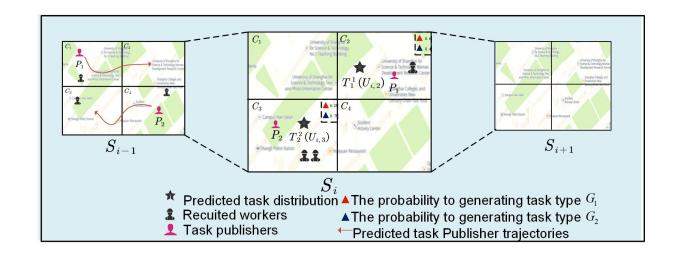

management, and detecting water pollution sources promptly [\[8,](#page-8-5) [11,](#page-8-6) [15,](#page-8-7) [19,](#page-8-8) [32\]](#page-8-9). In MCS, the worker recruitment method has been researched as a very important issue, as it directly influences the efficiency of task execution [\[4,](#page-8-10) [7,](#page-8-11) [10,](#page-8-12) [17,](#page-8-13) [18\]](#page-8-14). Beyond technical efficiency, MCS has a profound potential to contribute to the United Nations Sustainable Development Goals (SDGs), such as creating sustainable cities and communities and taking urgent action to combat climate change. For instance, MCS can be deployed for dynamic traffic flow management to reduce congestion emissions, for real-time air quality mapping to protect public health, and for rapid damage assessment to coordinate disaster relief efforts.

The existing worker recruitment methods are mainly divided into two categories: the first is to recruit according to the location of the task, such as when the task comes, considering the time and place of the task, workers are recruited to improve the task completion rate [\[5\]](#page-8-15). Second is to recruit according to the trajectories of workers, for example, by sensing real-time location and utilizing historical trajectory data of workers, it becomes feasible to predict the future activity area of these workers accurately, then workers can be strategically recruited for tasks [\[3,](#page-8-16) [16\]](#page-8-17). However, the above methods mainly serve tasks that have already occurred, and cannot perform worker pre-recruitment before task occurrence. Thus, they neglect the effect of task distribution predictability, and have not revealed that, when the task has strict timeliness, worker pre-recruitment is a feasible method to reduce task response time.

Based on the above findings, this paper proposes a Spatiotemporal Task Prediction-based Worker Pre-recruitment (STPWR) method. Unlike conventional approaches that recruit workers only after tasks appear, STPWR proactively recruits workers by predicting spatiotemporal task distributions, thereby significantly reducing task response time. As illustrated in Figure [1,](#page-1-0) publishers ��1 and ��2 are predicted to generate tasks in cells ��2 and ��3, respectively, enabling the platform to pre-assign workers accordingly. This prerecruitment paradigm, however, introduces two key challenges.

The first one is the sparsity of historical data. When predicting task distribution, the incompleteness of historical data of task publishers greatly reduces the accuracy of task distribution prediction. This makes the recruited workers deviate from the actual needs, and then affects the task completion rate.

The second one is the trade-off between moving distance and response time. When recruiting workers, in order to reduce the response time, there is a tendency to assign workers who are closer in distance to perform tasks quickly. However, this is often accompanied by frequent movement of workers, resulting in an increase in the moving distance. On the issue of data sparsity in trajectory prediction, in [\[25\]](#page-8-18), a time-variant Markov model based on Gibbs sampling has been designed for mobility prediction, to solve the problem of high missing rate, in which the Gibbs sampling method is used to recover the missing parts of a trajectory.

Advanced predictive models now integrate structural priors to enhance accuracy. For instance, Kang et al. [\[13\]](#page-8-19) introduce Struc-Former, a structural prior-guided Transformer designed for highfidelity data inference in sparse mobile crowdsensing scenarios. In [\[26\]](#page-8-20), a multi-task learning algorithm has been designed to predict the sparse trajectories and improve the prediction performance, which learns the similarity of different users. However, these methods primarily focus on the trajectory itself and fail to fully predict

Figure 1: A scenario of work recruitment.

the spatiotemporal distribution of tasks closely related to the trajectories.

On the issue of worker travel distance and task response time, in [\[12\]](#page-8-21), considering that the task is related to a specific location, workers need to go to the designated cell and perform the task. By optimizing the moving distance of workers, the travel distance is effectively reduced. In [\[2\]](#page-8-22), by planning the movement path of workers and taking into account the task deadline at the same time, the movement distance of workers is effectively reduced. In [\[34\]](#page-8-23), the recruitment of workers is carried out by obtaining the future movement trajectory of workers, aiming at effectively shortening the task response time. However, these methods do not consider the future distribution of tasks and the current recruitment status of workers, making it impossible to effectively strike a balance between task response time and mobility efficiency.

This paper introduces a method for worker pre-recruitment based on spatiotemporal task prediction. The method addresses the challenge of sparse historical data and predicts the spatiotemporal distribution of tasks, thereby reducing unnecessary movement of workers and ensuring that tasks receive prompt responses. The key contributions of this paper are outlined as follows:

- A Spatiotemporal Prediction Model with Trajectory Filling: We address data sparsity by leveraging similarities in movement and behavior among task publishers to fill missing historical data, and employ an LSTM-based model to accurately forecast future task distributions.
- A Multi-Objective Pre-Recruitment Optimization Framework: We formulate worker pre-recruitment as a multi-objective optimization problem, balancing task completion rate, worker travel distance, and response time, and solve it efficiently using a genetic algorithm.
- Extensive Validation and Performance Gains: Comprehensive experiments on a real-world dataset demonstrate that our framework improves prediction accuracy by 15-20%, achieves high task completion rates of 80-95%, and reduces both response time and worker movement by up to 25%.

### 2 Related Work

### 2.1 Worker recruitment methods in MCS

The existing methods for recruiting workers can be mainly divided into two categories: recruitment based on the location of tasks and recruitment based on the trajectories of workers. For recruitment based on the location of tasks, for example, in [\[6\]](#page-8-24), a service framework was designed based on location-aware crowdsensing systems with time constraints, aiming to efficiently recruit workers for GPS

location-based tasks to ensure high-quality results. In [\[21\]](#page-8-25), they combined the location and time window of the task to design a profit-oriented worker recruitment method that ensures the worker completes the task before the deadline. In terms of collaborative task management, [\[35\]](#page-8-26) proposes a privacy-preserving hybrid multitask allocation scheme (PPHMA) that optimizes the coordination among diverse workers while ensuring the security of sensing data in complex multi-task environments.

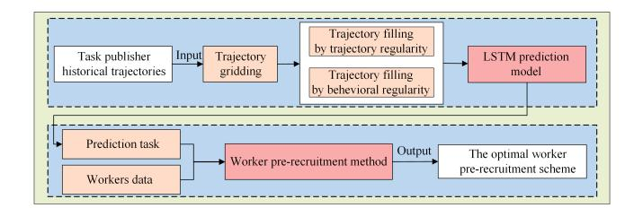

For recruitment based on the trajectories and preferences of workers, in [\[3,](#page-8-16) [14,](#page-8-27) [16\]](#page-8-17), they predicted worker mobility and performed recruitment after task generation, effectively matching workers to the designated tasks while minimizing deviations from their daily trajectories. This approach significantly optimizes the overall task completion rate. In [\[3\]](#page-8-16), the grid-based prediction method was designed to estimate the future location distribution of workers by prediction, taking into account the spatial characteristics of current workers and tasks, and achieving the maximization of the global worker recruitment quality under the travel cost constraint. In [\[27\]](#page-8-28), a geography-based model predicted the probability of workers passing through specific areas at certain times, focusing on minimizing the incentive budget for task allocation. Additionally, in [\[16\]](#page-8-17), future movement trajectories of workers were considered, along with changes in task distribution across different locations and sensing cycles, ensuring that tasks were allocated without deviating from the workers' established routes. In [\[17\]](#page-8-13), a stable task assignment mechanism is introduced for multi-platform MCS environments, emphasizing the importance of matching robustness and long-term stability in worker recruitment under cost constraints.

However, in the above methods of worker recruitment, recruitment often begins after the task is generated. Recruiting workers only after the task is generated will increase task response delay. Therefore, it is crucial to develop an effective pre-recruitment method for workers to reduce the response delay of tasks.

### 2.2 Trajectory prediction in MCS

When task publishers generate tasks and need to recruit workers, the task generation is closely linked to the trajectory of the task publishers. Therefore, the role of trajectory prediction in worker recruitment is crucial. In [\[32\]](#page-8-9), a subarea evaluation method based on deep reinforcement learning is developed for sparse mobile crowd sensing (SMCS), specifically addressing worker mobility and sensing cycle constraints to minimize data inference errors in urban environmental sensing. In [\[24\]](#page-8-29), a mobile crowd-testing worker recruitment strategy is presented, employing a POI-based mobility prediction approach similar to the semi-Markov model, primarily focusing on optimizing data upload costs. In [\[23\]](#page-8-30), the semi-Markov model is employed to predict the probability of workers appearing at specific locations by translating their movements into transitions between cells. In [\[30\]](#page-8-31), the context-aware trajectory prediction method utilizing two types of LSTM networks is designed, transforming real-valued target trajectories into discrete path segments within a gridded system.

In trajectory prediction, data sparsity primarily presents itself as a discontinuity or absence of trajectory data over time and space. This lack of data poses a challenge for prediction methods, which depend on having complete historical information.

Figure 2: System Model

When using trajectory prediction methods, the main purpose is to obtain the spatiotemporal distribution of tasks generated by the publisher, and conduct pre-recruitment of workers, thereby shortening response time. In considering the publisher's trajectory information, it is necessary to consider the similarity of movement trajectories and the behavioral patterns they exhibit in publishing tasks. Patterns include task type, generation frequency, time, and location, which are essential for understanding their requirements and predicting behavior. Although motion trajectories provide geolocation information, behavioral patterns are not adequately considered. Therefore, to more accurately predict and respond to the publisher's requirements, a comprehensive analysis of behavioral patterns and motion trajectories is required.

### 3 System Work

To formalize the interactions and computations within the proposed system model, we summarize the key mathematical notations in Table [1](#page-9-0) in the Appendix. These symbols are foundational to the problem formulation and the design of our STPWR method. The sets ��,��, ��,�� and �� define the core entities of the MCS environment. Critical properties such as worker execution capacity ������(���� ), task requirement ������(�� (����,��)), and worker preference ������ �� (���� ) directly influence the recruitment strategy. The probabilistic measures �� (��ℎ) (����,��) and �� (����) (����,��), predicted by our LSTM model, quantify the future likelihood of task generation. Furthermore, the similarity metrics ��������������ℎ,�� and ������������ℎ,������ are central to our data filling technique. The decision variable ���� (�� ℎ (����,��)) and the objective measures ������,�� �������������� and ������(���� ) are instrumental in formulating the optimization problem presented in the following section.

### 3.1 System Model

As illustrated in Figure [2,](#page-2-0) the system model includes task publishers, a platform, and workers. The platform gathers historical data from task publishers and uses this information to predict task generation. For each predicted task, the platform is responsible for pre-recruiting workers. Once the workers are pre-recruited by the platform, they will proceed to the designated location where the task is generated to carry out the task.

Task environment: The task environment is partitioned into cells. The set of cells is denoted by �� = ��1,��2, . . .����. . . ,���� . Each day is divided into time slots, and the set of time slot is denoted by �� = ��1, ��2, . . .���� . . . , ���� . A pair of cell and time slot is called a spatiotemporal unit. For instance, ����,�� represents the spatiotemporal unit within the cell ���� at time slot ���� . and (�� (����,��),��(����,��)) is the coordinate of the center point of the ����,��.

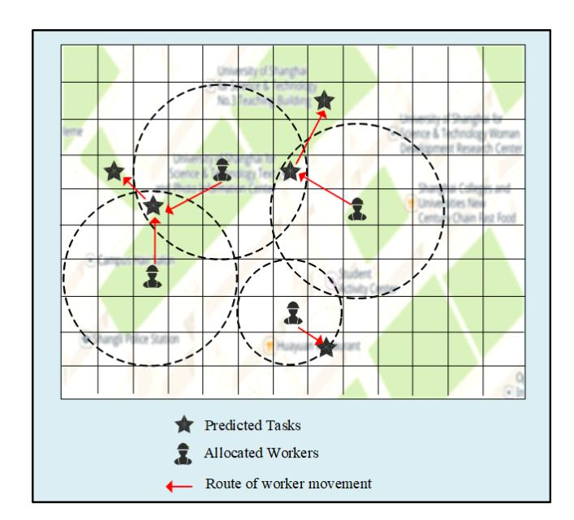

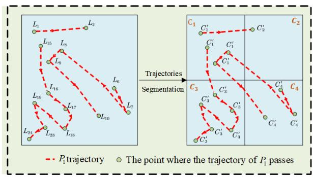

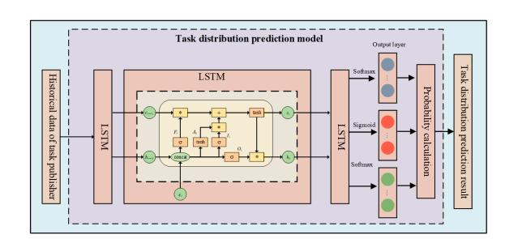

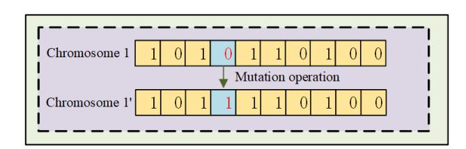

Figure 6: Mutation operation.

and the distance workers need to travel. The algorithm consists of several components: population initialization, chromosome representation, fitness function, selection operation, crossover operation, and mutation operation, each of which is detailed below.

Population initialization: The worker pre-recruitment method presented assigns a set of workers to each predicted task. To achieve a uniform distribution of feasible solutions throughout the solution space, we initialize the population randomly. For a task, the designed algorithm selects a number of workers from the candidate workers set �� , and repeats this process until an initial population comprising �� chromosomes are formed.

Chromosome representation: In this paper, a chromosome represents a worker pre-recruitment scheme. Table [3](#page-10-1) provides a detailed exposition of the chromosome binary encoding scheme. The scheme assigns task �� 1 (����,��) to the workers ��3,��4,��8,��9. Table [3](#page-10-1) is detailed in the Appendix.

Fitness function: In this paper, the objective is to maximize the task completion rate, based on which, another optimization objective is to minimize the movement distance of workers. Since fitness is directly proportional to the task completion rate and inversely proportional to movement distance, the fitness function can be expressed as:

�������������� =������ �� (����,��) − ������ �� (����,��) − ������(���� ) ������������ + ������������ . (10)

Selection operation: In this paper, a roulette wheel selection method is designed to execute the following selection operations: 1) Calculate the total fitness. 2) Calculate the selection probability of each chromosome based on its proportion of the total fitness. 3) Select chromosomes according to their probabilities. For a population with R chromosomes, the selection probability for the ��-th chromosome can be calculated as:

������ (��) = ���������������� − �������������������� Í�� ��=1 (���������������� − ��������������������) . (11)

Crossover operation: To achieve the optimization objectives while ensuring that each worker is assigned to only one area at a time, the order crossover (OX) operation is selected. We employ a crossover probability of ���� = 0.85.

Mutation operation: The mutation operation is achieved by adding or removing worker genes from the chromosome. The mutation probability is set to ���� = 0.01. For example, as shown in Figure [6,](#page-5-0) a new gene ��4 is added to chromosome 1. It is worth noting that since a worker is allocated to a task at most once, it is necessary to avoid adding a worker who already exists in the chromosome. In addition, for a chromosome that contains only one worker, removing the worker is also not allowed. Based on the

above concepts, the steps of the STPWR can be described as follows: i) Generate an initial population with R chromosomes, where each chromosome represents a worker recruitment scheme. ii) Calculate the fitness of all chromosomes in the population using the designed fitness function. iii) Generate a new generation population through selection, crossover, and mutation operations. iv) Repeat steps ii) and iii) until the maximum number Υ of iterations is reached, and output the chromosome with the highest fitness as the optimal solution. These steps are detailed in Algorithm 1 in the Appendix.

### 5 Experimental Evaluations

### 5.1 Experimental Setting

Dataset and Model Settings: In this paper, the data set Feeder [\[33\]](#page-8-32) is used, which encompasses five distinct types of data, Cellphone CDR Data, Smartcard Data, Taxicab GPS Data, Bus GPS Data, and Truck GPS Data, all sourced from Shenzhen, a city in China. In our study, we focus specifically on the Taxicab GPS Data due to its superior representation of mobility patterns. This dataset includes detailed records such as Taxi ID, Timestamp, Latitude, Longitude, Occupancy Status, and Speed. For our analysis, we selected 36 taxis based on the continuity and consistency of their records, as well as the similarity in their active time periods. We use the 'Occupancy Status' to indicate task generation, where 1 (with passengers) represents a task and 0 (without passengers) indicates no task. The 'Speed' is used to categorize the task type based on the taxi's movement patterns. This experiment randomly selects one of the days in the Shenzhen. The simulation parameters are summarized in Table [4](#page-10-2) in the Appendix.

Baselines: To emphasize the advantages of matching the degree of a task and a spatiotemporal unit in task delivery, we compare it with baselines. On the one hand, in order to verify the advantage of the STPWR method in predicting task generation based on publisher trajectory, we compared it with the following baselines: Gibbs-Inspired LSTM: [\[25\]](#page-8-18) This method is developed by incorporating the principles used in Gibbs sampling to address the issues of high missing rate. Unfilled LSTM: This method does not adopt the filling method for prediction.

In order to verify the effectiveness of the workers' recruitment in STPWR method, we compared it with the following baselines: Priority Greedy Method: In this method, the urgency of a task is determined by its response time alone, with tasks having longer response times being given higher priority. Distance Greedy Method: In this method, the likelihood of a task being carried out is directly proportional to the brevity of the worker's movement distance, with shorter distances being more favorable. Random Method: In this method, recruitment is carried out in a random way without consideration of specific patterns.

Additionally, to verify the effectiveness of the worker pre-recruitment method, we will also compare the following methods: OTAGA [\[31\]](#page-8-33): In this method, worker recruitment is contingent upon the attributes of the task, without consideration for the pre-recruitment strategy. GDRL [\[29\]](#page-8-34): In this method, by integrating a Graph Attention Network (GAT) with Deep Reinforcement Learning (DRL) to address the worker recruitment problem without the premise of worker pre-recruitment.

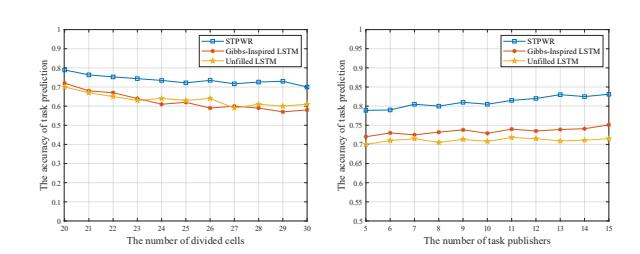

Figure 7: Comparison of task prediction accuracy across different numbers of cell divisions, task publishers.

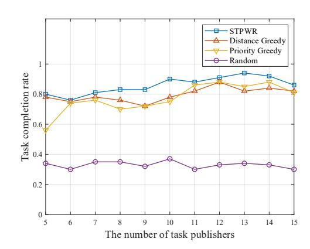

Figure 8: Comparison of task completion rates across methods by number of task publishers.

### 5.2 Results and Discussion

The accuracy of prediction: The accuracy of prediction is crucial when evaluating prediction methods. In this paper, we evaluate the accuracy of our prediction model by examining the difference between predicted and actual values. For this purpose, we use the accuracy of task generation prediction (i.e., the ratio of correctly predicted task generation events to the total actual task generation events) as our evaluation metric.

As shown in Figure [7,](#page-6-0) we analyze the impact of varying cells from 202 to 302 on the accuracy of task prediction. The results highlight the significant advantages of STPWR in accurately predicting task distribution. In comparison to the Gibbs-Inspired LSTM and the Unfilled LSTM, the advantage is attributed to our method's ability to leverage trajectories and behavior patterns of task publishers, leading to more reliable predictions. Figure [7](#page-6-0) also represents the comparison of task prediction accuracy across different numbers of task publishers. The results reveal that the prediction accuracy of STPWR improves as the number of task publishers increases. This improvement is attributed to the method of filling missing information based on the similarity of trajectories and behavior patterns. As the number of task publishers increases, the availability of similar patterns enhances the accuracy of the predictions.

Task Completion Rate(TCR): It is a crucial criterion in worker pre-recruitment. We introduce a worker pre-recruitment method

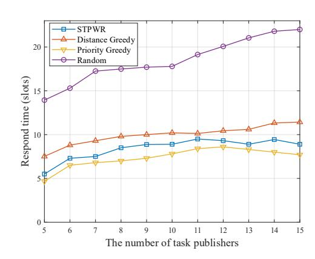

Figure 9: Comparison of task response time slots across methods by number of task publishers.

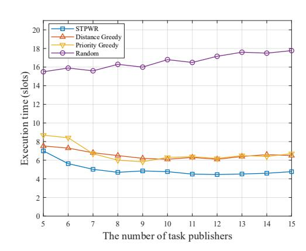

Figure 10: Comparison of task average execution time across methods by number of task publishers.

that considers various factors, including workers' activity scope and task priority.

As shown in Figure [8,](#page-6-1) the task completion rate increases alongside the number of task publishers. The STPWR method demonstrates significant advantages, maintaining a high completion rate, which indicates high efficiency and stability in worker recruitment. In contrast, both the distance greedy and priority greedy methods show lower task completion rates compared to STPWR.

As shown in Figure [9,](#page-6-2) the priority greedy method exhibits the lowest task response time, while the distance greedy method performs the worst. In contrast, the STPWR method achieves a balanced performance by considering both worker movement distance and task response time.

In Figure [10,](#page-6-3) the comparison of the average execution time for completed tasks reveals that the STPWR method continues to demonstrate strong performance, maintaining a competitive edge

Figure 11: Comparison of worker movement across methods by number of task publishers.

Figure 12: Comparison of task completion rates across nonpre-recruitment methods by number of task publishers.

despite executing a greater number of tasks. This suggests that the STPWR method exhibits robust efficiency and overall performance, even under higher operational demands.

In Figure [11,](#page-7-0) although the STPWR method is not optimal in optimizing the moving distance of workers, overall, STPWR still has certain advantages in optimizing workers' moving distance. This advantage is primarily due to the STPWR method's ability to execute more tasks without significantly increasing the workers' movement distance. This indicates that the STPWR algorithm can effectively balance task execution efficiency and worker movement distance in dynamic environments, ensuring that tasks are completed efficiently while reducing the burden of worker movement.

The advantages of worker pre-recruitment: In Figure [12,](#page-7-1) the STPWR method shows a clear advantage in task completion rate, while TOAGA and GDRL have lower rates. This difference is attributed to the STPWR method's consideration of factors such as workers' maximum mobility constraints and task types, enabling

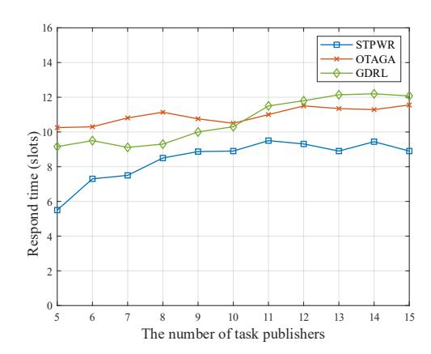

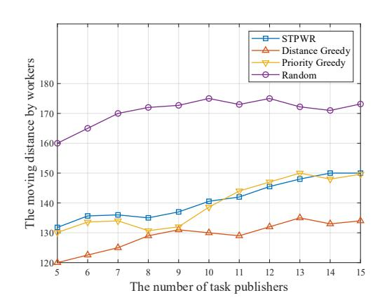

Figure 13: Comparison of task response time slots across non-pre-recruitment methods by number of task publishers.

more precise worker recruitment. The method enhances task execution efficiency and improves overall task completion rates. By adjusting strategies, STPWR ensures optimal completion rates even in dynamic environments.

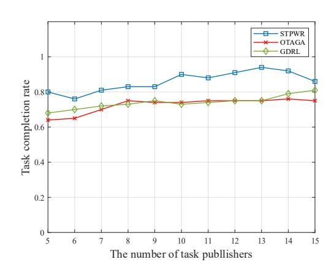

As illustrated in Figure [13,](#page-7-2) the STPWR method shows a clear advantage in reducing task responding time compared to approaches without worker pre-recruitment. This improvement arises from predicting task distribution, allowing timely worker recruitment. This proactive strategy minimizes response times and enhances task execution efficiency.

## 6 Conclusion And Disscussion

This paper introduces the STPWR framework, aimed at improving the efficiency and sustainability of mobile crowd sensing systems. It enriches sparse historical data through a trajectory-filling technique that incorporates individual movement patterns and similarities among task publishers. The enriched data informs a predictive model using an LSTM architecture to forecast future movements and predict sensing tasks. Our worker pre-recruitment strategy utilizes multi-objective optimization to minimize task response delays and unnecessary worker movement, addressing operational efficiency and environmental concerns.

Future work includes adding fairness constraints to ensure equitable coverage in urban and rural areas, exploring advanced optimization techniques, and strengthening the theoretical foundations of pre-recruitment models. We also plan to validate our framework with humanitarian and urban management organizations in real-world scenarios like disaster response and environmental monitoring, aiming for more responsive, resource-efficient, and socially beneficial sensing systems.

### Acknowledgments

This work was supported in part by the National Natural Science Foundation of China under Grant 61802257 and 61602305, and by the Natural Science Foundation of Shanghai under Grant 18ZR1426000 and 19ZR1477600.

References [1] Abderrafi Abdeddine, Loubna Mekouar, and Youssef Iraqi. 2025. A Generic Framework for Mobile Crowdsensing: A Comprehensive Survey. IEEE Access 13 (2025), 9134–9170. [doi:10.1109/ACCESS.2025.3526739](https://doi.org/10.1109/ACCESS.2025.3526739) [2] Mohamed Aboualola, Khalid Abualsaud, Tamer Khattab, and Nizar Zorba. 2022. Novel Task Allocation Method for Emergency Events under Delay-Cost Tradeoff. In GLOBECOM 2022-2022 IEEE Global Communications Conference. IEEE, 6236– 6240. [3] Shathee Akter and Seokhoon Yoon. 2020. DaTask: A decomposition-based deadline-aware task assignment and workers' path-planning in mobile crowdsensing. IEEE Access 8 (2020), 49920–49932. [4] Peng Chen, Jixian Zhang, Weidong Li, and Hao Wu. 2025. Revenue-Optimal Reverse Auction for Task Allocation in Mobile Crowdsensing Through Transformer Attention. IEEE Transactions on Computational Social Systems (2025). [5] Yu Ding, Lichen Zhang, and Longjiang Guo. 2022. Dynamic delayed-decision task assignment under spatial-temporal constraints in mobile crowdsensing. IEEE Transactions on Network Science and Engineering 9, 4 (2022), 2418–2431. [6] Rebeca Estrada, Rabeb Mizouni, Hadi Otrok, Anis Ouali, and Jamal Bentahar. 2017. A crowd-sensing framework for allocation of time-constrained and locationbased tasks. IEEE Transactions on Services Computing 13, 5 (2017), 769–785. [7] Kejia Fan, Jialin Guo, Runsheng Li, Yuanye Li, Anfeng Liu, Jianheng Tang, Tian Wang, Mianxiong Dong, and Houbing Song. 2025. RMDF-CV: A Reliable Multi-Source Data Fusion Scheme With Cross Validation for Quality Service Construction in Mobile Crowd Sensing. IEEE Transactions on Services Computing 18, 1 (2025), 399–413. [8] Kejia Fan, Yajiang Huang, Jingyu He, Feijiang Han, Jianheng Tang, Huiping Zhuang, Anfeng Liu, Tian Wang, Mianxiong Dong, Houbing Herbert Song, and Yunhuai Liu. 2025. CALM: A Ubiquitous Crowdsourced Analytic Learning Mechanism for Continual Service Construction with Data Privacy Preservation. Proceedings of the ACM on Interactive, Mobile, Wearable and Ubiquitous Technologies 9, 2, Article 29 (2025), 30 pages. [9] Kejia Fan, Jiali Liu, Jianheng Tang, Anfeng Liu, Tian Wang, Yunhuai Liu, Mianxiong Dong, and Houbing Song. 2025. PCQ-SP: A Privacy-Preserving, Cost-Aware, and Quality-Enabled Service Planning Scheme for Multi-Task Spatial Crowdsourcing. IEEE Transactions on Mobile Computing (2025), 1–15. [doi:10.1109/TMC.2025.3637233](https://doi.org/10.1109/TMC.2025.3637233) [10] Xiaoliang Guang, Yuhuai Peng, and Chenlu Wang. 2025. Game-Based Multi-UAV Dynamic Collaborative with Energy-Efficient Hierarchical Information Sharing for Mobile Crowdsensing. IEEE Transactions on Mobile Computing (2025). [11] Yajiang Huang, Jialin Guo, Shihao Yang, Jiali Liu, Anfeng Liu, Jianheng Tang, Tian Wang, Mianxiong Dong, and Houbing Song. 2025. QLP-DCS: A Quality-Aware, Low-Cost, and Privacy-Preserving Data Collection Service for Mobile Crowd Sensing. IEEE Transactions on Services Computing (2025). [12] Zhi Gang Jia, Weiwei Zhao, Ming Chi, Jie Luo, and Bing Ren. 2021. Task allocation based on time optimization in Mobile crowd sensing. In 2021 IEEE 5th Information Technology, Networking, Electronic and Automation Control Conference (ITNEC), Vol. 5. IEEE, 1076–1080. [13] Xu Kang, Shouceng Tian, Feifei Kou, Lei Shi, and Jiadong Ren. 2025. StrucFormer: Structural Prior Guided Transformer for Mobile Crowdsensing Data Inference. In ICASSP 2025-2025 IEEE International Conference on Acoustics, Speech and Signal Processing (ICASSP). IEEE, 1–5. [14] Chang Lai and Xinglin Zhang. 2020. Duration-sensitive task allocation for mobile crowd sensing. IEEE Systems Journal 14, 3 (2020), 4430–4441. [15] Chenyi Liang, Fangzhe Chen, Gaoyu Luo, Zhibin Gaotextsuperscript, Yifeng Zhao, and Lianfen Huang. 2025. Energy-Efficient Data Collection and Resource Allocation for UoI-Aware Mobile Crowdsensing in IoV. IEEE Internet of Things Journal (2025). [16] Quan T Ngo and Seokhoon Yoon. 2023. Context-aware worker recruitment for mobile crowd sensing based on mobility prediction. IEEE Access 11 (2023), 92353–92364. [17] Shuo Peng, Guo Zhang, Baoxian Zhang, Zheng Yao, Chen Liu, and Cheng Li. 2025. A Stable Task Assignment Mechanism for Multi-Platform Mobile Crowdsensing. IEEE Transactions on Vehicular Technology (2025). [18] Jianheng Tang, Yishuo Cai, Saiqin Long, Yirui Shen, Kejia Fan, Zhetao Li, Qingyong Deng, and Anfeng Liu. 2024. Q-BLPP: A Quality-Enabled Bilateral Location Privacy-Preserving Service Construction Scheme in Mobile Crowd Sensing. IEEE Transactions on Services Computing 17, 6 (2024), 4151–4165. [19] Jianheng Tang, Kejia Fan, Shihao Yang, Anfeng Liu, Neal N. Xiong, Houbing Song, and Victor C. M. Leung. 2025. CPDZ: A Credibility-Aware and Privacy-Preserving Data Collection Scheme With Zero-Trust in Next-Generation Crowdsensing Networks. IEEE Journal on Selected Areas in Communications 43, 6 (2025), 2183– 2199. [20] Jianheng Tang, Zhixuan Huang, Shihao Yang, Kejia Fan, Anfeng Liu, Tian Wang, Yunhuai Liu, Mianxiong Dong, and Houbing Herbert Song. 2025. Q-DBPP: A Quality-Aware Dual-Bilateral Privacy Preserving Scheme in Mobile Crowd Sensing. IEEE Transactions on Mobile Computing (2025), 1–14. [doi:10.1109/TMC.](https://doi.org/10.1109/TMC.2025.3626742) [2025.3626742](https://doi.org/10.1109/TMC.2025.3626742) [21] Xi Tao and Wei Song. 2020. Profit-oriented task allocation for mobile crowdsensing with worker dynamics: Cooperative offline solution and predictive online solution. IEEE Transactions on Mobile Computing 20, 8 (2020), 2637–2653. [22] En Wang, Zixuan Song, Mengni Wu, Wenbin Liu, Bo Yang, Yongjian Yang, and Jie Wu. 2024. A new data completion perspective on sparse crowdsensing: spatiotemporal evolutionary inference approach. IEEE Transactions on Mobile Computing (2024). [23] En Wang, Yongjian Yang, and Kaihao Lou. 2019. User selection utilizing data properties in mobile crowdsensing. Information Sciences 490 (2019), 210–226. [24] En Wang, Yongjian Yang, Jie Wu, Wenbin Liu, and Xingbo Wang. 2017. An efficient prediction-based user recruitment for mobile crowdsensing. IEEE Transactions on Mobile Computing 17, 1 (2017), 16–28. [25] Huandong Wang, Sihan Zeng, Yong Li, and Depeng Jin. 2020. Predictability and prediction of human mobility based on application-collected location data. IEEE Transactions on Mobile Computing 20, 7 (2020), 2457–2472. [26] Huandong Wang, Sihan Zeng, Yong Li, Pengyu Zhang, and Depeng Jin. 2020. Human mobility prediction using sparse trajectory data. IEEE Transactions on Vehicular Technology 69, 9 (2020), 10155–10166. [27] Liang Wang, Zhiwen Yu, Daqing Zhang, Bin Guo, and Chi Harold Liu. 2018. Heterogeneous multi-task assignment in mobile crowdsensing using spatiotemporal correlation. IEEE transactions on mobile computing 18, 1 (2018), 84–97. [28] Enhui Wu and Zhenlong Peng. 2024. Research progress on incentive mechanisms in mobile crowdsensing. IEEE Internet of Things Journal 11, 14 (2024), 24621– 24633. [29] Chenghao Xu and Wei Song. 2023. Intelligent task allocation for mobile crowdsensing with graph attention network and deep reinforcement learning. IEEE Transactions on Network Science and Engineering 10, 2 (2023), 1032–1048. [30] Xin Xu. 2020. Context-based trajectory prediction with LSTM networks. In Proceedings of the 2020 3rd International Conference on Computational Intelligence and Intelligent Systems. 100–104. [31] Guisong Yang, Dongsheng Guo, Buye Wang, Xingyu He, Jiangtao Wang, and Gang Wang. 2023. Participant-quantity-aware online task allocation in mobile crowdsensing. IEEE Internet of Things Journal 10, 24 (2023), 22650–22663. [32] Hongjian Zeng, Yonghua Xiong, Jinhua She, and Anjun Yu. 2025. Task Assignment Scheme Designed for Online Urban Sensing Based on Sparse Mobile Crowdsensing. IEEE Internet of Things Journal 12, 11 (2025), 17791–17806. [doi:10.1109/JIOT.2025.3540501](https://doi.org/10.1109/JIOT.2025.3540501) [33] Desheng Zhang, Juanjuan Zhao, Fan Zhang, Ruobing Jiang, and Tian He. 2015. Feeder: supporting last-mile transit with extreme-scale urban infrastructure data. In Proceedings of the 14th International Conference on Information Processing in Sensor Networks. 226–237. [34] Jinyi Zhang and Xinglin Zhang. 2021. Multi-task allocation in mobile crowd sensing with mobility prediction. IEEE Transactions on Mobile Computing 22, 2 (2021), 1081–1094. [35] Xian Zhang, Xiaolin Qin, Haiwen Xu, and Lin Li. 2025. PPHMA: Privacy-Preserving Hybrid Multi-task Allocation for Mobile Crowd Sensing. IEEE Transactions on Network Science and Engineering (2025). A Symbols And Descriptions To formalize the interactions and computations within the proposed system model, we summarize the key mathematical notations in Table [1.](#page-9-0) These symbols are foundational to the problem formulation and the design of our STPWR method. The notations are categorized to reflect the core entities and relationships in our framework: spatiotemporal units, task publishers, workers, tasks, and the metrics for similarity and optimization. This structured overview aids in tracing the flow of information from the prediction of task distributions to the final recruitment decision variables. A clear grasp of these symbols is essential for comprehending the system's dynamics and replicating the experimental setup. B Description of Datasets Table [2](#page-9-1) shows the trajectory results of several task publishers after trajectory gridding. The table illustrates how raw location data is converted into a discrete sequence of grid cells over time. Empty entries in the table represent missing location records, highlighting the data sparsity issue inherent in real-world mobility datasets. This processed format serves as the primary input for the subsequent

data completion and prediction stages of our framework.

| DAY TIME |      |    |           |    |    |
|----------|------|----|-----------|----|----|
|          | AREA |    | MOVVEMENT |    |    |
|          | P1   | P2 | P3        | P4 | P5 |
| 1        | c1   | c2 | c2        |    | c1 |
| 2        | c2   | c2 | c2        |    | c1 |
| 3        |      | c2 |           |    | c1 |
| 4        |      | c4 |           |    | c1 |
| 5        |      | c4 |           |    | c1 |
| 6        | c4   | c2 | c4        |    | c4 |
| 1        | c4   |    | c1        | c4 | c2 |
| 2        | c1   |    | c1        | c4 | c2 |
| 3        | c1   | c3 | c1        | c1 | c2 |
| 4        | c4   | c4 | c1        | c3 | c2 |
| 5        |      | c4 | c3        | c1 | c2 |
| 6        |      | c4 | c3        | c1 | c2 |
| 1        |      | c1 | c2        |    | c2 |
| 2        |      | c1 | c1        |    | c1 |
| 3        | c1   | c1 | c1        |    | c1 |
| 4        | c3   | c1 | c1        |    | c3 |
| 5        | c3   | c1 | c1        |    | c3 |
| 6        | c3   | c1 | c1        |    | c3 |
| 1        | c3   | c4 | c1        | c1 | c3 |
| 2        |      | c3 | c3        | c1 | c1 |
| 3        |      | c3 | c4        | c1 | c1 |
| 4        |      | c1 | c4        | c1 | c1 |
| 5        | c3   | c3 | c1        | c1 | c1 |
| 6        | c3   | c3 | c3        | c1 | c1 |

