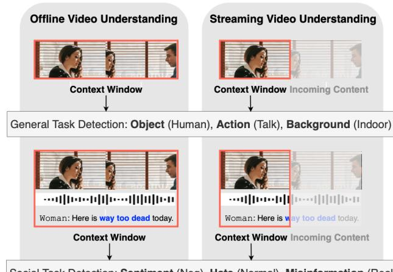
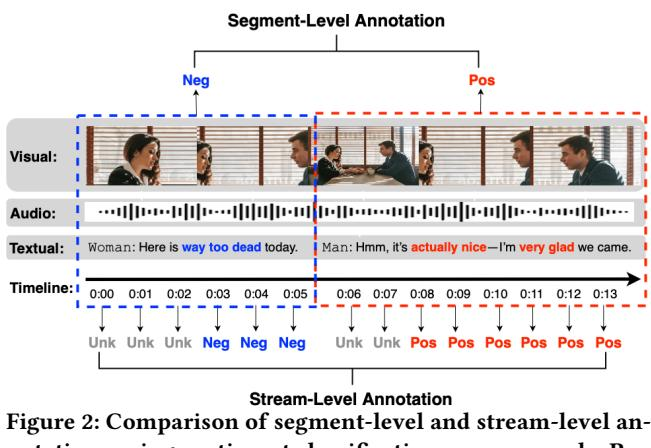
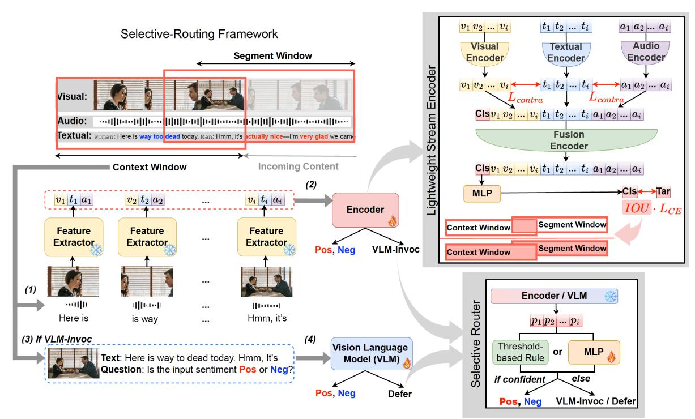
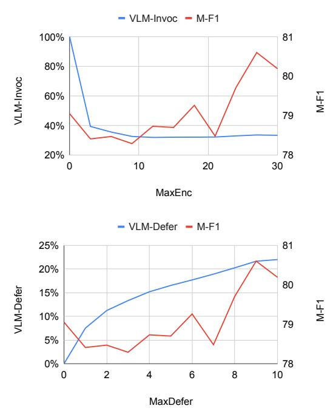

# StreamSense: Streaming Social Task Detection with Selective Vision–Language Model Routing

[Han Wang](https://orcid.org/0009-0007-4486-0693)

han\_wang@sutd.edu.sg Singapore University of Technology and Design Singapore

[Deyi Ji](https://orcid.org/0000-0001-7561-9789) jideyi@mail.ustc.edu.cn University of Science and Technology of China China

[Lanyun Zhu](https://orcid.org/0000-0001-7309-3330) lanyun\_zhu@ntu.edu.sg Nanyang Technological University Singapore

[Jiebo Luo](https://orcid.org/0000-0002-4516-9729) jiebo.luo@gmail.com University of Rochester USA

[Roy Ka-Wei Lee](https://orcid.org/0000-0002-1986-7750) s.roylee@gmail.com Singapore University of Technology and Design Singapore

# Abstract

Live streaming platforms require real-time monitoring and reaction to social signals, utilizing partial and asynchronous evidence from video, text, and audio. We propose StreamSense, a streaming detector that couples a lightweight streaming encoder with selective routing to a Vision–Language Model (VLM) expert. Stream-Sense handles most timestamps with the lightweight streaming encoder, escalates hard/ambiguous cases to the VLM, and defers decisions when context is insufficient. The encoder is trained using (i) a cross-modal contrastive term to align visual/audio cues with textual signals, and (ii) an IoU-weighted loss that down-weights poorly overlapping target segments, mitigating label interference across segment boundaries. We evaluate StreamSense on multiple social streaming detection tasks (e.g., sentiment classification and hate content moderation), and the results show that StreamSense achieves higher accuracy than VLM-only streaming while only occasionally invoking the VLM, thereby reducing average latency and compute. Our results indicate that selective escalation and deferral are effective primitives for understanding streaming social tasks. Code is publicly available on [GitHub.](https://github.com/Social-AI-Studio/StreamSense)

# CCS Concepts

• Computing methodologies → Computer vision.

# Keywords

Livestream, Streaming Video, Vision-Language Model, Multimodal

### ACM Reference Format:

Han Wang, Deyi Ji, Lanyun Zhu, Jiebo Luo, and Roy Ka-Wei Lee. 2026. StreamSense: Streaming Social Task Detection with Selective Vision–Language Model Routing. In Proceedings of the ACM Web Conference 2026 (WWW '26), April 13–17, 2026, Dubai, United Arab Emirates. ACM, New York, NY, USA, [10](#page-9-0) pages.<https://doi.org/10.1145/3774904.3793046>

[This work is licensed under a Creative Commons Attribution 4.0 International License.](https://creativecommons.org/licenses/by/4.0) WWW '26, Dubai, United Arab Emirates © 2026 Copyright held by the owner/author(s). ACM ISBN 978-1-4503-XXXX-X/2018/06 <https://doi.org/10.1145/3774904.3793046>

Figure 1: Comparison of (1) offline versus streaming video understanding and (2) general versus social task detection. Neg = Negative, Hate = Hate Speech.

# 1 Introduction

Live streaming platforms (e.g., Twitch, YouTube Live, TikTok Live, etc.) deliver low-latency video to millions while enabling real-time interaction, creating a tight feedback loop between content creators and their audiences. These platforms are popular for gaming, entertainment, live shopping, education, breaking news, and civic events, and underpin the creator economy. In this setting, understanding social signals as they emerge is crucial: streams exhibit rapid sentiment shifts, harassment waves, hate raids, coordinated misinformation during evolving events, deceptive promotions, and context-dependent toxicity. These signals are multimodal (spoken/on-screen text often provides decisive cues while visual and audio signals provide context) and asynchronous, complicating instant interpretation. Effective moderation, safety interventions, and analytics, therefore, require real-time inference under partial context; deciding when current evidence suffices, when to wait for more, and when to escalate to stronger models.

Therefore, we formalize streaming social task detection (SSTD) as the problem of making a decision at each timestamp using pastonly evidence from video, text, and audio. As illustrated in Figure [1,](#page-0-0)

SSTD differs from conventional (offline/general) video detection along three axes: (i) Causality & latency: predictions cannot peek into future content and must be synchronized with the live stream; (ii) Multimodality: while general task detection is often visioncentric, social tasks frequently hinge on spoken or on-screen language with visuals providing situational context; and (iii) Social inference: detection requires substantial human understanding and background knowledge to interpret intent, stance, or toxicity beyond visually localized cues. These differences make offline or general task methods unfit for streaming social analysis.

Prior work on offline social tasks typically couples frozen encoders with deep classifiers [\[15,](#page-8-0) [20,](#page-8-1) [28,](#page-8-2) [36,](#page-8-3) [40,](#page-8-4) [42\]](#page-9-1). With the rise of Large Language Models (LLMs) and Vision-Language Models (VLMs), recent studies show strong performance on social nuanced tasks due to broad pretraining on social media and web content [\[14,](#page-8-5) [19,](#page-8-6) [22,](#page-8-7) [24,](#page-8-8) [46\]](#page-9-2). However, directly applying LLM/VLM systems to SSTD faces two obstacles: (1) integration: bringing new modality streams into large models typically requires costly multimodal pretraining, and (2) efficiency: high-capacity models are computationally expensive and slow for continuous, large-scale, real-time inference.

Streaming work in general task detection is mainly focused on online action recognition (OAR) [\[7,](#page-8-9) [13,](#page-8-10) [35,](#page-8-11) [37,](#page-8-12) [38\]](#page-8-13). Those labels are time-synchronous: When the action occurs, the ground truth is immediately knowable. In contrast, for social tasks, annotators often cannot commit at a given timestamp without observing full context. Proper stream-level supervision should therefore allow an Unknown state until sufficient evidence accrues (Figure [2\)](#page-2-0). In practice, available datasets only provide segment-level labels created after viewing the whole segment, which induces two pathologies for streaming models: (a) label interference between adjacent windows with conflicting segment labels in training-time, and (b) forced predictions under insufficient context. Unsurprisingly, naively adapting OAR architectures to SSTD yields weak results [\[33\]](#page-8-14).

To address these research gaps, we propose StreamSense, a realtime multimodal system that combines a lightweight streaming encoder with selective routing to a high-capacity VLM expert, and a learned deferral policy when context is insufficient. The streaming encoder ingests past-only video, text and audio; a router estimates probability score and either (i) emits a prediction, (ii) escalates the current window to the VLM, or (iii) defers until more evidence arrives. To train robustly under segment-level supervision, we use (i) a cross-modal contrastive objective to align visual/audio cues with decisive textual signals, and (ii) an IoU-weighted cross-entropy that down-weights windows with low overlap to the target segment, mitigating label interference across adjacent windows. This design outperforms VLM-only baselines while sparingly invoking the VLM, yielding lower latency and compute.

We summarize our contributions as follows: (1) We formalize streaming social task detection and articulate why it fundamentally differs from conventional video detection in terms of causality, multimodality, and social inference; (2) We introduce StreamSense, a selective-routing framework that combines a lightweight streaming encoder with an on-demand VLM expert and a deferral policy for low-context timestamps; and (3) We address supervision mismatch with IoU-weighted classification to reduce label interference and

a cross-modal contrastive alignment to enhance modality fusion, achieving strong accuracy while substantially reducing VLM calls.

# 2 Related Works

### 2.1 Social Task Detection

Social task detection studies human behaviors and intentions in social media content across modalities (text, images/memes, and video). We focus on video settings with representative subtasks, including sentiment/affect classification, hate/harassment detection, and misinformation identification.

Sentiment is the most resourced area, with IEMOCAP [\[3\]](#page-8-15), CMU-MOSI [\[44\]](#page-9-3), CMU-MOSEI [\[43\]](#page-9-4), MELD [\[25\]](#page-8-16), CH-SIMS [\[39\]](#page-8-17), and CMU-MOSEAS [\[41\]](#page-8-18) offering video- or segment-level annotations (sometimes fine-grained emotions). MOSI/MOSEI are particularly popular due to their strict guidelines, which ensure each segment conveys a complete and consistent opinion. Hate/harassment datasets such as HateMM [\[6\]](#page-8-19), MultiHateClip [\[34\]](#page-8-20), HateClipSeg [\[33\]](#page-8-14), and ImpliHate-Vid [\[26\]](#page-8-21) provide video/segment labels and, in some cases, victim categories. However, outside HateClipSeg, segment boundaries are subjective and may fail to capture complete or consistent opinions. Misinformation video resources remain scarce [\[2,](#page-8-22) [23\]](#page-8-23) and typically lack frame/segment alignment. Finally, these segment-level corpora are suited for offline analysis but not for stream-level supervision (i.e., lacking an Unknown state).

Traditional social video detection and understanding models fuse unimodal features using deep architectures [\[15,](#page-8-0) [18,](#page-8-24) [20,](#page-8-1) [28,](#page-8-2) [29,](#page-8-25) [36,](#page-8-3) [40,](#page-8-4) [42\]](#page-9-1). Canonical examples include TFN [\[42\]](#page-9-1) (tensor fusion of uni/bi/trimodal interactions), MISA [\[15\]](#page-8-0) (modality-invariant/specific factors), and Self-MM [\[40\]](#page-8-4) (self-supervised multimodal pretraining). Recent work leverages LLMs for sentiment [\[46\]](#page-9-2), hate [\[14\]](#page-8-5), and misinformation [\[19\]](#page-8-6), with advantages in zero-/few-shot generalization and explanation [\[4,](#page-8-26) [16,](#page-8-27) [17,](#page-8-28) [21,](#page-8-29) [22,](#page-8-7) [24,](#page-8-8) [31,](#page-8-30) [32,](#page-8-31) [48\]](#page-9-5). Yet, integrating visual/audio into language models typically requires heavy multimodal pretraining, and the high inference cost of language models hinders per-timestamp analysis in continuous, high-frequency monitoring.

Most of the aforementioned social detection models do not require real-time inference and are trained on offline, trimmed segments with full context. In livestreams, real-time detection requires a high inference rate, making full reliance on LLMs/VLMs prohibitively costly. Moreover, livestreams require causal processing, so evidence may arrive asynchronously; forcing immediate decisions can yield premature labels under insufficient context. StreamSense addresses this gap with a lightweight streaming encoder, selective VLM escalation, and an explicit deferral policy for limited context.

# 2.2 Streaming Video Understanding

Streaming video understanding typically targets online action recognition (OAR), where models emit human action labels in real time [\[7,](#page-8-9) [13,](#page-8-10) [35,](#page-8-11) [37,](#page-8-12) [38\]](#page-8-13). The emphasis is on temporal modeling under causality: OadTR [\[35\]](#page-8-11) captures global dependencies with Transformers; LSTR [\[38\]](#page-8-13) blends long/short-term cues; WOAD [\[13\]](#page-8-10) learns from weak labels via pseudo frame supervision. However, both OAR and recent streaming highlight prediction tasks [\[8\]](#page-8-32) assume temporally aligned supervision. In contrast, social tasks are often asynchronous: labels (e.g., sentiment, hate, misinformation) may be unknowable at

notations using sentiment classification as an example. Pos = Positive, Neg = Negative, Unk = Unknown

a given timestamp but are typically assigned using future content in segment-level annotations, which can create consecutive windows with similar features yet conflicting labels, leading to label interference during training.

A complementary line of works explores streaming visual question answering (VQA) [\[5,](#page-8-33) [10,](#page-8-34) [30,](#page-8-35) [45\]](#page-9-6). To improve efficiency, works explore parallel encoders and asynchronous LLM inference [\[5\]](#page-8-33), memory mechanisms for long contexts [\[45\]](#page-9-6), and cache designs for streaming [\[10\]](#page-8-34). However, VQA is query-driven and low-rate; it does not mandate high-frequency decisions at every timestamp. Directly applying such models to social monitoring yields limited gains relative to their computational and fine-tuning costs.

StreamSense differs from online action recognition and streaming VQA. We target high-cadence social monitoring with asynchronous evidence across video, text and audio. Our design (i) uses a lightweight streaming encoder for the typical case, (ii) selectively routes hard cases to a fine-tuned offline VLM expert, and (iii) defers when context is insufficient. Encoder training uses IoU-weighted classification and cross-modal contrastive losses to reduce label interference and stabilize multimodal fusion under partial context.

### 3 Streaming Social Task Detection

In this section, we first formalize streaming social task detection by specifying the inputs, outputs, and evaluation criteria. We then highlight two core challenges that arise in livestream settings: (i) achieving high accuracy under tight latency and compute budgets, and (ii) coping with supervision that is segment-level and post hoc rather than truly stream-level.

### 3.1 Task Formulation

We define streaming social task detection (SSTD) as real-time inference of social labels (e.g., sentiment, hate speech, misinformation) from a live, multimodal video stream. Let the stream be features [x1, . . . , x�� ] over�� time steps, where each x�� = (���� , ���� , ����) comprises visual, textual, and audio cues available up to time ��.

Streaming prediction (past-only). At fixed decision intervals �� (e.g., every Δ seconds), the model predicts a label using past-only window of length ��:

�� (x ) → ��ˆ�� , x �� = [x��−�� , . . . , x��], �� ∈ {��, 2��, . . . ,�� }.

with frames �� &lt; �� − �� outside the window and frames �� &gt; �� unseen (for�� &lt; ��, we use fixed padding). Unlike offline classification, SSTD forbids peeking beyond time ��, requires per-interval decisions from a bounded past-only window [x��−�� , . . . , x��], and must fuse videotext–audio signals that can be temporally misaligned (e.g., speech trailing the visuals), so some labels may be undecidable at time �� until later evidence appears.

Supervision & Evaluation. We next describe how existing datasets supervise SSTD and how we evaluate it. Many social video corpora provide segment-level labels: a segment [����, ����] is annotated post hoc as a consistent opinion/state ������:���� ∈ Y. In the trimmed setting, a classifier consumes the whole segment,

�� (x����:����) → ��ˆ����:����, x����:���� = [x����, . . . , x����].

For SSTD, frame/timestamp labels are derived by propagation, ���� = ������:���� for �� ∈ [����, ����], and we measure accuracy and macro-F1 (M-F1) of ��ˆ�� using a past-only window [x��−�� , . . . , x��]. This posthoc supervision lacks an Unknown state to indicate "insufficient evidence at time ��" and serve as "a buffer between consecutive windows with conflicting labels", creating a supervision–inference mismatch addressed next.

### 3.2 Challenge I: Balancing Performance and Efficiency

SSTD requires frequent, low-latency decisions while fusing video, text, and audio using only past evidence. At stream cadence, inputs arrive as micro-batches, limiting the ability to batch efficiently and exponentially increasing the per-timestamp cost of inference for high-capacity models. Beyond inference, multimodal pre-processing is nontrivial: automatic speech recognition and on-screen text extraction introduce latency and jitter relative to video frames, and keeping these streams synchronized online adds computational and memory overhead, consuming the same real-time budget. Evidence for social labels is also sparse and asynchronous. Decisive cues (a short phrase, a brief overlay, or a fleeting visual) often appear after an initially ambiguous moment in the scene. Running heavy inference uniformly at every timestamp wastes computation on windows where the label is genuinely undecidable, yet naive throttles (larger stride, frame dropping) systematically miss short events and reduce recall. Standard confidence heuristics are unreliable in partial or misaligned contexts: deep classifiers can be overconfident on non-informative inputs, and calibration tuned offline does not transfer cleanly to stream-time uncertainty.

Simple remedies such as fixed downsampling, static ASR/OCR cadence, early-exit rules borrowed from single-modality settings, or one-shot distillation into a small model, do not address the underlying constraints. They either degrade tail performance on rare but safety-critical moments, cause performance drift across topics and languages, or remain operationally brittle. In summary, SSTD sits at a compute–quality frontier defined by high decision frequency, costly multimodal pre-processing, asynchronous and sparse evidence, and strict latency/compute budgets. These factors render the task more challenging than trimmed or offline detection and are not amenable to simple modifications of existing pipelines.

Figure 3: Overview of the proposed StreamSense framework.

all evidence is observed. Propagating a segment label to every timestamp treats early and late windows as equally informative, even when evidence is unevenly distributed. Weighting the pertimestamp loss by IoU(�� �� , ���� ) �� prioritizes windows with higher segment overlap—typically later, more informative windows—while suppressing early low-overlap windows that may share identical inputs yet exhibit label ambiguity during transitions. This mitigates label interference without introducing look-ahead bias, with larger �� further concentrating learning on high-overlap windows.

Overall objective. The encoder is trained with the sum of both components:

L = L CM + L�� IoU \* CE. (5)

Notes that textual and audio embeddings ���� and ���� may be aggregated over modality-specific windows ���� and ���� up to �� to account for non-synchronous rates.

### 4.2 Selective Routing to the VLM Expert

Never invoking the VLM delegates all decisions to a lightweight encoder trained on limited data, lacking the broader social and world knowledge of large models, which degrades performance. Conversely, calling the VLM at every timestamp approximates an accuracy upper bound but is prohibitively costly in latency and compute for high-cadence streams. Moreover, many timestamps are either easy (clear evidence) or genuinely undecidable in the current context, so uniform escalation wastes resources without improving decisions. Given the encoder's per-timestamp prediction on the past-only window, routing decides whether to emit the encoder label directly or invoke a VLM expert to reprocess the raw inputs

up to time ��. Upon invocation, the VLM takes the current frame, text from ��!−!�� to ��, and a query prompt to produce a refined prediction at time ��; both the encoder and VLM are trained or fine-tuned.

We consider two routing strategies that use the encoder's predicted class probability ���� ∈ [0.5, 1.0]:

(1) Model-based adaptive strategy: a small multilayer perceptron (MLP) takes the encoder's past probability scores �� �� = [����−�� , . . . , ����] and predicts whether should invoke the VLM to correct the encoder error at time ��.

(2) Threshold-based rule: the VLM is invoked when either a label change is detected or the encoder probability falls below a dynamic threshold �� Enc that increases with the distance �� = �� −��vlm from the last successful VLM-invoked prediction time ��vlm:

�� Enc (��) = 0.5 + �� ������������ + 1 · 0.5, 1 ≤ �� ≤ ������������ + 1. (6)

Here, MaxEnc denotes the Maximum Encoder Allowance Step. As �� increases, lightweight encoder predictions become more unreliable; if �� = MaxEnc + 1 we force a VLM call. Setting MaxEnc = 0 fixes �� Enc at 1, so the VLM is always invoked; larger MaxEnc lowers the VLM invocation rate.

# 4.3 Deferral Policy

Some timestamps are genuinely undecidable under the current pastonly context. Even after a VLM invocation, the system may defer rather than guess. Similarly, we instantiate two deferral strategies using the VLM model's probability score ���� ∈ [0.5, 1.0].

Figure 4: StreamSense model performance for MOSI dataset under the threshold-based VLM-Invocation and Prediction Defer strategy, evaluated across varying MaxEnc (0–30) and MaxDefer (0–10). MaxEnc: Maximum Encoder Allowance Steps, MaxDefer: Maximum Deferral Allowance Steps . Metrics: VLM-Invoc = VLM Invocation Rate, VLM-Defer = VLM Defer Rate, M-F1 = Macro-F1.

(1) Model-based adaptive strategy: A second MLP takes the VLM's past probability scores �� and predicts whether the current VLM prediction is correct at time ��; if not, the system outputs Defer.

(2) Threshold-based rule: Defer is triggered when the VLM confidence falls below a dynamic threshold �� VLM that decreases with the distance from the last successful prediction, �� = �� − max(��enc, ��vlm).

VLM (��) = 1.0− �� ���������� �� ���� + 1 ·0.5, 1 ≤ �� ≤ ���������� �� ����+1. (7)

Here, MaxDefer denotes the Maximum Deferral Allowance Steps. As �� grows, prolonged deferral becomes harder; if �� = MaxDefer+1 we require a prediction (no further deferral). When MaxDefer = 0, VLM is fixed at 0.5, so deferral is disabled; increasing MaxDefer allows more deferrals under low-confidence contexts.

### 5 Experiments

# 5.1 Experimental Settings

5.1.1 Datasets. We train and evaluate StreamSense on three streaming social task datasets.

MOSI (CMU-MOSI [\[44\]](#page-9-3)) is a multimodal sentiment intensity corpus with 2,199 segments from 93 YouTube monologue videos. Each segment is annotated with a sentiment score in [−3, +3]. We binarize sentiment as negative (���� = 0) for scores &lt; 0 and positive (���� = 1) for scores ≥ 0, excluding unannotated parts of the videos.

MOSEI (CMU-MOSEI [\[43\]](#page-9-4)) comprises 23,453 annotated segments from 3,228 YouTube videos. Each segment is labeled with a sentiment score in [−3, +3] and six emotion categories. Following MOSI, we treat scores &lt; 0 as negative (���� = 0) and scores ≥ 0 as positive (���� = 1), excluding unannotated portions. Due to the public release not including all raw videos and some links being broken, our final MOSEI subset comprises 12,803 segments from 2,189 downloaded videos.

HateClipSeg [\[33\]](#page-8-14) is a segment-level hate video dataset with researcher-defined boundaries that ensure consistent and complete opinions. It contains 11,714 segments from 435 YouTube and Bitchute videos labeled as Normal or one of five Offensive categories (Hateful, Insulting, Sexual, Violence, Self-Harm). We map Normal to ���� = 0 and all offensive categories to ���� = 1.

5.1.2 Preprocessing. Data are split at the video level into 80% training and 20% testing. The features are sampled every second, and the inference interval is also set to �� = 1 s. The context window size is �� = 32, covering the most recent 32 s of content. Unimodal features are extracted using pretrained models: ViT-Large [\[11\]](#page-8-36) for vision, BERT [\[9\]](#page-8-37) for text, and Wav2Vec2 [\[1\]](#page-8-38) for audio. Based on encoder performance on MOSI, the optimal unimodal windows are ���� = 2 s for text and ���� = 4 s for audio, with vision excluded.

5.1.3 Baselines. We evaluate six baselines. For Encoder-only, we evaluate our Stream Encoder and two visual online action recognition models, OadTR [\[35\]](#page-8-11) and LSTR [\[38\]](#page-8-13), adapted to multi-modal inputs by concatenating the three uni-modal features. For VLM-only, we consider Qwen2.5-VL-7B-Instruct (Qwen2.5) [\[27\]](#page-8-39), LLaVA-NeXT-Video-7B (LLaVA-Next) [\[47\]](#page-9-7), and Llama-3.2-11B-Vision (Llama-3.2) [\[12\]](#page-8-40). These baselines highlight the effect of selective routing.

5.1.4 Implementation Details. All experiments are conducted on a single NVIDIA RTX A6000 GPU with FP16 precision. Our Stream Encoder employs three uni-modal 2-layer encoders (�������� = 2), a 2-layer fusion encoder (���� ����\_������ = 2), and a 2-layer MLP. The VLM is a pretrained Llama-3.2-11B-Vision (LLaMA-3.2) [\[12\]](#page-8-40). Both the Encoder and the VLM are trained on streaming social detection data for 10 epochs; the Encoder uses �� = 1 s sampling, and the VLM uses �� = 4 s sampling to reduce training time. The best epoch is selected for selective routing. For VLM invocation and prediction deferral, the model-based strategy uses a 2-layer MLP; the threshold-based strategy sets ������������ = 18 and ���������� �� ���� = 6 across datasets. Unless stated otherwise, we use the threshold-based method.

5.1.5 Evaluation Metrics. The SSTD tasks are evaluated at fixed intervals �� = 1 s using Accuracy (Acc) and Macro-F1 (M-F1), with M-F1 as the primary metric. Efficiency is measured by VLM-Suc (successful VLM invocations) and VLM-Defer (deferred invocations), whose sum defines VLM-Invoc (overall VLM usage). We report latency (seconds per prediction, counting each deferral as a 1-second delay) and GPU usage to reflect deployment cost.

# 5.2 Main Results

Table [1](#page-6-0) summarizes the SSTD performance across three datasets and benchmark models. Among lightweight models, our stream encoder had achieved the best performance across all datasets. The stream encoder adopts a multimodal design (separate branches per

Table 1: Model performance on streaming social task detection. Metrics: VLM-Suc = VLM Success Rate, VLM-Defer = VLM Defer Rate, Acc = Accuracy, M-F1 = Macro-F1. The highest values are highlighted; the second-highest values are underlined. VLM-Suc and VLM-Defer are aggregated across datasets for brevity.

| Model                   |            | Latency | ↓  | GPU ↓ | VLM-Suc | ↓ VLM-Defer | ↓ Acc ↑ | MOSI M-F1 | ↑ Acc ↑ | MOSEI M-F1 | ↑ Acc ↑ | HateClipSeg M-F1 ↑ |
|-------------------------|------------|---------|----|-------|---------|-------------|---------|-----------|---------|------------|---------|--------------------|
| OadTR                   | 0.1        | s       | 2  | GB    | 0%      | 0%          | 71.10   | 68.73     | 73.86   | 64.10      | 63.04   | 62.48              |
| LSTR                    | 0.1        | s       | 2  | GB    | 0%      | 0%          | 65.56   | 64.55     | 68.97   | 60.82      | 63.21   | 62.75              |
| Stream Encoder          | (ours) 0.1 | s       | 2  | GB    | 0%      | 0%          | 71.72   | 70.79     | 76.52   | 65.70      | 64.01   | 63.94              |
| Qwen2.5                 | 0.7        | s       | 20 | GB    | 100%    | 0%          | 79.80   | 77.71     | 84.44   | 72.35      | 67.82   | 67.82              |
| LLaVA-Next              | 1.1        | s       | 21 | GB    | 100%    | 0%          | 80.10   | 78.42     | 83.77   | 71.87      | 68.52   | 67.95              |
| Llama-3.2               | 0.8        | s       | 27 | GB    | 100%    | 0%          | 80.85   | 79.05     | 85.35   | 73.43      | 68.51   | 68.51              |
| StreamSense (Llama-3.2) | 0.3        | s       | 29 | GB    | 10 ± 3% | 17 ± 3%     | 81.24   | 79.26     | 85.64   | 74.23      | 72.10   | 72.06              |

Table 2: Encoder performance under varying loss configurations with �� (cross-modal contrastive loss) and �� (IoU-based cross-entropy loss). Metrics: Acc = Accuracy, M-F1 = Macro-F1. The highest values are highlighted.

| ��   | Acc ↑ | MOSI M-F1 | ↑ Acc ↑ | MOSEI M-F1 | ↑ Acc ↑ | HateClipSeg M-F1 ↑ |
|------|-------|-----------|---------|------------|---------|--------------------|
| 0.00 | 70.07 | 69.31     | 75.42   | 65.47      | 62.79   | 62.74              |
| 0.20 | 70.87 | 69.97     | 76.79   | 65.61      | 63.74   | 63.68              |
| 0.25 | 71.72 | 70.79     | 76.52   | 65.70      | 64.01   | 63.94              |
| 0.30 | 71.21 | 70.25     | 76.45   | 65.47      | 63.93   | 63.90              |
| ��   | Acc ↑ | M-F1      | ↑ Acc ↑ | M-F1       | ↑ Acc ↑ | M-F1 ↑             |
| 0.0  | 70.92 | 69.84     | 73.76   | 63.92      | 62.72   | 62.71              |
| 0.8  | 70.92 | 69.84     | 76.02   | 65.61      | 63.48   | 63.38              |
| 1.0  | 71.72 | 70.79     | 76.52   | 65.70      | 64.01   | 63.94              |
| 1.2  | 70.70 | 69.86     | 76.32   | 65.65      | 63.91   | 63.89              |

modality with cross-modal contrastive alignment and multi-modal fusion) and uses an IoU-based classification loss that targets label interference at segment boundaries. In contrast, OadTR and LSTR—designed for visual-only or synchronous online action recognition—perform poorly when naively extended to multimodality, indicating that simple concatenation is inadequate for social tasks where key cues are textual or acoustic.

We observe that all VLMs consistently outperform lightweight models across datasets but incur substantially higher latency, underscoring the accuracy–latency trade-off of large models in streaming social understanding. This observation suggests that a pure VLM represents an accuracy upper bound among single-component systems but is impractical for low-latency or cost-sensitive deployment; among evaluated models, Llama-3.2 performed best and was selected as the base VLM.

StreamSense, which combines the lightweight encoder with threshold based VLM invocation and prediction deferral, achieves the best overall trade-off: it attains the highest performance while invoking the VLM on only 27% of timestamps, with 17% corresponding to deferrals. It yields a moderate latency of 0.3 s. By explicitly deferring when context is insufficient, StreamSense surpasses the VLM-only system despite much lower VLM usage. This effect is most pronounced on HateClipSeg, where deferral is especially beneficial (M-F1 72.06 for StreamSense versus 68.51 for VLM-only), consistent with the notion that hate speech requires a broader context than sentiment.This result shows that selective routing with deferral is essential in streaming settings, improving accuracy by

avoiding premature decisions while reducing cost and latency via judicious VLM use.

# 5.3 Ablation Study on the Encoder Loss

We ablate the encoder's two loss components: cross-modal contrastive (weight ��) and IoU-based cross-entropy (weight ��), to assess their contributions with varying hyperparameters (Table [2\)](#page-6-1).

For the cross-modal contrastive term, incorporating it (�� &gt; 0) consistently improves M-F1 on MOSI and HateClipSeg compared to removing it (�� = 0). On MOSEI, the gains are limited, consistent with the task being largely text-dominated (Table [5](#page-7-0) shows multimodal exceeds text-only by only 0.32 M-F1). The best setting is �� = 0.25. From the ablation results, we noted that (i) alignment helps when non-text cues contribute meaningfully (MOSI, Hate-ClipSeg), but offers little headroom when text already carries most signal (MOSEI); (ii) using a modest �� avoids over-constraining representations while retaining the robustness benefits of alignment, so we keep ��=0.25 in subsequent experiments.

For the IoU-based cross-entropy, using it (�� &gt; 0) significantly outperforms standard cross-entropy (�� = 0) on all datasets, with an average M-F1 increase of 1.32. This supports the hypothesis that label interference around segment boundaries is a consistent challenge in streaming social tasks and that weighting by temporal overlap mitigates it. The best setting is �� = 1. Interesting, we note that (i) boundary-aware supervision is necessary for streaming evaluation derived from segment labels and should be treated as a default training objective in this setting; (ii) the consistent gains across datasets justify fixing ��=1 for the main results.

### 5.4 Ablation Study on VLM Invocation and the Prediction Deferral Strategy

Table [3](#page-7-1) compares the VLM invocation and deferral strategies.

5.4.1 Model-based vs. threshold-based. The model-based method (33% VLM usage; 0.4 s latency) outperforms the Encoder-only setting but remains inferior to the VLM-only system. This suggests that relying solely on the model's probability scores, without human insights, is insufficient for reliable escalation and deferral. In contrast, our deliberated threshold-based method provides stronger control over when to invoke the VLM and when to defer.

5.4.2 Threshold-based settings. We evaluate three configurations: No VLM (the Encoder's probabilities drive deferral; VLM-Suc = 0%),

| Strategy                 | Latency | ↓ GPU ↓ | VLM-Suc ↓ | VLM-Defer | ↓ Acc ↑ | MOSI M-F1 ↑ | Acc ↑ | MOSEI M-F1 ↑ | Acc ↑ | HateClipSeg M-F1 ↑ |
|--------------------------|---------|---------|-----------|-----------|---------|-------------|-------|--------------|-------|--------------------|
| Model                    | 0.4 s   | 29 GB   | 23 ± 1%   | 10 ± 5%   | 76.47   | 75.26       | 84.32 | 72.56        | 68.57 | 68.49              |
| Threshold ( No VLM )     | 0.5 s   | 29 GB   | 0%        | 43 ± 10%  | 77.45   | 77.29       | 84.48 | 67.86        | 67.70 | 67.57              |
| Threshold ( No Defer )   | 0.3 s   | 29 GB   | 20 ± 4%   | 0%        | 78.35   | 76.89       | 82.98 | 72.93        | 68.70 | 68.67              |
| Threshold ( Allow Both ) | 0.3 s   | 29 GB   | 10 ± 3%   | 17 ± 3%   | 81.24   | 79.26       | 85.64 | 74.23        | 72.10 | 72.06              |

| Text                                                                             | Ground Truth | No VLM   | No Defer | Allow Both |
|----------------------------------------------------------------------------------|--------------|----------|----------|------------|
| The action is really, really well directed. It’s very reminiscent of District 9. | positive     | positive | positive | positive   |
| It’s very reminiscent of District 9. It’s like someone watched                   | negative     | positive | positive | defer      |
| It’s like someone watched the third act of District 9 a bunch of times, and like | negative     | positive | negative | negative   |

| Modality | Latency | ↓ GPU ↓ | VLM-Suc | ↓ VLM-Defer | ↓ Acc ↑ | MOSI M-F1 ↑ | Acc ↑ | MOSEI M-F1 ↑ | Acc ↑ | HateClipSeg M-F1 ↑ |
|----------|---------|---------|---------|-------------|---------|-------------|-------|--------------|-------|--------------------|
| V        | 0.4 s   | 28 GB   | 12 ± 4% | 24 ± 8%     | 68.64   | 40.70       | 80.93 | 45.51        | 66.19 | 66.10              |
| T        | 0.3 s   | 28 GB   | 10 ± 3% | 17 ± 5%     | 78.07   | 74.02       | 82.92 | 73.58        | 64.28 | 64.27              |
| V, T, A  | 0.3 s   | 29 GB   | 10 ± 3% | 17 ± 3%     | 81.24   | 79.26       | 85.64 | 74.23        | 72.10 | 72.06              |

Acknowledgement This research is supported in part by the National Research Foundation, Prime Minister's Office, Singapore, and the Ministry of Digital Development and Information, under its Online Trust and Safety (OTS) Research Programme (Award Grant No. S24T2TS007). Any opinions, findings, and conclusions or recommendations expressed in this material are those of the author(s) and do not reflect the views of the National Research Foundation, Prime Minister's Office and Singapore, or the Ministry of Digital Development and Information, Singapore. References [1] Alex Baevski, Yuhao Zhou, Abdelrahman Mohamed, and Michael Auli. 2020. wav2vec 2.0: A framework for self-supervised learning of speech representations. In Advances in Neural Information Processing Systems (NeurIPS), Vol. 33. 12449– 12460. [2] Chryssoula Boididou, Stavros Papadopoulos, Maria Zampoglou, Lefteris Apostolidis, Olga Papadopoulou, and Yannis Kompatsiaris. 2018. Detection and Visualization of Misleading Content on Twitter. International Journal of Multimedia Information Retrieval 7, 1 (2018), 71–86. [doi:10.1007/s13735-017-0143-x](https://doi.org/10.1007/s13735-017-0143-x) [3] Carlos Busso, Murtaza Bulut, Chi-Chun Lee, Abe Kazemzadeh, Emily Mower, Samuel Kim, Jeannette N Chang, Sungbok Lee, and Shrikanth S Narayanan. 2008. IEMOCAP: Interactive emotional dyadic motion capture database. Language Resources and Evaluation 42 (2008), 335–359. [4] Rui Cao, Ming Shing Hee, Amanda Kuek, Wei Hao Chong, Roy Ka-Wei Lee, and Jing Jiang. 2023. Pro-Cap: Leveraging a Frozen Vision-Language Model for Hateful Meme Detection. In Proceedings of the 31st ACM International Conference on Multimedia. ACM, 5244–5252. [5] J. Chen, Z. Lv, S. Wu, K. Q. Lin, C. Song, D. Gao, ..., and M. Z. Shou. 2024. VideoLLM-Online: Online video large language model for streaming video. In Proceedings of the IEEE/CVF Conference on Computer Vision and Pattern Recognition. 18407– 18418. [6] M. Das, R. Raj, P. Saha, B. Mathew, M. Gupta, and A. Mukherjee. 2023. HateMM: A multi-modal dataset for hate video classification. In Proceedings of the International AAAI Conference on Web and Social Media, Vol. 17. 1014–1023. [7] R. De Geest, E. Gavves, A. Ghodrati, Z. Li, C. Snoek, and T. Tuytelaars. 2016. Online action detection. In European Conference on Computer Vision. Springer, Cham, 269–284. [8] J. Deng, S. Wang, D. Shen, L. Zhao, F. Yang, G. Zhou, and G. Meng. 2024. A Multimodal Transformer for Live Streaming Highlight Prediction. In 2024 IEEE International Conference on Multimedia and Expo (ICME). IEEE, 1–6. [9] Jacob Devlin, Ming-Wei Chang, Kenton Lee, and Kristina Toutanova. 2019. BERT: Pre-training of Deep Bidirectional Transformers for Language Understanding. In Proceedings of the 2019 Conference of the North American Chapter of the Association for Computational Linguistics: Human Language Technologies, Volume 1 (Long and Short Papers). NAACL, 4171–4186. [10] Shuchen Di, Zhen Yu, Guolin Zhang, Hao Li, Tian Zhong, Hao Cheng, and Huazhong Jiang. 2025. Streaming video question-answering with in-context video KV-cache retrieval. arXiv preprint arXiv:2503.00540 (2025). [11] Alexey Dosovitskiy, Lucas Beyer, Alexander Kolesnikov, Dirk Weissenborn, Xiaohua Zhai, Thomas Unterthiner, Mostafa Dehghani, Matthias Minderer, Georg Heigold, Sylvain Gelly, Jakob Uszkoreit, and Neil Houlsby. 2021. An Image is Worth 16x16 Words: Transformers for Image Recognition at Scale. In International Conference on Learning Representations (ICLR).<https://arxiv.org/abs/2010.11929> [12] A. Dubey, A. Jauhri, A. Pandey, A. Kadian, A. Al-Dahle, A. Letman, and R. Ganapathy. 2024. The LLAMA 3 Herd of Models. arXiv preprint arXiv:2407.21783 (2024). [13] Mengmeng Gao, Yuying Zhou, Ruohan Xu, Richard Socher, and Chuang Xiong. 2021. WOAD: Weakly Supervised Online Action Detection in Untrimmed Videos. In Proceedings of the IEEE/CVF Conference on Computer Vision and Pattern Recognition (CVPR). 1915–1923. [14] Kai Guo, An Hu, Jinyu Mu, Zhiwei Shi, Zhiwei Zhao, Nikhil Vishwamitra, and Hengrong Hu. 2023. An Investigation of Large Language Models for Real-World Hate Speech Detection. In 2023 International Conference on Machine Learning and Applications (ICMLA). IEEE, 1568–1573. [15] Devamanyu Hazarika, Roger Zimmermann, and Soujanya Poria. 2020. MISA: Modality-Invariant and -Specific Representations for Multimodal Sentiment Analysis. arXiv preprint arXiv:2005.03545 (2020).<https://arxiv.org/abs/2005.03545> [16] Deyi Ji, Yuekui Yang, Liqun Liu, Peng Shu, Haiyang Wu, Shaogang Tang, Xudong Chen, Shaoping Ma, Tianrun Chen, and Lanyun Zhu. 2025. RAVEN++: Pinpointing Fine-Grained Violations in Advertisement Videos with Active Reinforcement Reasoning. In Proceedings of the 2025 Conference on Empirical Methods in Natural Language Processing: Industry Track. 1–10. [17] Deyi Ji, Yuekui Yang, Haiyang Wu, Shaoping Ma, Tianrun Chen, and Lanyun Zhu. 2025. RAVEN: Robust Advertisement Video Violation Temporal Grounding via Reinforcement Reasoning. In Proceedings of the 63rd Annual Meeting of the Association for Computational Linguistics (Volume 6: Industry Track). 22–31. [18] Deyi Ji, Feng Zhao, Lanyun Zhu, Wenwei Jin, Hongtao Lu, and Jieping Ye. 2024. Discrete Latent Perspective Learning for Segmentation and Detection. In International Conference on Machine Learning. 21719–21730. [19] Xinyi Li, Yongfeng Zhang, and Edward C. Malthouse. 2024. Large Language Model Agent for Fake News Detection. arXiv preprint arXiv:2405.01593 (2024). [20] Pei-Pei Liang, Zi Liu, Amir Zadeh, and Louis-Philippe Morency. 2018. Multimodal language analysis with recurrent multistage fusion. arXiv preprint arXiv:1808.03920 (2018). [21] Junyu Lu, Kai Ma, Kun Wang, Kai Xiao, Roy Ka-Wei Lee, Bo Xu, and Hongfei Lin. 2025. Unveiling the Capabilities of Large Language Models in Detecting Offensive Language with Annotation Disagreement. Preprint. [22] Abhishek Nirmal, Anirban Bhattacharjee, Pavan Sheth, and Huan Liu. 2024. Towards interpretable hate speech detection using large language model-extracted rationales. arXiv preprint arXiv:2403.12403 (2024). [23] Ourania Papadopoulou, Markos Zampoglou, Symeon Papadopoulos, and Ioannis Kompatsiaris. 2019. A corpus of debunked and verified user-generated videos. Online Information Review 43, 1 (2019), 72–88. [doi:10.1108/OIR-03-2018-0101](https://doi.org/10.1108/OIR-03-2018-0101) [24] V. S. Pendyala and C. E. Hall. 2024. Explaining misinformation detection using large language models. Electronics 13, 9 (2024), 1673. [25] Soujanya Poria, Devamanyu Hazarika, Navonil Majumder, Gautam Naik, Erik Cambria, and Rada Mihalcea. 2018. MELD: A multimodal multi-party dataset for emotion recognition in conversations. arXiv preprint arXiv:1810.02508 (2018). [26] M. Z. U. Rehman, A. Bhatnagar, O. Kabde, S. Bansal, and N. Kumar. 2025. Impli-HateVid: A Benchmark Dataset and Two-stage Contrastive Learning Framework for Implicit Hate Speech Detection in Videos. arXiv preprint arXiv:2508.06570 (2025). [27] Qwen Team. 2025. Qwen2.5-VL.<https://qwenlm.github.io/blog/qwen2.5-vl/> [28] Dapeng Wang, Xiaoming Guo, Yu Tian, Jie Liu, Lixin He, and Xiang Luo. 2023. TETFN: A text enhanced transformer fusion network for multimodal sentiment analysis. Pattern Recognition 136 (2023), 109259. [29] G. Wang, Y. Di, and Y. Liu. YYYY. Video-Image-Sentence Multi-Modality Sequential Recommendation Model. Journal Name XX, X (YYYY), XX–XX. [30] Han Wang, Bin Feng, Zhen Lai, Meng Xu, Shuai Li, Wei Ge, ..., and Peng Huang. 2025. StreamBridge: Turning Your Offline Video Large Language Model into a Proactive Streaming Assistant. arXiv preprint arXiv:2505.05467 (2025). [31] Han Wang, Mei Shuen Hee, Mohammad Rizal Awal, Kim Tian Woon Choo, and Roy Ka-Wei Lee. 2023. Evaluating GPT-3 generated explanations for hateful content moderation. arXiv preprint arXiv:2305.17680 (2023). [32] Han Wang, Deyi Ji, Junyu Lu, Lanyun Zhu, Hailong Zhang, Haiyang Wu, Liqun Liu, Peng Shu, and Roy Ka-Wei Lee. 2025. Multi-Agent VLMs Guided Self-Training with PNU Loss for Low-Resource Offensive Content Detection. Proceedings of the AAAI Conference on Artificial Intelligence (2025). [33] Han Wang, Zhi Wang, and Roy Ka-Wei Lee. 2025. HateClipSeg: A Segment-Level Annotated Dataset for Fine-Grained Hate Video Detection. arXiv preprint arXiv:2508.01712 (2025). [34] H. Wang, T. R. Yang, U. Naseem, and R. K. W. Lee. 2024. Multihateclip: A multilingual benchmark dataset for hateful video detection on YouTube and Bilibili. In Proceedings of the 32nd ACM International Conference on Multimedia. 7493–7502. [35] X. Wang, S. Zhang, Z. Qing, Y. Shao, Z. Zuo, C. Gao, and N. Sang. 2021. Oadtr: Online action detection with transformers. In Proceedings of the IEEE/CVF International Conference on Computer Vision. 7565–7575. [36] Yao Wang, Yelong Shen, Zi Liu, Pei-Pei Liang, Amir Zadeh, and Louis-Philippe Morency. 2019. Words can shift: Dynamically adjusting word representations using nonverbal behaviors. In Proceedings of the AAAI Conference on Artificial Intelligence, Vol. 33. 7216–7223. [37] M. Xu, M. Gao, Y. T. Chen, L. S. Davis, and D. J. Crandall. 2019. Temporal recurrent networks for online action detection. In Proceedings of the IEEE/CVF International Conference on Computer Vision. 5532–5541. [38] M. Xu, Y. Xiong, H. Chen, X. Li, W. Xia, Z. Tu, and S. Soatto. 2021. Long shortterm transformer for online action detection. Advances in Neural Information Processing Systems 34 (2021), 1086–1099. [39] Wenmeng Yu, Hua Xu, Fanyang Meng, Yilin Zhu, Yixiao Ma, Jiele Wu, Jiyun Zou, and Kaicheng Yang. 2020. CH-SIMS: A Chinese multimodal sentiment analysis dataset with fine-grained annotation of modality. In Proceedings of the 58th Annual Meeting of the Association for Computational Linguistics. 3718–3727. [40] Wenmeng Yu, Hua Xu, Ziqi Yuan, and Jiele Wu. 2021. Learning Modality-Specific Representations with Self-Supervised Multi-Task Learning for Multimodal Sentiment Analysis. arXiv preprint arXiv:2102.04830 (2021). [https:](https://arxiv.org/abs/2102.04830) [//arxiv.org/abs/2102.04830](https://arxiv.org/abs/2102.04830) [41] Amir Zadeh, Yan Sheng Cao, Simon Hessner, Paul Pu Liang, Soujanya Poria, and Louis-Philippe Morency. 2020. CMU-MOSEAS: A multimodal language dataset for Spanish, Portuguese, German and French. In Proceedings of the Conference on Empirical Methods in Natural Language Processing, Vol. 2020. 1801. NIH Public Access.

[42] Amir Zadeh, Minghai Chen, Soujanya Poria, Erik Cambria, and Louis-Philippe Morency. 2017. Tensor Fusion Network for Multimodal Sentiment Analysis. In Proceedings of the 2017 Conference on Empirical Methods in Natural Language Processing. Association for Computational Linguistics, 1103–1114. [doi:10.18653/](https://doi.org/10.18653/v1/D17-1115) [v1/D17-1115](https://doi.org/10.18653/v1/D17-1115) [43] A. Zadeh, M. Chen, S. Poria, E. Cambria, and L. P. Morency. 2018. Multimodal language analysis in the wild: CMU-MOSEI dataset and interpretable dynamic fusion graph. In Proceedings of the 56th Annual Meeting of the Association for Computational Linguistics (Volume 1: Long Papers). 2236–2246. [44] A. Zadeh, R. Zellers, E. Pincus, and L. P. Morency. 2016. MOSI: Multimodal corpus of sentiment intensity and subjectivity analysis in online opinion videos. arXiv preprint arXiv:1606.06259 (2016). [45] Hao Zhang, Yi Wang, Yu Tang, Yifei Liu, Jiaya Feng, Jifeng Dai, and Xing Jin. 2024. Flash-VStream: Memory-based real-time understanding for long video streams. arXiv preprint arXiv:2406.08085 (2024). [46] Wenxuan Zhang, Yue Deng, Bing Liu, Sinno Jialin Pan, and Lidong Bing. 2023. Sentiment Analysis in the Era of Large Language Models: A Reality Check. arXiv preprint arXiv:2305.15005 (2023). [47] Y. Zhang, B. Li, H. Liu, Y. Lee, L. Gui, D. Fu, and C. Li. 2024. LLaVA-Next: A Strong Zero-Shot Video Understanding Model. arXiv preprint arXiv:2407.xxxxx (2024). [48] Lanyun Zhu, Deyi Ji, Tianrun Chen, Haiyang Wu, De Wen Soh, and Jun Liu. [n. d.]. CPCF: A Cross-Prompt Contrastive Framework for Referring Multimodal Large Language Models. In Forty-second International Conference on Machine Learning.