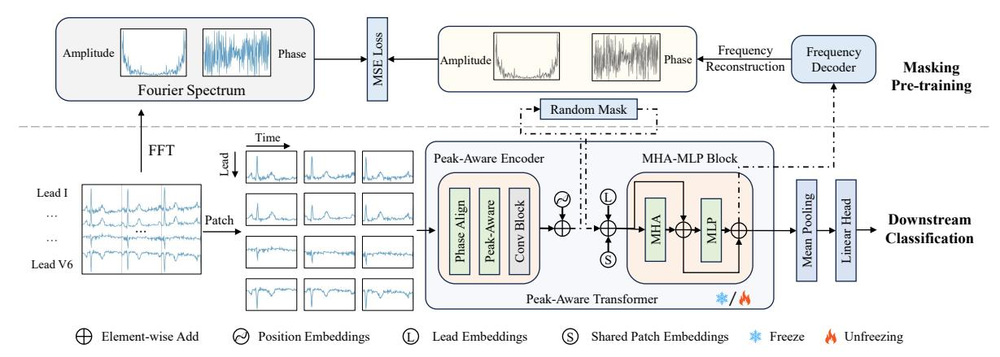
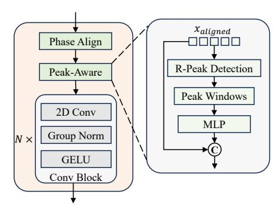
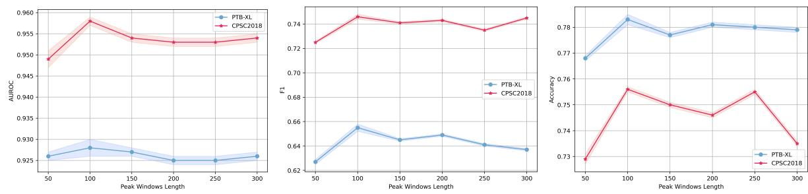
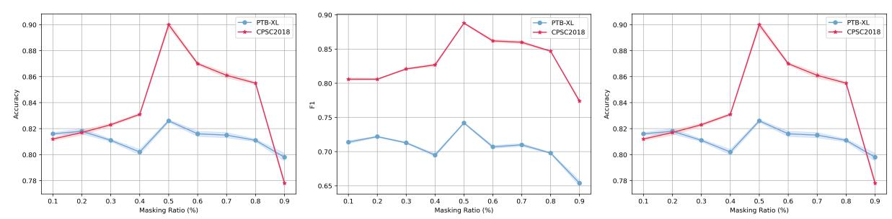
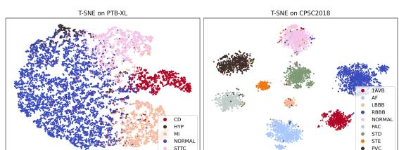
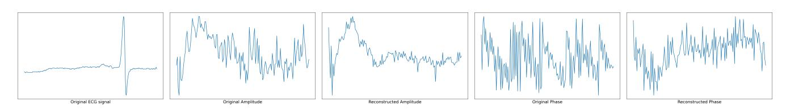
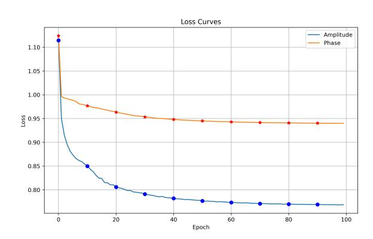

# Sustainable and Responsible ECG-Based AI Diagnostics: Masked Frequency Reconstruction with Peak-Aware Transformers

Wei Wang Macao Polytechnic University Macao, China weiwang@mpu.edu.mo

Jian Chen The University of Hong Kong Hong Kong, China ccccccj03@connect.hku.hk

Junxin Chen Dalian University of Technology Dalian, China junxinchen@ieee.org

Zeling Xu Hong Kong University of Science and Technology Hong Kong, China ZelingXu@ieee.org

Yuntao Zou Huazhong University of Science and Technology Wuhan, China zouyutnao@hust.edu.cn

Henry H. Y. Tong∗ Macao Polytechnic University Macao, China henrytong@mpu.edu.mo

# Abstract

Electrocardiogram (ECG)–based deep learning systems play an increasingly important role in scalable and accessible cardiac health diagnostics, yet their effectiveness is often constrained by limited labeled data, data imbalance, and deployment in resource-restricted or vulnerable populations. Self-supervised learning (SSL) offers a path toward more equitable and sustainable medical AI, but existing ECG SSL approaches often overlook crucial frequency-domain information and clinically important waveform peaks. In this work, we introduce Electrocardiogram Masked Frequency Reconstruction with Peak-Aware Transformer (EMFR-PAT), a responsible and energy-efficient SSL framework that learns high-quality ECG representations by reconstructing masked frequency components and explicitly modeling peak-related features such as R-peaks. To improve robustness across diverse real-world and web-based ECG collection settings, we further incorporate a phase alignment module to mitigate the impact of temporal shifts. Experiments on two public datasets demonstrate that EMFR-PAT significantly outperforms existing SSL baselines in fine-tuning and linear probing, highlighting its ability to generalize even in low-label or data-poor environments. By advancing the reliability, interpretability, and efficiency of ECG representation learning, this work contributes to the development of web-enabled health technologies that support global health equity, responsible AI adoption, and scalable clinical decision support.

## CCS Concepts

#### • Applied computing → Health care information systems; • Computing methodologies → Knowledge representation and reasoning.

© 2026 Copyright held by the owner/author(s). ACM ISBN 979-8-4007-2307-0/2026/04 <https://doi.org/10.1145/3774904.3793047>

# Keywords

Sustainable medical AI, Healthcare information systems, Knowledge representation and reasoning, Heart disease diagnosis

#### ACM Reference Format:

Wei Wang, Jian Chen, Junxin Chen, Zeling Xu, Yuntao Zou, and Henry H. Y. Tong. 2026. Sustainable and Responsible ECG-Based AI Diagnostics: Masked Frequency Reconstruction with Peak-Aware Transformers. In Proceedings of the ACM Web Conference 2026 (WWW '26), April 13–17, 2026, Dubai, United Arab Emirates. ACM, New York, NY, USA, [11](#page-10-0) pages. [https://doi.org/10.1145/](https://doi.org/10.1145/3774904.3793047) [3774904.3793047](https://doi.org/10.1145/3774904.3793047)

# 1 Introduction

As a non-invasive tool to record the electrical activity of the heart over time, the electrocardiogram (ECG) is now widely used for disease diagnosis [\[30\]](#page-8-0). Deep learning methods are proposed to extract features of ECG for classification with lots of labeled data [\[4\]](#page-8-1). However, given the abundance of unlabeled ECG recordings containing various heart diseases, self-supervised learning (SSL) methods have been increasingly developed to learn generic representations of ECG signals for different tasks. This development is inspired by the impressive performance of SSL methods in natural language processing [\[1\]](#page-8-2) and computer vision [\[2\]](#page-8-3). SSL methods effectively learn representations of ECG signals, enabling the detection of various heart diseases.

Existing SSL methods for ECG-based representation learning can be divided into contrastive learning and generative learning [\[16\]](#page-8-4). Contrastive learning methods compare the representations before and after data augmentation. During contrastive learning, the similarity between the representations of positive sample pairs is higher, and the similarity between negative sample pairs is lower [\[20\]](#page-8-5). The ways of augmentation are diverse, including cropping, flipping, and shifting, but these simple augmentation will drastically change the semantic information of the signals [\[19\]](#page-8-6). Therefore, generative methods that reconstruct from representations are gradually becoming mainstream. Masked image modeling (MIM) [\[35\]](#page-8-7) and Masked Autoencoder (MAE) [\[13\]](#page-8-8) are the widely used generative learning frameworks for image, and their variants perform well in the case of ECG [\[11,](#page-8-9) [14,](#page-8-10) [23\]](#page-8-11). These generative methods have shown great performance in learning the representation of ECG signals for reconstruction and can be used for downstream classification.

∗Corresponding author.

[This work is licensed under a Creative Commons Attribution 4.0 International License.](https://creativecommons.org/licenses/by/4.0) WWW '26, Dubai, United Arab Emirates

However, existing generative methods are proposed to reconstruct the temporal domain of ECG signals, without considering the frequency information. In fact, the Fourier spectrum of ECG signals has been proven to have great importance in reflecting the information related to heart disease [\[12,](#page-8-12) [32\]](#page-8-13). At the same time, the peak in the ECG waveform such as R-peak is widely used for clinical diagnosis, containing key features of heart state [\[25\]](#page-8-14).

To overcome these shortcomings, we design a novel ECG Masked Frequency Reconstruction Peak-Aware Transformer (EMFR-PAT) for ECG signal representation learning. Specifically, we introduce frequency reconstruction to ECG-mask modeling, which reconstructs the amplitude and phase of the signal in the Fourier spectrum based on learned representation. Furthermore, a Peak-Aware Transformer (PAT) contains phase alignment, and a peak-aware module is proposed to better capture the key clinical features of ECG signals for better representation learning, which is more in line with the lack of labeling of ECG data in the clinical field. The main contributions are summarized as follows:

- We extend the generative learning method in ECG mask modeling into the frequency domain. By reconstructing the amplitude and phase in the Fourier spectrum, the model can better learn the representation of ECG signals.
- We design a novel Peak-Aware Transformer for ECG signal encoding, which contains phase alignment and a peak-aware module to help capture the clinical features of ECG signals for representation learning.
- Extensive experiments conducted on two public 12-lead ECG signal datasets for disease classification with diverse experimental settings show the great performance of the proposed EMFR-PAT.

#### 2 Related Work

In this section, we review the related work about ECG-based representation learning by two different learning methods: contrastive learning and generative learning.

#### 2.1 Contrastive Learning

Several contrastive learning methods are proposed to learn effective representation of ECG signals by optimizing the similarity objective between sample representations. 3KG [\[9\]](#page-8-15) using ECG-specific 3D augmentations in the vectorcardiogram (VCG) space for conservative learning to better capture the unique spatio-temporal features of the ECG. CT-HB [\[34\]](#page-8-16) proposed to define positive and negative pairs based on heartbeats of ECG signals for contrastive learning. Liu et al. depend on contrastive predictive coding (CPC) to design lead-separation CPC and lead-combination CPC for ECG representation learning [\[22\]](#page-8-17). ISL [\[18\]](#page-8-18) proposed to conduct data augmentation with the clinical characteristics of cardiac signals. RLM [\[24\]](#page-8-19) is an ECG-specific augmentation that randomly masks ECG lead for contrastive learning. Lai et al. proposed four ways of augmentation for contrastive learning of ECG, including frequency dropout, crop resize, cycle mask, and channel mask [\[17\]](#page-8-20). Although these methods have achieved good results, their performance is often limited by the data augmentation method used.

#### 2.2 Generative Learning

Instead of contrastive learning, generative learning is proposed to reconstruct the data with the representation. MaeFE [\[36\]](#page-8-21) divides the ECG signals into patches on the temporal or spatial dimension and then adopts MAE to learn representation. Furthermore, Sawano et al. proposed to divide the ECG signals as spatial-temporal patches for general ECG representation learning, but it ignored the lead relationship between different leads of ECG [\[29\]](#page-8-22). ECG-MAE [\[14\]](#page-8-10) randomly masks the ECG signals in both time and lead dimensions and then integrates CNN layers to ViT [\[8\]](#page-8-23) as the encoder. ST-MEM [\[23\]](#page-8-11) uses MAE architecture for generative learning with lead indicators to learn the relationship between different leads. However, these generative methods all ignore the frequency domain properties of ECG signals and do not focus on the clinical properties of ECG signals, such as peaks in the waveform. To this end, we propose an ECG mask frequency reconstruction and peak-aware transformer to better capture the frequency domain properties and clinical properties for ECG representation learning.

#### 3 Methodology

In this section, we detail the whole framework of the proposed EMFR-PAT, which can be seen in Fig. [1.](#page-2-0) We first formulate the 12-lead ECG signals as �� ∈ R 12×�� . To segment the ECG signals as patch sequences, we use a ��-length window without overlap on the temporal dimension. �� can be segmented into R 12×��×��, where �� =�� /�� represents the patch number of each lead signal. To better meet the requirements of the proposed PAT, we transformed the patch sequences as �� ∈ R (12×��)×��.

#### 3.1 ECG Masked Frequency Reconstruction

Frequency Reconstruction. To learn the effective representation of ECG signals, we adopt an unsupervised task as the pre-training, which is to reconstruct the randomly masked patches. Considering the great importance of the Fourier spectrum of ECG signals, we proposed to conduct masked ECG signal reconstruction in the frequency domain, which is to reconstruct the amplitude and phase. Inspired by MAE in the vision field, we propose a novel PAT as the encoder and a decoder with additional blocks to conduct the ECG masked frequency reconstruction tasks.

Given ECG patch sequences, we first apply the Discrete Fourier Transform (DFT) as Eq. [1](#page-1-0) on each patch ���� to obtain the Fourier spectrum of ECG signals ��˜�� :

��˜�� = ��∑︁−1 ��=0 ���� · cos 2�� �� ���� − �� sin 2�� �� ���� , (1)

where �� is the length of signals, �� is the index of frequency, and �� is the imaginary unit. Furthermore, we can obtain the corresponding amplitude �� and phase �� as Eq. [2](#page-1-1) and Eq. [3:](#page-1-2)

�� = √︁ ��������(��˜��) 2 + ��������(��˜��) 2 , (2)

�� = ������������( ��������(��˜��) ��������(��˜��) ), (3)

where �������� and �������� represent the real and imaginary parts of a complex number. To get a more stable convergence [\[15\]](#page-8-24), we conduct a z-score normalization on �� and �� within a sample.

value as Eq. [8](#page-3-0) to Eq. [9:](#page-3-1)

�� ′ �� = ���� − �� · ��1, (8)

��˜ ′ �� = ���� · �� ����′ �� . (9)

Then we conduct an inverse DFT to obtain the aligned signal ���������������� . The influence brought by temporal shift is eliminated from the frequency domain perspective, which makes our model more consistent in the representation of ECG signals extracted from the same origins [\[10\]](#page-8-25). Furthermore, considering the extraordinary significance of R Peak in ECG signal waveform in clinical diagnosis, we further introduce a Peak-Aware module.

In particular, for each ECG signal patch, we first extract the R peak from the signal based on the Hamilton algorithm and determine a window according to the position of the R peak. In order to emphasize the peak features, the window is set such that it is centered at the detected R peak position and has a length of 100 (but no more than the boundary of the patch). We introduce an MLP to map this peak window into an embedding of the same length as the sequence, expand ���������������� to a channel dimension, and concatenate the mapped peak embedding with the channel dimension of ���������������� . Then we combine several temporal convolution blocks and MLP to extract the temporal features of ECG patches. The whole framework of Peak-Aware Encoder is shown in Fig. [2.](#page-2-4)

Lead and Patch Embeddings. To enable the model to be aware of the differences between different leads, we use a lead-specific embedding �� = [��1, ..., ��12], which ���� is for the ��-th lead of 12-lead ECG signals, and shared patch embedding �� = [������ �� ��, ��������ℎ�� ]. This lead embedding can provide shared embedding among the patch from the same lead, which enables the model to extract representations for different leads. Furthermore, we add the shared patch embedding before and after each patch embedding sequence to help the model learn the relationship between different leads.

MHA-MLP Block. We adopt several MHA-MLP blocks further to extract the features of the patch embedding sequence. Specifically, layer normalization ���� is conducted on the queries �� and keys �� of each head before the dot-product as Eq. [10:](#page-3-2)

������������������(��, ��,�� ) = ��( ���� (��)���� (��) �� √ ���� )�� , (10)

where ���� is the dimension of each head and �� is the Softmax function. For MLP, we adopt the MLP module in LLaMA [\[31\]](#page-8-26). We also adopt a residual connection to enable the model to converge better in the MHA-MLP Block as we can see in Fig. [1.](#page-2-0)

#### 3.3 Reconstruction and Classification

After obtaining the representation of the ECG signal patches, we need to conduct frequency reconstruction for pre-training and linear classification. Therefore, we adopt a frequency decoder and a linear head respectively.

Frequency Decoder for Pre-training. We adopt several MHA-MLP blocks to decode the representation. In particular, we first group the patch sequence by lead and then conduct decoding on each lead. In this way, the decoder is lead-independent, which can motivate the encoders to learn more effective representations since it improves the complexity of the reconstruction. Two linear heads are then used to generate the reconstructed amplitude and phase respectively.

Linear Head for Downstream. We first remove the shared patch embedding on both ends of the patch embedding sequence and then adopt a global mean-pooling to obtain the final representation. Then we use a simple linear head to conduct downstream classification.

#### 4 Experimental Setup

We provided the details of the experimental setup here including the details about the dataset and implementation in this section.

#### 4.1 Dataset

We use three 12-lead datasets to conduct the ECG masked frequency reconstruction as the pre-training of the EMFR-PAT, along with two datasets as the downstream datasets to evaluate our method for ECG arrhythmia diagnosis.

Pre-training datasets. We use three datasets to construct the pretraining dataset for our method, which include PhysioNet Challenge 2021 [\[27\]](#page-8-27), CODE-15 [\[28\]](#page-8-28), and SPH [\[21\]](#page-8-29).

PhysioNet Challenge 2021 dataset contains over 80,000 public 12-lead ECG signals from six sources in four countries across three continents. We first read the ECG recordings with 500 Hz one by one and then removed the recordings with a duration of less than less than 10s. The final number of samples in this dataset used for pre-training is 88,174.

CODE-15 dataset is sampled with a frequency of 400 Hz, which contains 345,779 12-lead ECG recordings from 233,270 patients. We first resample the signals to 500 Hz and then read the first 10s long segments in each recording to maintain consistency with other datasets. The final number of samples in this dataset used for pre-training is 324,115.

SPH dataset consists of 25,770 12-lead clinical ECG records with a frequency of 500 Hz from 24,666 patients. Since the duration of recordings in this dataset is from 10s to 60s, we adopt the same process to use the first 10s long segments of each recording.

We then combine these three datasets without focusing on specific labels as the pre-training dataset. The summary of the pretraining dataset is shown in Table [1.](#page-3-3) We normalized the ECG signals using Z-normalization to ensure uniform scales without any other pre-processing (such as a bandpass digital filter). At the same time, we adopt the length of patch �� as 500, which is 1s length.

Table 1: Summary of the pre-training dataset

Downstream datasets. PTB-XL and CPSC2018 are the downstream datasets we use to evaluate our proposed EMFR-PAT. In these two datasets, ECG recordings are annotated with heart disease labels. However, a single ECG can exhibit multiple heart diseases simultaneously; for example, one ECG might show signs of both myocardial infarction (MI) and conduction disorder (CD) at the same time. Therefore, we adopt the same ST-MEM process to remove ECGs with more than one label. The downstream task is simplified as a multi-multi-class classification task instead of a multi-label classification. PTB-XL is regarded as a 5-class dataset, which includes normal signals (NORMAL), myocardial infarction (MI), ST/T Change (STTC), conduction disturbance (CD), and hypertrophy

Table 2: Results of linear evaluation and fine-tuning on downstream tasks.

| Methods         |        | Accuracy |       | PTB-XL F1 |            | AUROC         |       |       | Accuracy |       | CPSC2018 F1 |       | AUROC   |
|-----------------|--------|----------|-------|-----------|------------|---------------|-------|-------|----------|-------|-------------|-------|---------|
| Supervised-PAT  | 0.783  | ± 0.004  | 0.655 | ± 0.017   | 0.928      | ±             | 0.002 | 0.756 | ± 0.001  | 0.746 | ± 0.002     | 0.958 | ± 0.001 |
|                 |        |          |       | Linear    | Evaluation |               |       |       |          |       |             |       |         |
| MoCo v3         | 0.552  | ± 0.000  | 0.142 | ± 0.000   | 0.739      | ±             | 0.006 | 0.268 | ± 0.055  | 0.080 | ± 0.038     | 0.712 | ± 0.054 |
| CMSC            | 0.681  | ± 0.032  | 0.441 | ± 0.058   | 0.797      | ±             | 0.038 | 0.361 | ± 0.005  | 0.238 | ± 0.022     | 0.724 | ± 0.013 |
| MTAE            | 0.683  | ± 0.008  | 0.437 | ± 0.012   | 0.807      | ±             | 0.006 | 0.486 | ± 0.012  | 0.349 | ± 0.034     | 0.818 | ± 0.010 |
| MTAE+RLM        | 0.687  | ± 0.006  | 0.444 | ± 0.009   | 0.806      | ±             | 0.005 | 0.480 | ± 0.010  | 0.342 | ± 0.022     | 0.824 | ± 0.006 |
| MLAE            | 0.649  | ± 0.008  | 0.382 | ± 0.020   | 0.779      | ±             | 0.008 | 0.443 | ± 0.014  | 0.263 | ± 0.021     | 0.794 | ± 0.016 |
| ST-MEM          | 0.726  | ± 0.005  | 0.508 | ± 0.008   | 0.838      | ±             | 0.011 | 0.723 | ± 0.008  | 0.641 | ± 0.010     | 0.938 | ± 0.002 |
| EMFR-PAT (Ours) | 0. 745 | ± 0.001  | 0.594 | ± 0.002   | 0.913      | ± Fine-tuning | 0.003 | 0.613 | ± 0.001  | 0.583 | ± 0.001     | 0.901 | ± 0.001 |
| MoCo v3         | 0.779  | ± 0.004  | 0.644 | ± 0.010   | 0.913      | ±             | 0.002 | 0.852 | ± 0.002  | 0.838 | ± 0.002     | 0.967 | ± 0.003 |
| CMSC            | 0.724  | ± 0.067  | 0.510 | ± 0.115   | 0.877      | ±             | 0.003 | 0.736 | ± 0.006  | 0.717 | ± 0.006     | 0.938 | ± 0.006 |
| MTAE            | 0.789  | ± 0.002  | 0.613 | ± 0.015   | 0.910      | ±             | 0.001 | 0.793 | ± 0.004  | 0.769 | ± 0.004     | 0.961 | ± 0.001 |
| MTAE+RLM        | 0.793  | ± 0.002  | 0.615 | ± 0.007   | 0.911      | ±             | 0.004 | 0.782 | ± 0.002  | 0.756 | ± 0.003     | 0.960 | ± 0.002 |
| MLAE            | 0.802  | ± 0.004  | 0.625 | ± 0.009   | 0.915      | ±             | 0.001 | 0.834 | ± 0.007  | 0.816 | ± 0.009     | 0.973 | ± 0.002 |
| ST-MEM          | 0.825  | ± 0.002  | 0.655 | ± 0.003   | 0.933      | ±             | 0.003 | 0.872 | ± 0.009  | 0.857 | ± 0.012     | 0.980 | ± 0.001 |
| EMFR-PAT (Ours) | 0.826  | ± 0.001  | 0.742 | ± 0.001   | 0.951      | ±             | 0.002 | 0.900 | ± 0.002  | 0.888 | ± 0.001     | 0.987 | ± 0.001 |

(HYP). CPSC2018 is regarded as a 5-class dataset, which includes normal signals (NORMAL), atrial fibrillation (AF), first-degree atrioventricular block (1AVB), left bundle branch block (LBBB), right bundle branch block (RBBB), premature atrial contraction (PAC), premature ventricular contraction (PVC), ST-segment depression (STD), and ST-segment elevated (STE). It should also be noted that CPSC2018 dataset consists of ECG recordings with a length from 6s to 60s, we remove the recordings less than 10s and crop the recordings exceeding 10s into non-overlapping 10-second segments. More details can be found in the Appendix [A.](#page-8-30)

### 4.2 Baselines.

We adopt several contrastive learning methods and generative learning methods as our compared baselines to verify the performance of our EMFR-PAT. For contrastive learning methods, we compared the MoCo v3 [\[7\]](#page-8-31) and the Contrastive Multi-segment Coding (CMSC) [\[28\]](#page-8-28). For generative learning methods, we compared Masked Time Autoencoder (MTAE) and Masked Lead Autoencoder (MLAE) from MaeFE [\[36\]](#page-8-21), and also ST-MEM [\[23\]](#page-8-11). In addition, Random Lead Masking (RLM) [\[24\]](#page-8-19) is conducted on MTAE as MTAE+RLM.

### 4.3 Implementation.

We compared our pre-training method EMFR-PAT to baselines on the downstream tasks. Specifically, we first compare it with the Supervised-PAT, which is without pre-training. Then we adopt two experimental settings, linear evaluation, and fine-tuning. After pretraining, the linear evaluation will freeze the parameters of the PAT and only train the final linear head while fine-tuning will still update

the parameters of the PAT. Since the downstream tasks are multiclassification tasks, we adopt accuracy, macro-F1 score, and AUROC as metrics. In addition, to evaluate the performance of our model with less labeled data, we conduct low-resource experiments that use 1% and 5% of the training data to compare the AUROC metric between different methods. All the experiments are conducted on NVIDIA GTX 4090 GPU based on the PyTorch framework. More details can be found in the Appendix [B.](#page-8-32)

### 5 Experimental Result

In this section, we provide the results of our experiments to verify the performance of our proposed EMFR-PAT.

## 5.1 Downstream Fine-tuning

The results of linear evaluation and fine-tuning are reported in Table [2.](#page-4-0) For PTB-XL dataset, our proposed EMFR-PAT performs better than all baselines in both linear evaluation and fine-tuning settings, especially on the F1 score, which means that EMFR-PAT can better recognize the classes with a small sample size. We can also find that without pre-training, our proposed PAT can achieve a similar performance against ST-MEM with pre-training, which strongly demonstrates the effectiveness of our designed PAT in extracting ECG representations. In addition, although the encoder is frozen in linear evaluation, EMFR-PAT achieves slightly worse AUC metrics than Supervised-PAT but surpasses the some of baselines with finetuning, which effectively demonstrates the great performance of our proposed EMFR-PAT in learning ECG representation during masking reconstruction pre-training.

Table 3: Results of low-resource experiment on PTB-XL and CPSC2018 datasets.

| Methods         |       |    |       |       | PTB-XL |       |       |      |       |       |    |       |       | CPSC2018 |       |       |      |       |
|-----------------|-------|----|-------|-------|--------|-------|-------|------|-------|-------|----|-------|-------|----------|-------|-------|------|-------|
|                 |       | 1% |       |       | 5%     |       |       | 100% |       |       | 1% |       |       | 5%       |       |       | 100% |       |
| Supervised-PAT  | 0.769 | ±  | 0.001 | 0.838 | ±      | 0.002 | 0.928 | ±    | 0.002 | 0.775 | ±  | 0.001 | 0.838 | ±        | 0.001 | 0.958 | ±    | 0.001 |
| MoCo v3         | 0.797 | ±  | 0.006 | 0.826 | ±      | 0.015 | 0.913 | ±    | 0.002 | 0.791 | ±  | 0.045 | 0.903 | ±        | 0.019 | 0.967 | ±    | 0.003 |
| CMSC            | 0.648 | ±  | 0.064 | 0.773 | ±      | 0.023 | 0.877 | ±    | 0.003 | 0.625 | ±  | 0.013 | 0.732 | ±        | 0.038 | 0.938 | ±    | 0.006 |
| MTAE            | 0.707 | ±  | 0.024 | 0.713 | ±      | 0.001 | 0.910 | ±    | 0.001 | 0.670 | ±  | 0.032 | 0.756 | ±        | 0.013 | 0.961 | ±    | 0.001 |
| MTAE+RLM        | 0.730 | ±  | 0.030 | 0.730 | ±      | 0.003 | 0.911 | ±    | 0.004 | 0.708 | ±  | 0.020 | 0.726 | ±        | 0.011 | 0.960 | ±    | 0.002 |
| MLAE            | 0.793 | ±  | 0.007 | 0.838 | ±      | 0.018 | 0.915 | ±    | 0.001 | 0.860 | ±  | 0.013 | 0.922 | ±        | 0.007 | 0.973 | ±    | 0.002 |
| ST-MEM          | 0.815 | ±  | 0.012 | 0.878 | ±      | 0.011 | 0.933 | ±    | 0.003 | 0.897 | ±  | 0.025 | 0.952 | ±        | 0.004 | 0.980 | ±    | 0.001 |
| EMFR-PAT (Ours) | 0.837 | ±  | 0.022 | 0.885 | ±      | 0.017 | 0.951 | ±    | 0.002 | 0.824 | ±  | 0.036 | 0.913 | ±        | 0.023 | 0.987 | ±    | 0.001 |

Table 4: Results of ablation studies on PAT and reconstruction objective for pre-training.

|                | Table 4: Methods | Results | of Accuracy ablation |       | studies PTBXL F1 on | PAT        | and AUROC Supervised |       |       | Accuracy | objective | CPSC2018 F1 for |       | AUROC   |
|----------------|------------------|---------|----------------------|-------|---------------------|------------|----------------------|-------|-------|----------|-----------|-----------------|-------|---------|
| W/O            | P-A              | 0.769   | ± 0.003              | 0.610 | ± 0.001             | 0.919      | ±                    | 0.004 | 0.729 | ± 0.001  | 0.718     | ± 0.001         | 0.951 | ± 0.001 |
| W/O            | PA               | 0.774   | ± 0.002              | 0.631 | ± 0.004             | 0.922      | ±                    | 0.002 | 0.703 | ± 0.001  | 0.682     | ± 0.001         | 0.932 | ± 0.001 |
| Supervised-PAT |                  | 0.783   | ± 0.004              | 0.655 | ± 0.017             | 0.928      | ±                    | 0.002 | 0.756 | ± 0.001  | 0.746     | ± 0.002         | 0.958 | ± 0.001 |
|                |                  |         |                      |       | Linear              | Evaluation |                      |       |       |          |           |                 |       |         |
| W/O            | P-A              | 0.739   | ± 0.001              | 0.560 | ± 0.003             | 0.898      | ±                    | 0.002 | 0.545 | ± 0.001  | 0.515     | ± 0.001         | 0.856 | ± 0.002 |
| W/O            | PA               | 0.705   | ± 0.001              | 0.528 | ± 0.002             | 0.876      | ±                    | 0.001 | 0.510 | ± 0.001  | 0.479     | ± 0.001         | 0.853 | ± 0.001 |
|                | TR               | 0.729   | ± 0.002              | 0.525 | ± 0.001             | 0.881      | ±                    | 0.002 | 0.436 | ± 0.001  | 0.353     | ± 0.001         | 0.804 | ± 0.001 |
| TR+FR          |                  | 0.732   | ± 0.001              | 0.547 | ± 0.002             | 0.890      | ±                    | 0.001 | 0.559 | ± 0.000  | 0.520     | ± 0.001         | 0.881 | ± 0.002 |
| EMFR-PAT       | (Ours)           | 0.745   | ± 0.001              | 0.594 | ± 0.002             | 0.913      | ± Fine-tuning        | 0.003 | 0.613 | ± 0.001  | 0.583     | ± 0.001         | 0.901 | ± 0.001 |
| W/O            | P-A              | 0.821   | ± 0.001              | 0.699 | ± 0.001             | 0.942      | ±                    | 0.001 | 0.823 | ± 0.001  | 0.829     | ± 0.001         | 0.974 | ± 0.001 |
| W/O            | PA               | 0.816   | ± 0.001              | 0.706 | ± 0.001             | 0.945      | ±                    | 0.001 | 0.781 | ± 0.001  | 0.756     | ± 0.001         | 0.960 | ± 0.001 |
|                | TR               | 0.811   | ± 0.001              | 0.684 | ± 0.002             | 0.947      | ±                    | 0.001 | 0.834 | ± 0.001  | 0.821     | ± 0.001         | 0.974 | ± 0.001 |
| TR+FR          |                  | 0.817   | ± 0.002              | 0.725 | ± 0.001             | 0.946      | ±                    | 0.001 | 0.841 | ± 0.001  | 0.835     | ± 0.002         | 0.975 | ± 0.001 |
| EMFR-PAT       | (Ours)           | 0.826   | ± 0.001              | 0.742 | ± 0.001             | 0.951      | ±                    | 0.002 | 0.868 | ± 0.002  | 0.864     | ± 0.001         | 0.983 | ± 0.001 |

For CPSC2018 dataset, EMFR-PAT achieves the best performance with the fine-tuning setting, which obtains an obvious margin with others on the accuracy, F1, and AUROC scores, while the second best with the linear evaluation. At the same time, EMFR-PAT with linear evaluation shows an obvious gap to Supervised-PAT, especially on the F1 score. This is because CPSC2018 is a classification dataset with an imbalanced sample distribution. When only the linear head is trained, the linear layer is too simple, and it is very easy to overfit the categories with more samples in the dataset, resulting in poor performance of the classification results in the F1 index. For the same reason, when we use less labeled data to fine-tune the model, the results of our method show a large decline and a large variance compared with the PTB-XL dataset.

In summary, we can observe that with pre-training and finetuning, our proposed EMFR-PAT can achieve much better performance on both two datasets than Supervised-PAT. After fine-tuning, our EMFR-PAT outperforms the best-performing baseline by an obvious margin in multiple metrics.

### 5.2 Low-resource Experiments

The results of AUROC of low-resource experiments that reduce the labeled data used for training are reported in Table [3.](#page-5-0) Firstly, we can find that the performance of Supervised-PAT drops rapidly when less labeled data for training is used. For PTB-XL dataset, EMFR-PAT achieves the best performance among baselines on all low-resource tasks. In particular, it has the largest gap with the baseline methods with 1% of training data, which shows our EMFR-PAT has learned the most generic representation during pre-training and just needs 1% of training data to obtain a similar performance of most of the baselines with 5% of training data.

For CPSC2018 dataset, we find that the performance of our proposed EMFR-PAT is in third place with 1% and 5% of training data. This means that the adaptability of our method on this dataset is weaker than PTB-XL. Nevertheless, we find that after finetuning with only 1% of the training data, EMFR-PAT can achieve Supervised-PAT very close to that trained with 5% of the training data, which demonstrates the strong potential of pre-training in our proposed method. In addition, after pre-training, our proposed EMFR-PAT achieves much better performance than the Supervised-PAT with the same labeled training data, demonstrating the effect of our proposed frequency reconstruction.

## 5.3 Ablation Study

First of all, we conduct an experiment to find out the optimal length of peak windows used in the Peak-Aware module. This encoder aims to enhance the performance of the model in extracting the

Figure 3: Experimental results of different peak window lengths.

Figure 4: Experimental results of different masking ratios.

R-peak feature of the ECG signal. Therefore, we need to find out the location of the R-peak and take a clip around it as our goal to focus on. We set the value range from 50 to 300 to experimentally verify the effect of this parameter in a step of 50. The whole experimental results are reported in Fig. [3.](#page-6-0) We can observe that when this length is set to 100, our model achieves the best performance on both two downstream datasets under supervised training conditions. This means that when the peak window length is 100, our model can effectively focus on the R-peak and the waveform around it, to extract features that can effectively distinguish the related diseases. Therefore, in our main experiments, we set the peak window length in our EMFR-PAT as 100.

Secondly, since the masking ratio is the key parameter that affects the difficulty of the reconstruction task, we conduct experiments to verify its effect. Specifically, A higher masking rate means a more complex reconstruction task, while a lower masking rate means a simpler one. We change the masking ratio from 0.1 to 0.9 with a step of 0.1 for pre-training and then conduct the finetuning task on downstream datasets. Then we conduct downstream tasks with the fine-tuning setting on two downstream datasets. The whole experimental results are reported in Fig. [4.](#page-6-1) We can observe an interesting trend for all three metrics on the CPSC2018 dataset: When the masking ratio is less than 0.5, the performance of the model keeps improving as the masking ratio increases, while when the masking ratio is larger than 0.5, the performance of the model starts to decrease. This phenomenon can well prove our point that neither too simple nor too-difficult mask training process can learn the generic representation of ECG signals most effectively. Although on the PTB-XL dataset, the performance of the model shows large fluctuations as the masking ratio keeps changing, when the masking ratio is equal to 0.5, it is still the best performance.

To better evaluate the proposed EMFR-PAT, we design some variants to conduct ablation studies. On the one hand, we verify the effect of the module we proposed in the PAT and also the reconstruction objective for the pre-training process. Specifically, we remove the phase alignment module (W/O PA) and peak-aware module (W/O P-A) in the PAT respectively to verify their effect. For these two variants, we adopt three experimental settings: supervised, linear evaluation, and fine-tuning. On the other hand, we compare the frequency reconstruction with temporal reconstruction (TR), and also combined temporal and frequency reconstruction (TR + FR). For these two variants, we adopt two experimental settings: linear evaluation, and fine-tuning. The results of these ablation studies are reported in Table [4.](#page-5-1)

For supervised experiments, we can observe that after removing the phase alignment module or the peak-aware module, the performance of PAT drops obviously in both two datasets. These results show that our proposed Peak-Aware module performs well in extracting ECG features. In addition, we also find that the peak-aware module performs better on the PTB-XL dataset and the peak-aware module performs better on the ICBEB. dataset. For linear evaluation, removing these two modules results in an expected performance degradation compared to EMFR-PAT. To verify the effect of frequency reconstruction, we conduct pre-training on reconstructing the temporal domain and even both temporal and frequency domains. On both linear evaluation and fine-tuning settings we can see that our proposed frequency reconstruction performs best. Only performing time domain reconstruction during pre-training achieves the worst downstream performance, and introducing frequency domain reconstruction on the basis of time domain reconstruction can bring performance improvement, but it still cannot exceed that of only performing frequency domain reconstruction. The results

Table 5: Experiment on different pre-training dataset

|                |         |             | PTBXL       |                   |             | CPSC2018    |             |
|----------------|---------|-------------|-------------|-------------------|-------------|-------------|-------------|
|                |         | Accuracy    | F1          | AUROC             | Accuracy    | F1          | AUROC       |
| Supervised-PAT |         | 0.783±0.002 | 0.655±0.003 | 0.928±0.002       | 0.756±0.001 | 0.746±0.002 | 0.958±0.001 |
|                |         |             |             | Linear Evaluation |             |             |             |
| Without        | CODE-15 | 0.701±0.001 | 0.533±0.001 | 0.871±0.001       | 0.499±0.001 | 0.461±0.001 | 0.846±0.001 |
| With           | CODE-15 | 0.745±0.001 | 0.594±0.002 | 0.913±0.003       | 0.613±0.001 | 0.583±0.001 | 0.901±0.001 |
| Without        | CODE-15 | 0.808±0.002 | 0.664±0.002 | 0.944±0.002       | 0.804±0.001 | 0.792±0.001 | 0.969±0.001 |
| With           | CODE-15 | 0.826±0.001 | 0.742±0.001 | 0.953±0.002       | 0.900±0.002 | 0.888±0.001 | 0.987±0.001 |

of this ablation experiment effectively verify the effectiveness of our proposed ECG signal reconstruction in the frequency domain.

To further evaluate the performance of our proposed EMFR-PAT, we removed the sub-dataset with CODE-15, the largest dataset in the pre-training dataset, and pre-trained our model with fewer ECG signals. In this way, we can effectively see that the performance of our model is affected by the size of the pre-training data. We summarize the used dataset with this setting as Table [10.](#page-9-0) By comparing Table [1](#page-3-3) and Table [10,](#page-9-0) we can observe that the amount of data used for pre-training is reduced to about 1/4 of the original.

Specifically, we conduct pre-training with this dataset to reconstruct the frequency domain information of ECG signals, and then conduct downstream classification. To better evaluate the effect of the pre-training dataset CODE-15, we compared the results of both fine-tuning and linear evaluation on two downstream datasets. The whole experimental results are shown in Table [5.](#page-7-0) We can see that without CODE-15 dataset, the improvement obtained by our method after pre-training becomes smaller, but is still non-significant. Moreover, the size of the pre-training dataset has a more significant impact on the linear evaluation setting than the fine-tuning setting.

### 5.4 Representation Visualization

To better demonstrate the great performance of our proposed EMFR-PAT, we visualize the embedding space of the downstream datasets using t-SNE. Specifically, we remove the linear head for classification and adopt the PAT encoder to obtain the encoding of ECG signals. Then we use t-SNE to reduce the feature dimension and plot them as a scatter plot. At the same time, different colors are assigned according to the category label for visualization as Fig. [5.](#page-7-1)

Figure 5: Embedding distribution with t-SNE.

Each color represents a specific heart-related disease diagnosis label. We can see that on the two downstream datasets, samples with the same label are clustered together in the feature space after dimensionality reduction of ECG representations extracted by our EMFR-PAT model. Even on the CPSC2018 dataset, there is a significant distance between the samples of different classes, which means that our proposed method can learn the representation of ECG signals very effectively and can be used to achieve highprecision diagnosis of heart-related diseases.

#### 6 Conclusion

In this work, we propose EMFR-PAT, ECG Masked Frequency Reconstruction Peak-Aware Transformer for ECG generic representation learning. By introducing frequency domain reconstruction to ECG masked modeling instead of existing time domain reconstruction, our proposed method can better learn the representation of ECG signals during the pre-training. We also adapt to the characteristics of ECG signals, a novel peak-sensing Transformer including phase alignment and peak-aware module is designed to better extract the key features of ECG signals for representation learning. Experimental results demonstrate the superiority of EMFR-PAT among existing state-of-the-art generative learning methods for ECG signal representation learning. However, low-resource experimental results on CPSC2018 dataset also show that EMFR-PAT still has the potential for further improvement. In addition, considering the similarities between ECG signals and other physiological signals such as EEG and PPG, our future work will explore the further extension of EMFR-PAT to the physiological signal generalization framework, which is more generic for multi-modal medical data.

Limitaion and discussion. We collect a large dataset for ECG mask frequency reconstruction, but it still has a large margin from today's large vision models and large language models, which also use generative learning methods for pre-training. It is delighted to find that using the generative learning method as pre-training with tremendous ECG data does work and obtain appreciable performance gain for specific heart-related disease classification tasks. Moreover, considering the great performance of multimodal learning in different fields [\[5,](#page-8-33) [6,](#page-8-34) [26\]](#page-8-35), it's of great potential to explore the cross-modal representation of ECG signals and related medical data such as PPG signals and clinical reports [\[3\]](#page-8-36).

# Acknowledgments

This work is supported by Macao Polytechnic University Internal Research Grant (No. RP/FCSD-03/2024 for HHYT).

References [1] Tom Brown, Benjamin Mann, Nick Ryder, Melanie Subbiah, Jared D Kaplan, Prafulla Dhariwal, Arvind Neelakantan, Pranav Shyam, Girish Sastry, Amanda Askell, et al. 2020. Language models are few-shot learners. Advances in neural information processing systems 33 (2020), 1877–1901. [2] Mathilde Caron, Hugo Touvron, Ishan Misra, Hervé Jégou, Julien Mairal, Piotr Bojanowski, and Armand Joulin. 2021. Emerging properties in self-supervised vision transformers. In Proceedings of the IEEE/CVF international conference on computer vision. 9650–9660. [3] Jian Chen, Xiaoru Dong, Wei Wang, Shaorui Zhou, Lequan Yu, and Xiping Hu. 2025. DERI: Cross-Modal ECG Representation Learning with Deep ECG-Report Interaction. In The 34th Internationa Joint Conference on Artificial Intelligence. 4824–4832. [4] Jian Chen, Yuzhu Hu, Lalit Garg, Thippa Reddy Gadekallu, Gautam Srivastava, and Wei Wang. 2024. Graph Enhanced Low-Resource ECG Representation Learning for Emotion Recognition Based on Wearable Internet of Things. IEEE Internet of Things Journal (2024). [5] Jian Chen, Yuzhu Hu, Qifeng Lai, Wei Wang, Junxin Chen, Han Liu, Gautam Srivastava, Ali Kashif Bashir, and Xiping Hu. 2024. IIFDD: Intra and inter-modal fusion for depression detection with multi-modal information from Internet of Medical Things. Information Fusion 102 (2024), 102017. [6] Jian Chen, Wei Wang, Yuzhu Hu, Junxin Chen, Han Liu, and Xiping Hu. 2024. TGCA-PVT: Topic-Guided Context-Aware Pyramid Vision Transformer for Sticker Emotion Recognition. In Proceedings of the 32nd ACM International Conference on Multimedia. 9709–9718. [7] Xinlei Chen, Saining Xie, and Kaiming He. 2021. An empirical study of training self-supervised vision transformers. In Proceedings of the IEEE/CVF international conference on computer vision. 9640–9649. [8] Alexey Dosovitskiy, Lucas Beyer, Alexander Kolesnikov, Dirk Weissenborn, Xiaohua Zhai, Thomas Unterthiner, Mostafa Dehghani, Matthias Minderer, Georg Heigold, Sylvain Gelly, et al. 2020. An image is worth 16x16 words: Transformers for image recognition at scale. arXiv preprint arXiv:2010.11929 (2020). [9] Bryan Gopal, Ryan Han, Gautham Raghupathi, Andrew Ng, Geoff Tison, and Pranav Rajpurkar. 2021. 3KG: Contrastive learning of 12-lead electrocardiograms using physiologically-inspired augmentations. In Machine Learning for Health. PMLR, 156–167. [10] Haokun GUI, Xiucheng Li, and Xinyang Chen. 2024. Vector Quantization Pretraining for EEG Time Series with Random Projection and Phase Alignment. In Forty-first International Conference on Machine Learning. [11] Prashnna K Gyawali, B Milan Horacek, John L Sapp, and Linwei Wang. 2018. Learning disentangled representation from 12-lead electrograms: application in localizing the origin of Ventricular Tachycardia. In Workshops at the Thirty-Second AAAI Conference on Artificial Intelligence. [12] RGRG Haberl, G Jilge, R Pulter, and G Steinbeck. 1989. Spectral mapping of the electrocardiogram with Fourier transform for identification of patients with sustained ventricular tachycardia and coronary artery disease. European Heart Journal 10, 4 (1989), 316–322. [13] Kaiming He, Xinlei Chen, Saining Xie, Yanghao Li, Piotr Dollár, and Ross Girshick. 2022. Masked autoencoders are scalable vision learners. In Proceedings of the IEEE/CVF conference on computer vision and pattern recognition. 16000–16009. [14] Rui Hu, Jie Chen, and Li Zhou. 2023. Spatiotemporal self-supervised representation learning from multi-lead ECG signals. Biomedical Signal Processing and Control 84 (2023), 104772. [15] Wei-Bang Jiang, Li-Ming Zhao, and Bao-Liang Lu. 2024. Large brain model for learning generic representations with tremendous EEG data in BCI. arXiv preprint arXiv:2405.18765 (2024). [16] Longlong Jing and Yingli Tian. 2020. Self-supervised visual feature learning with deep neural networks: A survey. IEEE transactions on pattern analysis and machine intelligence 43, 11 (2020), 4037–4058. [17] Jiewei Lai, Huixin Tan, Jinliang Wang, Lei Ji, Jun Guo, Baoshi Han, Yajun Shi, Qianjin Feng, and Wei Yang. 2023. Practical intelligent diagnostic algorithm for wearable 12-lead ECG via self-supervised learning on large-scale dataset. Nature Communications 14, 1 (2023), 3741. [18] Xiang Lan, Dianwen Ng, Shenda Hong, and Mengling Feng. 2022. Intra-inter subject self-supervised learning for multivariate cardiac signals. In Proceedings of the AAAI Conference on Artificial Intelligence, Vol. 36. 4532–4540. [19] Xiang Lan, Hanshu Yan, Shenda Hong, and Mengling Feng. 2023. Towards Better Time Series Contrastive Learning: A Dynamic Bad Pair Mining Approach. arXiv preprint arXiv:2302.03357 (2023). [20] Duc Le, Sang Truong, Patel Brijesh, Donald A Adjeroh, and Ngan Le. 2023. scl-st: Supervised contrastive learning with semantic transformations for multiple lead ecg arrhythmia classification. IEEE journal of biomedical and health informatics 27, 6 (2023), 2818–2828. [21] Hui Liu, Dan Chen, Da Chen, Xiyu Zhang, Huijie Li, Lipan Bian, Minglei Shu, and Yinglong Wang. 2022. A large-scale multi-label 12-lead electrocardiogram database with standardized diagnostic statements. Scientific data 9, 1 (2022), 272. [22] Wenhan Liu, Qianxi Guo, Xinwei Gao, Sheng Chang, Hao Wang, Jin He, and Qijun Huang. 2022. Lead Separation and Combination: A Novel Unsupervised 12-Lead ECG Feature Learning Framework for Internet of Medical Things. IEEE Internet of Things Journal 9, 23 (2022), 23897–23914. [doi:10.1109/JIOT.2022.3188771](https://doi.org/10.1109/JIOT.2022.3188771) [23] Yeongyeon Na, Minje Park, Yunwon Tae, and Sunghoon Joo. 2024. Guiding Masked Representation Learning to Capture Spatio-Temporal Relationship of Electrocardiogram. arXiv preprint arXiv:2402.09450 (2024). [24] Jungwoo Oh, Hyunseung Chung, Joon-myoung Kwon, Dong-gyun Hong, and Edward Choi. 2022. Lead-agnostic self-supervised learning for local and global representations of electrocardiogram. In Conference on Health, Inference, and Learning. PMLR, 338–353. [25] Luis Fernando Pava, Pablo Perafán, Marisol Badiel, Juan José Arango, Lluis Mont, Carlos A Morillo, and Josep Brugada. 2010. R-wave peak time at DII: a new criterion for differentiating between wide complex QRS tachycardias. Heart rhythm 7, 7 (2010), 922–926. [26] Wen Qi and Hang Su. 2022. A cybertwin based multimodal network for ecg patterns monitoring using deep learning. IEEE Transactions on Industrial Informatics 18, 10 (2022), 6663–6670. [27] Matthew A Reyna, Nadi Sadr, Erick A Perez Alday, Annie Gu, Amit J Shah, Chad Robichaux, Ali Bahrami Rad, Andoni Elola, Salman Seyedi, Sardar Ansari, et al. 2021. Will two do? Varying dimensions in electrocardiography: the PhysioNet/Computing in Cardiology Challenge 2021. In 2021 Computing in Cardiology (CinC), Vol. 48. IEEE, 1–4. [28] Antônio H Ribeiro, GM Paixao, Emilly M Lima, M Horta Ribeiro, Marcelo M Pinto Filho, Paulo R Gomes, Derick M Oliveira, Wagner Meira Jr, Thömas B Schon, and Antonio Luiz P Ribeiro. 2021. CODE-15%: A large scale annotated dataset of 12-lead ECGs. Zenodo, Jun 9 (2021). [29] Shinnosuke Sawano, Satoshi Kodera, Hirotoshi Takeuchi, Issei Sukeda, Susumu Katsushika, and Issei Komuro. 2022. Masked Autoencoder-Based Self-Supervised Learning for Electrocardiograms to Detect Left Ventricular Systolic Dysfunction.. In NeurIPS 2022 Workshop on Learning from Time Series for Health. [30] Konstantinos C Siontis, Peter A Noseworthy, Zachi I Attia, and Paul A Friedman. 2021. Artificial intelligence-enhanced electrocardiography in cardiovascular disease management. Nature Reviews Cardiology 18, 7 (2021), 465–478. [31] Hugo Touvron, Louis Martin, Kevin Stone, Peter Albert, Amjad Almahairi, Yasmine Babaei, Nikolay Bashlykov, Soumya Batra, Prajjwal Bhargava, Shruti Bhosale, et al. 2023. Llama 2: Open foundation and fine-tuned chat models. arXiv preprint arXiv:2307.09288 (2023). [32] Takeshi Tsutsumi, Nami Takano, Narihisa Matsuyama, Yukei Higashi, Kuniaki Iwasawa, and Toshiaki Nakajima. 2011. High-frequency powers hidden within QRS complex as an additional predictor of lethal ventricular arrhythmias to ventricular late potential in post–myocardial infarction patients. Heart Rhythm 8, 10 (2011), 1509–1515. [33] Patrick Wagner, Nils Strodthoff, Ralf-Dieter Bousseljot, Dieter Kreiseler, Fatima I Lunze, Wojciech Samek, and Tobias Schaeffter. 2020. PTB-XL, a large publicly available electrocardiography dataset. Scientific data 7, 1 (2020), 1–15. [34] Crystal T Wei, Ming-En Hsieh, Chien-Liang Liu, and Vincent S Tseng. 2022. Contrastive heartbeats: Contrastive learning for self-supervised ecg representation and phenotyping. In ICASSP 2022-2022 IEEE International Conference on Acoustics, Speech and Signal Processing (ICASSP). IEEE, 1126–1130. [35] Zhenda Xie, Zheng Zhang, Yue Cao, Yutong Lin, Jianmin Bao, Zhuliang Yao, Qi Dai, and Han Hu. 2022. Simmim: A simple framework for masked image modeling. In Proceedings of the IEEE/CVF conference on computer vision and pattern recognition. 9653–9663. [36] Huaicheng Zhang, Wenhan Liu, Jiguang Shi, Sheng Chang, Hao Wang, Jin He, and Qijun Huang. 2022. Maefe: Masked autoencoders family of electrocardiogram for self-supervised pretraining and transfer learning. IEEE Transactions on Instrumentation and Measurement 72 (2022), 1–15. Appendix A Dataset Processing For downstream classification datasets, we divide each dataset into training, validation, and testing sets, which is 7:1:2, the same as the setting of ST-MEM. Specifically, Table [6](#page-9-1) and Table [7](#page-9-2) show the number of instances (ECGs) of downstream dataset PTB-XL and CPSC2018. B Implementation

In this section, we provide more details about the implementation of our proposed EMFR-PAT. The implementation of our proposed

Table 6: The number of instances (ECGs) of PTB-XL

|                     | # ECGs | NORMAL | MI   | STTC | CD   | HYP  |
|---------------------|--------|--------|------|------|------|------|
| Original            | 21837  | 9528   | 5486 | 5250 | 4907 | 2655 |
| After removing ECGs | 16272  | 9083   | 2538 | 2406 | 1709 | 536  |
| Train               | 11390  | 6379   | 1752 | 1706 | 1177 | 376  |
| Valid               | 1627   | 907    | 279  | 240  | 159  | 42   |
| Test                | 3255   | 1797   | 507  | 460  | 373  | 118  |

Table 7: The number of instances (ECGs) of CPSC2018

|        | Orginal | After cropping | After removing | Train | Valid | Test |
|--------|---------|----------------|----------------|-------|-------|------|
| # ECGs | 6877    | 9364           | 8682           | 6077  | 868   | 1737 |
| NORMAL | 918     | 1201           | 1201           | 849   | 113   | 239  |
| AF     | 1098    | 1593           | 1266           | 865   | 131   | 270  |
| 1AVB   | 704     | 900            | 840            | 585   | 84    | 171  |
| LBBB   | 207     | 300            | 225            | 161   | 18    | 46   |
| RBBB   | 1695    | 2357           | 1911           | 1336  | 212   | 363  |
| PAC    | 574     | 1014           | 892            | 636   | 85    | 171  |
| PVC    | 653     | 1256           | 1104           | 779   | 113   | 212  |
| STD    | 826     | 1102           | 971            | 673   | 86    | 212  |
| STE    | 202     | 332            | 272            | 193   | 26    | 53   |

EMFR-PAT can be conducted as a two-stage procedure: pre-training for reconstruction and downstream for classification.

## B.1 Pre-training Setting.

For the first stage, we train the Peak-Aware Transformer and the Frequency Decoder synchronously to reconstruct the amplitude and phase in the Fourier Spectrum of ECG signals by minimizing the reconstruction loss of the masked patches. Further details of hyper-parameters used in pre-training are shown in Table [8.](#page-9-3) It should be noted that although we use 2D Convolution in Peak-Aware Encoder, the kernel size is set as 1 on the length dimension which represents the number of patches.

# B.2 Downstream Setting.

For the second stage, we remove the Frequency Decoder and add a global mean pooling layer and a linear head for classification on PTBXL [\[33\]](#page-8-37) and CPSC2018 [\[21\]](#page-8-29) datasets. We conduct two different experimental settings in the downstream tasks. On the one hand, we unfreeze all the parameters of the PAT encoder and update them with the final linear head together as the fine-tuning. On the other hand, we freeze the parameters of the PAT encoder and just train the linear head for classification, which is called linear evaluation. We use cross-entropy loss to optimize our model during training on the downstream tasks. More details of the hyper-parameters used in downstream tasks training are shown in Table [9.](#page-9-4)

# C Visualization of Pre-training

We first plot the reconstruction loss during pre-training in Fig. [7.](#page-10-1) It can be seen from Fig. [7](#page-10-1) that there is a steady descent that eventually converges in the reconstruction loss during pre-training, which indicates that our proposed method learns high-level information from the Fourier domain of ECG signals. In addition, we can see that the loss of phase is always larger than the loss of amplitude, which

Table 8: Hyper-parameters of pre-training

| Hyperparameters    |                   | Values     |
|--------------------|-------------------|------------|
| Peak-Aware Encoder |                   |            |
|                    | Num. of CNN       | blocks 3   |
|                    | Input channels    | {1,8,8}    |
|                    | Output channels   | {8,8,8}    |
|                    | Kernel size       | {15,3,3}   |
|                    | Stride            | {16,1,1}   |
|                    | Padding           | {7,1,1}    |
|                    | Hidden size of    | MLP 128    |
| Num. of MHA-MLP    | blocks in encoder | 12         |
| Num. of MHA-MLP    | blocks in dncoder | 3          |
| Hidden             | size              | 200        |
| MLP                | size              | 800        |
| Attention          | head number       | 10         |
| Dropout            | path rate         | 0.1        |
| Batch              | size              | 512        |
| Peak learning      | rate              | 5e-4       |
| Minimal            | learning rate     | 1e-5       |
| Learning rate      | scheduler         | Cosine     |
| Optimizer          |                   | AdamW      |
| Adam               | ��                | (0.9,0.98) |
| Weight             | decay             | 0.05       |
| Total              | epochs            | 100        |
| Warmup             | epochs            | 10         |
| Gradient           | clipping          | 1          |
| Layer              | scale init        | 0.1        |
| Mask               | ratio             | 0.5        |

Table 9: Hyper-parameters of downstream

| Hyperparameters |                | Fine-tuning | Linear Evaluation |
|-----------------|----------------|-------------|-------------------|
| Batch           | size           | 32          | 32                |
| Peak learning   | rate           | 1e-3        | 1e-4              |
| Minimal         | learning rate  | 1e-4        | 1e-5              |
| Learning        | rate scheduler | Cosine      | Cosine            |
| Optimizer       |                | AdamW       | AdamW             |
| Adam            | ��             | (0.9,0.995) | (0.9,0.995)       |
| Weight          | decay          | 1e-5        | 1e-5              |
| Total           | epochs         | 30          | 100               |
| Warmup          | epochs         | 3           | 10                |
| Drop            | path           | 0.12        | 0.12              |

Table 10: Pre-training dataset without CODE-15

means that reconstructing phase is more difficult than amplitude for our proposed EMFR-PAT.

We further visualize the amplitude and phase in the Fourier domain as Fig. [6,](#page-10-2) which are reconstructed during the pre-training to better demonstrate the performance of our proposed method.

Figure 6: Visualization of reconstructed Fourier spectrum.

Figure 7: The reconstruction loss during pre-training

We can see that although some details are missing, the overall trend of the reconstructed amplitude is similar to the original amplitude, while the reconstructed phase is not as good as the amplitude. This result is also consistent with our observation in the loss function that it is more difficult to reconstruct the phase.