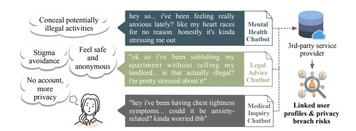
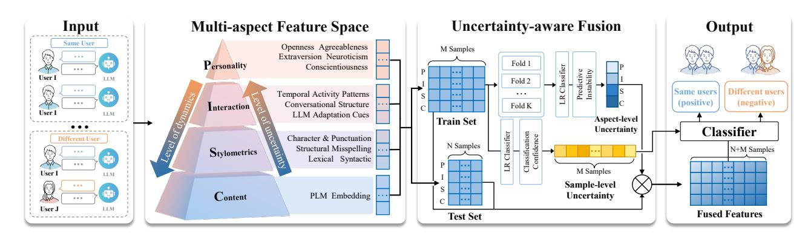
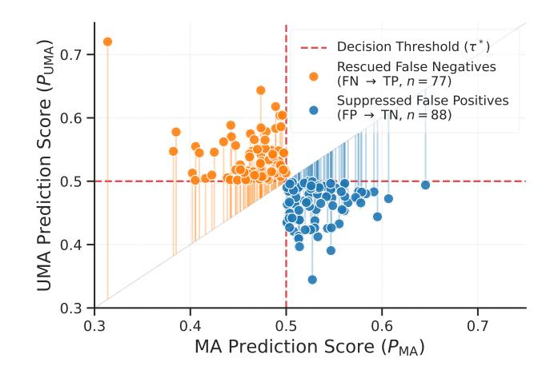
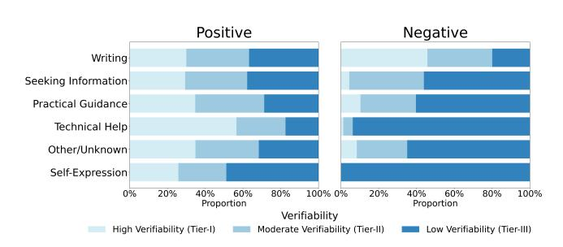
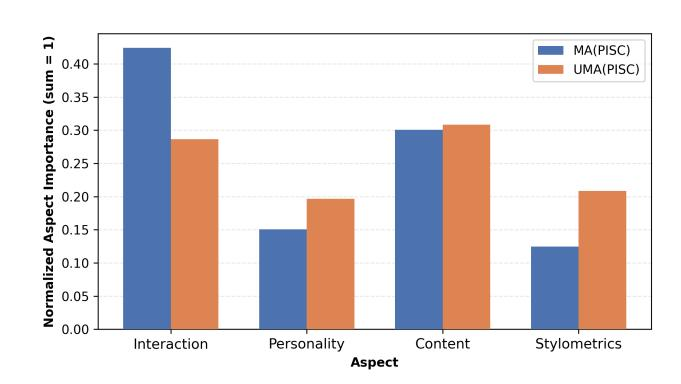
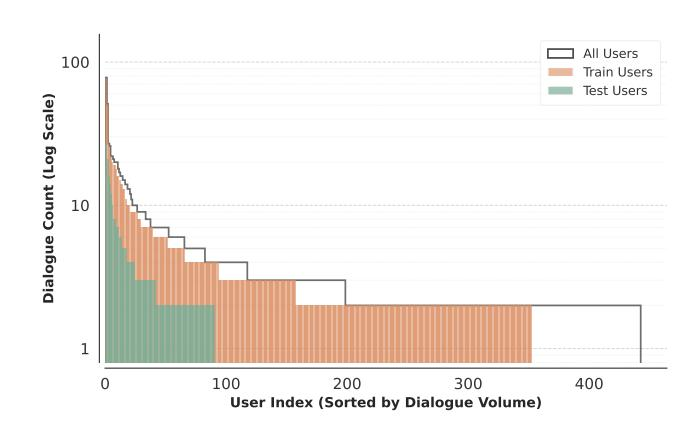
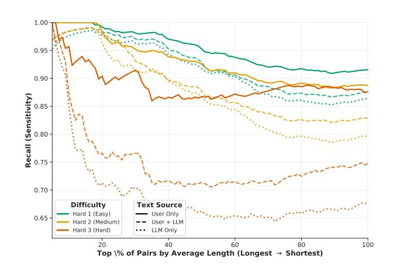
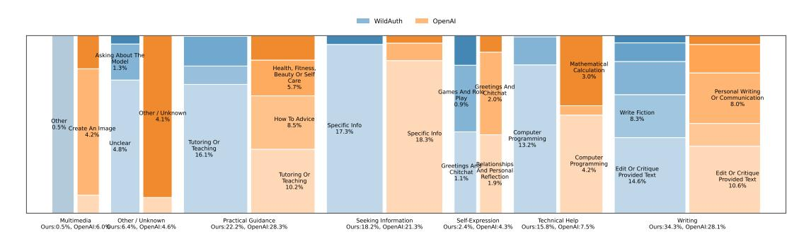
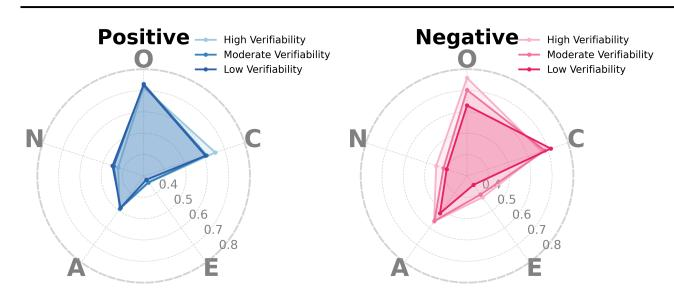

# The Chatbot Knows It's You: Dialogue Attribution in Unauthenticated Human–LLM Sessions

Wenxuan Wang∗ wenxuanwang3@ln.hk School of Data Science, Lingnan University Hong Kong, China

Zirui Liu∗ ziruiliu3@ln.hk School of Data Science, Lingnan University Hong Kong, China

Haoxuan Kou haoxuankou@ln.hk School of Data Science, Lingnan University Hong Kong, China

Xuefeng Liu liu\_xuefeng@buaa.edu.cn School of Computer Science and Engineering, Beihang University Beijing, China

Jiaxing Shen† jiaxingshen@ln.edu.hk School of Data Science, Lingnan University Hong Kong, China

# Abstract

As large language models (LLMs) become ubiquitous in publicfacing services, millions of users engage in unauthenticated sessions under the assumption that "no login" implies "no tracking." We challenge this assumption by formalizing Dialogue Attribution—the task of identifying the same user across disparate, unauthenticated human–LLM sessions, even under severe topic shifts. To rigorously quantify this threat, we introduce WildAuth, the first benchmark derived from real-world ChatGPT logs, and propose Uncertaintyaware Multi-aspect Attribution (UMA). UMA effectively links users by fusing complementary identity signals—content, stylometrics, interaction, and personality—via a novel uncertainty-aware mechanism that dynamically suppresses noise in ambiguous or short-text scenarios. Our approach consistently outperforms strong stylometric, PLM-based, and LLM-assisted baselines, achieving an AUC of 92.05% (F1 76.15%) in challenging cross-topic settings. More critically, we find that attribution remains highly effective (88.65% AUC) even when relying solely on the LLM's responses. These findings expose a fundamental privacy paradox: the very behavioral signatures that enable natural interaction—including the assistant's stylistic "mirroring"—render anonymous sessions intrinsically linkable, necessitating a re-evaluation of privacy standards for AI infrastructure.

# CCS Concepts

• Security and privacy → Pseudonymity, anonymity and untraceability; • Computing methodologies → Discourse, dialogue and pragmatics; • Human-centered computing → User models.

© 2026 Copyright held by the owner/author(s). ACM ISBN 979-8-4007-2307-0/2026/04 <https://doi.org/10.1145/3774904.3793048>

# Keywords

Dialogue Attribution; Human-LLM Interaction; Privacy Risks; User Modeling; Large Language Models; Behavioral Fingerprinting

#### ACM Reference Format:

Wenxuan Wang, Zirui Liu, Haoxuan Kou, Xuefeng Liu, and Jiaxing Shen. 2026. The Chatbot Knows It's You: Dialogue Attribution in Unauthenticated Human–LLM Sessions . In Proceedings of the ACM Web Conference 2026 (WWW '26), April 13–17, 2026, Dubai, United Arab Emirates. ACM, New York, NY, USA, [11](#page-10-0) pages.<https://doi.org/10.1145/3774904.3793048>

# 1 Introduction

As LLMs evolve into the primary interface for the Web, they are rapidly becoming critical infrastructure for healthcare [\[1\]](#page-8-0), law [\[2\]](#page-8-1), education [\[3\]](#page-8-2), and government services [\[4\]](#page-8-3). This integration has driven a massive shift toward unauthenticated, "anonymous" sessions, where users—from citizens at a government helpdesk to patients seeking triage—feel safe disclosing highly sensitive information. They operate under the assumption that "no login" means "no tracking." However, we argue this assumption masks a fundamental privacy paradox: the more natural and helpful a dialogue becomes, the more unique behavioral evidence it exposes. While no cookie or account ID links these sessions, the conversation itself acts as a persistent fingerprint, potentially allowing third parties to reconstruct a user's identity across disparate sensitive domains.

This paradox creates a new and urgent technical problem we term Dialogue Attribution: the task of identifying the same user across disparate, unauthenticated LLM sessions, even when topics, timeframes, and platforms change. Tackling this is uniquely challenging due to two factors. First, LLM dialogues are highly dynamic; a user's style often shifts with the topic or, more insidiously, exhibits a mirroring effect where the user unconsciously adopts the assistant's linguistic patterns [\[5\]](#page-8-4). Consequently, standard stylometric methods often overfit to transient content ("what is said") rather than the stable authorial identity ("who is speaking"). Second, unauthenticated sessions are often short and sparse, yielding a faint behavioral signal that renders traditional profiling unreliable.

To overcome these challenges, we posit that while users may mask what they discuss, they cannot easily hide who they are.

∗Both authors contributed equally to this research.

†Corresponding author.

[This work is licensed under a Creative Commons Attribution 4.0 International License.](https://creativecommons.org/licenses/by/4.0) WWW '26, Dubai, United Arab Emirates

Psychological research suggests that an individual's internal behavioral logic remains consistent even as topics shift from "cooking" to "bankruptcy" [\[6\]](#page-8-5). Guided by this insight, we propose the Uncertainty-aware Multi-aspect Attribution (UMA) framework. UMA captures a robust conversational fingerprint by fusing four complementary signals—Personality, Interaction dynamics, Stylometrics, and Content (PISC)—into a unified identity signature. Crucially, to handle the noise inherent in short texts, we introduce an Uncertainty-aware Fusion mechanism that explicitly models feature reliability, dynamically down-weighting ambiguous signals to prevent overfitting.

Our investigation yields a startling conclusion: the chatbot knows it's you. Our experiments on a new multi-tier benchmark reveal that UMA achieves an AUC of up to 92.1% on the most challenging cross-topic tasks, significantly outperforming strong baselines. Most notably, we find that user identity leaks through not only the user's own words but also the LLM's responses, which encode both user's topics and prompting style. Our main contributions are:

- We construct and release the first open-set benchmark for unauthenticated LLM dialogue attribution, derived from real-world chat logs and structured into three difficulty tiers to rigorously test cross-topic user linkage.
- We propose the UMA framework, the first method to explicitly model inferred Personality and Interaction Dynamics as stable identity anchors, enabling robust tracking even when users switch topics or mask their writing style.
- We develop an Uncertainty-aware Fusion mechanism that dynamically re-weights feature contributions based on reliability, significantly improving accuracy in the sparse, short-text scenarios characteristic of anonymous sessions.
- We demonstrate that "anonymous" sessions are fundamentally trackable by revealing that user identity leaks not only through user queries but also through mirroring in LLM-generated responses, compelling a re-evaluation of privacy standards for public-facing AI.

The remainder of this paper is organized as follows. Section [2](#page-1-0) formalizes the Dialogue Attribution problem and outlines the privacy paradox in unauthenticated sessions. Section [3](#page-2-0) reviews related work. Section [4](#page-2-1) details the curation of our dataset and the construction of the WildAuth benchmark. Section [5](#page-3-0) presents the proposed Uncertainty-aware Multi-aspect Attribution framework. Section [6](#page-5-0) reports comprehensive experimental results and analyses. Section [7](#page-7-0) concludes the paper.

### 2 Preliminaries

# 2.1 Emerging Privacy Threats in Future LLM

LLM Ubiquity Across Critical Infrastructure LLMs have achieved unprecedented pervasive deployment since ChatGPT's November 2022 launch. By September 2025, ChatGPT alone serves 800 million users generating 2.5 billion daily prompts [\[7,](#page-8-6) [8\]](#page-8-7), while LLMs have penetrated mission-critical domains: 88% of students use AI for learning [\[9\]](#page-8-8), healthcare professionals increasingly rely on AI consultation tools [\[10\]](#page-8-9), and 18% of consumer complaints demonstrate LLM assistance [\[11\]](#page-8-10). This pervasive integration extends to corporate communications (24%) and biomedical research abstracts

Figure 1: The privacy paradox in anonymous AI interactions: user motivations, cross-platform conversations, and re-identification risks.

(13.5%) [\[11,](#page-8-10) [12\]](#page-8-11), establishing LLMs as essential infrastructure across society.

The Trajectory Toward Anonymous Access Despite current registration requirements, operational imperatives drive a fundamental shift toward anonymous LLM access. Government services lead this transition, exemplified by the UK's GOV.UK Chat serving thousands without registration [\[13\]](#page-8-12), while public sector deployments span healthcare consultations [\[14\]](#page-8-13), legal advice [\[15\]](#page-8-14), and financial services [\[16\]](#page-8-15). Private sector adoption amplifies this trend through 320,000+ publicly accessible LLM services [\[17\]](#page-8-16), embedded customer service AI [\[18\]](#page-8-17), and one-click website chatbot integration platforms [\[19,](#page-8-18) [20\]](#page-8-19). This trajectory reflects practical necessity: users cannot reasonably register with every AI-enabled touchpoint as LLMs become ubiquitous infrastructure.

The Privacy Paradox and Serious Consequences The convergence of LLM pervasiveness and anonymous access creates unprecedented privacy vulnerabilities affecting 700+ million weekly users [\[8\]](#page-8-7). Users share sensitive information—medical symptoms, financial difficulties, legal concerns—under the assumption of anonymity, yet these interactions potentially enable sophisticated behavioral tracking and cross-platform user attribution. The consequences are particularly severe for vulnerable populations, with elevated adoption rates among Hispanic (66%) and Black (57%) communities [\[21\]](#page-8-20), while applications span domains where privacy breaches carry lifealtering impacts: healthcare discrimination [\[22\]](#page-8-21), academic profiling, and political surveillance. As malicious actors could aggregate behavioral patterns across healthcare, educational, and government AI services to construct comprehensive user profiles, the apparent anonymity of LLM interactions masks serious privacy risks that current regulatory frameworks fail to address adequately.

# 2.2 A Motivating Example

Consider a user, as shown in Figure [1,](#page-1-1) who seeks anonymous aid for compounding life crises. Over a week, she consults three separate chatbots: a mental health bot for anxiety ("honestly it's kinda stressing me out"), a legal bot for a lease violation ("is that actually illegal? i'm pretty stressed"), and a medical bot for chest pain ("kinda worried tbh"). Despite avoiding account registration, she leaves a persistent conversational fingerprint: distinctive lexical markers ("honestly", "kinda", "tbh"), interaction rhythms aligned with her lunch breaks, and consistent personality markers (anxiety-driven hedging, helpseeking tone). An adversary aggregating these logs could link the

sessions to reconstruct a devastating profile—correlating her illegal subletting with her deteriorating mental and physical health. This scenario exemplifies the privacy paradox of anonymous AI: the very linguistic naturalness that makes LLMs helpful simultaneously exposes users to cross-domain re-identification, enabling severe exploitations from employment discrimination to insurance fraud.

#### 2.3 Problem Statement

The fundamental question driving this research is deceptively simple: Can we identify the same person across different anonymous conversations with AI systems? This capability would fundamentally undermine the privacy assumptions underlying anonymous AI services. A person's writing style, vocabulary choices, conversation patterns, and even the timing of their interactions create unique behavioral signatures. If these signatures can be reliably detected and matched, then the promise of anonymous AI assistance becomes illusory, exposing users to very privacy risks they sought to avoid.

Let the input space be defined as: X = {(�� ℎ �� , ���� �� )|�� ℎ �� , ���� �� ∈ D}, where D is the dialogue dataset, ��, �� index users, and ℎ, �� index their sessions; each dialogue ���� = {�� (��) , �� (��) , . . . , �� (��) ���� } consists of several turns of interaction; each turn �� (��) �� represents text exchanged between user and LLM.

The output space is binary: Y = {0, 1}, where �� = 1 indicates dialogues are from the same user (positive class) and �� = 0 indicates dialogues are from different users (negative class).

The objective is to learn a mapping function �� (·) : X → Y such that the error L (�� ) is minimized.

# 3 Related Works

Stylometry and Interaction Dynamics Traditional authorship verification has long relied on static stylometrics. Character-level ��-grams, which capture sub-lexical patterns like punctuation and affix usage, remain a robust baseline for identifying authors across topics [\[23,](#page-8-22) [24\]](#page-8-23). These methods were developed for a monologic paradigm—analyzing static artifacts like essays [\[25\]](#page-8-24) or social media posts [\[26\]](#page-8-25) authored by a single individual. In this setting, the temporal dimension of drafting is intrinsically absent from the final text, rendering behavioral analysis impossible. Our work, however, targets a fundamentally different domain: LLM Dialogue Attribution. LLM sessions are inherently dyadic and dynamic, defined by real-time turn-taking between a user and an assistant. This live structure generates a new class of behavioral metadata (e.g., response latency, turn-taking rhythm) that is structurally nonexistent in static corpora. While such interaction dynamics have been studied in other user profiling domains [\[27,](#page-8-26) [28\]](#page-8-27), our framework is the first to formalize and exploit them as core identity anchors in the specific context of unauthenticated LLM sessions.

Neural Embeddings Deep learning approaches typically encode entire documents into dense vectors using models like BERT [\[29\]](#page-8-28) or RoBERTa [\[30\]](#page-8-29), often followed by metric-learning heads [\[31\]](#page-8-30). While these methods achieve high accuracy in closed domains, they suffer from a critical "content bias": their representations are often dominated by semantic topic information rather than stylistic [\[32\]](#page-8-31). This limitation is particularly severe in unauthenticated LLM sessions, where users frequently switch topics (e.g., from health to law) within short spans. Recent studies confirm that standard PLMs

degrade significantly in such cross-topic scenarios [\[32\]](#page-8-31). Although methods like LUAR [\[33\]](#page-8-32) mitigate this via windowed contrastive learning, they still struggle to disentangle "topic" from "author" in the sparse, few-shot context of anonymous chat sessions.

LLM-based Methods and The Mirroring Effect The integration of LLMs into authorship analysis has primarily focused on using them as advanced annotators to detect stylistic nuances [\[34\]](#page-8-33). Our work shifts the focus to the LLM as a participant. Drawing on Communication Accommodation Theory, which posits that speakers unconsciously adapt to one another [\[35\]](#page-8-34), we identify a novel privacy vector unique to this domain: the mirroring effect. Recent studies confirm that LLMs align their lexical style with users during conversation [\[5\]](#page-8-4). We argue that this phenomenon transforms the attribution task: the LLM's own responses become a latent carrier of the user's identity. Unlike prior work that discards system responses as noise, our framework actively decodes this mirrored signal to enhance attribution robustness.

### 4 The WildAuth Benchmark

To rigorously evaluate Dialogue Attribution in real-world scenarios, we introduce WildAuth, an open-set benchmark derived from unauthenticated user behaviors. WildAuth is designed to prevent models from relying on spurious correlations (e.g., topic artifacts) by enforcing strict cross-topic and cross-domain evaluation protocols. The dataset, code, and evaluation scripts are available at [https:](https://github.com/wwx0015/WildAuth) [//github.com/wwx0015/WildAuth](https://github.com/wwx0015/WildAuth)

#### 4.1 Dataset Curation

We construct WildAuth from WildChat-1M [\[36\]](#page-8-35), a large-scale corpus of multi-turn user–ChatGPT dialogues. Each session is associated with a hashed user identifier, enabling ground-truth linkage. To ensure the benchmark reflects meaningful attribution challenges rather than trivial short-text matching, we apply the following filtering criteria: 1) users must have at least 2 distinct sessions, and 2) each dialogue must contain a minimum of 4 turns. Our empirical analysis (see Appendix [C.2\)](#page-9-0) confirms that shorter contexts yield negligible attribution signal. The final curated dataset comprises 1,755 dialogues from 442 unique users. While 442 users represent a pilot-scale study compared to commercial deployments, this scale is sufficient to demonstrate the existence of the privacy paradox and the relative efficacy the proposed framework over baselines. Data Representation We construct a pairwise verification task. For a user�� with ���� dialogues, we generate all possible positive pairs (�� ℎ �� , ���� �� ). To maintain class balance, we sample an equal number of negative pairs (�� ℎ �� , ���� �� ) drawn uniformly from disjoint users. Each sample is serialized as a tuple:

S = (Label, ����, ����, T��, T��) (1)

where �� represents dialogue and T represents turn-level timestamps, essential for extracting interaction dynamics. We strip geolocation metadata to prevent the model from learning shortcuts.

### 4.2 Difficulty Tiers

To systematically assess model robustness against contextual shifts, WildAuth features three progressively challenging tiers. We leverage an LLM-based topic classifier [\[37\]](#page-8-36) to annotate each dialogue

Table 1: Statistics under an 80/20 user-level open-set split.

| Metric               | Easy          | Medium        | Hard          |
|----------------------|---------------|---------------|---------------|
| Total Users          | 442           | 442           | 372           |
| Split (Train / Test) | 352 / 90      | 352 / 90      | 304 / 68      |
| Total Pairs          | 18,630        | 18,630        | 12,924        |
| Total (Pos / Neg)    | 9,315 / 9,315 | 9,315 / 9,315 | 3,609 / 9,315 |
| Train Pairs (Total)  | 16,116        | 16,116        | 11,200        |
| Pos / Neg            | 8,058 / 8,058 | 8,058 / 8,058 | 3,142 / 8,058 |
| Test Pairs (Total)   | 2,514         | 2,514         | 1,724         |
| Pos / Neg            | 1,257 / 1,257 | 1,257 / 1,257 | 467 / 1,257   |

with one of 14 coarse topics (e.g., Legal, Medical, Creative Writing). We compare the topic distribution of WildAuth with OpenAI's aggregate ChatGPT usage statistics (Figure [7,](#page-10-1) Appendix [A\)](#page-9-1), confirming that our benchmark broadly aligns with real-world usage.

- Easy (Random Tier): Positive pairs are intra-user; negative pairs are random inter-user. This setting mirrors i.i.d. evaluation.
- Medium (Topic-Matched Negatives): Negative pairs are restricted to different users discussing the same topic. This forces the model to distinguish style from semantic content.
- Hard (Cross-Topic Positives): Positive pairs are restricted to the same user discussing disjoint topics (e.g., User A discussing Finance vs. User A discussing Cooking). This represents the "Privacy Paradox" scenario where users traverse disparate domains.

# 4.3 Data Partitioning Strategy

To simulate realistic attribution scenarios, we enforce a strict openset protocol [\[38\]](#page-8-37) where the set of users in the training and testing partitions are mutually exclusive. This ensures that the model learns generalizable identity features rather than memorizing specific users seen during training.

Real-world user activity follows a heavy-tailed power law, where a small fraction of "power users" generates a disproportionate volume of dialogue. Standard random splitting can disrupt this distribution, leading to test sets that do not reflect the diversity of the population. To prevent such distribution shifts, we employ a stratified user-level split that explicitly preserves the long-tail characteristic in both subsets (see Appendix [A\)](#page-9-1). This guarantees that both partitions contain a representative mix of sparse and prolific users. The statistics of the WildAuth benchmark after this rigorous partitioning are summarized in Table [1.](#page-3-1) Across the Easy and Medium tiers, both training and test sets remain strictly balanced in terms of positive and negative pairs. The Hard tier is class-imbalanced. Because we require positive pairs to come from cross-topic dialogues of the same user, the pool of eligible same-user pairs is smaller. We therefore subsample positive pairs while retaining all negatives, so that the overall benchmark remains sufficiently large.

# 4.4 Ethical Considerations

Given the sensitive nature of user profiling, we adhere to strict ethical guidelines. First, WildAuth is derived exclusively from the public WildChat corpus, which has already undergone PII scrubbing. Second, our benchmark is released solely for research purpose—to quantify privacy risks and develop obfuscation tools—rather than to enable surveillance. While this work demonstrates a privacy vulnerability, we adhere to the ACM Code of Ethics by disclosing this

flaw to the research community to accelerate defensive measures (e.g., obfuscation tools) before malicious actors can exploit it.

#### 4.5 Baselines and Evaluation Protocol

We evaluate WildAuth against representative methods from three paradigms: classical stylometry, neural encoders, and LLMs.

Stylometric Baselines We employ Character ��-grams [\[24\]](#page-8-23), the standard for authorship attribution. We extract character 3-grams and 4-grams, weight them via TF-IDF, and compute the cosine similarity between dialogue vectors.

Neural Embeddings We utilize pre-trained transformers to encode dialogues into dense vectors, using cosine similarity for verification.

- BERT [\[29\]](#page-8-28) & RoBERTa [\[30\]](#page-8-29): We encode the entire dialogue text and use mean-pooling over the last hidden layer to obtain a static semantic representation.
- LUAR [\[33\]](#page-8-32): The current state-of-the-art for open-set authorship verification. LUAR learns to map text to an "author style" embedding space via contrastive learning on windowed text chunks, explicitly designed to be topic-invariant.

LLM-based Methods We investigate both representation-based and generation-based approaches.

- OpenAI Embeddings: We use text-embedding-3-large [\[39\]](#page-8-38), a commercial state-of-the-art semantic encoder.
- LIP (Linguistically Informed Prompting) [\[34\]](#page-8-33): We implement a zero-shot prompting strategy where an LLM (GPT-4) is explicitly instructed to analyze stylometric features (e.g., punctuation, tone) and output a verification decision.

Metrics We report the Area Under the ROC Curve (AUC) as the primary metric. To complement this ranking-based view with a thresholded decision metric, we also report the F1-Score, which jointly accounts for precision and recall.

# 5 Uncertainty-aware Multi-aspect Attribution

We propose Uncertainty-aware Multi-aspect Attribution, a unified framework designed for robust dialogue attribution. This framework integrates four complementary aspects of conversational evidence, grounded in the intuition that every user leaves a distinctive conversational fingerprint. As illustrated in Figure [2,](#page-4-0) this fingerprint spans a hierarchical spectrum. At the foundational level, Content and Stylometrics provide direct, explicit evidence; however, these signals are highly sensitive to situational variations, exhibiting high dynamics. To counteract this instability, we incorporate Interaction and Personality ascending the hierarchy, as these aspects capture deeper behavioral and psychological traits intrinsic to the user's identity. Yet, this depth comes at a cost: inferring such latent attributes from sparse dialogue turns inherently introduces higher inference uncertainty. To explicitly address the resulting tradeoff between feature dynamics and uncertainty, we introduce an uncertainty-aware fusion mechanism that re-weights these aspects, effectively mitigating the impact of noise in sparse or ambiguous dialogue pairs. In the following subsections, we detail each aspect and the Uncertainty-aware Fusion process.

Figure 2: Overview of the UMA framework. The model extracts four hierarchical aspects: Content, Stylometrics, Interaction, and Personality. The Uncertainty-aware Fusion module dynamically re-weights these features using aspect-level uncertainty and sample-level uncertainty to generate the final attribution decision.

### 5.1 Content-Based Semantic Consistency

The content aspect constitutes the foundational layer of our framework, evaluating semantic consistency across dialogues. Building on the premise that authors exhibit stable semantic patterns, this module leverages vector embeddings to capture identity-preserving content features. For each dialogue, we encode the textual content into a dense vector representation using LUAR. LUAR builds on BERT-style encoders, which provide a high-level summary of dialogue content, and further adds an architecture specifically tailored for authorship attribution. Given this design, we treat LUAR as the content backbone of our framework and leave fine-grained stylometric features to the dedicated stylometric module (Section [5.2\)](#page-4-1). We then compute the cosine similarity between the two embeddings to quantify the degree of semantic consistency. Formally, the content-level similarity between two dialogues is defined as:

simcontent(���� , ����) = ��LUAR(����) · ��LUAR(����) ∥ ��LUAR(����) ∥ ∥��LUAR(����) ∥ (2)

where ���� and ���� denote two user–LLM dialogues, and ��LUAR(·) is the pre-trained LUAR encoder that maps each dialogue into a text-based embedding.

#### 5.2 Stylometrics-Based Writing Style

The Stylometrics aspect captures the writing style of the user, functioning as a textual identity that remains consistent across topics [\[40\]](#page-8-39). We extract a comprehensive set of stylometric features that capture an individual's writing style. At the lexical level, we look at word length, character makeup, and vocabulary variety, which reflect how the writer usually chooses and combines words. Syntactic features are captured through the use of function words and common part-of-speech patterns. We also include characterlevel signals such as character frequencies, character n-grams, and punctuation usage, which provide fine-grained information about writing habits. Beyond this, we add structural features that describe how messages are arranged, including formatting patterns and the use of special symbols. In addition, we incorporate non-standard spelling features that measure how often misspellings occur, how many types of errors appear, which mistakes repeat across messages, and how varied the error distribution is.

By encoding these stylistic choices, the style aspect produces a representation of the user's writing style. This allows us to compare two sessions in terms of stylistic similarity. The style-level similarity between two sessions is defined as

simstyle (���� , ����) = ��sty (����) · ��sty (����) ∥ ��sty (����) ∥ ∥��sty (����) ∥ (3)

where ��sty (·) denotes the stylometric feature extractor based on the stylometrics framework, which captures lexical, structural, and orthographic regularities of style. A higher cosine similarity implies stronger stylistic consistency between the two dialogues.

### 5.3 Interaction-Based Conversational Patterns

The interaction aspect models the conversational patterns governing the user–LLM exchange. Unlike traditional authorship analysis, which treats text as static, we posit that the turn-taking patterns and structures of a dialogue carry latent behavioral fingerprints that are distinct from linguistic style and harder to mimic. We capture three distinct categories of interaction features. First, Temporal Activity Patterns quantify the user's interaction pacing, including the speaking-frequency distribution over time partitions (e.g., hour-of-day), the inter-turn gaps, and the user response latency, which serves as a proxy for the user's thinking time and engagement intensity. Additionally, Conversational Structure models discourse flow and dependency habits, where key indicators include the propensity to repurpose prior LLM responses as subsequent prompts, the frequency of topic shifts, and the inter-turn coherence of consecutive user queries. Finally, LLM Adaptation Cues leverage findings that LLMs tend to mirror user styles [\[41\]](#page-8-40) to track the trajectory of the assistant's alignment; specific features include the average degree of style convergence and the correlation between the user's and the LLM's turn-by-turn stylistic shifts.

Given that interaction cues are heterogeneous rather than purely semantic, a single similarity metric captures only partial evidence. Therefore, we employ a suite of distance metrics to construct a comprehensive similarity vector. The interaction-level similarity between two sessions ���� and ���� is formally defined as a multidimensional tuple:

siminteraction(���� , ����) = ��cos, ��ℓ2 , ��ℓ1 , ��maha, ��corr⊤ (4)

Table 2: Attribution performance (AUC %) across datasets. MA: Multi-aspect Attribution. Features: Interaction (I), Style (S), Content (C), Personality (P). Bold indicates the best performance per setting (improvement over strongest baseline in parentheses); underlined values denote the global best for each dataset. Cell colors range from red (high AUC) to blue (low AUC).

| Dataset | Text       | Source N-Gram AUC (%) | BERT AUC (%) | RoBERTa AUC (%) | LUAR AUC (%) | Text-Emb-3 AUC (%) | LIP AUC (%) | MA(ISC) AUC (%) | MA(PISC) AUC (%) |       | UMA(PISC) AUC (%) |
|---------|------------|-----------------------|--------------|-----------------|--------------|--------------------|-------------|-----------------|------------------|-------|-------------------|
| Easy    | User       | 90.08                 | 92.18        | 91.59           | 95.81        | 96.50              | 94.12       | 98.05           | 98.23            | 98.23 | (+1.73)           |
|         | LLM        | 87.73                 | 91.62        | 91.04           | 94.74        | 93.24              | 92.27       | 96.93           | 97.04            | 97.11 | (+2.37)           |
|         | User + LLM | 88.78                 | 92.48        | 92.28           | 95.95        | 94.73              | 87.88       | 97.66           | 97.82            | 97.90 | (+1.95)           |
| Medium  | User       | 78.32                 | 82.64        | 83.85           | 91.49        | 93.77              | 89.57       | 94.22           | 94.89            | 94.92 | (+1.15)           |
|         | LLM        | 77.83                 | 81.40        | 81.04           | 90.51        | 86.98              | 88.54       | 92.67           | 93.59            | 93.59 | (+3.08)           |
|         | User + LLM | 77.42                 | 83.17        | 84.31           | 90.90        | 89.09              | 87.84       | 93.26           | 94.05            | 94.08 | (+3.18)           |
| Hard    | User       | 70.23                 | 75.17        | 77.27           | 87.58        | 88.51              | 86.19       | 91.18           | 92.00            | 92.05 | (+3.54)           |
|         | LLM        | 69.47                 | 69.86        | 69.81           | 84.08        | 76.98              | 82.74       | 87.83           | 88.65            | 88.65 | (+4.57)           |
|         | User + LLM | 68.44                 | 74.66        | 77.20           | 84.97        | 80.54              | 83.43       | 88.96           | 89.86            | 90.24 | (+5.27)           |

that can dilute the signal density in the User+LLM setting compared to User alone. In the Hard, LLM-only setting, stylometric methods (LUAR, LIP) clearly dominate semantic encoders (BERT, RoBERTa, Text-Emb-3), indicating that the structural and stylistic signals preserved in the assistant's mirroring contribute more to attribution than semantic content, which degrades when topics shift.

LLM-only attribution and privacy risks In the LLM-only setting, a striking pattern emerges: both our multi-aspect methods and the stylometric baselines (LUAR, LIP) achieve strong attribution performance across all three difficulty tiers, with AUC consistently above 80%. These results highlight a core privacy risk: user identity can be reconstructed to a substantial extent from LLM responses alone. This finding challenges the assumption that redacting user queries is sufficient for anonymization; the "mirroring effect" in the assistant's response effectively leaks the user's prompting style.

Personality and Uncertainty-aware Fusion gains Comparing MA(ISC) with MA(PISC) isolates the contribution of personality: incorporating personality traits leads to consistent AUC gains across all tiers (e.g., +0.82% in Hard, User-only), confirming that psychological profiles provide an orthogonal signal beyond content, stylometrics, and interaction. The transition from MA(PISC) to UMA(PISC) further refines performance, particularly in the Hard tiers. While some configurations (e.g., Hard, LLM-only) show similar AUC for MA and UMA, this aligns with UMA's design as a conservative refinement mechanism. By down-weighting ambiguous pairs near the decision boundary, Uncertainty-aware Fusion prioritizes reliability, ensuring that the model improves confidence on difficult samples without forcing varying decisions on stable ones.

F1-scores consistent with AUC trends To complement AUC, Table [3](#page-10-2) in Appendix [C.1](#page-9-3) reports F1-scores across all settings. The F1 patterns closely follow the AUC: UMA(PISC) achieves the largest gains on the Hard tiers (e.g., +3.74 in the User-only and +5.29 in the LLM-only), confirming that our method yields more reliable decisions where attribution is most challenging. In the LLM-only setting, both our methods and the stylometric baselines still maintain strong attribution performance, with F1 exceeding 85% on Easy, 84% on Medium, and 66% on Hard, reinforcing the privacy concern that identity can be inferred even from LLM responses alone.

Figure 3: Probability shift dynamics for samples rectified by UMA. Points represent test instances misclassified by the base MA but correctly classified after Uncertainty-aware Fusion. The dashed lines (�� ∗ ) denote the decision boundary normalized to 0.5.

#### 6.3 Decision Boundary & Probability Shift

To investigate the mechanism by which Uncertainty-aware Fusion improves performance, we analyze the shift in probability for "rectified" samples—instances misclassified by the base Multi-aspect (MA) model but correctly classified by UMA. For unified visualization, we normalize the decision space such that the base model's optimal threshold �� ∗ maps to 0.5.

As shown in Figure [3,](#page-6-1) the rectified samples are not randomly distributed but are tightly clustered around the decision intersection (�� ∗ , ��∗ ). This concentration reveals that UMA does not drastically alter high-confidence predictions (which would risk introducing new errors); rather, it acts as a fine-grained refiner for ambiguous cases. By explicitly down-weighting unreliable signals via our uncertainty term, UMA "nudges" these borderline samples across the decision threshold. Thus, the mechanism targets high aleatoric uncertainty—where the base model is indecisive—enhancing robustness without compromising stability.

Figure 4: Normalized aspect-level SHAP importance comparison between MA and UMA.

# 6.4 Aspect-wise Contribution Analysis

To determine which behavioral signals drive attribution decisions, we quantify aspect-level importance using SHAP (SHapley Additive exPlanations) scores [\[45\]](#page-8-44). We aggregate feature-wise SHAP values within each of the four aspects to derive their normalized global contribution, as illustrated in Figure [4.](#page-7-1)

In the base MA model, the Interaction aspect dominates the decision process. This trend reflects a tendency to overfit to highvariance features—such as turn-taking rhythm and message gaps which, while discriminative in long sessions, behave as noise in sparse dialogue. Conversely, Personality and Stylometrics contribute minimally, suggesting that the base model struggles to extract these subtle stable signals from short texts. The introduction of Uncertainty-aware Fusion in UMA produces a decisive shift in feature reliance. The contribution of Interaction decreases significantly, confirming that our fusion mechanism successfully identifies and down-weights these uncertain signals in ambiguous samples. Simultaneously, the importance of Stylometrics and Content increases, becoming dominant. This shift validates our core hypothesis: UMA forces the model to pivot from noisy, situational dynamics to stable, identity-preserving linguistic patterns when confidence is low, thereby enhancing robustness across topics.

# 6.5 Drivers of Verification Difficulty

To identify the behavioral characteristics that facilitate or hinder attribution, we conduct a fine-grained analysis of the Hard benchmark tier. While the global Hard setting (cross-topic) is challenging, we hypothesize that intrinsic verifiability varies significantly across dialogue types. To test this, we stratify the Hard test set into three fine-grained Verifiability Tiers based on model loss (detailed segmentation logic in Appendix [D\)](#page-10-3): Tier-I (High Verifiability): Pairs where attribution is most reliable. Tier-II (Moderate Verifiability): Pairs with average difficulty. Tier-III (Low Verifiability): Pairs prone to misattribution. Figure [5](#page-7-2) correlates these tiers with dialogue topics. We observe that verification difficulty is fundamentally governed by the functional constraints of the conversation:

- Creative & Open Topics (Tier-I): Topics such as Writing and Roleplay appear predominantly in Tier-I. These tasks encourage free-form expression, allowing users to manifest robust, distinctive stylistic fingerprints (High Distinctiveness).

Figure 5: Topic distribution across Verifiability Tiers.

- Functional & Normative Topics (Tier-III): Conversely, Technical Help and Legal discussions cluster in Tier-III. The strict normative requirements of these domains enforce a standardized "functional style" that minimizes inter-user divergence, making different users appear indistinguishable (High Confusion).
- Volatile Self-Expression (Tier-III): Interestingly, highly subjective topics like Self-Expression also appear in Tier-III for positive pairs. Here, extreme emotional variance creates intra-user instability, making the same user appear different across sessions.

Personality as a Homogenizer vs. Amplifier. Figure [9](#page-10-4) in Appendix [D](#page-10-3) illustrates the impact of user personality on verifiability. Conscientiousness acts as a stylistic homogenizer: mean Conscientiousness scores are significantly elevated in Tier-III (Low Verifiability) for negative pairs. Such users adopt a "correct," structured writing style that lacks uniqueness, blending into the general population. In contrast, traits such as Openness and Extraversion are elevated in Tier-I (High Verifiability), confirming that expressive, unconventional users leave stronger, more easily trackable footprints regardless of the topic.

# 7 Conclusion

This work exposes a fundamental privacy paradox in the era of ubiquitous LLMs: the very behavioral signatures that enable natural, helpful interaction also render "anonymous" sessions intrinsically linkable. To quantify this risk, we introduced WildAuth, a rigorous open-set benchmark that validates the feasibility of cross-session attribution even under challenging topic shifts. Our proposed framework, Uncertainty-aware Multi-aspect Attribution, demonstrates that robust user re-identification is possible by fusing stable personality and stylistic cues while actively suppressing situational noise. Crucially, our analysis reveals that user identity leaks not only through their own queries but also through the structural "mirroring" in the assistant's responses, challenging the sufficiency of current redaction-based privacy models. We hope these findings serve as a wake-up call for the community to prioritize the development of next-generation, attribution-resistant AI infrastructure.

# Acknowledgments

This work has benefited from the financial support of Lingnan University (ISRG252605) and National Natural Science Foundation of China under Grants 62372028.

#### References

[1] Natalia S Dellavalle, Jessica R Ellis, Annie A Moore, Marlee Akerson, Matt Andazola, Eric G Campbell, and Matthew DeCamp. What patients want from healthcare chatbots: insights from a mixed-methods study. Journal of the American Medical Informatics Association, 32(11):1735–1745, 10 2025. [2] Gary Graham, Tahir M. Nisar, Guru Prabhakar, Royston Meriton, and Sadia Malik. Chatbots in customer service within banking and finance: Do chatbots herald the start of an ai revolution in the corporate world? Computers in Human Behavior, 165:108570, 2025. [3] Zhenyao Cai, Seehee Park, Nia Nixon, and Shayan Doroudi. Advancing knowledge together: Integrating large language model-based conversational ai in small group collaborative learning. In Extended Abstracts of the CHI Conference on Human Factors in Computing Systems, CHI EA '24, New York, NY, USA, 2024. Association for Computing Machinery. [4] Jieyu Zhou, Rui Shen, Yue You, Carl DiSalvo, Lynn Dombrowski, and Christopher J. MacLellan. Improving public service chatbot design and civic impact: Investigation of citizens' perceptions of a metro city 311 chatbot. In Proceedings of the 2025 ACM Designing Interactive Systems Conference, DIS '25, page 2143–2155. ACM, July 2025. [5] Noé Durandard, Saurabh Dhawan, Arpit Patel, et al. Llms stick to the point, humans to style: Semantic and stylistic alignment in human and llm communication. In Proceedings of the 26th Annual Meeting of the Special Interest Group on Discourse and Dialogue (SIGDIAL), pages 207–218, 2025. [6] Jennifer P Green, Reeshad S Dalal, Kristen L Swigart, Melissa A Bleiberg, David M Wallace, and Amber K Hargrove. Personality consistency and situational influences on behavior. Journal of Management, 45(8):3204–3234, 2019. [7] NerdyNav. Latest chatgpt statistics: 800m+ users, revenue (oct 2025). [https:](https://nerdynav.com/chatgpt-statistics/) [//nerdynav.com/chatgpt-statistics/,](https://nerdynav.com/chatgpt-statistics/) October 2025. Accessed: 2025-11-30. [8] Fabio Duarte. Number of chatgpt users (november 2025). [https://explodingtopics.](https://explodingtopics.com/blog/chatgpt-users) [com/blog/chatgpt-users,](https://explodingtopics.com/blog/chatgpt-users) October 2025. Accessed: 2025-11-30. [9] Nađa Terzimehić, Babette Bühler, and Enkelejda Kasneci. Conversational ai as a catalyst for informal learning: An empirical large-scale study on llm use in everyday learning. 2025. [10] Yavuz Selim Kıyak and Emre Emekli. Using large language models to generate script concordance test in medical education: Chatgpt and claude. Revista Española de Educación Médica, 2025, 12 2024. [11] Weixin Liang, Yaohui Zhang, Mihai Codreanu, Jiayu Wang, Hancheng Cao, and James Zou. The widespread adoption of large language model-assisted writing across society. arXiv preprint arXiv:2502.09747, 2025. [12] Dmitry Kobak, Rita González-Márquez, Emőke-Ágnes Horvát, and Jan Lause. Delving into llm-assisted writing in biomedical publications through excess vocabulary. Science Advances, 11(27):eadt3813, 2025. [13] UK Government. Government's experimental AI chatbot to help people set up small businesses and find support. [https://www.gov.uk/government/](https://www.gov.uk/government/news/governments-experimental-ai-chatbot-to-help-people-set-up-small-businesses-and-find-support) [news/governments-experimental-ai-chatbot-to-help-people-set-up-small](https://www.gov.uk/government/news/governments-experimental-ai-chatbot-to-help-people-set-up-small-businesses-and-find-support)[businesses-and-find-support,](https://www.gov.uk/government/news/governments-experimental-ai-chatbot-to-help-people-set-up-small-businesses-and-find-support) November 2024. Accessed: 2025-11-30. [14] Balaji Shesharao Ingole, Vishnu Ramineni, Vivekananda Jayaram, Gokul Pandy, Manjunatha Sughaturu Krishnappa, Vidyasagar Parlapalli, Sreeram Mullankandy, and Amey Ram Banarse. Ai chatbot implementation on government websites: A framework for development, user engagement, and security for dhs website. In 2024 International Conference on Intelligent Cybernetics Technology & Applications (ICICyTA), pages 377–382. IEEE, 2024. [15] Mansur Samadovich Omonov and Yonghan Ahn. Towards smart public administration: a toe-based empirical study of ai chatbot adoption in a transitioning government context. Administrative Sciences, 15(8):324, 2025. [16] Kun-Hsien Lin, Cheng-An Shen, and Su-Chuan Cheng. Applications of ai in digital governance services for local taxes-a case of the local tax bureau of taichung city government. In Proceedings of the 25th Annual International Conference on Digital Government Research, pages 6–18, 2024. [17] Xinyi Hou, Jiahao Han, Yanjie Zhao, and Haoyu Wang. Unveiling the landscape of llm deployment in the wild: An empirical study. arXiv preprint arXiv:2505.02502, 2025. [18] Zhipeng Li, Binglin Wu, Yingyi Zhang, Xianneng Li, Kai Li, and Weizhi Chen. Cusmer: Multimodal intent recognition in customer service via data augment and llm merge. In Companion Proceedings of the ACM on Web Conference 2025, pages 3058–3062, 2025. [19] Kseniia Burmagina. Chatgpt usage: Statistics and facts. [https://elfsight.com/blog/](https://elfsight.com/blog/chatgpt-usage-statistics/) [chatgpt-usage-statistics/,](https://elfsight.com/blog/chatgpt-usage-statistics/) 2025. Accessed: 2025-11-30. [20] YourGPT. How to easily embed a ai chatbot on your website. [https://yourgpt.](https://yourgpt.ai/blog/general/how-to-create-an-ai-chatbot-for-your-website) [ai/blog/general/how-to-create-an-ai-chatbot-for-your-website,](https://yourgpt.ai/blog/general/how-to-create-an-ai-chatbot-for-your-website) 2025. Accessed: 2025-11-30. [21] Hanna. Survey: Half of U.S. adults now use AI large language models like chatgpt. [https://www.makebot.ai/blog-en/survey-half-of-u-s-adults-now-use](https://www.makebot.ai/blog-en/survey-half-of-u-s-adults-now-use-ai-large-language-models-like-chatgpt)[ai-large-language-models-like-chatgpt,](https://www.makebot.ai/blog-en/survey-half-of-u-s-adults-now-use-ai-large-language-models-like-chatgpt) April 2025. Accessed: 2025-11-30. [22] Tushar Bhargava. How to add AI chatbot to your website for free. [https://znicrm.](https://znicrm.com/resources/4581/how-to-add-ai-chatbot-to-your-website-for-free) [com/resources/4581/how-to-add-ai-chatbot-to-your-website-for-free,](https://znicrm.com/resources/4581/how-to-add-ai-chatbot-to-your-website-for-free) July 2025. Accessed: 2025-11-30. [23] Jacob Tyo, Bhuwan Dhingra, and Zachary C Lipton. On the state of the art in authorship attribution and authorship verification. arXiv preprint arXiv:2209.06869, 2022. [24] Janek Bevendorff, Ian Borrego-Obrador, Mara Chinea-Ríos, Marc Franco-Salvador, Maik Fröbe, Annina Heini, Krzysztof Kredens, Maximilian Mayerl, Piotr Pęzik, Martin Potthast, et al. Overview of pan 2023: Authorship verification, multiauthor writing style analysis, profiling cryptocurrency influencers, and trigger detection: Condensed lab overview. In International Conference of the Cross-Language Evaluation Forum for European Languages, pages 459–481. Springer, 2023. [25] Eduardo Oliveira and Paula de Barba. The impact of cognitive load on students' academic writing: An authorship verification investigation. ASCILITE Publications, page e22177, 11 2022. [26] Benedikt Boenninghoff, Steffen Hessler, Dorothea Kolossa, and Robert M. Nickel. Explainable authorship verification in social media via attention-based similarity learning, 2019. [27] Jiaxing Shen, Oren Lederman, Jiannong Cao, Florian Berg, Shaojie Tang, and Alex Pentland. Gina: Group gender identification using privacy-sensitive audio data. In 2018 IEEE International Conference on Data Mining (ICDM), pages 457–466. IEEE Computer Society, 2018. [28] Jiaxing Shen, Jiannong Cao, Oren Lederman, Shaojie Tang, and Alex "Sandy" Pentland. User profiling based on nonlinguistic audio data. ACM Transactions on Information Systems (TOIS), 40(1):1–23, 2021. [29] Jacob Devlin, Ming-Wei Chang, Kenton Lee, and Kristina Toutanova. Bert: Pretraining of deep bidirectional transformers for language understanding. In Proceedings of the 2019 conference of the North American chapter of the association for computational linguistics: human language technologies, volume 1 (long and short papers), pages 4171–4186, 2019. [30] Yinhan Liu, Myle Ott, Naman Goyal, Jingfei Du, Mandar Joshi, Danqi Chen, Omer Levy, Mike Lewis, Luke Zettlemoyer, and Veselin Stoyanov. Roberta: A robustly optimized bert pretraining approach. arXiv preprint arXiv:1907.11692, 2019. [31] Momen Ibrahim, Ahmed Akram, Mohammed Radwan, Rana Ayman, Mustafa Abd-El-Hameed, Nagwa M. El-Makky, and Marwan Torki. Enhancing authorship verification using sentence-transformers. In Conference and Labs of the Evaluation Forum, 2023. [32] Cristina Aggazzotti, Nicholas Andrews, and Elizabeth Allyn Smith. Can authorship attribution models distinguish speakers in speech transcripts?, 2025. [33] Rafael A Rivera-Soto, Olivia Elizabeth Miano, Juanita Ordonez, Barry Y Chen, Aleem Khan, Marcus Bishop, and Nicholas Andrews. Learning universal authorship representations. In Proceedings of the 2021 Conference on Empirical Methods in Natural Language Processing, pages 913–919, 2021. [34] Baixiang Huang, Canyu Chen, and Kai Shu. Can large language models identify authorship?, 2024. [35] Howard Giles. Communication Accommodation Theory: Negotiating Personal Relationships and Social Identities Across Contexts. Cambridge University Press, Cambridge, 2016. [36] Wenting Zhao, Xiang Ren, Jack Hessel, Claire Cardie, Yejin Choi, and Yuntian Deng. Wildchat: 1m chatgpt interaction logs in the wild, 2024. [37] Aaron Chatterji, Thomas Cunningham, David J Deming, Zoe Hitzig, Christopher Ong, Carl Yan Shan, and Kevin Wadman. How people use chatgpt. Technical report, National Bureau of Economic Research, 2025. [38] Efstathios Stamatatos, Mike Kestemont, Krzysztof Kredens, Piotr Pezik, Annina Heini, Janek Bevendorff, Benno Stein, and Martin Potthast. Overview of the authorship verification task at pan 2022. In CEUR workshop proceedings, volume 3180, pages 2301–2313. CEUR-WS. org, 2022. [39] OpenAI. New embedding models and API updates. [https://openai.com/index/](https://openai.com/index/new-embedding-models-and-api-updates/) [new-embedding-models-and-api-updates/,](https://openai.com/index/new-embedding-models-and-api-updates/) January 2024. Accessed: 2024-01-25. [40] Ahmed Abbasi and Hsinchun Chen. Writeprints: A stylometric approach to identity-level identification and similarity detection in cyberspace. ACM Trans. Inf. Syst., 26(2), April 2008. [41] Terra Blevins, Susanne Schmalwieser, and Benjamin Roth. Do language models accommodate their users? a study of linguistic convergence. arXiv preprint arXiv:2508.03276, 2025. [42] Yash Mehta, Samin Fatehi, Amirmohammad Kazameini, Clemens Stachl, Erik Cambria, and Sauleh Eetemadi. Bottom-up and top-down: Predicting personality with psycholinguistic and language model features. In 2020 IEEE International Conference on Data Mining (ICDM), pages 1184–1189, 2020. [43] Christopher J. Soto. Big Five Personality Traits, pages 240–241. SAGE Publications, Inc., 2018. [44] Jingjie Tan. essays-big5. [https://huggingface.co/datasets/jingjietan/essays-big5,](https://huggingface.co/datasets/jingjietan/essays-big5) 2025. Accessed: 2025-11-30. [45] Scott M Lundberg and Su-In Lee. A unified approach to interpreting model predictions. Advances in neural information processing systems, 30, 2017.

Figure 6: Per-user dialogue counts for all, train, and test users. Users are sorted by total dialogue volume on the ��-axis, and the logarithmic ��-axis highlights the heavy-tailed pattern, showing that train and test preserve the global long-tail distribution.

# A Dataset Statistics

We visualize the alignment of user activity distributions across our data splits in Figure [6.](#page-9-4) The plot employs a logarithmic scale on the ��-axis to accommodate the extreme variance in user engagement. As illustrated, the dataset exhibits a classic Zipfian (long-tail) distribution. Our stratified splitting strategy successfully preserves this structural property: both the training (orange) and testing (green) subsets mirror the heavy-tailed shape of the full population (blue), ensuring that the model is evaluated on a representative mix of sparse and frequent users.

Figure [7](#page-10-1) presents a comparison between the topic distribution of our dataset and the official ChatGPT usage statistics reported by OpenAI [\[37\]](#page-8-36).

# B Distance and Similarity Metrics

Let u and v denote the interaction feature vectors extracted from two dialogues ���� and ���� , where u, v ∈ R �� . The metrics used in the interaction module are defined as follows:

Cosine Similarity (��cos). measures the cosine of the angle between the two vectors:

��cos(u, v) = u · v ∥u∥2 ∥v∥2 (10)

Euclidean Distance (��ℓ2 ). represents the straight-line distance between the points:

��ℓ2 (u, v) = ∥u − v∥2 = vut∑︁ �� ��=1 (���� − ���� ) (11)

Manhattan Distance (��ℓ1 ). sums the absolute differences of their coordinates:

��ℓ1 (u, v) = ∥u − v∥1 = ∑︁ �� ��=1 |���� − ���� | (12)

Mahalanobis Distance (��maha). accounts for the correlations between variables in the dataset. Let Σ be the covariance matrix estimated from the training set interaction features:

��maha (u, v) = √︁ (u − v) ⊤Σ −1 (u − v) (13)

Correlation Coefficient (��corr). measures the linear correlation (Pearson) between the feature values of the two vectors, where ��¯ and ��¯ are the means of the vector components:

��corr(u, v) = Í�� ��=1 (���� − ��¯) (���� − ��¯) √︃Í�� ��=1 (���� − ��¯) √︃Í�� ��=1 (���� − ��¯) (14)

# C Additional Experimental Analysis

### C.1 Extended Security Evaluation on Hard Benchmark

Table [3](#page-10-2) reports F1-Score performance across all datasets and text sources, showing that UMA(PISC) consistently matches or improves upon MA(PISC) and other baselines at their operating decision thresholds.

# C.2 Impact of Dialogue Length on Attribution Performance

Dialogue length constrains the behavioral signals available for attribution, so we measure cumulative Recall on positive pairs ranked by average length (Figure [8\)](#page-9-5). Across all benchmarks, Recall peaks on the longest dialogues (top 5–10%) and gradually declines as shorter sessions are included, with the Easy and Medium splits remaining robust (&gt; 0.85) while the Hard split exhibits a sharper drop, reflecting its higher intrinsic difficulty. A consistent source hierarchy emerges (User Only &gt; User+LLM &gt; LLM Only), yet the LLM Only curves eventually stabilize in the latter half of the distribution, indicating that the mirrored assistant style yields a weaker but persistent signal. The stabilization after roughly the top 40% confirms that our multi-aspect representations retain discriminative identity markers even in short, sparse sessions.

Figure 8: Impact of dialogue length on Recall. Curves represent cumulative performance on positive pairs sorted by average length.

Figure 7: Topic distribution comparison: WildAuth vs. OpenAI usage statistics. Vertical bars denote coarse-grained topics; internal segments represent fine-grained subtopics.

Table 3: Attribution performance (F1-Score %) across datasets. MA: Multi-aspect Attribution. Features: Interaction (I), Style (S), Content (C), Personality (P). Bold indicates the best performance per setting (improvement over strongest baseline in parentheses); underlined values denote the global best for each dataset. Cell colors range from red (high F1) to blue (low F1).

| Dataset | Text       | Source N-Gram F1 (%) | BERT F1 (%) | RoBERTa F1 (%) | LUAR F1 (%) | Text-Emb-3 F1 (%) | LIP F1 (%) | MA(ISC) F1 (%) | MA(PISC) F1 (%) |       | UMA(PISC) F1 (%) |
|---------|------------|----------------------|-------------|----------------|-------------|-------------------|------------|----------------|-----------------|-------|------------------|
| Easy    | User       | 82.66                | 83.16       | 83.85          | 90.17       | 89.30             | 89.34      | 93.01          | 93.58           | 93.58 | (+3.41)          |
|         | LLM        | 80.24                | 82.82       | 82.76          | 87.63       | 84.49             | 85.93      | 90.82          | 90.76           | 91.17 | (+3.54)          |
|         | User + LLM | 80.43                | 84.01       | 83.69          | 88.96       | 85.70             | 86.73      | 91.82          | 91.79           | 92.30 | (+3.34)          |
| Medium  | User       | 70.69                | 77.33       | 76.88          | 85.58       | 85.61             | 85.34      | 87.72          | 88.22           | 88.71 | (+3.10)          |
|         | LLM        | 72.11                | 79.71       | 77.36          | 84.29       | 79.95             | 84.31      | 86.25          | 87.69           | 87.69 | (+3.38)          |
|         | User + LLM | 71.62                | 77.37       | 76.72          | 84.60       | 81.46             | 83.69      | 87.02          | 87.45           | 87.90 | (+3.30)          |
| Hard    | User       | 49.60                | 58.68       | 56.52          | 72.41       | 67.18             | 70.88      | 74.46          | 75.57           | 76.15 | (+3.74)          |
|         | LLM        | 50.11                | 60.29       | 58.77          | 66.99       | 56.57             | 67.04      | 70.37          | 72.33           | 72.33 | (+5.29)          |
|         | User + LLM | 52.40                | 56.90       | 55.24          | 69.20       | 58.99             | 68.31      | 70.26          | 72.67           | 73.07 | (+3.87)          |

Table 4: BCE Loss Distribution across Verifiability Tiers.

| Partition Verifiability  |            | Tier    | Count | Avg. BCE Loss |
|--------------------------|------------|---------|-------|---------------|
| Tier-I                   | (High      | Verif.) | 1203  | 0.2162        |
| Positive (Same) Tier-II  | (Moderate) |         | 1203  | 0.6265        |
| Tier-III                 | (Low       | Verif.) | 1203  | 1.4085        |
| Tier-I                   | (High      | Verif.) | 3105  | 0.0428        |
| Negative (Diff.) Tier-II | (Moderate) |         | 3105  | 0.1425        |
| Tier-III                 | (Low       | Verif.) | 3105  | 0.6560        |

Figure 9: Average personality score across different verifiability tiers.

# D Verifiability Stratification Analysis

To understand the distribution of difficulty within the Hard (Cross-Topic) benchmark, we performed a post-hoc stratification of the test set.

Methodology. We first bifurcated the test set into Positive (Same User) and Negative (Different User) partitions. Within each partition, we computed the Binary Cross-Entropy (BCE) loss for every sample using our best-performing model, UMA. We then sorted samples by loss and segmented them into three statistically distinct Verifiability Tiers (Tier-I, Tier-II, Tier-III) using an iterative tripartite splitting algorithm designed to maximize the inter-tier loss variance.

Quantitative Split. Table [4](#page-10-5) presents the resulting BCE loss distribution. Tier-III (Low Verifiability) samples exhibit loss values orders of magnitude higher than Tier-I, confirming that these represent fundamentally different attribution challenges—specifically, "Confusion" (False Positives in Negative pairs) and "Instability" (False Negatives in Positive pairs).