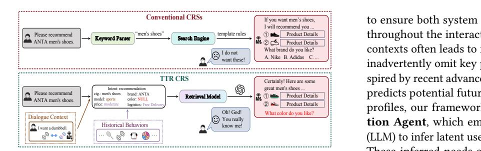
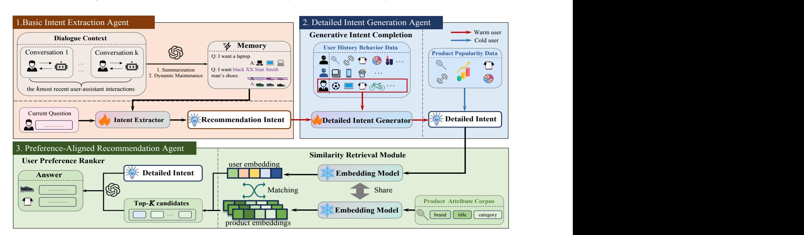
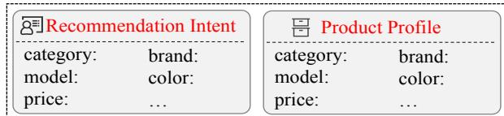
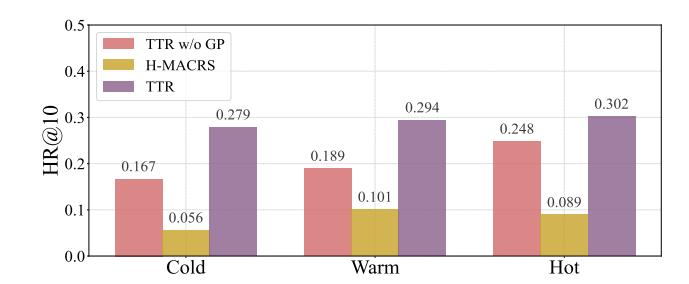
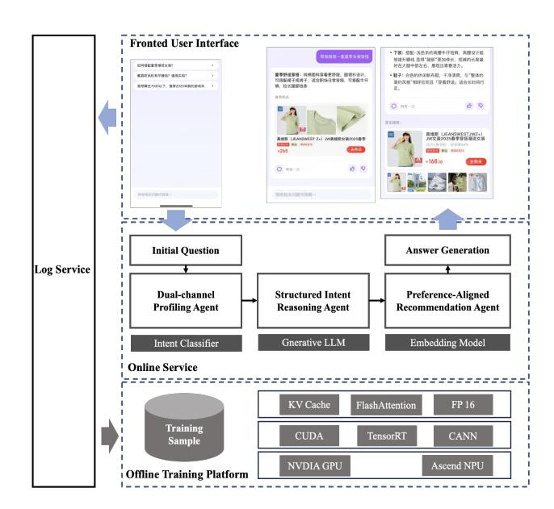

# Think Then Recommend: An LLM-Powered Multi-Agent Framework for Personalized Conversational Recommender System in E-Commerce

Yuankun Zu∗ Southeast University Nanjing, China zyk0418@seu.edu.cn

Xiangyu Cai JD.com Beijing, China caixiangyu1@jd.com

Chuchu Yu JD.com Beijing, China yuchuchu@jd.com

Hao Peng† JD.com Beijing, China penghao5@jd.com

Jia Duan JD.com Beijing, China duanjia1@jd.com

Long Chen JD.com Beijing, China chenlong@jd.com

Kunyao Wang JD.com Beijing, China wangkunyao@jd.com

Zehua Zhang JD.com Beijing, China zhangzehua@jd.com

Changping Peng JD.com Beijing, China pengchangping@jd.com

Zhangang Lin JD.com Beijing, China linzhangang@jd.com

Ching Law JD.com Beijing, China lawching@jd.com

## Abstract

While Conversational Recommender Systems (CRSs) facilitate interactive product discovery through natural language dialogues, existing CRSs face two major limitations: (1) they often focus on transient dialogue contexts and short-term queries, overlooking users' historical behavioral patterns that are crucial for understanding long-term preferences and intent elaboration, thereby undermining the personalization of recommendations; (2) they lack explainability and controllability, with opaque decision processes that hinder user understanding and system steering, while also demonstrating poor robustness against unexpected inputs. To address these challenges, we propose TTR (Think-Then-Recommend), a novel multi-agent framework that seamlessly integrates dialoguebased intent extraction, generative intent completion from historical behavioral patterns, and retrieval-enhanced ranking into an end-to-end recommendation paradigm. Our framework consists of three key components: (1) a Basic Intent Extraction Agent that synthesizes dialogue contexts with current question to derive basic intent assessment; (2) a Detailed Intent Generation Agent, powered by a generative large language model (LLM), which identifies latent user needs by analyzing historical behavioral patterns; and (3)

∗Work done during an internship in JD.com.

†Corresponding author.

[This work is licensed under a Creative Commons Attribution 4.0 International License.](https://creativecommons.org/licenses/by/4.0) WWW '26, Dubai, United Arab Emirates

© 2026 Copyright held by the owner/author(s). ACM ISBN 979-8-4007-2307-0/2026/04 <https://doi.org/10.1145/3774904.3793050>

a Preference-Aligned Recommendation Agent that first retrieves products via latent feature matching in embedding space and then semantically re-ranks top candidates through LLM-driven intentproduct alignment to deliver justified recommendations. Crucially, TTR is designed with three foundational pillars to ensure trustworthy and effective system performance: Explainability, enabling clear interpretation and evaluation of recommendation rationale; Controllability, incorporating mechanisms to monitor and steer agent behavior dynamically; and Veracity and Robustness, ensuring accurate and reliable outputs even under unexpected or adversarial inputs. Extensive experimental results on both public benchmarks and proprietary industrial e-commerce datasets demonstrate the superiority of TTR over existing systems.

## CCS Concepts

• Information systems → Recommender systems; Query intent; Personalization.

## Keywords

Conversational Recommender Systems, Multi Agents, Controllability, Explainability, E-commerce, Personalization

#### ACM Reference Format:

Yuankun Zu, Xiangyu Cai, Chuchu Yu, Hao Peng, Jia Duan, Long Chen, Kunyao Wang, Zehua Zhang, Changping Peng, Zhangang Lin, and Ching Law. 2026. Think Then Recommend: An LLM-Powered Multi-Agent Framework for Personalized Conversational Recommender System in E-Commerce. In Proceedings of the ACM Web Conference 2026 (WWW '26), April 13–17, 2026, Dubai, United Arab Emirates. ACM, New York, NY, USA, [9](#page-8-0) pages. <https://doi.org/10.1145/3774904.3793050>

**TTR CRS** Keyword Parser Sear ch Engine template rules ① ② If you want men's shoes, I will recommend you ... Product Details What brand do you like? A. Nike B. Adidas C. ... … … know me! Product Details ① ② Certainly! Here are some great men's shoes ... Product Details Product Details What color do you like? to ensure both system responsiveness and contextual coherence throughout the interaction. Moreover, relying solely on dialogue contexts often leads to incomplete intent extraction, as users may inadvertently omit key preference details during conversations. Inspired by recent advances in generative retrieval [\[15,](#page-8-17) [23,](#page-8-18) [26\]](#page-8-19), which predicts potential future interactions based on historical product profiles, our framework introduces a Detailed Intent Generation Agent, which employs a generative large language model (LLM) to infer latent user needs from historical behavioral patterns. These inferred needs are then used to complement the initially extracted intent, forming a complete structured intent profile. To ensure practical applicability, we explicitly define structured intent in terms of compatibility with the target product profile. By analyzing global user behavior patterns, we can identify trending product preferences and hotspots, enabling effective handling of cold-start scenarios where new users lack historical behavior. Equipped with a comprehensive structured intent profile, the Preference-Aligned Recommendation Agent employs a two-stage recommendation pipeline that first retrieves candidate products through latent feature matching in embedding space, followed by an LLM-driven semantic re-ranking process. This process dynamically evaluates finegrained alignment between user intent and product attributes, leveraging a preference-aligned LLM trained on product profiles and user intent profiles. The model not only optimizes relevance through intent-product matching but also generates natural-language explanations to transparently justify recommendations to users.

Figure 1: Comparison between conventional conversational recommendation systems and our TTR.

#### 1 Introduction

The rapid advancement of natural language processing (NLP) and conversational artificial intelligence (AI) has revolutionized modern e-commerce by enabling more intuitive and interactive product discovery through conversational recommender systems (CRSs) [\[4,](#page-8-1) [5,](#page-8-2) [11,](#page-8-3) [21,](#page-8-4) [34\]](#page-8-5). These systems engage users in natural language dialogues, dynamically refining recommendations based on real-time interactions. To achieve optimal performance, an effective CRS for e-commerce must fulfill two critical requirements [\[8,](#page-8-6) [20,](#page-8-7) [22,](#page-8-8) [37\]](#page-8-9): first, it should possess the capability to accurately discern user intent during conversational exchanges; second, it must be able to deliver precise and personalized recommendations tailored to individual user profiles.

Despite their growing adoption, existing CRSs face several key limitations that hinder their effectiveness in real-world e-commerce scenarios. As shown in Fig. [1,](#page-1-0) conventional CRSs typically focus solely on information from a single conversation round. While recent studies have introduced more adaptive approaches by incorporating dialogue contexts [\[18,](#page-8-10) [19,](#page-8-11) [41\]](#page-8-12), these efforts primarily address short-term interactions while overlooking the essential role of long-term user behavioral patterns. This narrow focus leads to suboptimal personalization, as most users fail to express complete intent within conversations [\[10,](#page-8-13) [12\]](#page-8-14). These limitations are further compounded by a more fundamental limitation in current system architectures. Most CRSs rely on simplistic keyword parsing and search-engine integration [\[7,](#page-8-15) [22,](#page-8-8) [25,](#page-8-16) [37\]](#page-8-9) rather than modeling nuanced intents from both dialogue and behavioral history. This forces systems to artificially narrow search scope through constrained interactions, consequently, compromising both personalization quality and conversational experience.

To address these challenges, we propose Think-Then-Recommend (TTR), a novel multi-agent framework that first extracts user intent from dialogue contexts, then complements it with insights from historical behavioral patterns, and finally delivers tailored recommendations through intelligent retrieval and ranking.

Specifically, our proposed TTR system introduces a Basic Intent Extraction Agent that dynamically integrates dialogue contexts with current question for accurate intent extraction, supported by a fine-tuned intent extractor model optimized for this module to ensure precision. To ensure input efficiency, we design an asynchronously dialogue summarization module, which continuously updates conversational memory while generating natural responses

With comprehensive experiments, we show the superiority of TTR: (1) On the public TGReDial [\[40\]](#page-8-20) dataset, TTR demonstrates significant improvements over MemoCRS [\[34\]](#page-8-5), achieving relative gains of 40.1%, 36.4%, and 90.4% in HR@5, HR@10, and HR@20 metrics respectively. (2) On the proprietary industrial e-commerce dataset, TTR demonstrates significant performance improvements over existing system H-MACRS [\[22\]](#page-8-8), while effectively addressing the cold-start user problem. (3) TTR demonstrates superior performance in response generation quality compared to other LLMbased CRSs, achieving significant improvements in both fluency and informativeness.

Our main contributions can be summarized as follows:

- We propose Think-Then-Recommend, a novel conversational recommendation system framework that generates structured user intent profile through the synergistic analysis of dialogue contexts and historical behavioral patterns.
- With structured intent profile, our framework breaks away from conventional keyword-based search paradigms, establishing a new paradigm for personalized recommendation.
- We propose TTR as a responsible recommendation framework built on three pillars—interpretable reasoning, dynamic behavioral control, and adaptive resilience—to ensure reliable, safe, and human-aligned interactions in complex conversational environments.
- Extensive experiments on both public benchmarks and proprietary industrial e-commerce datasets demonstrate the superiority of TTR, which achieves an increases by 12.3% in intent recognition accuracy over existing systems.

Figure 2: TTR framework. First, it extracts structured user intents by analyzing both dialogue context and current question. Next, a generative LLM refines these intents by uncovering latent preferences from historical behavior patterns. Finally, a retrieval-augmented ranking engine translates these enhanced intents into precise product recommendations.

## 2 Related Work

## 2.1 Conversational Recommendation Systems

Conversational recommendation systems (CRSs) have gained significant attention for their capacity to deliver personalized recommendations through interactive dialogues [\[5,](#page-8-2) [6,](#page-8-21) [34\]](#page-8-5). Early approaches predominantly employed rule-based or retrieval-based frameworks, utilizing predefined templates to query users about product attributes and progressively narrowing down options [\[3,](#page-8-22) [9,](#page-8-23) [16,](#page-8-24) [27\]](#page-8-25). Other methods leveraged bandit algorithms or reinforcement learning to efficiently recommend items with minimal interactions [\[14,](#page-8-26) [38\]](#page-8-27). However, these strategies lacked flexibility in handling openended, natural conversations. The integration of knowledge graphs and pre-trained language models (PLMs) has enhanced CRSs by balancing natural language generation with recommendation accuracy [\[1,](#page-8-28) [36,](#page-8-29) [39\]](#page-8-30). Nevertheless, these techniques still suffer from data scarcity in specialized domains and excessive reliance on external knowledge, restricting their generalizability. The advent of large language models (LLMs) further transformed CRSs, enabling powerful contextual understanding and zero-shot recommendation capabilities [\[28,](#page-8-31) [30–](#page-8-32)[32\]](#page-8-33). Despite these advancements, existing models predominantly evaluated on limited datasets fail to capture the complexity of real-world e-commerce interactions, where user intentions are often multifaceted and ambiguous. To address this, our work emphasizes precise identification of user intents from dialogue contexts and their historical behavioral patterns to effectively complement and clarify user intent.

## 2.2 Agent in E-Commerce

In recent years, intelligent agent technology in e-commerce has made significant progress in personalized recommendations, supply chain optimization, and virtual shopping assistants [\[24,](#page-8-34) [29,](#page-8-35) [33\]](#page-8-36). For example, recommendation agents driven by reinforcement learning can dynamically adapt to user preferences [\[2\]](#page-8-37), multi-agent systems are used to optimize supply chain management [\[28\]](#page-8-31), and dialogue agents based on large language models enhance the shopping experience [\[34\]](#page-8-5). However, existing research has not fully explored the potential of multi-agent collaboration in e-commerce scenarios. Especially in the field of personalized recommendation, the current system usually adopts a single path search filter mode: extract query keywords from the dialogue, call the search agent to retrieve products, and then refine the filter conditions through interactive questions [\[7,](#page-8-15) [22,](#page-8-8) [25\]](#page-8-16). This approach has limitations such as single intent understanding and rigid processes, making it difficult to capture users' implicit needs or handle cross product recommendations. To this end, we propose a generative recommendation framework that based on a Detailed Intent Generation Agent, which utilizes a generative large language model combined with user historical behavioral patterns to structurally complement the user intent. This structured intent enables direct similarity-based retrieval against product profiles.

## 3 Methodology

We propose Think-Then-Recommend (TTR), an end-to-end recommendation framework that intelligently bridges user intent understanding and personalized recommendations through a cohesive multi-agent workflow. The system first extracts basic user intents by analyzing both dialogue contexts and current question via its Basic Intent Extraction Agent, then refines these intents by inferring latent preferences from historical behavioral patterns using a generative LLM in the Detailed Intent Generation Agent. Finally, the Preference-Aligned Recommendation Agent translates these structured intents into relevant product recommendations through

| Model    | @5     | HR @10 | @20    | @5     | MRR @10 | @20    | @5     | NDCG @10 | @20    |
|----------|--------|--------|--------|--------|---------|--------|--------|----------|--------|
| SASRec   | 0.0056 | 0.0057 | 0.0085 | 0.0014 | 0.0014  | 0.0016 | 0.0024 | 0.0025   | 0.0031 |
| TGReDial | 0.0075 | 0.0174 | 0.0236 | 0.0055 | 0.0068  | 0.0072 | 0.0059 | 0.0091   | 0.0107 |
| ZSCRS    | 0.0025 | 0.0087 | 0.0100 | 0.0007 | 0.0016  | 0.0017 | 0.0012 | 0.0032   | 0.0035 |
| MemoCRS  | 0.0162 | 0.0261 | 0.0323 | 0.0095 | 0.0108  | 0.0112 | 0.0111 | 0.0143   | 0.0158 |
| H-MACRS  | 0.0156 | 0.0195 | 0.0332 | 0.0062 | 0.0067  | 0.0077 | 0.0085 | 0.0097   | 0.0133 |
| TTR      | 0.0227 | 0.0356 | 0.0615 | 0.0097 | 0.0112  | 0.0131 | 0.0128 | 0.0168   | 0.0235 |

Table 1: Performance comparison on TGReDial dataset with recent advanced CRSs.

#### 3.3 Preference-Aligned Recommendation Agent

With a comprehensive structured intent profile, our proposed system implements a two-phase recommendation pipeline combining preliminary similarity retrieval and LLM-based ranking, as illustrated in Fig[.2.](#page-2-0)

3.3.1 Similarity Retrieval Module. Since the structured intent representation �� �� from Section 3.2 is designed to mirror product profiles, we can leverage a domain-specific embedding model ���� pretrained on e-commerce knowledge base to embed both intent and product profiles simultaneously:

q = ���� (�� ), p = ���� (A) (9)

where A denotes the attribute set of a specific product.

sim(�� , A) = q · p ∥q∥ ∥p∥ (10)

We retrieve the top-�� most relevant products by ranking all candidate products according to their similarity scores with the user intent profile.

3.3.2 User Preference Ranker. In large-scale e-commerce platforms with extensive product catalogs, conventional similarity-based retrieval methods often fail to achieve precise alignment with user preferences. To address this limitation, we propose a User Preference Ranker that processes the complete candidate set C = {��1, ..., ���� } through an LLM-based ranking model ���� in a single forward pass:

���� (�� , C) → (S, r) (11)

where:

- S = [��1, ..., ���� ] denotes the top-�� recommendation list ranked by descending preference scores (������ ≥ ������+1 ), where ������ represents the alignment score between product ���� 's profile and the user intent profile ��
- r generates natural language explanations that jointly consider �� �� and the selected products S

This end-to-end ranking approach enables the simultaneous optimization of both recommendation accuracy and explanation quality. In our framework, the LLM ranker model jointly considers the list of candidate product profiles and the user intent profile, and performs preference alignment optimization to maximize the congruence between recommendation scores and true user preferences.

#### 4 Experiments

#### 4.1 Experimental Settings

4.1.1 Dataset. We conduct experiments on both public benchmarks and proprietary industrial e-commerce datasets. For the public dataset, we choose TGReDial [\[40\]](#page-8-20), whcih is a collection of Chinese conversational recommendation sessions. It contains 10,000 sessions of 129,392 utterances involving 1,482 users and 33,834 movies. We crawl movie related information to summarize movie information and user preferences. In addition, we keep the dataset settings consistent with [\[34\]](#page-8-5). For the industrial dataset, we deploy our multi-agent shopping assistant in the core scenario of our online recommendation system and collect interaction logs to construct an industrial-scale dataset. Specifically, the dataset is sampled from 7-day system logs encompassing hundreds of millions of users and items, totaling billions of interaction records. It captures multi-round conversational interactions along with user click/purchase feedback. We further enriched the dataset by incorporating detailed item attributes. The final curated dataset contains 26,482 interaction sessions involving 13,269 unique users and 600,724 actively recommended items.

4.1.2 Evaluation Metrics. For recommendation task, we follow the common practices [\[32,](#page-8-33) [34,](#page-8-5) [35\]](#page-8-38) to adopt several widely used metrics, ����@��, ������@��, and ��������@��. For dialogue generation task, we restrict our benchmarking to LLM-based approaches exclusively. We adopt human evaluations to ensure fair comparison, where three annotators score the �������������� and ���� �� ������������������������ of the generated responses following [\[17,](#page-8-39) [32\]](#page-8-33). The range of scores is from 0 to 2, and the scores of three annotators are averaged.

4.1.3 Baselines. We evaluate the superiority of our TTR by considering the following five representative baselines. SASRec [\[13\]](#page-8-40) only leverages user historical items for recommendation. TGReDial [\[40\]](#page-8-20) employs topic prediction and guided transitions for conversational recommendation. ZSCRS [\[31\]](#page-8-41) employs LLMs as zero-shot conversational recommenders. MemoCRS [\[34\]](#page-8-5) introduces memory- enhanced LLM to refine and manage user preference. H-MACRS [\[22\]](#page-8-8) implements a recommendation system based on query keywords in e-commerce scenarios.

#### 4.2 Main Results

Compared to the recent state-of-the-art baselines in CRSs, TTR achieves excellent performance on both public benchmarks and proprietary industrial e-commerce datasets. As

| Model    | @5     | @10    | HR @20 | 40     | @5     | @10    | MRR @20 | 40     | @5     | @10    | NDCG @20 | 40     |
|----------|--------|--------|--------|--------|--------|--------|---------|--------|--------|--------|----------|--------|
| SASRec   | 0.0230 | 0.0355 | 0.0502 | 0.0627 | 0.0124 | 0.0141 | 0.0151  | 0.0156 | 0.0149 | 0.0190 | 0.0228   | 0.0253 |
| TGReDial | 0.0294 | 0.0422 | 0.0604 | 0.0695 | 0.0214 | 0.0233 | 0.0244  | 0.0247 | 0.0234 | 0.0280 | 0.0322   | 0.0340 |
| ZSCRS    | 0.0313 | 0.0467 | 0.0709 | 0.1038 | 0.0186 | 0.0206 | 0.0223  | 0.0235 | 0.0218 | 0.0267 | 0.0328   | 0.0395 |
| MemoCRS  | 0.0344 | 0.0529 | 0.0785 | 0.1132 | 0.0192 | 0.0216 | 0.0233  | 0.0246 | 0.0229 | 0.0288 | 0.0353   | 0.0424 |
| H-MACRS  | 0.0488 | 0.0728 | 0.1052 | 0.1496 | 0.0285 | 0.0316 | 0.0339  | 0.0354 | 0.0347 | 0.0412 | 0.0494   | 0.0584 |
| TTR      | 0.2320 | 0.2852 | 0.3439 | 0.4027 | 0.1621 | 0.1692 | 0.1732  | 0.1753 | 0.1795 | 0.1966 | 0.2115   | 0.2235 |

Table 2: Performance comparison on the proprietary industrial e-commerce dataset with recent advanced CRSs.

| Model   | Fluency | Informativeness |
|---------|---------|-----------------|
| ZSCRS   | 1.45    | 1.05            |
| MemoCRS | 1.52    | 1.58            |
| H-MACRS | 1.29    | 1.65            |
| TTR     | 1.78    | 1.72            |

Table 3: Performance comparison on the proprietary industrial e-commerce dataset with LLM-based CRSs for dialogue generation task.

shown in Tab[.1,](#page-4-0) On TGReDial, our method significantly outperforms the strongest baseline MemoCRS in terms of TTR (HR@5, 10, 20). Specifically, our model achieves 0.0227, 0.0356, 0.0615, compared to MemoCRS's 0.0162, 0.0261, 0.0323, corresponding to relative improvements of 40.1%, 36.4%, and 90.4%, respectively. The observed improvements provide empirical evidence that aggregating hitorical behaviors enables better characterization of user preferences in recommendation systems. As shown in Tab[.2,](#page-5-0) on industrial dataset, TTR achieves a significant improvement over the strongest baseline H-MACRS on all metrics, with an order-of-magnitude increase in TTR. This evidences that query-based recommendation models may face challenges in promptly and accurately capturing specific user intents in e-commerce scenarios.

Results of evaluation on dialogue generation task imply that TTR greatly enhances reply quality. We conduct a comprehensive comparison of several LLM-based CRSs. ZSCRS generates generic recommendations that lack personalization, while the MemoCRS incorporates historical dialogue to enhance recommendation relevance at the cost of potential fluency degradation when handling noisy historical conversation data. The H-MACRS achieves high precision through interactive refinement, but suffers from fragmented conversational flow due to its stepwise selective questioning mechanism. In contrast, our proposed TTR system demonstrates superior performance by accurately identifying user shopping intent from conversational context, generating natural and coherent responses, and proactively addressing potential information gaps through carefully designed clarifying questions, collectively delivering a more seamless and satisfying user experience.

TTR exhibits better performance in cold-start scenario. We compare TTR with the query-based H-MACRS currently deployed in online e-commerce platform. While H-MACRS employs interactive selective questioning to refine search results, it does not

Figure 4: Performance comparison on cold, warm and hot users with H-MACRS. cold users (&lt; 5 historical behaviors), warm users (5 − 20), and hot users (&gt; 20).

specifically address the cold-start needs of users. Intuitively, when encountering a user with no historical behavior, the system should prioritize recommending popular products. To validate this, we categorize users into three groups: cold, warm, and hot based on their historical interaction volume. By analyzing global user behavior, we construct popularity profiles for different product categories to infer and supplement user intent. As shown in Figure 4, this module significantly improves recommendations for cold-start users. For warm users, their limited historical data still provides some enhancement, while for hot users, their extensive behavior history primarily drives intent completion.

#### 4.3 Ablation and Analysis

We carry out extensive ablation studies to assess the impact of essential components within the TTR framework. Specifically, we investigate from (1) the effectiveness of historical dialogue summarization, (2) the impact of completing intent with historical behavior, (3) the effectiveness of sorting recommended products based on user intent profile.

(1) Dialogue Context Integration demonstrates effectiveness in user intent extraction by incorporating dialogue contexts with the current question. This is substantiated by significant performance degradation when the feature is disabled (ΔHR@5 = 0.0341; ΔHR@40 = 0.0401).

(2) Historical Behavioral Augmentation demonstrates significant importance, as disabling this feature leads to a substantial performance drop (HR@5 = 0.065 vs. 0.232). This sharp decline strongly indicates that in e-commerce scenarios, users' historical behaviors effectively reflect their intent and preferences.

|      | Model    | @5     | @10    | HR @20 | @40    | @5     | @10    | MRR @20 | @40    | @5     | @10    | NDCG @20 | @40    |
|------|----------|--------|--------|--------|--------|--------|--------|---------|--------|--------|--------|----------|--------|
| w/o  | Dialogue | 0.1979 | 0.2510 | 0.3053 | 0.3626 | 0.1347 | 0.1418 | 0.1455  | 0.1476 | 0.1504 | 0.1606 | 0.1813   | 0.1930 |
| w/o  | Behavior | 0.0650 | 0.0700 | 0.0900 | 0.1500 | 0.0385 | 0.0393 | 0.0406  | 0.0426 | 0.0452 | 0.0569 | 0.0518   | 0.0639 |
| w/o  | Ranking  | 0.2031 | 0.2552 | 0.3093 | 0.3667 | 0.1379 | 0.1449 | 0.1486  | 0.1507 | 0.1541 | 0.1710 | 0.1846   | 0.1964 |
| full | TTR      | 0.2320 | 0.2852 | 0.3439 | 0.4027 | 0.1621 | 0.1692 | 0.1732  | 0.1753 | 0.1795 | 0.1966 | 0.2115   | 0.2235 |

Table 4: Ablation study of TTR on the proprietary industrial e-commerce dataset. w/o Dialogue: Intent extraction from current question only. w/o Behavior: No historical behavior for intent completion. w/o Ranking: Similarity-based retrieval only without LLM preference ranker.

(3) Preference Alignment plays a critical role in recommendation quality, as its removal leads to noticeable performance degradation (ΔHR@5 = 0.0289; ΔNDCG@5 = 0.0254). These results suggest that user intent strongly correlates with product preferences. The full framework's superior performance validates the necessity of all components working in concert.

### 4.4 Deployment and Online A/B Test

To validate the effectiveness and performance of our proposed framework in large-scale e-commerce scenarios, we deployed the TTR-based multi agent shopping assistant at a core recommendation position over real industrial e-commerce platform as mentioned before. The system has been stably operating for over two months and examined through a rigid A/B Test.

4.4.1 Deployment Details. As shown in Fig[.5,](#page-6-0) our deployment architecture features three key components that form a closed-loop optimization system. The interactive workflow begins when a user accesses the shopping assistant interface. The system dynamically generates three contextually relevant queries based on the user's historical behavioral patterns and real-time platform trends. Upon query selection or free-form input, the TTR system activates its agents through our patented orchestration framework. During this process, logging service automatically captures full agent reasoning traces and user feedback(click/purchase). Subsequently, the collected interaction data undergoes a multi-stage annotation pipeline combining validation by certified experts and LLMs. This continuously updated dataset powers our model update.

Our system's technical implementation is built upon an internally developed large language model with 10B parameters, which is employed for both intent classification and generative modeling tasks. Model training was conducted using NVIDIA Hopper architecture GPUs within our enterprise-level distributed training framework, which supports large-scale parallel computation. To ensure production readiness, we implemented multiple systemlevel optimizations including KV cache memory optimization, FP16 quantization deployment, and dynamic batch scheduling. These engineering enhancements enable the model maintaining real-time responsiveness for online serving at scale.

4.4.2 Online Results. In light of the deployment specifics and the application scenarios outlined above, a two-week online A/B experiment was conducted in May 2025. As previously stated, the TTR primarily modifies the user intent recognition process. Therefore, we maintain other Agents in the framework unchanged. Compared

Figure 5: The Deployment of Our TTR Framework In an Online Scenario.

to baselines,which totally rely on pretrained LLMs, our method achieve an increases by 12.3% in intent recognition accuracy.

#### 5 Interpretability, Controllability and Robustness

## 5.1 Interpretability

To address the critical lack of explainability in existing conversational recommender systems (CRSs), TTR explicitly generates structured, LLM-mediated reasoning traces that articulate the logical progression from user intent to recommended items. Rather than treating explanation as an afterthought, TTR embeds interpretability into its core architecture: the Detailed Intent Generation Agent produces a formalized representation of latent user preferences inferred from historical behavior and dialogue context, while the Preference-Aligned Recommendation Agent constructs a semantically grounded reasoning chain that explicitly links each recommendation to the synthesized intent via latent feature alignment and semantic consistency checks. These reasoning outputs are not post-hoc approximations but are generated deterministically as part of the recommendation pipeline, ensuring fidelity to the

system's internal decision process. By externalizing the rationale in natural language, TTR enables users and system auditors to evaluate the validity, relevance, and coherence of recommendations without requiring access to model internals. This design not only enhances transparency and trust but also facilitates diagnostic analysis and iterative refinement of system behavior—key requirements for deploying CRSs in real-world, user-centric e-commerce environments. In this way, TTR is proposed to unify intent interpretation and justification generation as intrinsic, end-to-end components of the recommendation process, establishing a new paradigm for explainable conversational recommendation.

## 5.2 Controllability

To ensure dynamic and reliable system steering, TTR introduces a multi-layered controllability architecture that enforces behavioral constraints at each stage of the conversational recommendation pipeline. This architecture comprises three sequentially deployed control mechanisms, each targeting a distinct phase of agent reasoning while preserving the autonomy of underlying LLM-based components. The first layer, the intent verification module, operates as a pre-filter prior to intent extraction. It evaluates whether a user utterance exhibits explicit commercial intent. Only when such intent is detected with high confidence is the downstream recommendation pipeline activated; this design effectively suppresses non-relevant or spurious dialogues, thereby conserving computational resources and maintaining system focus on task-oriented interactions. The second layer, an online validation mechanism governing the Detailed Intent Generation Agent, employs a curated knowledge base derived from historical e-commerce dialogues and domain-specific regulatory guidelines. This mechanism continuously monitors generated intents for hallucinations, biases, or ethical violations, applying corrections to ensure that interpreted user intentions remain grounded in plausible behavioral patterns and comply with legal and ethical standards. The third layer, applied to the Preference-Aligned Recommendation Agent, dynamically constrains the candidate item space through a dual-filtering framework. Items are filtered according to business policies—such as inventory availability, regional compliance, and prohibited categories—as well as soft signals derived from real-time user feedback. This enables continuous, feedback-driven refinement of the recommendation set, reducing the risk of harmful, misleading, or low-quality suggestions.

Collectively, these three layers—intent gating, intent validation, and recommendation filtering—form a closed-loop governance system that enables proactive, context-sensitive intervention without impeding the generative capacity of LLM agents. Unlike conventional conversational recommendation systems (CRSs), which typically rely on post-hoc moderation or lack formal oversight mechanisms, TTR embeds controllability as a foundational design principle. This structured, multi-stage approach ensures robust alignment between user expectations, ethical imperatives, and operational constraints in complex e-commerce environments.

## 5.3 Veracity and Robustness

To ensure veracity and robustness in the face of ambiguous, adversarial, or out-of-distribution inputs, TTR employs a dual-layered

defense architecture that proactively filters harmful or incoherent signals at critical junctures of the recommendation pipeline—before they can compromise output integrity or trigger unsafe reasoning.

The first layer, an input adversarial filter, is deployed at the system ingress and operates prior to any intent extraction. Trained on a diverse corpus of real-world e-commerce dialogues—including adversarial prompts, injection attempts, manipulative queries, and non-commercial noise—it classifies incoming utterances with respect to semantic coherence, commercial relevance, and intent authenticity. Inputs exhibiting signs of jailbreaking, deceptive framing, or lack of genuine user intent are rejected at this stage, preventing the propagation of noise or malicious triggers into downstream components. This early filtering ensures that only contextually grounded, semantically valid inputs are processed, thereby preserving the fidelity of subsequent reasoning. The second layer, a safety and sensitivity filter, is applied to all outputs generated by the Detailed Intent Generation Agent and the Preference-Aligned Recommendation Agent. This filter is constructed via a hybrid annotation pipeline that combines large-scale LLM-based labeling with expert human validation, grounded in historical user interaction logs and domain-specific compliance standards (e.g., product prohibitions, anti-discrimination policies, data privacy regulations). It detects and suppresses outputs containing prohibited content—including references to illegal or restricted goods, discriminatory language, misleading claims, or privacy-invasive requests—with high precision and low false-positive rates. Crucially, this module operates as a decoupled, post-generation checkpoint: it does not constrain the generative process itself, but enforces safety boundaries on its outputs, thus preserving the creative and adaptive capacity of LLM agents while ensuring compliance with ethical and operational norms.

Together, these two layers—input validation and output sanitization—form a resilient, end-to-end defense mechanism that safeguards the system against both external manipulation and internal hallucination. By enforcing input legitimacy and output safety without compromising agent autonomy, TTR achieves reliable, trustworthy performance even under adversarial or unforeseen conditions—a critical requirement for deployment in dynamic, highstakes e-commerce environments.

## 6 Conclusion

In this paper, we proposed Think-Then-Recommend (TTR), an endto-end recommendation framework that intelligently bridges user intent understanding and personalized recommendations through a cohesive multi-agent workflow. With structured intent profile, our framework breaks away from conventional keyword-based search paradigms, establishing a new paradigm for personalized recommendation. Extensive experimental results on both public benchmarks and proprietary industrial e-commerce datasets demonstrate the superiority of TTR over existing systems.

## 7 Usage of Generative AI

In this work, we employed generative AI for grammar and syntax checking during manuscript preparation. All AI-generated content was manually verified to ensure accuracy and adherence to academic standards.

#### References

[1] Qibin Chen, Junyang Lin, Yichang Zhang, Ming Ding, Yukuo Cen, Hongxia Yang, and Jie Tang. 2019. Towards knowledge-based recommender dialog system. arXiv preprint arXiv:1908.05391 (2019). [2] Xiaocong Chen, Lina Yao, Julian McAuley, Guanglin Zhou, and Xianzhi Wang. 2023. Deep reinforcement learning in recommender systems: A survey and new perspectives. Knowledge-Based Systems 264 (2023), 110335. [3] Konstantina Christakopoulou, Filip Radlinski, and Katja Hofmann. 2016. Towards conversational recommender systems. In Proceedings of the 22nd ACM SIGKDD international conference on knowledge discovery and data mining. 815–824. [4] Jiabao Fang, Shen Gao, Pengjie Ren, Xiuying Chen, Suzan Verberne, and Zhaochun Ren. 2024. A multi-agent conversational recommender system. arXiv preprint arXiv:2402.01135 (2024). [5] Siamak Farshidi, Kiyan Rezaee, Sara Mazaheri, Amir Hossein Rahimi, Ali Dadashzadeh, Morteza Ziabakhsh, Sadegh Eskandari, and Slinger Jansen. 2024. Understanding user intent modeling for conversational recommender systems: a systematic literature review. User Modeling and User-Adapted Interaction (2024), 1–64. [6] Yue Feng, Shuchang Liu, Zhenghai Xue, Qingpeng Cai, Lantao Hu, Peng Jiang, Kun Gai, and Fei Sun. 2023. A large language model enhanced conversational recommender system. arXiv preprint arXiv:2308.06212 (2023). [7] Zuohui Fu, Yikun Xian, Yongfeng Zhang, and Yi Zhang. 2020. Tutorial on conversational recommendation systems. In Proceedings of the 14th ACM conference on recommender systems. 751–753. [8] Yogesh Gajula. 2025. Sentiment-Aware Recommendation Systems in E-Commerce: A Review from a Natural Language Processing Perspective. arXiv preprint arXiv:2505.03828 (2025). [9] Zhankui He, Handong Zhao, Tong Yu, Sungchul Kim, Fan Du, and Julian McAuley. 2022. Bundle MCR: Towards conversational bundle recommendation. In Proceedings of the 16th ACM Conference on Recommender Systems. 288–298. [10] Chin-Lung Hsu and Judy Chuan-Chuan Lin. 2023. Understanding the user satisfaction and loyalty of customer service chatbots. Journal of Retailing and Consumer Services 71 (2023), 103211. [11] Dietmar Jannach, Ahtsham Manzoor, Wanling Cai, and Li Chen. 2021. A survey on conversational recommender systems. ACM Computing Surveys (CSUR) 54, 5 (2021), 1–36. [12] Antje Henriette Annette Janssen, Lukas Grützner, and Michael H Breitner. 2021. Why do Chatbots fail? A Critical Success Factors Analysis.. In ICIS. [13] Wang-Cheng Kang and Julian McAuley. 2018. Self-attentive sequential recommendation. In 2018 IEEE international conference on data mining (ICDM). IEEE, 197–206. [14] Sumeet Katariya, Branislav Kveton, Csaba Szepesvari, and Zheng Wen. 2016. DCM bandits: Learning to rank with multiple clicks. In International Conference on Machine Learning. PMLR, 1215–1224. [15] Sunkyung Lee, Minjin Choi, and Jongwuk Lee. 2023. GLEN: Generative retrieval via lexical index learning. arXiv preprint arXiv:2311.03057 (2023). [16] Wenqiang Lei, Xiangnan He, Yisong Miao, Qingyun Wu, Richang Hong, Min-Yen Kan, and Tat-Seng Chua. 2020. Estimation-action-reflection: Towards deep interaction between conversational and recommender systems. In Proceedings of the 13th international conference on web search and data mining. 304–312. [17] Shuokai Li, Ruobing Xie, Yongchun Zhu, Xiang Ao, Fuzhen Zhuang, and Qing He. 2022. User-centric conversational recommendation with multi-aspect user modeling. In Proceedings of the 45th International ACM SIGIR Conference on Research and Development in Information Retrieval. 223–233. [18] Jianghao Lin, Yanru Qu, Wei Guo, Xinyi Dai, Ruiming Tang, Yong Yu, and Weinan Zhang. 2023. Map: A model-agnostic pretraining framework for click-through rate prediction. In Proceedings of the 29th ACM SIGKDD Conference on Knowledge Discovery and Data Mining. 1384–1395. [19] Weiwen Liu, Yunjia Xi, Jiarui Qin, Fei Sun, Bo Chen, Weinan Zhang, Rui Zhang, and Ruiming Tang. 2022. Neural re-ranking in multi-stage recommender systems: A review. arXiv preprint arXiv:2202.06602 (2022). [20] Yuanxing Liu, Wei-Nan Zhang, Yifan Chen, Yuchi Zhang, Haopeng Bai, Fan Feng, Hengbin Cui, Yongbin Li, and Wanxiang Che. 2023. Conversational recommender system and large language model are made for each other in E-commerce presales dialogue. arXiv preprint arXiv:2310.14626 (2023). [21] Ahtsham Manzoor, Samuel C Ziegler, Klaus Maria Pirker Garcia, and Dietmar Jannach. 2024. ChatGPT as a conversational recommender system: A user-centric analysis. In Proceedings of the 32nd ACM Conference on User Modeling, Adaptation and Personalization. 267–272. [22] Guangtao Nie, Rong Zhi, Xiaofan Yan, Yufan Du, Xiangyang Zhang, Jianwei Chen, Mi Zhou, Hongshen Chen, Tianhao Li, Ziguang Cheng, et al. 2024. A hybrid multi-agent conversational recommender system with llm and search engine in e-commerce. In Proceedings of the 18th ACM Conference on Recommender Systems. 745–747. [23] Ming Pang, Chunyuan Yuan, Xiaoyu He, Zheng Fang, Donghao Xie, Fanyi Qu, Xue Jiang, Changping Peng, Zhangang Lin, Zheng Luo, et al. 2025. Generative Retrieval and Alignment Model: A New Paradigm for E-commerce Retrieval. arXiv preprint arXiv:2504.01403 (2025). [24] Joon Sung Park, Joseph O'Brien, Carrie Jun Cai, Meredith Ringel Morris, Percy Liang, and Michael S Bernstein. 2023. Generative agents: Interactive simulacra of human behavior. In Proceedings of the 36th annual acm symposium on user interface software and technology. 1–22. [25] Ivens Da Silva Portugal, Paulo Alencar, and Donald Cowan. 2024. An Agentic AI-based Multi-Agent Framework for Recommender Systems. In 2024 IEEE International Conference on Big Data (BigData). IEEE, 5375–5382. [26] Shashank Rajput, Nikhil Mehta, Anima Singh, Raghunandan Hulikal Keshavan, Trung Vu, Lukasz Heldt, Lichan Hong, Yi Tay, Vinh Tran, Jonah Samost, et al. 2023. Recommender systems with generative retrieval. Advances in Neural Information Processing Systems 36 (2023), 10299–10315. [27] Xuhui Ren, Hongzhi Yin, Tong Chen, Hao Wang, Zi Huang, and Kai Zheng. 2021. Learning to ask appropriate questions in conversational recommendation. In Proceedings of the 44th international ACM SIGIR conference on research and development in information retrieval. 808–817. [28] Param Thakkar and Anushka Yadav. 2024. Personalized Recommendation Systems using Multimodal, Autonomous, Multi Agent Systems. arXiv preprint arXiv:2410.19855 (2024). [29] Lei Wang, Chen Ma, Xueyang Feng, Zeyu Zhang, Hao Yang, Jingsen Zhang, Zhiyuan Chen, Jiakai Tang, Xu Chen, Yankai Lin, et al. 2024. A survey on large language model based autonomous agents. Frontiers of Computer Science 18, 6 (2024), 186345. [30] Ting-Chun Wang, Shang-Yu Su, and Yun-Nung Chen. 2022. Barcor: Towards a unified framework for conversational recommendation systems. arXiv preprint arXiv:2203.14257 (2022). [31] Xiaolei Wang, Xinyu Tang, Wayne Xin Zhao, Jingyuan Wang, and Ji-Rong Wen. 2023. Rethinking the evaluation for conversational recommendation in the era of large language models. arXiv preprint arXiv:2305.13112 (2023). [32] Xiaolei Wang, Kun Zhou, Ji-Rong Wen, and Wayne Xin Zhao. 2022. Towards unified conversational recommender systems via knowledge-enhanced prompt learning. In Proceedings of the 28th ACM SIGKDD conference on knowledge discovery and data mining. 1929–1937. [33] Zefan Wang, Zichuan Liu, Yingying Zhang, Aoxiao Zhong, Jihong Wang, Fengbin Yin, Lunting Fan, Lingfei Wu, and Qingsong Wen. 2024. Rcagent: Cloud root cause analysis by autonomous agents with tool-augmented large language models. In Proceedings of the 33rd ACM International Conference on Information and Knowledge Management. 4966–4974. [34] Yunjia Xi, Weiwen Liu, Jianghao Lin, Bo Chen, Ruiming Tang, Weinan Zhang, and Yong Yu. 2024. MemoCRS: Memory-enhanced Sequential Conversational Recommender Systems with Large Language Models. In Proceedings of the 33rd ACM International Conference on Information and Knowledge Management. 2585– 2595. [35] Bowen Yang, Cong Han, Yu Li, Lei Zuo, and Zhou Yu. 2021. Improving conversational recommendation systems' quality with context-aware item meta information. arXiv preprint arXiv:2112.08140 (2021). [36] Xiaoyu Zhang, Xin Xin, Dongdong Li, Wenxuan Liu, Pengjie Ren, Zhumin Chen, Jun Ma, and Zhaochun Ren. 2023. Variational reasoning over incomplete knowledge graphs for conversational recommendation. In Proceedings of the sixteenth ACM international conference on web search and data mining. 231–239. [37] Yongfeng Zhang, Xu Chen, Qingyao Ai, Liu Yang, and W Bruce Croft. 2018. Towards conversational search and recommendation: System ask, user respond. In Proceedings of the 27th acm international conference on information and knowledge management. 177–186. [38] Guanjie Zheng, Fuzheng Zhang, Zihan Zheng, Yang Xiang, Nicholas Jing Yuan, Xing Xie, and Zhenhui Li. 2018. DRN: A deep reinforcement learning framework for news recommendation. In Proceedings of the 2018 world wide web conference. 167–176. [39] Kun Zhou, Wayne Xin Zhao, Shuqing Bian, Yuanhang Zhou, Ji-Rong Wen, and Jingsong Yu. 2020. Improving conversational recommender systems via knowledge graph based semantic fusion. In Proceedings of the 26th ACM SIGKDD international conference on knowledge discovery & data mining. 1006–1014. [40] Kun Zhou, Yuanhang Zhou, Wayne Xin Zhao, Xiaoke Wang, and Ji-Rong Wen. 2020. Towards topic-guided conversational recommender system. arXiv preprint arXiv:2010.04125 (2020). [41] Xi Zhu, Yu Wang, Hang Gao, Wujiang Xu, Chen Wang, Zhiwei Liu, Kun Wang, Mingyu Jin, Linsey Pang, Qingsong Weng, et al. 2025. Recommender systems meet large language model agents: A survey. Foundations and Trends® in Privacy and Security 7, 4 (2025), 247–396.