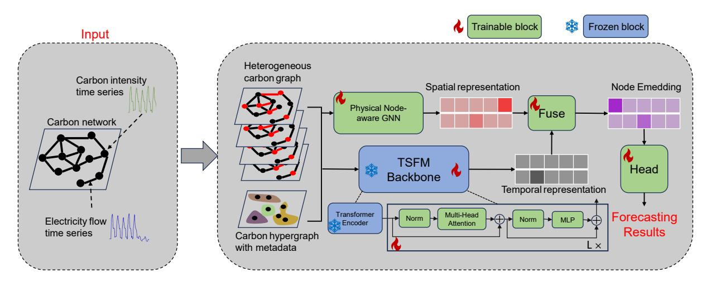
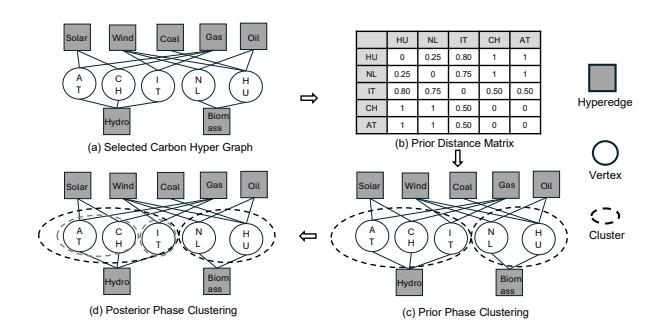
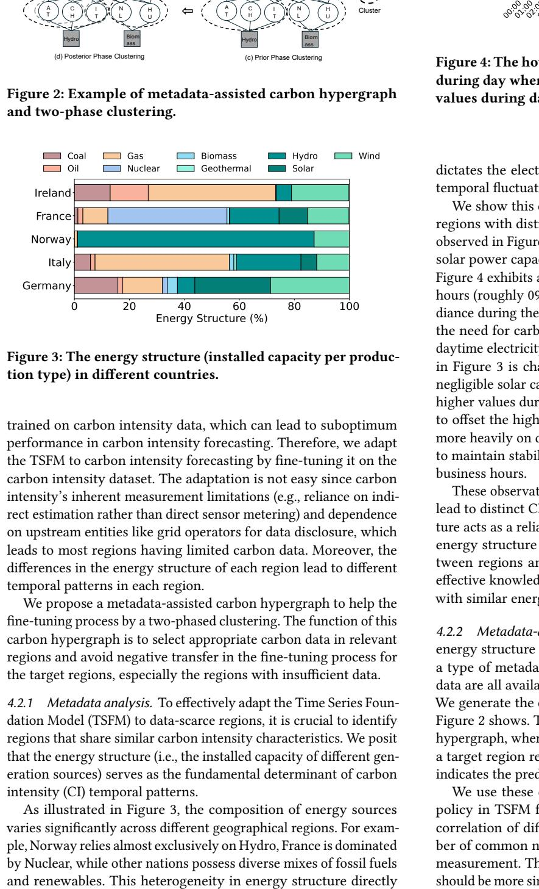
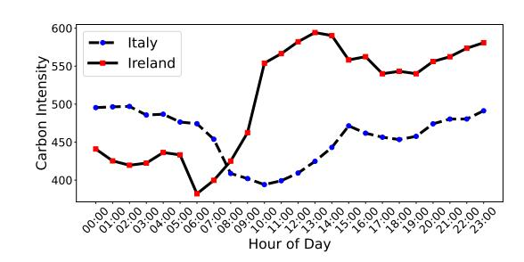
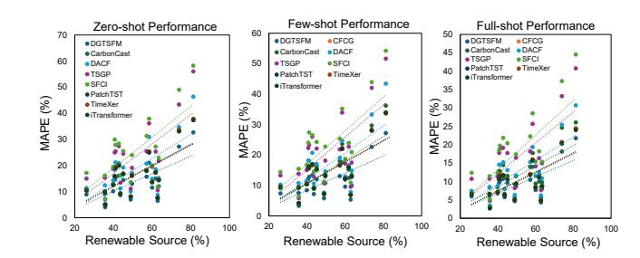
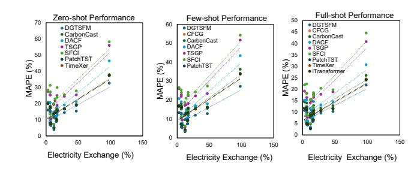

# Toward Green Computing: General Carbon Intensity Forecasting via Dual Graph Empowered Time Series Foundation Model

Xiaoyang Zhang Hong Kong Polytechnic University Hong Kong, China xiaoyang.zhang@connect.polyu.hk

Taiqi Zhou Hong Kong Polytechnic University Hong Kong, China taiqi.zhou@connect.polyu.hk

Fang He Hong Kong Polytechnic University Hong Kong, China fangf.he@connect.polyu.hk

Yang Deng Hong Kong Polytechnic University Hong Kong, China yang2.deng@connect.polyu.hk

Dan Wang Hong Kong University of Science and Technology Hong Kong, China wangdan@ust.hk

# Abstract

Carbon intensity forecasting is vital for optimizing carbon-aware systems to reduce their carbon footprint. Existing methods focus on data-rich regions, yet most areas lack sufficient carbon data due to carbon intensity's inherent measurement limitations (i.e., reliance on indirect estimation rather than direct sensor metering) and dependence on upstream entities like grid operators for data disclosure. We propose DGCFM, a Dual Graph empowered Carbondomain Foundation Model, enabling cross-regional general carbon intensity forecasting, especially for data-scarce regions. DGCFM builds on a pre-trained Time Series Foundation Model (TSFM) with strong generalization capabilities to capture temporal patterns under data constraints, empowered by metadata-driven carbon hypergraph fine-tuning and a spatiotemporal graph to capture spatial dependency in carbon networks. Evaluated on real-world datasets, DGCFM achieves 20.04% average accuracy improvement in lowdata scenarios.

# CCS Concepts

• Social and professional topics → Sustainability; • Computing methodologies → Neural networks.

# Keywords

Carbon Intensity Forecasting, Sustainable Computing, Social Good

### ACM Reference Format:

Xiaoyang Zhang, Taiqi Zhou, Fang He, Yang Deng, and Dan Wang. 2026. Toward Green Computing: General Carbon Intensity Forecasting via Dual Graph Empowered Time Series Foundation Model. In Proceedings of the ACM Web Conference 2026 (WWW '26), April 13–17, 2026, Dubai, United Arab Emirates. ACM, New York, NY, USA, [9](#page-8-0) pages. [https://doi.org/10.1145/](https://doi.org/10.1145/3774904.3793051) [3774904.3793051](https://doi.org/10.1145/3774904.3793051)

# 1 Introduction

While Artificial Intelligence (AI) has made tremendous progress in recent years [\[4,](#page-8-1) [5\]](#page-8-2), it has also brought about some social problems. As part of the United Nations' sustainable development goals,

[This work is licensed under a Creative Commons Attribution 4.0 International License.](https://creativecommons.org/licenses/by/4.0)

WWW '26, Dubai, United Arab Emirates © 2026 Copyright held by the owner/author(s). ACM ISBN 979-8-4007-2307-0/2026/04 <https://doi.org/10.1145/3774904.3793051>

there is increasing interest in the Artificial Intelligence (AI) research community in developing techniques to address societal problems [\[3,](#page-8-3) [11,](#page-8-4) [14,](#page-8-5) [18,](#page-8-6) [21,](#page-8-7) [22,](#page-8-8) [31,](#page-8-9) [33\]](#page-8-10), especially to facilitate the decarbonization of computing [\[2,](#page-8-11) [7,](#page-8-12) [15,](#page-8-13) [20,](#page-8-14) [25\]](#page-8-15). Recently, carbon demand-side techniques have been proposed to reduce the operational carbon footprint of carbon-aware systems resulting from consuming electricity, i.e., shift electricity demand from periods when the carbon intensity of electricity is high to periods when it is low. For example, cloud computing providers leverage the variations in carbon intensity to schedule workloads since some computing loads exhibit temporal elasticity [\[1,](#page-8-16) [28\]](#page-8-17) and LLM inference can reduce its carbon footprint by guiding the autoregressive generation process according to carbon intensity [\[13\]](#page-8-18). However, the effectiveness of such carbon-aware systems fundamentally depends on accurate electricity carbon intensity forecasting, a critical yet underexplored component in current implementations.

The carbon intensity of electricity (in ����������/���� ℎ) is defined as the average amount of carbon released per unit of electricity generated. Carbon intensity forecasting is already being used in the decarbonization of society, e.g., the commercial service ElectricityMaps [\[19\]](#page-8-19) offers regional carbon forecasts to major firms (e.g., Google, Microsoft) for their carbon reduction. Academic efforts have proposed various forecasting models [\[16,](#page-8-20) [32\]](#page-8-21), but these typically require substantial historical carbon intensity data from target regions. However, the distribution of the carbon data is uneven across regions due to carbon intensity's inherent measurement limitations (e.g., reliance on indirect estimation rather than direct sensor metering) and dependence on upstream entities like grid operators for data disclosure. For instance, while developed countries generally possess comprehensive carbon data, developing countries frequently experience significant data gaps. This data scarcity creates a critical performance gap: existing models exhibit significantly degraded accuracy when applied to regions with insufficient historical data, thereby hindering global decarbonization efforts through computing solutions.

In this paper, we present a holistic study by formulating a new General Carbon Intensity Forecasting problem (GCIF). To solve GCIF, we propose DGCFM, a new Dual Graph (i.e., a spatial-temporal carbon graph and a metadata-assisted carbon hypergraph) empowered Carbon-domain time series Foundation Model. First, we introduce carbon flows, which collectively establish a carbon network. Then, we model the carbon network as a spatial-temporal carbon

Figure 2: Example of metadata-assisted carbon hypergraph and two-phase clustering.

Figure 3: The energy structure (installed capacity per production type) in different countries.

trained on carbon intensity data, which can lead to suboptimum performance in carbon intensity forecasting. Therefore, we adapt the TSFM to carbon intensity forecasting by fine-tuning it on the carbon intensity dataset. The adaptation is not easy since carbon intensity's inherent measurement limitations (e.g., reliance on indirect estimation rather than direct sensor metering) and dependence on upstream entities like grid operators for data disclosure, which leads to most regions having limited carbon data. Moreover, the differences in the energy structure of each region lead to different temporal patterns in each region.

We propose a metadata-assisted carbon hypergraph to help the fine-tuning process by a two-phased clustering. The function of this carbon hypergraph is to select appropriate carbon data in relevant regions and avoid negative transfer in the fine-tuning process for the target regions, especially the regions with insufficient data.

4.2.1 Metadata analysis. To effectively adapt the Time Series Foundation Model (TSFM) to data-scarce regions, it is crucial to identify regions that share similar carbon intensity characteristics. We posit that the energy structure (i.e., the installed capacity of different generation sources) serves as the fundamental determinant of carbon intensity (CI) temporal patterns.

As illustrated in Figure 3, the composition of energy sources varies significantly across different geographical regions. For example, Norway relies almost exclusively on Hydro, France is dominated by Nuclear, while other nations possess diverse mixes of fossil fuels

Figure 4: The hourly carbon intensity trace, with lower values during day when solar production is high in Italy and higher values during day in Ireland where there is no solar power.

dictates the electricity generation mix, which in turn drives the temporal fluctuations of carbon intensity.

We show this correlation by analyzing the hourly CI traces of regions with distinct energy structures, as shown in Figure 4. As observed in Figure 3, Italy possesses a non-negligible proportion of solar power capacity. Consequently, its carbon intensity curve in Figure 4 exhibits a distinct "valley" or lower values during daylight hours (roughly 09:00 to 17:00). This occurs because high solar irradiance during the day generates zero-carbon electricity, displacing the need for carbon-intensive fossil fuel generation despite high daytime electricity demand. Conversely, Ireland's energy structure in Figure 3 is characterized by a high share of wind power but negligible solar capacity. As a result, its CI trace in Figure 4 shows higher values during the day. Without significant solar generation to offset the high daytime electricity demand, the grid must rely more heavily on dispatchable fossil fuel sources (e.g., gas and coal) to maintain stability, leading to a peak in carbon intensity during business hours.

These observations demonstrate that different energy structures lead to distinct CI temporal patterns. Therefore, the energy structure acts as a reliable metadata for the carbon dataset. By utilizing energy structure as metadata, we can quantify the similarity between regions and construct a carbon hypergraph that enables effective knowledge transfer from data-rich to data-scarce regions with similar energy compositions.

4.2.2 Metadata-assisted carbon hypergraph generation. Here, the energy structure (e.g., solar, wind, coal, etc.) can be considered as a type of metadata for the carbon dataset of each region. These data are all available in the regions without carbon intensity data. We generate the carbon hypergraph assisted by the metadata, as Figure [2](#page-4-0) shows. The metadata is utilized to infer the edges in the hypergraph, where an edge between a group of source regions and a target region represents a feasible transfer case, and its weight indicates the predicted performance of that transfer.

We use these edges to estimate the globally optimal transfer policy in TSFM fine-tuning. To get the weight of edges, i.e. the correlation of different regions, our idea is to leverage the number of common neighbors in the carbon hypergraph for distance measurement. The hypothesis is that the carbon data of a region should be more similar to another region, if it has higher numbers of

Table 2: Performance comparison of all models in the scenario with insufficient data in terms of MAE, RMSE, and MAPE (%).

| Settings Methods Metric | AT    | BE    | BG    | CH    | CZ    | ES    | FI    | FR    | GR    | HR    | HU    | Datasets IT | LT     | NL    | NO    | PL     | PT    | RO    | RS    | SI    | SK    | AVE   |
|-------------------------|-------|-------|-------|-------|-------|-------|-------|-------|-------|-------|-------|-------------|--------|-------|-------|--------|-------|-------|-------|-------|-------|-------|
| MAE                     | 12.58 | 5.49  | 22.41 | 7.32  | 37.24 | 12.44 | 9.06  | 1.97  | 39.07 | 9.66  | 15.74 | 39.31       | 58.83  | 5.21  | 1.79  | 68.17  | 19.40 | 18.16 | 16.42 | 12.16 | 29.94 | 21.07 |
| RMSE DGCFM              | 16.62 | 6.35  | 26.33 | 9.22  | 45.54 | 17.39 | 10.34 | 2.09  | 45.54 | 12.48 | 18.62 | 43.25       | 61.78  | 6.31  | 2.08  | 80.69  | 27.58 | 20.96 | 21.10 | 15.15 | 35.30 | 24.99 |
| MAPE                    | 11.99 | 12.95 | 6.95  | 32.66 | 8.88  | 14.97 | 14.41 | 16.07 | 11.54 | 5.71  | 9.11  | 14.53       | 21.01  | 15.69 | 7.69  | 10.11  | 27.22 | 6.45  | 3.97  | 8.62  | 15.39 | 13.14 |
| MAE                     | 14.16 | 6.25  | 26.38 | 8.70  | 44.23 | 15.45 | 10.28 | 2.28  | 47.20 | 11.06 | 18.95 | 44.96       | 66.20  | 6.32  | 2.19  | 74.58  | 21.75 | 21.03 | 18.74 | 14.48 | 36.85 | 24.38 |
| RMSE PatchTST           | 19.06 | 7.51  | 32.60 | 10.54 | 51.59 | 20.06 | 12.11 | 2.60  | 55.38 | 13.59 | 20.90 | 50.83       | 75.88  | 7.41  | 2.39  | 103.20 | 32.13 | 25.74 | 24.51 | 16.22 | 42.09 | 29.82 |
| MAPE                    | 14.45 | 16.13 | 8.07  | 37.51 | 10.49 | 17.34 | 16.73 | 20.06 | 13.63 | 6.55  | 9.88  | 15.82       | 25.07  | 18.01 | 8.99  | 12.64  | 33.23 | 7.57  | 4.94  | 9.22  | 19.15 | 15.50 |
| MAE                     | 14.18 | 6.26  | 26.44 | 8.72  | 44.32 | 15.49 | 10.30 | 2.28  | 47.31 | 11.08 | 18.99 | 45.04       | 66.30  | 6.34  | 2.20  | 74.67  | 21.78 | 21.07 | 18.78 | 14.52 | 36.95 | 24.43 |
| RMSE TimeXer            | 19.00 | 7.49  | 32.46 | 10.51 | 51.46 | 20.01 | 12.07 | 2.59  | 55.16 | 13.56 | 20.85 | 50.66       | 75.57  | 7.38  | 2.38  | 102.70 | 32.03 | 25.63 | 24.44 | 16.19 | 41.94 | 29.72 |
| MAPE                    | 14.62 | 16.36 | 8.14  | 37.85 | 10.60 | 17.51 | 16.90 | 20.34 | 13.78 | 6.61  | 9.94  | 15.91       | 25.36  | 18.17 | 9.09  | 12.82  | 33.66 | 7.65  | 5.01  | 9.27  | 19.42 | 15.67 |
| MAE                     | 14.44 | 6.38  | 27.10 | 8.95  | 45.49 | 15.99 | 10.50 | 2.34  | 48.66 | 11.32 | 19.53 | 45.98       | 67.53  | 6.52  | 2.26  | 75.74  | 22.17 | 21.55 | 19.16 | 14.90 | 38.10 | 24.98 |
| RMSE MOMENT             | 18.86 | 7.42  | 32.10 | 10.44 | 51.11 | 19.85 | 11.97 | 2.56  | 54.59 | 13.50 | 20.72 | 50.22       | 74.76  | 7.32  | 2.36  | 101.41 | 31.77 | 25.36 | 24.24 | 16.13 | 41.55 | 29.44 |
| MAPE Zero-data          | 14.37 | 16.03 | 8.03  | 37.35 | 10.43 | 17.26 | 16.66 | 19.93 | 13.56 | 6.52  | 9.86  | 15.77       | 24.94  | 17.93 | 8.95  | 12.56  | 33.03 | 7.54  | 4.91  | 9.20  | 19.03 | 15.42 |
| MAE                     | 14.31 | 6.32  | 26.77 | 8.84  | 44.91 | 15.74 | 10.4  | 2.31  | 47.99 | 11.2  | 19.26 | 45.51       | 66.92  | 6.43  | 2.23  | 75.21  | 21.98 | 21.31 | 18.97 | 14.71 | 37.53 | 24.71 |
| RMSE CarbonCast         | 19.09 | 7.53  | 32.68 | 10.56 | 51.67 | 20.1  | 12.13 | 2.61  | 55.51 | 13.6  | 20.93 | 50.93       | 76.07  | 7.42  | 2.39  | 103.5  | 32.19 | 25.8  | 24.56 | 16.23 | 42.18 | 29.89 |
| MAPE                    | 14.59 | 16.32 | 8.13  | 37.79 | 10.58 | 17.48 | 16.87 | 20.29 | 13.75 | 6.6   | 9.93  | 15.89       | 25.31  | 18.14 | 9.07  | 12.79  | 33.58 | 7.64  | 5     | 9.26  | 19.37 | 15.64 |
| MAE                     | 16.68 | 6.45  | 30.86 | 9.76  | 48.85 | 16.23 | 11.84 | 2.44  | 52.54 | 13.99 | 20.33 | 49.5        | 75.07  | 6.77  | 2.34  | 89.67  | 26.56 | 23.1  | 20.96 | 15.46 | 37.63 | 27.48 |
| RMSE DACF               | 22.75 | 7.92  | 33.43 | 12.15 | 57.36 | 23.08 | 14.19 | 2.69  | 59.78 | 16.02 | 26.38 | 60.74       | 77.47  | 8.33  | 2.67  | 104.55 | 34.71 | 26.77 | 25.77 | 20.28 | 46.14 | 32.53 |
| MAPE                    | 15.17 | 17.08 | 10.05 | 46.35 | 11.33 | 18.54 | 19.17 | 20.94 | 14.84 | 7.27  | 12.41 | 18.39       | 30.93  | 20.69 | 10.34 | 14.32  | 34.67 | 8.72  | 5.35  | 11.17 | 21.16 | 17.57 |
| MAE                     | 20.65 | 8.28  | 35.05 | 12.43 | 66.06 | 21.67 | 16.34 | 3.26  | 67.69 | 17.65 | 27.26 | 71.05       | 97.68  | 9.27  | 2.8   | 117.39 | 33.23 | 32.13 | 28.13 | 22.49 | 52.35 | 36.33 |
| RMSE TSGP               | 28.58 | 10.17 | 45.12 | 15.74 | 87.15 | 30.79 | 16.34 | 3.78  | 74.18 | 20    | 31.39 | 76.4        | 104.08 | 10.99 | 3.4   | 135.89 | 45.26 | 35.87 | 35.62 | 29.03 | 56.62 | 42.69 |
| MAPE                    | 21.77 | 19.07 | 11.11 | 56.03 | 14.97 | 25.32 | 24.51 | 27.42 | 19.47 | 9.53  | 15.29 | 24.97       | 36.12  | 25.4  | 11.96 | 18.69  | 43.35 | 10.51 | 6.99  | 13.36 | 25.42 | 21.96 |
| MAE                     | 24.36 | 10.11 | 45.82 | 13.96 | 67    | 22.43 | 17.16 | 3.93  | 77.79 | 18    | 30.22 | 73.22       | 109.67 | 9.61  | 3.41  | 121.32 | 35.99 | 33.83 | 31.23 | 23.36 | 58    | 39.54 |
| RMSE SFCI               | 30.96 | 11.52 | 46.97 | 16.68 | 89.76 | 33.41 | 19.68 | 3.93  | 86.73 | 23.98 | 34.6  | 81.62       | 112.82 | 11.6  | 3.58  | 152.66 | 48.26 | 41.17 | 39.75 | 29.94 | 66.08 | 46.94 |
| MAPE                    | 22.92 | 23.96 | 13.61 | 58.23 | 17.15 | 27.23 | 25.53 | 28.36 | 20.01 | 10.45 | 16.12 | 29.93       | 37.91  | 31.32 | 13.82 | 19.42  | 48.99 | 11.81 | 7.26  | 16.19 | 27.87 | 24.19 |
| MAE                     | 10.49 | 4.57  | 18.67 | 6.10  | 31.03 | 10.37 | 7.55  | 1.64  | 32.56 | 8.05  | 13.11 | 32.76       | 49.02  | 4.34  | 1.50  | 56.81  | 16.17 | 15.14 | 13.68 | 10.13 | 24.95 | 17.18 |
| RMSE DGCFM              | 13.85 | 5.29  | 21.94 | 7.68  | 37.95 | 14.49 | 8.62  | 1.74  | 37.95 | 10.40 | 15.52 | 36.04       | 51.48  | 5.26  | 1.74  | 67.24  | 22.99 | 17.47 | 17.58 | 12.62 | 29.41 | 20.39 |
| MAPE                    | 9.99  | 10.79 | 5.79  | 27.22 | 7.40  | 12.48 | 12.01 | 13.39 | 9.62  | 4.76  | 7.59  | 12.11       | 17.50  | 13.08 | 6.41  | 8.43   | 22.68 | 5.38  | 3.31  | 7.19  | 12.83 | 10.86 |
| MAE                     | 12.37 | 5.66  | 22.34 | 7.38  | 37.21 | 12.36 | 9.09  | 1.96  | 39.57 | 9.77  | 15.53 | 38.87       | 58.20  | 5.30  | 1.82  | 66.71  | 18.78 | 18.60 | 15.98 | 12.24 | 30.39 | 20.96 |
| RMSE PatchTST           | 16.47 | 6.38  | 26.62 | 9.28  | 47.08 | 17.29 | 10.06 | 2.09  | 44.69 | 12.29 | 18.61 | 44.98       | 62.46  | 6.25  | 2.13  | 79.64  | 28.26 | 21.09 | 20.77 | 15.03 | 35.94 | 25.11 |
| MAPE                    | 12.97 | 13.42 | 7.24  | 33.93 | 9.57  | 15.98 | 15.34 | 16.97 | 12.31 | 6.05  | 9.31  | 15.68       | 22.17  | 16.71 | 8.17  | 10.51  | 28.19 | 6.95  | 4.23  | 9.22  | 16.23 | 13.86 |
| MAE                     | 12.62 | 5.80  | 22.84 | 7.56  | 38.06 | 12.63 | 9.30  | 2.01  | 40.53 | 10.00 | 15.86 | 39.70       | 59.46  | 5.43  | 1.87  | 68.06  | 19.14 | 19.08 | 16.30 | 12.53 | 31.13 | 21.42 |
| RMSE TimeXer            | 16.40 | 6.35  | 26.49 | 9.24  | 46.83 | 17.21 | 10.02 | 2.08  | 44.51 | 12.24 | 18.52 | 44.73       | 62.16  | 6.22  | 2.12  | 79.29  | 28.11 | 20.99 | 20.68 | 14.96 | 35.75 | 25.00 |
| MAPE                    | 13.03 | 13.48 | 7.27  | 34.07 | 9.62  | 16.05 | 15.41 | 17.05 | 12.36 | 6.07  | 9.35  | 15.76       | 22.27  | 16.78 | 8.20  | 10.55  | 28.30 | 6.98  | 4.25  | 9.26  | 16.30 | 13.93 |
| MAE                     | 12.59 | 5.79  | 22.79 | 7.54  | 37.97 | 12.60 | 9.28  | 2.00  | 40.43 | 9.98  | 15.83 | 39.62       | 59.33  | 5.41  | 1.86  | 67.92  | 19.10 | 19.03 | 16.26 | 12.50 | 31.06 | 21.38 |
| RMSE MOMENT             | 16.32 | 6.32  | 26.35 | 9.19  | 46.55 | 17.13 | 9.97  | 2.07  | 44.30 | 12.18 | 18.43 | 44.46       | 61.82  | 6.19  | 2.10  | 78.92  | 27.95 | 20.88 | 20.58 | 14.89 | 35.56 | 24.86 |
| MAPE                    | 12.90 | 13.37 | 7.21  | 33.78 | 9.53  | 15.90 | 15.27 | 16.90 | 12.25 | 6.02  | 9.28  | 15.61       | 22.07  | 16.63 | 8.13  | 10.46  | 28.07 | 6.91  | 4.21  | 9.17  | 16.15 | 13.80 |
| MAE                     | 12.51 | 5.74  | 22.62 | 7.48  | 37.69 | 12.51 | 9.21  | 1.99  | 40.11 | 9.9   | 15.72 | 39.34       | 58.91  | 5.37  | 1.85  | 67.47  | 18.98 | 18.87 | 16.16 | 12.4  | 30.81 | 20.74 |
| RMSE Low-data CFCG      | 16.5  | 6.39  | 26.67 | 9.3   | 47.17 | 17.32 | 10.07 | 2.09  | 44.76 | 12.31 | 18.64 | 45.07       | 62.57  | 6.26  | 2.13  | 79.76  | 28.31 | 21.13 | 20.8  | 15.05 | 36    | 24.62 |
| MAPE                    | 12.84 | 13.31 | 7.18  | 33.64 | 9.48  | 15.83 | 15.2  | 16.82 | 12.19 | 5.99  | 9.24  | 15.53       | 21.97  | 16.55 | 8.09  | 10.42  | 27.95 | 6.88  | 4.19  | 9.13  | 16.08 | 13.74 |
| MAE                     | 12.56 | 5.46  | 23.46 | 8.43  | 37.54 | 13.25 | 9.98  | 2.03  | 42.19 | 9.7   | 15.95 | 39.92       | 57.4   | 5.52  | 1.86  | 72.23  | 20.06 | 19.04 | 17.46 | 14.49 | 31.28 | 21.43 |
| RMSE CarbonCast         | 17.31 | 6.4   | 28.63 | 9.81  | 48.99 | 17.93 | 10.74 | 2.22  | 46.55 | 13.5  | 20.45 | 44.71       | 61.69  | 6.63  | 2.22  | 80.79  | 27.8  | 22.2  | 21.04 | 15.37 | 33.18 | 25.25 |
| MAPE                    | 13.44 | 12.97 | 7.34  | 36.24 | 9.12  | 15.25 | 16.28 | 16.66 | 11.97 | 6.24  | 9.62  | 15.84       | 23.64  | 18.01 | 8.38  | 10.61  | 29.71 | 6.9   | 3.93  | 8.87  | 15.66 | 14.05 |
| MAE                     | 14.15 | 6.43  | 26.46 | 8.64  | 45.27 | 14.58 | 10.74 | 2.38  | 45.38 | 11.17 | 17.63 | 43.25       | 65.93  | 5.69  | 2.27  | 77.84  | 23.23 | 20.65 | 20.25 | 14.56 | 36.15 | 23.83 |
| RMSE DACF               | 20.66 | 7.79  | 29.92 | 10.87 | 54.54 | 19.18 | 11.55 | 2.38  | 54.49 | 14.53 | 22.54 | 51.84       | 71.91  | 7.07  | 2.35  | 91.46  | 32.23 | 26.7  | 25.16 | 18.2  | 42.06 | 28.77 |
| MAPE                    | 14.85 | 14.66 | 7.7   | 43.43 | 10.31 | 16.64 | 17.05 | 20.75 | 12.98 | 6.56  | 10.77 | 18.19       | 24.68  | 19.1  | 9.09  | 11.56  | 33.31 | 7.85  | 4.28  | 10.62 | 18.08 | 15.72 |
| MAE                     | 20.12 | 8.21  | 33.45 | 10.94 | 55.05 | 17.96 | 13.72 | 2.9   | 61.76 | 14.61 | 21.79 | 58.83       | 94.77  | 7.83  | 2.55  | 111.13 | 30.33 | 26.78 | 24.69 | 16.86 | 46.24 | 31.71 |
| RMSE TSGP               | 26.44 | 9.82  | 38.45 | 14.26 | 70.78 | 27.88 | 15.45 | 3.07  | 70.22 | 17.61 | 29.69 | 67.8        | 99.08  | 9.37  | 3.08  | 124.06 | 42.9  | 33.21 | 29.45 | 25.7  | 51.16 | 37.92 |
| MAPE                    | 17.51 | 18.16 | 10.75 | 51.66 | 13.33 | 22.75 | 22.13 | 26    | 17.2  | 8.42  | 13.84 | 22.29       | 33.97  | 21.85 | 11.47 | 15.1   | 42.08 | 9.6   | 5.82  | 12.9  | 23.42 | 19.84 |
| MAE                     | 21.21 | 9.5   | 37.49 | 11.75 | 66.53 | 19.78 | 14.28 | 2.99  | 63.64 | 15.32 | 28.2  | 62.41       | 97.82  | 8.37  | 3.28  | 111.39 | 32.2  | 30.92 | 25.81 | 20.53 | 52.21 | 34.17 |
| RMSE SFCI               | 26.91 | 9.91  | 45.91 | 15.57 | 74.2  | 29.44 | 18.03 | 3.49  | 73.82 | 21.09 | 33.81 | 70.78       | 107.56 | 10.73 | 3.48  | 129.72 | 46.86 | 34.8  | 37.25 | 28.22 | 59.45 | 41.08 |
| MAPE                    | 20.95 | 22.8  | 11.27 | 54.24 | 14.42 | 24.02 | 24.3  | 26.55 | 18.72 | 9.54  | 15.48 | 24.03       | 35.19  | 25.36 | 11.84 | 16.76  | 43.95 | 10.95 | 6.4   | 14.56 | 27.43 | 21.57 |

the effectiveness of DGCFM for carbon intensity forecasting in regions with insufficient carbon data.

In operational deployments, if limited carbon data is available in the target region, users can typically leverage it to adapt the model in the target region and enhance the model performance. The lowdata setting in Table [2](#page-6-0) shows the performances of each model in the regions with limited carbon data. Overall, DGCFM outperforms all existing models by at least 20.04%. More specifically, DGCFM achieves an average improvement of 22.04% compared to PatchTST (from 13.93% to 10.86%), TimeXer 21.30% (from 13.80% to 10.86%), MOMENT 20.96% compared to CFCG (from 13.74% to 10.86%), CFCG 21.65% (from 13.86% to 10.86%), CarbonCast 22.70% (from 14.05% to 10.86%), DACF 30.92% (from 15.72% to 10.86%), TSGP 45.26% (from 19.84% to 10.86%), and SFCI 49.65% (from 21.57% to 10.86%) in MAPE. We also observe that DGCFM steadily outperforms other baselines in all datasets. The result demonstrates the effectiveness of DGCFM in the regions with limited carbon data.

To comprehensively evaluate the performance, we also conduct the experiment under a full-shot setting, i.e., 70% data in the target dataset is used to train the models, and 30% data is used for the test. Table [3](#page-6-1) shows the performances under the full-shot setting. Overall, DGCFM outperforms existing models by at least 9.77%. More specifically, CFCG achieves an average improvement of 11.16%

compared to PatchTST (from 9.77% to 8.68%), TimeXer 11.43% (from 9.80% to 8.68%), MOMENT 9.77% (from 9.62% to 8.68%), CFCG 9.78% (from 9.62% to 8.68%), CarbonCast 21.02% (from 10.99% to 8.68%), DACF 28.21% (from 12.09% to 8.68%), TSGP 44.75% (from 15.71% to 8.68%), and SFCI 50.14% (from 17.41% to 8.68%) in MAPE. We also observe that DGCFM can steadily outperform other baselines in all datasets under the full-shot setting.

Table 3: The overall full-shot performance.

| Models | DGCFM | PatchTST | TimeXer | MOMENT | CFCG  | CarbonCast | DACF  | TSGP  | SFCI  |
|--------|-------|----------|---------|--------|-------|------------|-------|-------|-------|
| MAE    | 13.75 | 15.31    | 15.33   | 15.35  | 15.13 | 16.89      | 19.24 | 24.63 | 26.87 |
| RMSE   | 16.31 | 18.39    | 18.45   | 18.24  | 17.95 | 20.29      | 23.28 | 28.82 | 31.84 |
| MAPE   | 8.68  | 9.77     | 9.80    | 9.62   | 9.62  | 10.99      | 12.09 | 15.71 | 17.41 |

# 5.3 Explainable Capabilities Learned

The superior performance of DGCFM stems from its dual capacity to capture both spatial and temporal dependencies in carbon data. We demonstrate these learned capabilities through systematic analysis:

Temporal Dependency Analysis. Figure [5](#page-7-0) illustrates the relationship between forecasting accuracy (MAPE) and renewable energy penetration rates across different regions. Each data point

Figure 5: The scatter plot of model performance as a function of the ratio of renewable sources.

Figure 6: The scatter plot of model performance as a function of the ratio of electricity exchange.

represents a geographical area with distinct renewable source compositions (e.g., solar, wind, hydro) in their energy mix. Higher renewable ratios induce greater temporal volatility in carbon intensity due to the intermittent nature of renewable generation. Our analysis reveals a positive correlation between renewable penetration and forecasting error, highlighting the inherent challenges in forecasting carbon patterns with increasing temporal dynamics. Notably, while all models exhibit performance degradation, DGCFM demonstrates (1) absolute superiority over baseline methods and (2)superior resistance to error escalation (slower error growth with renewable ratios increasing). This resilience confirms DGCFM's enhanced temporal modeling capabilities through its TSFM blocks.

Spatial Dependency Analysis. Figure [6](#page-7-1) examines forecasting performance against electricity exchange ratios, where higher values indicate stronger grid interdependencies between regions. We observe an increase in forecasting errors with rising exchange ratios, reflecting the compounded complexity of spatial interactions in interconnected power systems. We can also observe that our DGCFM model has a slower error increase. This demonstrates the capability of DGCFM to uncover the complex spatial dependency.

### 5.4 Model Ablation Study

To systematically evaluate the contribution of core components in DGCFM, we conduct ablation studies as Table [4](#page-7-2) shows. We compare the performance of degraded variants against the complete model through three key modifications:

(1) Architecture Simplification: Removing the Physical Nodeaware Graph Neural Network (PNGNN) component and replacing it with a generic GNN degrades MAPE by 7.18% (from 10.86% to

11.64%), indicating PNGNN's critical role in encoding spatial dependencies through physical constraints.

(2) Temporal Modeling Ablation: Substituting the TSFM backbone with conventional LSTM results in the most significant performance drop (11.70% MAE increase and 19.89% MAPE), confirming the superiority of our TSFM block for capturing complex temporal patterns.

(3) Fine-tuning Strategy Removal: We disable the carbon hypergraph-enhanced fine-tuning mechanism. This variant is equivalent to using all available regions' CI data to fine-tune the TSFM backbone for any target region's CI forecasting. This change leads to an 11.42% MAPE degradation (from 10.86% to 12.10%), demonstrating the importance of our domain-specific adaptation strategy for handling data scarcity in carbon intensity forecasting.

The progressive performance deterioration across all metrics (MAE: 17.18 to 20.19, RMSE: 20.39 to 23.44, MAPE: 10.86% to 13.02%) reveals the complementary nature of spatial-temporal modeling and domain adaptation in our framework. Particularly, the TSFM backbone contributes the largest performance gain (19.89% MAPE improvement over the LSTM baseline), showing that effective temporal dependency modeling forms the foundation for accurate carbon forecasting. The synergistic combination of physical constraints and hypergraph-based fine-tuning further enhances model robustness in data-constrained scenarios.

Table 4: Results of ablation study under the few-shot setting

| Models                            | MAE   | RMSE  | MAPE  |
|-----------------------------------|-------|-------|-------|
| DGCFM                             | 17.18 | 20.39 | 10.86 |
| w/o PNGNN                         | 18.11 | 21.45 | 11.64 |
| w/o TSFM Backbone                 | 20.19 | 23.44 | 13.02 |
| w/o Carbon Hypergraph Fine-tuning | 19.07 | 22.81 | 12.10 |

### 6 Social Impact

Carbon intensity forecasting is already being used in the decarbonization of society, e.g., ElectricityMaps [\[19\]](#page-8-19) already provide carbon forecasts to major tech firms (e.g., Google) for workload scheduling. By addressing the key challenge of generalizing forecasts to data-scarce regions, DGCFM counterbalances the "data divide" that favors wealthy nations and unlocks equitable access to carbon intelligence.

### 7 Conclusion

We present DGCFM, a dual-graph enhanced carbon-domain foundation model that systematically addresses the critical challenge of general carbon intensity forecasting across data-scarce regions. Extensive evaluations across different regions demonstrate 20.04% accuracy improvement over SOTA in low-data scenarios, representing the practical viability for supporting worldwide decarbonization.

### Acknowledgments

Dan Wang's work is supported in part by RGC GRF 15201322, 15230624, 15239925, CRF C5020-25GF, ITC ITS/052/23MX, and PolyU 1-CDKK, G-SAC8, K-ZYAP, HKUST Start up fund R9117.

- References [1] Bilge Acun, Benjamin Lee, Fiodar Kazhamiaka, Kiwan Maeng, Udit Gupta, Manoj Chakkaravarthy, David Brooks, and Carole-Jean Wu. 2023. Carbon explorer: A holistic framework for designing carbon aware datacenters. In Proceedings of the 28th ACM International Conference on Architectural Support for Programming Languages and Operating Systems, Volume 2. 118–132. [2] Noman Bashir, Varun Gohil, Anagha Belavadi Subramanya, Mohammad Shahrad, David Irwin, Elsa Olivetti, and Christina Delimitrou. 2024. The sunk carbon fallacy: Rethinking carbon footprint metrics for effective carbon-aware scheduling. In Proceedings of the 2024 ACM Symposium on Cloud Computing. 542–551. [3] Alessandro De Gaetano, Alain Barrat, and Daniela Paolotti. 2024. Modeling the interplay between disease spread, behaviors, and disease perception with a data-driven approach. Mathematical Biosciences 378 (2024), 109337. [4] Yicheng Di, Hongjian Shi, Khushal Haider Syed, Ruhui Ma, Haibing Guan, Yuan Liu, and Rajkumar Buyya. 2025. PIFGSR: Pluggable framework for information fusion using generative artificial intelligence (GenAI) in recommender systems. Information Fusion (2025), 104004. [5] Yicheng Di, Hongjian Shi, Xiaoming Wang, Ruhui Ma, and Yuan Liu. 2025. Federated recommender system based on diffusion augmentation and guided denoising. ACM Transactions on Information Systems 43, 2 (2025), 1–36. [6] Entsoe. 2024. Entsoe transparency platform. [https://transparency.entsoe.eu/](https://transparency.entsoe.eu/dashboard/show) [dashboard/show.](https://transparency.entsoe.eu/dashboard/show) [7] Ahmad Faiz, Sotaro Kaneda, Ruhan Wang, Rita Osi, Prateek Sharma, Fan Chen, and Lei Jiang. 2023. Llmcarbon: Modeling the end-to-end carbon footprint of large language models. arXiv preprint arXiv:2309.14393 (2023). [8] Justin Gilmer, Samuel S Schoenholz, Patrick F Riley, Oriol Vinyals, and George E Dahl. 2017. Neural message passing for quantum chemistry. In International conference on machine learning. PMLR, 1263–1272. [9] Mononito Goswami, Konrad Szafer, Arjun Choudhry, Yifu Cai, Shuo Li, and Artur Dubrawski. 2024. MOMENT: A Family of Open Time-series Foundation Models. In Forty-first International Conference on Machine Learning. [10] Paul Jaccard. 1908. Nouvelles recherches sur la distribution florale. Bull. Soc. Vaud. Sci. Nat. 44 (1908), 223–270. [11] Kathleen Kelley, Nicolò Gozzi, Mattia Mazzoli, and Daniela Paolotti. 2025. Exploring influenza vaccination determinants through digital participatory surveillance. BMC Public Health 25, 1 (2025), 1–14. [12] Kenneth Leerbeck, Peder Bacher, Rune Grønborg Junker, Goran Goranović, Olivier Corradi, Razgar Ebrahimy, Anna Tveit, and Henrik Madsen. 2020. Shortterm forecasting of CO2 emission intensity in power grids by machine learning. Applied Energy 277 (2020), 115527. [13] Baolin Li, Yankai Jiang, Vijay Gadepally, and Devesh Tiwari. 2024. Sprout: Green Generative AI with Carbon-Efficient LLM Inference. In Proceedings of the 2024 Conference on Empirical Methods in Natural Language Processing. 21799–21813. [14] Zhixiang Lu, Yulong Li, Feilong Tang, Zhengyong Jiang, Chong Li, Mian Zhou, Tenglong Li, and Jionglong Su. 2025. DeepGB-TB: A Risk-Balanced Cross-Attention Gradient-Boosted Convolutional Network for Rapid, Interpretable Tuberculosis Screening. arXiv preprint arXiv:2508.02741 (2025). [15] Diptyaroop Maji, Walid A Hanafy, Li Wu, David Irwin, Prashant Shenoy, and Ramesh K Sitaraman. 2025. Data Centers Carbon Emissions at Crossroads: An Empirical Study. ACM SIGENERGY Energy Informatics Review 5, 2 (2025), 48–55. [16] Diptyaroop Maji, Prashant Shenoy, and Ramesh K Sitaraman. 2022. CarbonCast: multi-day forecasting of grid carbon intensity. In Proceedings of the 9th ACM International Conference on Systems for Energy-Efficient Buildings, Cities, and Transportation. 198–207. [17] Diptyaroop Maji, Ramesh K Sitaraman, and Prashant Shenoy. 2022. DACF: dayahead carbon intensity forecasting of power grids using machine learning. In Proceedings of the Thirteenth ACM International Conference on Future Energy Systems. 188–192. [18] Aishik Mandal, Prottay Kumar Adhikary, Hiba Arnaout, Iryna Gurevych, and Tanmoy Chakraborty. 2025. A Comprehensive Review of Datasets for Clinical Mental Health AI Systems. arXiv preprint arXiv:2508.09809 (2025). [19] Electricity Maps. 2025. Electricity Data. [https://www.electricitymaps.com/.](https://www.electricitymaps.com/) [20] Jorge Murillo, Walid A Hanafy, David Irwin, Ramesh Sitaraman, and Prashant Shenoy. 2024. CDN-Shifter: Leveraging spatial workload shifting to decarbonize content delivery networks. In Proceedings of the 2024 ACM Symposium on Cloud Computing. 505–521. [21] Preslav Nakov, Jisun An, Haewoon Kwak, Muhammad Arslan Manzoor, Zain Muhammad Mujahid, and Husrev Taha Sencar. 2024. A survey on predicting the factuality and the bias of news media. In Findings of the Association for Computational Linguistics: ACL 2024. 15947–15962. [22] Lynnette Hui Xian Ng, Iain J Cruickshank, and Roy Lee. 2025. Examining the influence of political bias on large language model performance in stance classification. In Proceedings of the International AAAI Conference on Web and Social Media, Vol. 19. 1315–1328. [23] Yuqi Nie, Nam H Nguyen, Phanwadee Sinthong, and Jayant Kalagnanam. 2022. A time series is worth 64 words: Long-term forecasting with transformers. arXiv preprint arXiv:2211.14730 (2022). [24] Ana Carolina Riekstin, Antoine Langevin, Thomas Dandres, Ghyslain Gagnon, and Mohamed Cheriet. 2018. Time series-based GHG emissions prediction for smart homes. IEEE Transactions on Sustainable Computing 5, 1 (2018), 134–146. [25] Soumyendu Sarkar, Avisek Naug, Ricardo Luna, Antonio Guillen, Vineet Gundecha, Sahand Ghorbanpour, Sajad Mousavi, Dejan Markovikj, and Ashwin Ramesh Babu. 2024. Carbon Footprint Reduction for Sustainable Data Centers in Real-Time. In Proceedings of the AAAI Conference on Artificial Intelligence, Vol. 38. 22322–22330. [26] Mirko Schäfer, Bo Tranberg, Dave Jones, and Anke Weidlich. 2020. Tracing carbon dioxide emissions in the European electricity markets. In 2020 17th International Conference on the European Energy Market (EEM). IEEE, 1–6. [27] Jianbo Shi and Jitendra Malik. 2000. Normalized cuts and image segmentation. IEEE Transactions on pattern analysis and machine intelligence 22, 8 (2000), 888–
  - 905. [28] Abel Souza, Noman Bashir, Jorge Murillo, Walid Hanafy, Qianlin Liang, David Irwin, and Prashant Shenoy. 2023. Ecovisor: A virtual energy system for carbonefficient applications. In Proceedings of the 28th ACM International Conference on Architectural Support for Programming Languages and Operating Systems, Volume
  - 2. 252–265. [29] Petar Veličković, Guillem Cucurull, Arantxa Casanova, Adriana Romero, Pietro Liò, and Yoshua Bengio. 2018. Graph Attention Networks. International Conference on Learning Representations (2018). [https://openreview.net/forum?id=](https://openreview.net/forum?id=rJXMpikCZ) [rJXMpikCZ](https://openreview.net/forum?id=rJXMpikCZ) accepted as poster. [30] Yuxuan Wang, Haixu Wu, Jiaxiang Dong, Guo Qin, Haoran Zhang, Yong Liu, Yunzhong Qiu, Jianmin Wang, and Mingsheng Long. 2024. Timexer: Empowering transformers for time series forecasting with exogenous variables. arXiv preprint arXiv:2402.19072 (2024). [31] Hong Zhang, Quoc-Nam Nguyen, Prasanta Bhattacharya, Wei Gao, Liang Ze Wong, Brandon Siyuan Loh, Joseph JP Simons, and Jisun An. 2024. Enhancing stance classification on social media using quantified moral foundations. In International Conference on Advances in Social Networks Analysis and Mining. Springer, 305–319. [32] Xiaoyang Zhang and Dan Wang. 2023. A GNN-based Day Ahead Carbon Intensity Forecasting Model for Cross-Border Power Grids. In Proceedings of the 14th ACM International Conference on Future Energy Systems. 361–373. [33] Jiayou Zhong, Anudeex Shetty, Chao Jia, Xuanrui Lin, and Usman Naseem. 2025. Pluralistic Alignment for Healthcare: A Role-Driven Framework. In Proceedings of the 2025 Conference on Empirical Methods in Natural Language Processing. 31308–31331.