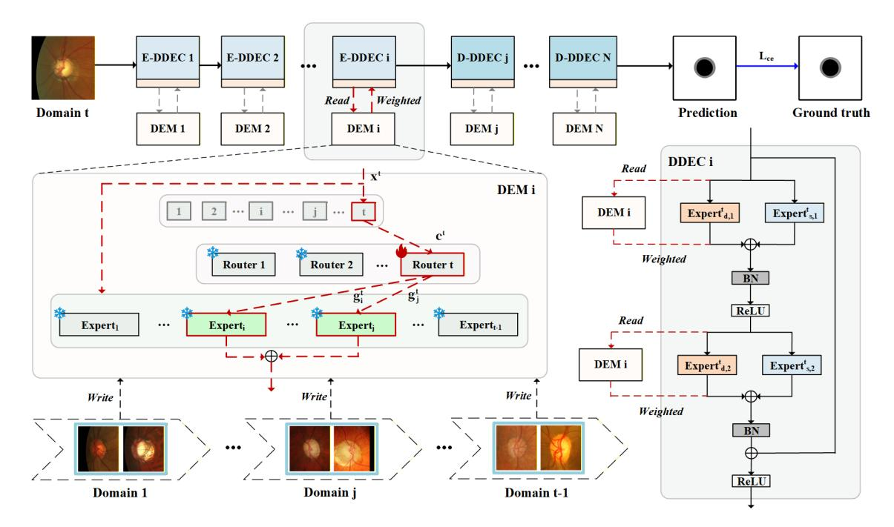
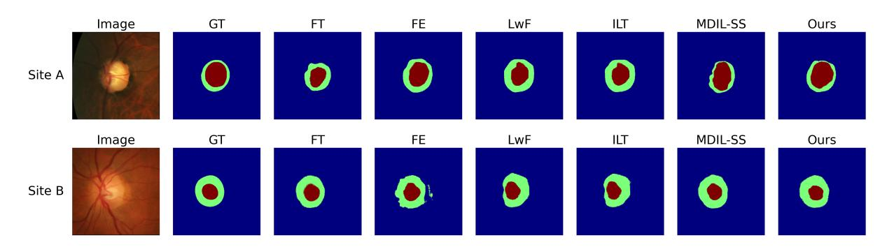

# Towards Glaucoma Screening in Decentralized Clinics: A Dynamic Expert-Assisted Domain-Incremental Approach

[Chenglong Fu](https://orcid.org/0009-0000-6766-9006)∗

[Jian Yao](https://orcid.org/0009-0007-8044-5518)∗

[Pengjiang Qian](https://orcid.org/0000-0002-5596-3694)†

7243115010@stu.jiangnan.edu.cn

jianyao\_ai@jiangnan.edu.cn qianpjiang@jiangnan.edu.cn

School of Artificial Intelligence and Computer Science, Jiangnan University

Wuxi, Jiangsu, China

The PRC Ministry of Education Engineering Research Center of Intelligent Technology for Healthcare Wuxi, Jiangsu, China

[Weiwei Fu](https://orcid.org/0000-0001-7192-3118)

School of Biomedical Engineering (Suzhou), Division of Life Sciences and Medicine, University of Science and Technology of China

Hefei, Anhui, China

Suzhou Institute of Biomedical Engineering and Technology, Chinese Academy of Science

> Suzhou, Jiangsu, China fuww@sibet.ac.cn

[Chuang Wang](https://orcid.org/0009-0002-6872-557X)

School of Artificial Intelligence and Computer Science,

Jiangnan University

Wuxi, Jiangsu, China The PRC Ministry of Education Engineering Research

Center of Intelligent Technology for Healthcare

Wuxi, Jiangsu, China 7233115017@stu.jiangnan.edu.cn [Guisong Yang](https://orcid.org/0000-0001-8057-7819)

Department of Computer Science and Engineering, University of Shanghai for Science and Technology Shanghai, China gsyang@usst.edu.cn

# Abstract

Timely and accurate diagnosis of blinding eye diseases such as glaucoma is crucial for healthcare interventions in the elderly. However, AI-assisted diagnostic models often suffer from degraded generalization and performance when applied across different domains. Continual learning offers a promising solution by enabling models to progressively accumulate and update knowledge with new data. Nevertheless, existing methods typically rely on historical data, which violates privacy preservation principles, and they are also prone to catastrophic forgetting, which limits their long-term clinical applicability. To overcome these challenges, we propose ECA-Net, a domain-incremental learning framework. Its core is a dynamic expert consultation mechanism that allows the model to adapt to new data from different medical institutions without accessing any historical raw data, using structured parameter decomposition and knowledge reorganization. ECA-Net introduces three key innovations: a dual-path domain-aware expert module, where shared and domain-specific experts collaborate to maintain stability while efficiently learning new domain features; a crossdomain expert retrieval mechanism, which dynamically activates

[This work is licensed under a Creative Commons Attribution 4.0 International License.](https://creativecommons.org/licenses/by/4.0) WWW '26, Dubai, United Arab Emirates

© 2026 Copyright held by the owner/author(s). ACM ISBN 979-8-4007-2307-0/2026/04 <https://doi.org/10.1145/3774904.3793053>

and integrates historical expert knowledge from memory units, mitigating catastrophic forgetting; and an optimized parameter inheritance and differential training strategy, significantly reducing cold-start costs for new domains. Experiments on multiple public datasets demonstrate that ECA-Net achieves outstanding segmentation performance and knowledge retention without relying on historical data.

# CCS Concepts

- Computing methodologies → Image segmentation; Applied computing → Health informatics.

# Keywords

Glaucoma Screening; Domain-Incremental Learning; Medical Image Segmentation; Privacy-Preserving AI; Mixture-of-Experts

### ACM Reference Format:

Chenglong Fu, Jian Yao, Pengjiang Qian, Weiwei Fu, Chuang Wang, and Guisong Yang. 2026. Towards Glaucoma Screening in Decentralized Clinics: A Dynamic Expert-Assisted Domain-Incremental Approach. In Proceedings of the ACM Web Conference 2026 (WWW '26), April 13–17, 2026, Dubai, United Arab Emirates. ACM, New York, NY, USA, [9](#page-8-0) pages. [https://doi.org/10.1145/](https://doi.org/10.1145/3774904.3793053) [3774904.3793053](https://doi.org/10.1145/3774904.3793053)

# 1 Introduction

Glaucoma is a major eye disease causing irreversible blindness in elderly populations worldwide. Early screening and diagnosis are essential for delaying visual impairment and maintaining quality of life [\[1,](#page-8-1) [33\]](#page-8-2). Traditional clinical diagnosis relies on manual evaluation

∗Both authors contributed equally to this research.

†Corresponding author.

of fundus images or optical coherence tomography (OCT), which is labor-intensive, time-consuming, and prone to inter-observer variability [\[32,](#page-8-3) [37\]](#page-8-4). AI-assisted diagnostic models have shown great potential in automating glaucoma screening and segmentation, enabling faster and more consistent analysis. However, differences in patient populations, imaging equipment, and acquisition protocols across medical institutions cause domain shifts, leading to performance degradation [\[36\]](#page-8-5) and limiting cross-institution generalization.

Mainstream continual learning approaches attempt to address these challenges but face trade-offs between privacy, efficiency, and performance. Replay-based methods [\[10,](#page-8-6) [26\]](#page-8-7) preserve historical samples to maintain old knowledge, conflicting with privacy regulations and increasing storage burden. Parameter isolation methods [\[27,](#page-8-8) [42\]](#page-8-9) avoid forgetting by assigning exclusive sub-networks to tasks, but scalability suffers as the number of domains grows. Regularization-based methods [\[7,](#page-8-10) [13,](#page-8-11) [18,](#page-8-12) [25,](#page-8-13) [39–](#page-8-14)[41\]](#page-8-15) constrain important weights to protect old knowledge, yet complex medical image distributions make it difficult to capture true domain-invariant features, leading to catastrophic forgetting or reduced cross-domain generalization.

Similarly, approaches such as federated learning, domain generalization, and traditional Mixture-of-Experts have limitations in decentralized healthcare. Federated learning requires synchronized collaboration, difficult in sequential or unstable networks. Domain generalization learns static invariant models that underperform under substantial distribution shifts. Federated MoE focuses on distributed coordination rather than mitigating long-term forgetting. These challenges highlight the need for a framework that preserves privacy, adapts to new domains incrementally, and maintains stability and scalability in multi-institution glaucoma screening.

In this context, a model must retain prior knowledge without accessing historical raw data while efficiently incorporating new domain knowledge. This requires two key capabilities: structured knowledge representation and dynamic knowledge routing. Domains in medical imaging typically reflect subtle distribution shifts from imaging devices, acquisition protocols, or patient populations, rather than independent tasks. Decomposing knowledge into shared representations and domain-specific components enables reusability and scalability through structured disentanglement. The model should dynamically identify domain characteristics from incoming images and retrieve, select, and integrate relevant historical expertise-performing a form of "expert consultation" during inference. This perspective aligns with recent findings in compositional models [\[14,](#page-8-16) [38,](#page-8-17) [43\]](#page-8-18), dynamic routing networks [\[2,](#page-8-19) [11,](#page-8-20) [16\]](#page-8-21), and modular continual learning [\[24,](#page-8-22) [29,](#page-8-23) [34\]](#page-8-24).

Based on these observations, we propose ECA-Net, a dynamic expert consultation network. Instead of training a single monolithic model, ECA-Net decomposes knowledge through a structured dual-path design and dynamically integrates it during inference via an innovative retrieval mechanism. When encountering new institutional data, the model acquires new knowledge while consolidating prior expertise stored in memory, without accessing historical images. Efficient parameter initialization and training strategies ensure effective and fair learning. Experiments on multiple public datasets demonstrate that ECA-Net provides superior

performance and stability, offering a feasible approach for crossdomain glaucoma screening and long-term clinical deployment.

In summary, our main contributions are three-fold:

- Addressing cross-institution data silos: We propose a privacy-compliant domain-incremental learning framework, termed ECA-Net, which enables models to continuously learn from elderly fundus images distributed across multiple medical institutions without accessing historical raw data.
- Ensuring stability during continual updates: By employing a dynamic expert consultation strategy implemented via cross-domain expert knowledge retrieval, ECA-Net preserves diagnostic performance on previously learned domains while incrementally adapting to new sites.
- Reducing marginal costs for network expansion: Through an efficient parameter reuse and inheritance strategy, newly introduced domains can be supported with minimal data and computational overhead, facilitating scalable and costeffective deployment of glaucoma screening systems in decentralized clinical settings.

# 2 Related Work

# 2.1 Continual Learning

Continual Learning (CL) aims to enable models to sequentially acquire new knowledge while alleviating catastrophic forgetting [\[8\]](#page-8-25). Existing CL methods are commonly grouped into three paradigms: rehearsal-based, regularization-based, and parameter isolation-based methods.

Rehearsal-based methods [\[10,](#page-8-6) [26\]](#page-8-7) mitigate forgetting by retaining and replaying samples from previous tasks during training. Although effective, they inherently require long-term storage and reuse of historical data, which poses significant privacy and management challenges in medical applications governed by strict data protection regulations.

Regularization-based methods [\[7,](#page-8-10) [13,](#page-8-11) [18,](#page-8-12) [25,](#page-8-13) [40,](#page-8-26) [41\]](#page-8-15) avoid storing past data by constraining updates to parameters considered important for previous tasks. However, in highly heterogeneous medical imaging scenarios, accurately identifying domain-invariant knowledge remains challenging, often resulting in an unstable balance between preserving prior knowledge and adapting to new domains.

Parameter isolation-based methods [\[27,](#page-8-8) [42\]](#page-8-9) allocate task-specific parameters or sub-networks to prevent interference. While effective in avoiding forgetting, their model capacity grows with the number of encountered domains, limiting scalability in long-term clinical deployment where computational resources are constrained.

These limitations suggest that existing CL paradigms remain insufficient to simultaneously satisfy the privacy, scalability, and robustness requirements of cross-domain medical screening tasks. In contrast to the aforementioned strategies, our proposed ECA-Net draws inspiration from the strengths of both rehearsal and parameter isolation paradigms while avoiding their core limitations. Similar to parameter isolation, we employ a structured architecture with dedicated components (domain-specific experts). Crucially, however, instead of storing raw data for rehearsal, we store and replay only the parameters of these lightweight experts, creating a datafree knowledge replay mechanism. This novel synthesis enables

effective knowledge retention with strict privacy preservation and sub-linear parameter growth.

### 2.2 Domain Continual Semantic Segmentation

Domain Continual Semantic Segmentation represents a challenging sub-field of CL where a model must sequentially learn from a stream of data originating from different domains, each potentially with a non-overlapping or partially overlapping label space [\[3,](#page-8-27) [4\]](#page-8-28). This setting is particularly prevalent and critical in medical imaging, where data collected from different hospitals, scanners, and patient populations exhibit significant domain shifts, and consolidating all data for joint training is often infeasible due to privacy and storage constraints. Early attempts to address this problem adapted generic CL strategies. Some works applied knowledge distillation at the output or feature level to preserve past knowledge [\[21,](#page-8-29) [22\]](#page-8-30), while others introduced task-specific normalization layers or modules to handle inter-domain discrepancies [\[15,](#page-8-31) [19,](#page-8-32) [23\]](#page-8-33). However, these methods often fall short in fully capturing the complexities of domain shifts in medical images, as they may not explicitly model both domain-invariant anatomical structures and domain-specific appearance characteristics.

Another line of research focuses on leveraging replay in the medical domain. To mitigate privacy concerns, some approaches generate synthetic data of previous domains or store and replay extracted features instead of raw pixels [\[5,](#page-8-34) [35\]](#page-8-35). Nevertheless, generative models can be computationally expensive and may not perfectly replicate the true data distribution, while feature replay still risks potential privacy leakage if the features are invertible.

More recent methods have begun to explore the synergy between domain adaptation and continual learning. Techniques [\[12,](#page-8-36) [44\]](#page-8-37) such as style replay [\[6,](#page-8-38) [31\]](#page-8-39) or frequency-domain mixing [\[17,](#page-8-40) [20,](#page-8-41) [30\]](#page-8-42) have been proposed to simulate domain shifts during training. These methods share a similar motivation with our work in exploiting low-level statistics for data augmentation. However, they often lack a structured mechanism to explicitly decompose and manage the learned knowledge, making it difficult to precisely control the trade-off between stability and plasticity across a long sequence of domains.

Our ECA-Net framework is positioned within this context. It moves beyond simple adaptation of existing CL techniques and introduces a principled, structured approach for domain-continual segmentation. By architecturally decomposing the model into shared and domain-specific experts and instituting a data-free dynamic expert consultation mechanism, ECA-Net provides a unified solution that directly addresses the dual requirements of preserving privacy and maintaining performance across all encountered domains, an aspect not holistically tackled by prior arts.

### 3 Methodology

# 3.1 Problem Setting

We consider the standard domain-incremental learning (DIL) paradigm, where a segmentation model sequentially learns from a stream of datasets {��1, ��2, . . . , ���� } originating from�� distinct clinical domains (e.g., different medical institutions or imaging modalities). At each learning stage �� ∈ {1, . . . ,�� }, the model only has access to the current domain-specific dataset ���� = {(x��, y��)}���� ��=1 , where x�� ∈ X represents the input medical image and y�� ∈ Y denotes its corresponding pixel-level annotation. The primary objective is to optimize the model parameters Θ such that it achieves superior segmentation performance on the current domain ���� while effectively mitigating catastrophic forgetting of previously acquired knowledge from domains {��1, . . . , ����−1}. Critically, this learning process must adhere to strict privacy constraints, meaning no raw data from past domains can be stored or re-accessed.

### 3.2 Proposed Framework

In domain-incremental learning (DIL), conventional approaches often train separate models for each domain, which limits scalability and hinders knowledge reuse. Typical continual learning methods rely on regularization or knowledge distillation (e.g., LwF [\[18\]](#page-8-12), ILT [\[21\]](#page-8-29)) to preserve historical knowledge, while some multi-task strategies employ separate decoders to capture domain-specific features. Despite these efforts, achieving a balance between stability (retaining old knowledge) and plasticity (learning new domains) remains challenging.

To address these limitations, we propose ECA-Net, a unified and scalable framework, illustrated in Figure [1.](#page-3-0) Unlike existing methods, ECA-Net uses a shared encoder-decoder backbone combined with structured modular decomposition in the latent space across all layers. The network incorporates a dual-path domainaware expert collaboration mechanism to simultaneously extract domain-agnostic visual features and adapt to site-specific distributions. It further implements a dynamic, layer-wise cross-domain expert knowledge retrieval system that accesses historical expertise from the Dynamic Expert Memory (DEM) without using raw data, effectively mitigating catastrophic forgetting. In addition, ECA-Net leverages an optimized parameter management strategy with structured parameter inheritance and differential training to alleviate the "cold-start" problem in small-sample domains while ensuring end-to-end differentiability of the routing process. Through the continuous interaction of shared and domain-specific experts, ECA-Net enables fine-grained knowledge transfer and robust generalization across decentralized clinical sites.

### 3.3 Dual-Path Domain-Aware Expert Collaboration Unit

Inspired by the architecture of parallel residual adapters, we redesign the fundamental building block of the network by proposing the Dual-Path Domain-Aware Expert Collaboration (DDEC) unit. To capture the fine-grained, multi-scale anatomical structures essential for optic disc and cup segmentation, a DDEC unit is integrated into every layer of the encoder and decoder. Each DDEC comprises a shared expert �� ��,�� and a domain-specific expert �� ��,�� at layer ��. The shared expert �� �� ��,�� , parameterized by �� ��,�� , consists of decoupled 3 × 1 and 1 × 3 convolutional layers shared across all domains to distill domain-agnostic visual representations. Conversely, the domain-specific expert �� ��,�� is implemented as a lightweight 1 × 1 convolutional adapter with dedicated parameters �� ��,�� for each domain ���� , enabling the model to rapidly adapt to site-specific styles and feature distributions. For an input feature map x�� at layer ��, the output z�� is formally defined as the summation of the outputs from

Table 2: Comparison of the performance of our proposed ECA-Net with other methods in a 2-task incremental setting. SiteA, SiteB, and SiteC represent the REFUGE, RIM-ONE-r3, and DRISHTI-GS datasets, respectively. The smaller the values of ΔDice and ΔIoU the better the model performance. (↑) indicates performance improvement compared with the single-task baseline.

| Model Multi-task | site A Δ Dice 0.55% | → site B ↓ Δ IoU ↓ (↑) 0.96% | site B Δ Dice (↑) 0.55% | → site A ↓ Δ IoU ↓ (↑) 0.96% | site B Δ Dice (↑) 1.12% | → site C ↓ Δ IoU ↓ (↑) 2% (↑) | site C Δ Dice 1.12% | → site B ↓ Δ IoU ↓ (↑) 2% (↑) |
|------------------|---------------------|------------------------------|-------------------------|------------------------------|-------------------------|-------------------------------|---------------------|-------------------------------|
| FT               | 8.06%               | 13.21%                       | 10.05%                  | 15.86%                       | 2.74%                   | 4.57%                         | 5.3%                | 8.91%                         |
| FE               | 6.06%               | 9.87%                        | 0.76%                   | 1.37%                        | 0.99%                   | 1.74%                         | 5.12%               | 8.43%                         |
| LwF              | 16.14%              | 24.34%                       | 11.7%                   | 19.11%                       | 12.28%                  | 19.85%                        | 14.7%               | 22.49%                        |
| ILT              | 16.48%              | 24.81%                       | 13.9%                   | 22.3%                        | 23.18%                  | 32.87%                        | 14.59%              | 22.29%                        |
| MDIL-SS          | 3.44%               | 5.88%                        | 1.94%                   | 3.42%                        | 3.55%                   | 5.92%                         | 15.38%              | 22.86%                        |
| ECA-Net          | 0.83%               | 1.5%                         | 0.11%                   | 0.19%                        | 0.04%                   | (↑) 0.07%                     | (↑) 2.16%           | 3.81%                         |

Table 3: The 2-task experiments specific values of Dice and IoU in REFUGE → RIM-ONE-r3 and RIM-ONE-r3 → REFUGE. (↑) indicates performance improvement compared with the single-task baseline.

| Model       | Dice   | ↑     | Site A → Δ Dice | Site B ↓ IoU | ↑     | Δ IoU ↓   |
|-------------|--------|-------|-----------------|--------------|-------|-----------|
| Single-task | 89.36, | 87.53 |                 | 80.83,       | 77.87 |           |
| Multi-task  | 89.07, | 88.77 | 0.55%           | (↑) 80.35,   | 79.83 | 0.96% (↑) |
| FT          | 76.56, | 85.94 | 8.06%           | 62.04,       | 75.39 | 13.21%    |
| FE          | 89.36, | 76.91 | 6.06%           | 80.83,       | 62.50 | 9.87%     |
| LwF         | 84.92, | 63.62 | 16.14%          | 73.83,       | 46.70 | 24.34%    |
| ILT         | 84.62, | 63.32 | 16.48%          | 73.39,       | 46.39 | 24.81%    |
| MDIL-SS     | 84.05, | 86.70 | 3.44%           | 72.64,       | 76.59 | 5.88%     |
| ECA-Net     | 89.04, | 86.38 | 0.83%           | 80.28,       | 76.06 | 1.50%     |
|             |        | Site  | B → Site        | A            |       |           |
| Model       | Dice   | ↑     | Δ Dice ↓        | IoU          | ↑     | Δ IoU ↓   |
| Single-task | 87.53, | 89.36 |                 | 77.87,       | 80.83 |           |
| Multi-task  | 88.77, | 89.07 | 0.55%           | (↑) 79.83,   | 80.35 | 0.96% (↑) |
| FT          | 71.71, | 87.55 | 10.05%          | 55.96,       | 77.94 | 15.86%    |
| FE          | 87.53, | 88.00 | 0.76%           | 77.87,       | 78.61 | 1.37%     |
| LwF         | 80.43, | 75.70 | 11.70%          | 67.27,       | 60.92 | 19.11%    |
| ILT         | 75.13, | 77.17 | 13.90%          | 60.20,       | 63.11 | 22.30%    |
| MDIL-SS     | 84.07, | 89.41 | 1.94%           | 72.53,       | 80.90 | 3.42%     |
| ECA-Net     | 87.18, | 89.51 | 0.11%           | 77.33,       | 81.07 | 0.19%     |

ΔIoU = �� Í�� ��=1 IoU��,�� −IoU��,�� IoU��,�� ΔDice = 1 �� Í�� ��=1 Dice��,�� −Dice��,�� Dice��,�� (7)

where, IoU��,�� and Dice��,�� denote the IoU and Dice scores of model �� at step ��, respectively, IoU��,�� and Dice��,�� correspond to the IoU and Dice scores of the single-task baseline �� at step ��.

# 4.3 Implementation Details

We adopt ERFNet [\[28\]](#page-8-44) as the backbone network, primarily due to its lightweight design, which makes it particularly suitable for real-time applications and resource-constrained scenarios. All input images are resized to a resolution of 384 × 384 pixels, with a batch size of 8, and the training is conducted for 100 epochs. The initial learning rate is set to 5 × 10−4 and optimized using an exponential decay schedule. All experiments are performed on a single NVIDIA GeForce RTX 5090 GPU.

### 4.4 Comparison with State-of-the-Arts

To comprehensively analyze the performance of different datasets in the incremental learning (IL) process, we report detailed metrics for both two-task and three-task incremental learning scenarios. All experiments are conducted on three datasets: REFUGE (Site A), RIM-ONE-r3 (Site B), and DRISHTI-GS (Site C). The detailed performance of the single-task model under both two-task and three-task settings is presented in Table [1.](#page-4-0)

4.4.1 2-Task incremental settings. Taking the site A → site B (REFUGE → RIM-ONE-r3) scenario as an example, in this setting, our model is first trained on the REFUGE dataset and subsequently fine-tuned on the RIM-ONE-r3 dataset. As shown in Table [2](#page-5-0) , compared with the incremental learning (IL) baseline methods, our model effectively mitigates catastrophic forgetting on the REFUGE dataset. Compared with classical IL methods such as LwF and ILT, ECA-Net achieves a substantial reduction in Dice gap (ΔDice) by 15.31% and 15.65%, respectively, and a reduction in IoU gap (ΔIoU) by 22.84% and 23.31%, respectively. Furthermore, our approach also outperforms the recent IL method MDIL-SS, with reductions of 2.61% and 4.38% in (ΔDice) and (ΔIoU), respectively. Notably, in terms of Dice and IoU, our method falls only 0.32% and 1.15% short of the single-task upper bound (Table [3\)](#page-5-1), indicating that our results are very close to the optimal performance.

4.4.2 3-Task incremental settings. We investigated the impact of task ordering on experimental results by evaluating two sequences: Site A → Site B → Site C and Site C → Site B → Site A. Table [4](#page-6-0) presents the performance comparison across all three-task incremental learning settings. Our proposed method consistently maintains superior performance when handling multiple datasets.

Compared to the state-of-the-art method MDIL-SS, our approach reduces the Dice gap (ΔDice) and IoU gap (ΔIoU) by 4.47% and 7.25%, respectively, in the Site A → Site B → Site C sequence. For the Site C → Site B → Site A sequence, the reductions are 5.39% and 8.81%, respectively.

Figure 2: Visualize the results of our ECA-Net in the 2-task (REFUGE → RIM-ONE-r3) incremental setting in comparison to other methods.

Table 4: Comparison of the performance of our proposed ECA-Net with other methods in a 3-task incremental setting. Site A, Site B, Site C represent the REFUGE, RIM-ONE-r3, and DRISHTI-GS. The smaller the values of ΔDice and ΔIoU , the better the model performance. (↑) indicates performance improvement compared with the single-task baseline.

| Model Multi-task | Site A → Δ Dice ↓ 0.78% (↑) | Site B → Site Δ IoU ↓ 1.41% (↑) | C Site C → Δ Dice ↓ 0.78% (↑) | Site B → Site A Δ IoU ↓ 1.41% (↑) |
|------------------|-----------------------------|---------------------------------|-------------------------------|-----------------------------------|
| FT               | 5.26%                       | 8.79%                           | 8.52%                         | 13.71%                            |
| FE               | 4.84%                       | 7.98%                           | 3.70%                         | 6.16%                             |
| LwF              | 13.18%                      | 20.51%                          | 13.88%                        | 21.55%                            |
| ILT              | 14.60%                      | 19.94%                          | 14.08%                        | 21.80%                            |
| MDIL-SS          | 4.86%                       | 7.99%                           | 6.94%                         | 11.52%                            |
| ECA-Net          | 0.39%                       | 0.74%                           | 1.55%                         | 2.71%                             |

Table 5: Ablation study of the proposed ECANet performed in a 3-task incremental setting (Site A → Site B → Site C). B: Baseline. DDEC: Dual-Path Domain-Aware Expert Collaboration Unit. CDER: Cross-Domain Expert Knowledge Retrieval.

| Model       | Dice   | ↑      |       | Δ Dice | ↓ IoU  | ↑      |       | Δ IoU ↓ |
|-------------|--------|--------|-------|--------|--------|--------|-------|---------|
| Single-task | 89.36, | 87.53, | 87.29 |        | 80.83, | 77.87, | 77.47 |         |
| B           | 89.44, | 74.76, | 78.83 | 8.06%  | 80.95, | 59.78, | 65.07 | 13.12%  |
| B+DDEC      | 88.90, | 82.27, | 81.79 | 4.29%  | 80.08, | 69.88, | 69.19 | 7.29%   |
| B+DDEC+CDER | 88.98, | 81.49, | 84.07 | 3.67%  | 80.19, | 68.78, | 72.52 | 6.28%   |
| ECA-Net     | 88.88, | 86.87, | 87.38 | 0.39%  | 80.00, | 76.83, | 77.59 | 0.74%   |

### 4.5 Ablation Study

To evaluate the contributions of the core components of ECA-Net in cross-domain incremental learning tasks, we conducted comprehensive ablation experiments by systematically combining the model's main modules. The experiments are based on the incremental sequence REFUGE → RIM-ONE-r3 → DRISHTI-GS, and performance is measured using the average Dice and IoU for optic disc and cup segmentation, as well as ΔDice and ΔIoU.

Initially, we only fine-tune the domain adapters composed of 1×1 convolutional layers to adapt to new domain data, while freezing the shared encoder and decoder to prevent forgetting of previously learned domains. This configuration serves as our baseline. Building upon this, we introduce the Dual-Path Domain-Aware Expert Collaboration (DDEC) unit and apply differential learning rates to optimize the shared and domain-specific experts separately. As shown in Table [5,](#page-6-1) parameter grouping and differential learning effectively address the poor adaptability to new domains caused by fully frozen parameters, resulting in only minor forgetting, with overall ΔDice and ΔIoU reduced by 3.77% and 5.83%, respectively.

Next, we incorporate the Cross-Domain Multi-Expert Knowledge Retrieval (CDER) mechanism, which enables dynamic recall of historical domain knowledge, effectively mitigating catastrophic forgetting and promoting knowledge reuse. The results in Table [5](#page-6-1) indicate that this addition not only reduces forgetting of previously learned knowledge but also substantially improves performance on new domains, highlighting the benefits of multi-expert collaboration. Given that only a limited number of experts are available at the initial stage, slight performance drops on Domain B due to adaptation issues are expected. Overall,ΔDice andΔIoU are further reduced by 0.62% and 1.01%, respectively.

Finally, the complete ECA-Net integrates an optimized parameter management strategy on top of the aforementioned modules. By reusing parameters from historical experts, the cold-start issue for new experts is mitigated, significantly enhancing the model's adaptability to new samples. Compared to the previous step, ΔDice and ΔIoU are further reduced by 3.28% and 5.54%, respectively. These ablation studies not only demonstrate the effectiveness of each component and strategy but also validate the model's generalization capability under limited data, addressing bottlenecks caused by scarce samples and effectively addressing the challenges of practical deployment in resource-constrained environments.

### 4.6 Model Scalability and Computational Efficiency

To quantitatively assess the scalability and computational efficiency of ECA-Net, we compare its total parameters and per-image inference FLOPs with a baseline in which each domain is trained independently (Single-task). Table [6](#page-7-0) summarizes the results across 1–3 domains.

As shown in Table [6,](#page-7-0) Single-task exhibits linear growth in total parameters as the number of domains increases, whereas ECA-Net

Table 6: Comparison of total parameters and per-image inference FLOPs between Single-task (independent models per domain) and ECA-Net across multiple domains.

| Number of Domains | Total Single-task | Parameters (M) ECA-Net | Inference Single-task | FLOPs (G) ECA-Net |
|-------------------|-------------------|------------------------|-----------------------|-------------------|
| 1                 | 2.06              | 2.39                   | 8.30                  | 9.47              |
| 2                 | 4.12              | 2.75                   | 8.30                  | 10.66             |
| 3                 | 6.18              | 3.08                   | 8.30                  | 11.83             |

achieves sub-linear growth due to shared and domain-specific experts with input-dependent activation. The per-image FLOPs of ECA-Net slightly increase with additional domains because more experts may be activated; however, we implement a Top-K selection mechanism, which limits the number of active experts for each input. As a result, even with continued expansion to more domains, the computational cost does not grow linearly and remains efficiently bounded, demonstrating the practical deployability of ECA-Net in resource-constrained clinical settings.

### 4.7 Qualitative Visualization Analysis

Figure [2](#page-6-2) provides a qualitative comparison of different methods on a two-stage domain-incremental learning task (REFUGE → RIM-ONE-r3), illustrating their behaviors under catastrophic forgetting and severe domain shifts. In the retrospective evaluation on the initial domain (Site A), conventional Fine-tuning (FT) exhibits severe forgetting, manifested as distorted optic disc boundaries and missing optic cup regions, indicating that previously learned knowledge is largely overwritten when adapting to new domains. Feature Extraction (FE), while preserving performance on Site A, fails to adapt to the distribution shift of Site B, resulting in fragmented predictions and erroneous topological structures. Regularizationbased methods such as LwF and ILT partially alleviate forgetting but still suffer from blurred boundaries and incomplete structures on Site B, which are insufficient for reliable clinical estimation of the cup-to-disc ratio (CDR).

Compared with a recent state-of-the-art domain-incremental method, MDIL-SS, ECA-Net demonstrates markedly improved robustness under extreme domain shifts. Although MDIL-SS shows some improvement over traditional regularization approaches, it produces irregular disc boundaries and unstable cup-disc proportions, leading to imprecise CDR estimation, especially when evaluated on Site B with substantially different imaging characteristics.

In contrast, ECA-Net (Ours) achieves consistently accurate and anatomically coherent segmentation across both sites. Benefiting from the decoupled Dual-Path Domain-aware Expert Collaboration (DDEC) design, shared experts capture stable anatomical structures while domain-specific experts adapt to site-dependent imaging variations. Moreover, through the proposed Cross-Domain Expert Knowledge Retrieval (CDER), ECA-Net dynamically recalls relevant historical expert knowledge during inference, enabling smooth and complete optic disc and cup delineation on Site A without accessing historical raw data. These qualitative results confirm that parameter decomposition combined with dynamic expert consultation allows ECA-Net to better preserve prior knowledge and handle subtle distributional variations than existing state-of-the-art methods.

### 4.8 Discussion and Limitations

ECA-Net demonstrates strong cross-domain generalization and stability in glaucoma screening, providing a balanced solution in terms of privacy, efficiency, and performance. It avoids storing or replaying historical raw data, instead relying on parameter-level expert knowledge reuse to comply with strict privacy regulations. Shared experts combined with input-dependent Top-K activation allow efficient scaling with sub-linear growth in model size, making the framework suitable for resource-constrained clinics. The dynamic expert consultation mechanism preserves prior knowledge while adapting to new domains, maintaining accurate segmentation and stable cup-to-disc ratio estimation across multiple institutions.

The framework assumes that domain shifts primarily arise from variations in imaging style, acquisition protocols, and patient populations, and does not address changes in label space or task semantics, such as the introduction of new disease types. While the number of experts grows linearly with the number of domains, each expert is implemented as a lightweight adapter and activation is input-dependent, mitigating excessive computational burden; future work could explore pruning or merging strategies to further improve scalability. In scenarios with extremely limited samples or strong domain shifts, expert retrieval may be less reliable, representing a potential direction for future research rather than a limitation of the current study.

Overall, ECA-Net provides a practical, privacy-aware, and scalable solution for decentralized glaucoma screening while acknowledging assumptions on domain shifts, expert scaling, and performance under extreme low-data or high-noise conditions, guiding both practical deployment and future research in medical AI and continual learning.

### 5 Conclusion

In this work, we presented ECA-Net, a domain-incremental learning framework for cross-institution glaucoma screening in elderly populations. By decomposing model knowledge into shared and domain-specific representations and leveraging a dynamic expert consultation mechanism, ECA-Net enables continuous adaptation to new domains without accessing historical raw data. Experiments on multiple public datasets demonstrate superior segmentation performance, effective mitigation of catastrophic forgetting, and stable diagnostic accuracy across previously learned domains. Parameter inheritance and differential training further reduce the coldstart cost for newly participating domains, ensuring scalable and practical deployment. Overall, ECA-Net provides a robust, privacycompliant, and efficient solution for multi-institution glaucoma diagnosis, with future work aimed at extending to other ophthalmic diseases and integrating multimodal clinical data to enhance crossdomain robustness and real-world applicability.

### Acknowledgments

This work was supported in part by the National Natural Science Foundation of China under Grant 62572218, and in part by the Basic Research Program of Jiangsu Province under Grant BK20252080.

### References

- [1] Karen Allison, Deepkumar Patel, and Omobolanle Alabi. 2020. Epidemiology of Glaucoma: The Past, Present, and Predictions for the Future. Cureus 12, 11 (2020). [2] Shaofeng Cai, Yao Shu, and Wei Wang. 2021. Dynamic Routing Networks. In Proceedings of the IEEE/CVF Winter Conference on Applications of Computer Vision (WACV). 3588–3597. [3] Fabio Cermelli, Dario Fontanel, Antonio Tavera, Marco Ciccone, and Barbara Caputo. 2022. Incremental Learning in Semantic Segmentation from Image Labels. In Proceedings of the IEEE/CVF Conference on Computer Vision and Pattern Recognition (CVPR). 4371–4381. [4] Fabio Cermelli, Massimiliano Mancini, Samuel Rota Bulo, Elisa Ricci, and Barbara Caputo. 2020. Modeling the Background for Incremental Learning in Semantic Segmentation. In Proceedings of the IEEE/CVF Conference on Computer Vision and Pattern Recognition (CVPR). 9233–9242. [5] Cheng Chen, Qi Dou, Hao Chen, Jing Qin, and Pheng-Ann Heng. 2019. Synergistic Image and Feature Adaptation: Towards Cross-Modality Domain Adaptation for Medical Image Segmentation. In Proceedings of the AAAI Conference on Artificial Intelligence (AAAI). 865–872. [6] Lang Chen, Yun Bian, Jianbin Zeng, Qingquan Meng, Weifang Zhu, Fei Shi, Chengwei Shao, Xinjian Chen, and Dehui Xiang. 2024. Style Consistency Unsupervised Domain Adaptation Medical Image Segmentation. IEEE Transactions on Image Processing 33 (2024), 4882–4895. [7] Arthur Douillard, Matthieu Cord, Charles Ollion, Thomas Robert, and Eduardo Valle. 2020. PodNet: Pooled Outputs Distillation for Small-Tasks Incremental Learning. In Proceedings of the European Conference on Computer Vision (ECCV). 86–102. [8] Robert M French. 1999. Catastrophic Forgetting in Connectionist Networks. Trends in Cognitive Sciences 3, 4 (1999), 128–135. [9] Prachi Garg, Rohit Saluja, Vineeth N Balasubramanian, Chetan Arora, Anbumani Subramanian, and CV Jawahar. 2022. Multi-Domain Incremental Learning for Semantic Segmentation. In Proceedings of the IEEE/CVF Winter Conference on Applications of Computer Vision (WACV). 761–771. [10] Tyler L Hayes, Nathan D Cahill, and Christopher Kanan. 2019. Memory Efficient Experience Replay for Streaming Learning. In 2019 International Conference on Robotics and Automation (ICRA). IEEE, 9769–9776. [11] Quzhe Huang, Zhenwei An, Nan Zhuang, Mingxu Tao, Chen Zhang, Yang Jin, Kun Xu, Liwei Chen, Songfang Huang, and Yansong Feng. 2024. Harder Tasks Need More Experts: Dynamic Routing in MoE Models. arXiv preprint arXiv:2403.07652 (2024). [12] Wen Ji and Albert CS Chung. 2024. Diffusion-Based Domain Adaptation for Medical Image Segmentation Using Stochastic Step Alignment. In Proceedings of the International Conference on Medical Image Computing and Computer-Assisted Intervention (MICCAI). 188–198. [13] James Kirkpatrick, Razvan Pascanu, Neil Rabinowitz, Joel Veness, Guillaume Desjardins, Andrei A Rusu, Kieran Milan, John Quan, Tiago Ramalho, Agnieszka Grabska-Barwinska, et al. 2017. Overcoming Catastrophic Forgetting in Neural Networks. Proceedings of the National Academy of Sciences 114, 13 (2017), 3521– 3526. [14] Adam Kortylewski, Ju He, Qing Liu, and Alan L Yuille. 2020. Compositional Convolutional Neural Networks: A Deep Architecture with Innate Robustness to Partial Occlusion. In Proceedings of the IEEE/CVF Conference on Computer Vision and Pattern Recognition (CVPR). 8940–8949. [15] Huilin Lai, Ye Luo, Bo Li, Guokai Zhang, and Jianwei Lu. 2023. Domain-Aware Dual Attention for Generalized Medical Image Segmentation on Unseen Domains. IEEE Journal of Biomedical and Health Informatics 27, 5 (2023), 2399–2410. [16] Changlin Li, Guangrun Wang, Bing Wang, Xiaodan Liang, Zhihui Li, and Xiaojun Chang. 2021. Dynamic Slimmable Network. In Proceedings of the IEEE/CVF Conference on Computer Vision and Pattern Recognition (CVPR). 8607–8617. [17] Heng Li, Haojin Li, Wei Zhao, Huazhu Fu, Xiuyun Su, Yan Hu, and Jiang Liu. 2023. Frequency-Mixed Single-Source Domain Generalization for Medical Image Segmentation. In Proceedings of the International Conference on Medical Image Computing and Computer-Assisted Intervention (MICCAI). 127–136. [18] Zhizhong Li and Derek Hoiem. 2017. Learning Without Forgetting. IEEE Transactions on Pattern Analysis and Machine Intelligence 40, 12 (2017), 2935–2947. [19] Jinping Liu, Hui Liu, Subo Gong, Zhaohui Tang, Yongfang Xie, Huazhan Yin, and Jean Paul Niyoyita. 2021. Automated Cardiac Segmentation of Cross-Modal Medical Images Using Unsupervised Multi-Domain Adaptation and Spatial Neural Attention Structure. Medical Image Analysis 72 (2021), 102135. [20] Shaolei Liu, Siqi Yin, Linhao Qu, and Manning Wang. 2023. Reducing Domain Gap in Frequency and Spatial Domain for Cross-Modality Domain Adaptation on Medical Image Segmentation. In Proceedings of the AAAI Conference on Artificial Intelligence (AAAI). 1719–1727. [21] Umberto Michieli and Pietro Zanuttigh. 2019. Incremental Learning Techniques for Semantic Segmentation. In Proceedings of the IEEE/CVF International Conference on Computer Vision Workshops (ICCV Workshops). [22] Umberto Michieli and Pietro Zanuttigh. 2021. Continual Semantic Segmentation via Repulsion-Attraction of Sparse and Disentangled Latent Representations. In Proceedings of the IEEE/CVF Conference on Computer Vision and Pattern Recognition (CVPR). 1114–1124. [23] Umberto Michieli and Pietro Zanuttigh. 2021. Knowledge Distillation for Incremental Learning in Semantic Segmentation. Computer Vision and Image Understanding 205 (2021), 103167. [24] Oleksiy Ostapenko, Pau Rodriguez, Massimo Caccia, and Laurent Charlin. 2021. Continual Learning via Local Module Composition. Advances in Neural Information Processing Systems (NeurIPS) 34 (2021), 30298–30312. [25] Sinan Özgün, Anne-Marie Rickmann, Abhijit Guha Roy, and Christian Wachinger. 2020. Importance Driven Continual Learning for Segmentation Across Domains. In International Workshop on Machine Learning in Medical Imaging (MLMI). 423–
  - 433. [26] Amin Ranem, Camila González, and Anirban Mukhopadhyay. 2022. Continual Hippocampus Segmentation With Transformers. In Proceedings of the IEEE/CVF Conference on Computer Vision and Pattern Recognition (CVPR). 3711–3720. [27] Dushyant Rao, Francesco Visin, Andrei Rusu, Razvan Pascanu, Yee Whye Teh, and Raia Hadsell. 2019. Continual unsupervised representation learning. Advances in neural information processing systems (NeurIPS) 32 (2019). [28] Eduardo Romera, José M Alvarez, Luis M Bergasa, and Roberto Arroyo. 2017. ERFNet: Efficient Residual Factorized ConvNet for Real-Time Semantic Segmentation. IEEE Transactions on Intelligent Transportation Systems 19, 1 (2017), 263–272. [29] Peter Schafhalter, Shun Liao, Yanqi Zhou, Chih-Kuan Yeh, Arun Kandoor, and James Laudon. 2024. Scalable Multi-Domain Adaptation of Language Models Using Modular Experts. arXiv preprint arXiv:2410.10181 (2024). [30] Yooseung Shin, Junyeong Maeng, Kwanseok Oh, and Heung-Il Suk. 2023. Frequency Mixup Manipulation Based Unsupervised Domain Adaptation for Brain Disease Identification. In Asian Conference on Pattern Recognition. 123–135. [31] Nikolaos Spanos, Anastasios Arsenos, Paraskevi-Antonia Theofilou, Paraskevi Tzouveli, Athanasios Voulodimos, and Stefanos Kollias. 2024. Complex Style Image Transformations for Domain Generalization in Medical Images. In Proceedings of the IEEE/CVF Conference on Computer Vision and Pattern Recognition (CVPR). 5036–5045. [32] Kyung Rim Sung, Gadi Wollstein, Na Rae Kim, Jung Hwa Na, Jessica E Nevins, Chan Yun Kim, and Joel S Schuman. 2012. Macular Assessment Using Optical Coherence Tomography for Glaucoma Diagnosis. British Journal of Ophthalmology 96, 12 (2012), 1452–1455. [33] Yih-Chung Tham, Xiang Li, Tien Y Wong, Harry A Quigley, Tin Aung, and Ching-Yu Cheng. 2014. Global Prevalence of Glaucoma and Projections of Glaucoma Burden Through 2040: A Systematic Review and Meta-Analysis. Ophthalmology 121, 11 (2014), 2081–2090. [34] Lazar Valkov, Akash Srivastava, Swarat Chaudhuri, and Charles Sutton. 2023. A Probabilistic Framework for Modular Continual Learning. arXiv preprint arXiv:2306.06545 (2023). [35] Tanvi Verma, Liyuan Jin, Jun Zhou, Jia Huang, Mingrui Tan, Benjamin Chen Ming Choong, Ting Fang Tan, Fei Gao, Xinxing Xu, Daniel S Ting, et al. 2023. Privacy-Preserving Continual Learning Methods for Medical Image Classification: A Comparative Analysis. Frontiers in Medicine 10 (2023), 1227515. [36] Chuang Wang, Pengjiang Qian, Zhihuang Wang, Weiwei Cai, Jian Yao, Yi-Zhang Jiang, Xiangyu Yan, and Wenjun Hu. 2024. Multicenter Knowledge Transfer Calibration With Rapid 0th-Order TSK Fuzzy System for Small Sample Epileptic EEG Signals. IEEE Transactions on Fuzzy Systems 32, 11 (2024), 6224 – 6236. [37] Huijuan Wu, Johannes F De Boer, and Teresa C Chen. 2012. Diagnostic Capability of Spectral-Domain Optical Coherence Tomography for Glaucoma. American Journal of Ophthalmology 153, 5 (2012), 815–826. [38] Yucheng Xie, Fu Feng, Ruixiao Shi, Jing Wang, Yong Rui, and Xin Geng. 2024. KIND: Knowledge Integration and Diversion for Training Decomposable Models. arXiv preprint arXiv:2408.07337 (2024). [39] Chang-Bin Zhang, Jia-Wen Xiao, Xialei Liu, Ying-Cong Chen, and Ming-Ming Cheng. 2022. Representation Compensation Networks for Continual Semantic Segmentation. In Proceedings of the IEEE/CVF Conference on Computer Vision and Pattern Recognition (CVPR). 7053–7064. [40] Jingyang Zhang, Ran Gu, Guotai Wang, and Lixu Gu. 2021. Comprehensive Importance-Based Selective Regularization for Continual Segmentation Across Multiple Sites. In Proceedings of the International Conference on Medical Image Computing and Computer-Assisted Intervention (MICCAI). 389–399. [41] Jingyang Zhang, Ran Gu, Peng Xue, Mianxin Liu, Hao Zheng, Yefeng Zheng, Lei Ma, Guotai Wang, and Lixu Gu. 2023. S3R: Shape and Semantics-Based Selective Regularization for Explainable Continual Segmentation Across Multiple Sites. IEEE Transactions on Medical Imaging 42, 9 (2023), 2539–2551. [42] Tingting Zhao, Zifeng Wang, Aria Masoomi, and Jennifer Dy. 2022. Deep Bayesian Unsupervised Lifelong Learning. Neural Networks 149 (2022), 95–106. [43] Andrey Zhmoginov, Dina Bashkirova, and Mark Sandler. 2021. Compositional Models: Multi-Task Learning and Knowledge Transfer With Modular Networks. arXiv preprint arXiv:2107.10963 (2021). [44] Jiayi Zhu, Bart Bolsterlee, Brian VY Chow, Yang Song, and Erik Meijering. 2023. Uncertainty and Shape-Aware Continual Test-Time Adaptation for Cross-Domain Segmentation of Medical Images. In Proceedings of the International Conference on Medical Image Computing and Computer-Assisted Intervention (MICCAI). 659–669.