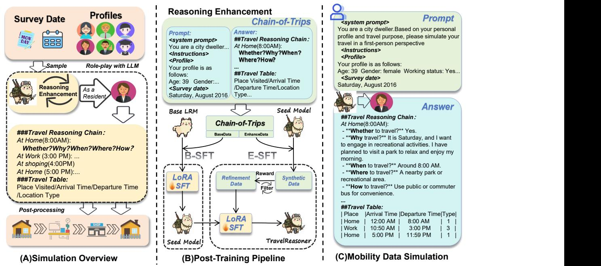
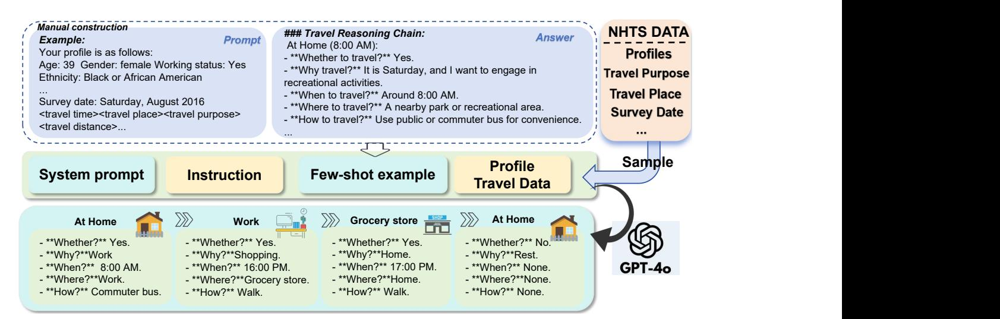

# TravelReasoner: Leveraging Large Reasoning Models to Address Mobility Data Gap

Peijie Liu Department of Electronic Engineering BNRist, Tsinghua University Beijing, China liupj23@mails.tsinghua.edu.cn

Fengli Xu∗

Department of Electronic Engineering BNRist, Tsinghua University Beijing, China fenglixu@tsinghua.edu.cn

Yong Li

Department of Electronic Engineering BNRist, Tsinghua University Beijing, China liyong07@tsinghua.edu.cn

# Abstract

Web-based urban platforms increasingly rely on fine-grained mobility data to support societal applications such as epidemic response, emergency management, and political mobilization. However, collecting such data remains challenging due to privacy concerns, security restrictions, low participation rates, and high acquisition costs, and the resulting datasets are often uneven across regions and population groups. We introduce TravelReasoner, a framework that leverages large reasoning models (LRMs) to generate interpretable and behaviorally coherent mobility data. We construct Chainof-Trips, a reasoning-aligned dataset derived from the National Household Travel Survey (NHTS), and develop a curriculum-based post-training pipeline to improve in-domain reasoning consistency. Experiments show that TravelReasoner outperforms strong baselines, improving location consistency by 6.8% and time consistency by 4.1%, while producing interpretable reasoning traces. Travel-Reasoner exhibits good generalization ability, adapting to diverse demographic characteristics and demonstrating strong cross-city generalization. Our findings suggest that interpretable reasoning models have significant potential to promote travel equity, enhance data-scarce urban environments, and contribute to sustainable cities and communities. [1](#page-0-0)

# CCS Concepts

- Computing methodologies → Artificial intelligence; Information systems → Information systems applications.

# Keywords

Mobility inequality, Human mobility data simulation, Large reasoning models, Interpretable AI, Transportation planning, Social equity

#### ACM Reference Format:

Peijie Liu, Fengli Xu, and Yong Li. 2026. TravelReasoner: Leveraging Large Reasoning Models to Address Mobility Data Gap. In Proceedings of the ACM Web Conference 2026 (WWW '26), April 13–17, 2026, Dubai, United Arab Emirates. ACM, New York, NY, USA, [11](#page-10-0) pages. [https://doi.org/10.1145/](https://doi.org/10.1145/3774904.3793054) [3774904.3793054](https://doi.org/10.1145/3774904.3793054)

© 2026 Copyright held by the owner/author(s). ACM ISBN 979-8-4007-2307-0/2026/04 <https://doi.org/10.1145/3774904.3793054>

# 1 Introduction

Web-based urban platforms are increasingly crucial for sustainable urban planning [\[7,](#page-8-0) [19\]](#page-8-1) and citizen engagement [\[9,](#page-8-2) [12,](#page-8-3) [13\]](#page-8-4), requiring refined mobility data to support various critical applications such as pandemic control [\[1,](#page-8-5) [45\]](#page-8-6), emergency response [\[3\]](#page-8-7), and political mobilization [\[2\]](#page-8-8). However, collecting such data faces numerous challenges. Current methods, including user tracking and web-based travel surveys [\[38\]](#page-8-9), often suffer from privacy concerns, low response rates, and high costs[\[18,](#page-8-10) [40\]](#page-8-11). Furthermore, access to such data varies across different regions and social groups, further complicating data availability [\[23\]](#page-8-12). These limitations underscore the urgent need for more flexible and data-efficient alternatives to generate more authentic, consistent, and interpretable mobility data.

Recent developments in large language models (LLMs) offer a promising direction, with growing evidence that LLMs can simulate human behaviors in diverse settings [\[10,](#page-8-13) [32,](#page-8-14) [33\]](#page-8-15). Several recent studies have explored using LLMs to generate mobility data[\[6,](#page-8-16) [20,](#page-8-17) [48\]](#page-8-18). While these approaches successfully mimic surface-level travel patterns, they often treat trips as isolated sequence elements and struggle to capture the underlying causal, motivational, and temporal reasoning behind travel choices [\[6\]](#page-8-16). As a result, the generated simulations can appear plausible on the surface yet lack behavioral realism, interpretability, and accountability—properties that are essential for deployment in Web-based civic platforms. Meanwhile, the emergence of large reasoning models (LRMs) has enabled strong performance on complex, multi-step reasoning tasks [\[46\]](#page-8-19), presenting new opportunities to build more coherent and human-aligned mobility simulations.

In this paper, we introduce TravelReasoner, a novel framework that enhances travel survey simulation by integrating the advanced reasoning capabilities of LRMs. Rather than treating trips as discrete events, we reformulate a travel chain as a chain of thought, capturing the first-person reasoning process behind each decision. To support this formulation, we construct Chain-of-Trips, a reasoningaligned dataset derived from National Household Travel Survey (NHTS) trip-chain records. Chain-of-Trips encodes the causal, motivational, and spatiotemporal structures that shape everyday travel, organized around five core questions—whether, why, when, where, and how—that reflect human decision-making. We further design a two-stage post-training pipeline that combines supervised finetuning with curriculum-guided refinement to strengthen behavioral authenticity and first-person coherence.

We evaluate TravelReasoner across multiple city-level simulation tasks and benchmark it against traditional models and state-of-theart LLM-based baselines. TravelReasoner substantially improves

∗Corresponding author.

1The code and data are available a[t https://github.com/tsinghua-fib-lab/TravelReasoner](https://github.com/tsinghua-fib-lab/TravelReasoner)

[This work is licensed under a Creative Commons Attribution 4.0 International License.](https://creativecommons.org/licenses/by/4.0) WWW '26, Dubai, United Arab Emirates.

behavioral consistency—boosting location consistency by 6.8% and time consistency by 4.1%—while generalizing robustly across geographic contexts. Importantly, the model demonstrates consistently improved simulation capabilities across different groups, while also consistently outperforming baseline models in cross-city generalization. Its interpretability and strong generalization capabilities allow for successful application to data-scarce domains. Our findings suggest that interpretable inference models have significant potential to promote mobility equity, improve data-scarce urban environments, and contribute to sustainable city and community development.

- The key contributions of this work are as follows:
- We reformulate travel survey simulation as interpretable first-person reasoning, enabling transparent and auditable mobility modeling for Web-based decision-making.
- We introduce Chain-of-Trips, a reasoning-aligned dataset constructed from NHTS trip-chain records with domain rules and human validation. It pairs real NHTS mobility trajectories with structured, first-person reasoning traces, enabling LRMs to learn human-aligned decision logic.
- We propose a curriculum-based LRM post-training pipeline that improves accuracy, strengthens reasoning coherence, and enhances cross-population and cross-city consistency in mobility simulation.
- We demonstrate TravelReasoner's value for Web-mediated mobility platforms and societal applications, particularly in supporting data-poor environments, and sustainable urban development.

# 2 Related Works

# 2.1 Human Mobility Data

Human mobility data play a central role in understanding urban dynamics and supporting applications such as epidemic monitoring, emergency response, transportation planning, and civic decisionmaking[\[37\]](#page-8-20). Traditionally, such data are collected through largescale household travel surveys [\[4,](#page-8-21) [11,](#page-8-22) [25\]](#page-8-23), GPS tracking studies, and mobile or web-based sensing. While these sources provide valuable behavioral insights, they suffer from several systemic limitations: surveys incur high monetary and administrative costs; mobilesensing data raise privacy and security concerns; and both methods often exhibit low participation rates and demographic imbalances. As a result, mobility datasets are frequently incomplete or uneven across regions and population groups, creating significant barriers for data-driven analysis.

To supplement sparse or biased data, researchers have explored modeling and simulation approaches. Early statistical methods, including Monte Carlo sampling based on household clustering [\[11,](#page-8-22) [39\]](#page-8-24) and neural-network-based synthetic population models [\[29\]](#page-8-25)—offered scalable alternatives but struggled to capture temporal dependencies and multimodal travel behaviors. Agent-based models (ABMs) simulate individual agents with specified behavioral rules [\[16,](#page-8-26) [17\]](#page-8-27), yet require extensive domain calibration and often fail to represent rare or diverse activity chains due to rule complexity.

Recently, large language models (LLMs) have emerged as a promising tool for generating synthetic mobility data [\[6,](#page-8-16) [15,](#page-8-28) [28,](#page-8-29) [41\]](#page-8-30). LLM-based methods have been shown in previous studies[\[6\]](#page-8-16) to

outperform traditional statistical methods[\[6\]](#page-8-16) in capturing complex spatiotemporal dependencies. Fine-tuned LLMs can approximate activity sequences[\[26,](#page-8-31) [27\]](#page-8-32) and generalize across cities with limited training data. However, current LLM-based mobility simulators predominantly replicate surface-level patterns and offer limited insight into the motivations, constraints, or contextual factors underlying mobility behavior. This lack of interpretability and behavioral grounding limits their applicability in Web-based mobility platforms and public-facing societal systems, where transparent, traceable, and bias-aware data generation is essential.

# 2.2 Reasoning with Large Language Models

Reasoning has emerged as a central challenge for LLMs. Although early LLMs excel at pattern completion, they often fail on tasks requiring explicit multi-step inference or decision modeling [\[31\]](#page-8-33). Techniques such as Chain-of-Thought prompting [\[22,](#page-8-34) [42\]](#page-8-35) and Interaction of Thought [\[49\]](#page-9-0) elicit structured reasoning traces[\[43,](#page-8-36) [44\]](#page-8-37) and improve factuality and coherence. Complementary efforts fine-tune models on domain-specific reasoning corpora or apply reinforcement learning with feedback to enhance alignment [\[14,](#page-8-38) [36\]](#page-8-39).

While these techniques significantly improve reasoning quality, they are rarely applied to socially grounded domains where decisions depend on personal constraints, temporal context, and sequential interdependencies—such as travel behavior. Moreover, existing reasoning-enhanced LLMs are seldom evaluated within Web-based civic infrastructures, where transparency, auditability, and fairness are prerequisites for public trust. Our work extends this line of research by developing a reasoning-augmented framework tailored to human mobility decision-making, bridging the gap between statistical accuracy and interpretable, first-person reasoning.

### 2.3 Web-based Mobility Platforms and Societal Web Systems

Web-based mobility platforms have fundamentally transformed urban travel planning and management. Key innovations range from Mobility-as-a-Service (MaaS) systems that integrate multimodal transport [\[9,](#page-8-2) [13\]](#page-8-4), to participatory GIS tools that facilitate citizen engagement—albeit with representational biases [\[5,](#page-8-40) [30\]](#page-8-41). Furthermore, urban digital twins leverage interactive visualizations to support resilience planning [\[8,](#page-8-42) [24\]](#page-8-43). Despite their utility, these systems remain heavily dependent on high-quality mobility data and face persistent challenges regarding privacy, equity, and transparency.

While computational social science has successfully leveraged digital traces (e.g., Web, mobile, and social media) to uncover largescale mobility patterns [\[21,](#page-8-44) [47\]](#page-8-45), these efforts remain predominantly descriptive rather than generative. A significant gap persists in creating interpretable, profile-aware synthetic data that addresses data scarcity while ensuring fairness. TravelReasoner fills this void by providing a transparent, reasoning-driven generative model. Designed for seamless integration into Web-based platforms, it offers accountable, bias-aware simulations to support sustainable urban planning and policy evaluation

Figure 1: Overview of the TravelReasoner framework. It consists of: (A) travel data generation based on profiles and survey dates, (B) post-training pipeline via two-stage supervised fine-tuning, and (C) first-person simulation of travel decisions.

# 3 TravelReasoner

In this section, we present TravelReasoner, a reasoning-augmented framework for mobility data simulation. We first provide an overview of the simulation process, then describe the construction of the Chain-of-Trips dataset from real NHTS data, and finally detail our two-stage training paradigm designed to enhance reasoning and improve generalization in mobility data simulation.

# 3.1 Overview

The overall design of TravelReasoner is illustrated in Figure [1.](#page-2-0) In (A), given a sampled survey date and a user profile (e.g., age, gender, employment status) from the NHTS dataset, the model is prompted to assume the role of a city resident and simulate daily travel behavior from a first-person perspective. The simulation yields two complementary outputs: (1) a Travel Reasoning Chain, which captures sequential decision-making at each time step (e.g., whether to travel, why, where, when, and how), and (2) a structured Travel Table, recording trip attributes such as location type, arrival time, and departure time. Post-processing the Travel Table reconstructs a complete activity chain, providing a realistic mobility trajectory. This design enables the model to generate not only plausible trip sequences but also interpretable reasoning aligned with human decision processes, producing mobility data suitable for urban planning, transportation modeling, and behavioral analysis.

Figure [1\(](#page-2-0)B) illustrates the two-stage pipeline designed to enhance reasoning capabilities. In the first stage, we perform supervised fine-tuning on a portion of the Chain-of-Trips dataset, enabling the model to learn structured reasoning patterns based on realworld behavior. In the second stage, we use another portion of the dataset to generate answers for the fine-tuned model in the first stage, and then select high-quality question-answer pairs for the

second stage of fine-tuning. These pairs are then used for additional fine-tuning, allowing the model to learn through self-reinforcement and encouraging it to generate logically consistent trip chains.

Figure [1\(](#page-2-0)C) presents an example after training. Given a user profile and a survey date, the model simulates detailed travel behavior from a first-person perspective. At each time point, it explicitly reasons through core behavioral questions—whether to travel, why, where, when, and how—producing natural language justifications alongside structured trip records. This demonstrates the model's ability to generate interpretable, goal-directed, and contextually grounded travel behavior. These interpretable simulations can be directly plugged into Web-based mobility dashboards and decisionsupport systems, where transparency and auditability are essential for public trust.

# 3.2 Large Reasoning Model Use

In this section, we primarily explain the necessity of using LRM. Table [1](#page-3-0) presents the results of our preliminary experimental analysis. We perform comparative experiments using both the baseline model and the semantic reasoning model in zero-shot and few-shot scenarios.

The preliminary results indicate that the reasoning model outperforms the baseline in zero-shot settings, providing strong justification for its use in subsequent experiments. In the few-shot scenario, we carefully designed three Chain-of-Thought examples to facilitate model learning through imitation. The introduction of CoT examples substantially enhances the imitation capabilities of both models, validating the construction of the Chain-of-Trip dataset for training generalization models.

These results highlight an important practical consideration. In real-world Web-based mobility platforms, user profiles are highly

Figure 2: Construction of the Chain-of-Trips dataset from NHTS data. User profiles and travel records are extracted to build structured prompts with few-shot examples. GPT-4o then generates step-by-step reasoning chains under realistic decision contexts.

|           | Model     | AverLoc | TimeCons | EditDis |
|-----------|-----------|---------|----------|---------|
| Zero-shot | Base      | 21.04   | 349.03   | 23.36   |
|           | Reasoning | 4.01    | 145.33   | 6.29    |
| Few-shot  | Base      | 2.07    | 126.61   | 3.92    |
|           | Reasoning | 2.33    | 114.99   | 4.31    |

Table 1: Experiments with the base model and reasoning model in zero-shot and few-shot scenarios. For few-shot scenarios, we manually construct chain-of-thought samples. The base model used is Llama-3.1-8B, and the reasoning model is DeepSeek-R1-Distill-Llama-8B. For metric information, please refer to Table [2](#page-5-0)

diverse, and it is unrealistic to assume the availability of tailored few-shot examples for every city, demographic group, or travel context. Therefore, we prioritize strong zero-shot performance, which enables deployment at scale without additional domain-specific prompting or per-user calibration. By internalizing domain reasoning during training, TravelReasoner generates high-quality, personalized reasoning traces in a zero-shot setting. Because Webbased mobility systems must serve highly diverse, long-tail user profiles, zero-shot generalization and transparent reasoning are essential for safe deployment. Without explicit reasoning, LLM simulators behave as correlation fitters and cannot support accountable Web-based decision-making. Therefore, we consider LRM as our experimental model.

# 3.3 Chain-of-Trips Construction

To support reasoning-augmented travel modeling, we construct Chain-of-Trips, a structured dataset derived from the NHTS. Each instance represents a single day of travel decisions from a first-person perspective, conditioned on contextual factors such as demographics, activity purposes, and temporal constraints. And the inference chains in this dataset are all based entirely on real-world travel behavior.

As shown in Figure [2,](#page-3-1) we begin by extracting user profiles and daily travel logs from the NHTS, including attributes such as age, gender, employment status, ethnicity, survey date, destinations(where), trip purposes(whether,why), travel times(when), and transportation modes(how). We organize this information into a structured prompt comprising four components: (1) a system prompt that defines the simulation objective; (2) task instructions that specify the scope of inference; (3) manually curated few-shot examples illustrating the desired reasoning structure; and (4) the target user profile with contextual details. These few-shot examples, selected from real NHTS patterns, are essential for guiding the generation of interpretable, multi-step decision trajectories. Full prompt details are provided in Appendix [A.2](#page-9-1) to enable reproducibility.

Using this prompt design, GPT-4o reconstructs each real NHTS trip chain in a first-person reasoning format. Given the factual attributes—user profile, departure and arrival times, destinations, trip purposes, and travel modes—the model rewrites each record into a structured Travel Reasoning Chain that explicitly explains the observed decisions (whether to travel, why, where, when, and how). In other words, GPT4o only serves to reconstruct real data; the inference chain is constructed from real data, ensuring the reliability of the inference. In parallel, it transforms the same factual attributes into a normalized Travel Table. Each dataset instance is represented as a triplet (��, ��, ��), where �� contains the system prompt, task instruction, and user profile; �� is a fact-aligned reasoning reconstruction; and �� is the corresponding structured table derived from the same ground-truth data.

By pairing real NHTS trajectories with first-person reasoning reflections on those trajectories, the Chain-of-Trips dataset enables TravelReasoner to learn both the behavioral patterns and the underlying decision logic of human travel. This dual-format representation—natural language reasoning combined with structured records—provides a rich, high-fidelity supervision signal that

grounds LRM reasoning in real-world mobility behavior. In summary, while the reasoning process for our Chain-of-Trip dataset is generated, it is strictly constrained by real physical constraints (real NHTS trajectories), thus reflecting real human decision-making.

#### 3.4 Post-training Pipeline

To enhance the model's ability to simulate human-like travel reasoning, we employ a two-stage training pipeline combined with LoRA [\[14\]](#page-8-38), a parameter-efficient adaptive method. In the first stage, we fine-tune the model using Chain-of-Trips data to enhance its structured reasoning capabilities. In the second stage, we applied self-learning to improve the model's inference stability and further enhance its inference quality.

3.4.1 Supervised Fine-tuning. We fine-tune the model on the Chainof-Trips dataset using LoRA, which freezes the pretrained weights and introduces a pair of trainable low-rank matrices into each target layer. Formally, instead of updating the full weight matrix ��0 ∈ R ��×�� , LoRA parameterizes the weight update as:

Δ�� = ����, �� ∈ R ��×�� , �� ∈ R ��×�� , �� ≪ min(��, ��), (1)

where �� is the low-rank dimension. The effective weight becomes �� = ��0 + �� , while only �� and �� are trainable. This design enables efficient fine-tuning with orders-of-magnitude fewer trainable parameters compared to full-parameter updates.

Each training instance is represented as a triplet (��, ��, ��), where �� is the prompt, �� the reasoning chain, and �� the structured answer table. We concatenate (��, ��, ��) as the target output and optimize the standard auto-regressive language modeling objective:

LSFT = − ∑︁�� ��=1 log ���� (���� | ��<�� , ��), (2)

where ���� denotes the ��-th token in the combined target (��, ��), and �� are the LoRA-augmented model parameters.

3.4.2 Two-stage training pipeline. We propose a two-stage training pipeline that incorporates the principles of curriculum learning, consisting of a Base Supervised Fine-Tuning (B-SFT) stage and an Enhanced SFT (E-SFT) stage.

In the B-SFT stage, we fine-tune the LRM using a portion of the Chain-of-Trips dataset, enabling it to grasp the fundamental paradigms and preliminary reasoning capabilities of the domain task, thereby constructing a baseline model.

In the E-SFT stage, we design an iterative self-optimization process to enhance the model's performance further. First, we use the LRM obtained in the B-SFT stage to generate a large number of candidate samples. Then, through manual screening and high-quality data curation (human-in-the-loop curation), our screening metric is shown in Equation [3.](#page-4-0) We screen the top 20% of question-answer pairs in the answers to construct a small, high-quality "golden" dataset. Finally, we use this refined dataset for a second round of fine-tuning, resulting in the final reasoning model, TravelReasoner.

Reward = �� · exp − AverLoc + �� · exp − −TimeCons �� + �� · exp − EditDist �� (3)

Where AverLoc represents the Mean Absolute Error (MAE) between the generated chain and the actual chain, TimeCons represents the Root Mean Square Error (RMSE) between the generated stay time and the actual time, EditDist represents the edit distance between the generated chain and the actual chain. ��, ��, and �� are the indicator weights, and ��, ��, and �� are the scaling factors. Here, we use �� = 0.2, �� = 0.4, �� = 0.4, �� = 2, �� = 60, and �� = 2. (Parameters were determined empirically based on the scale of error metrics on a validation set.)

Our E-SFT approach preserves the core benefits of reinforcement learning—reward-guided improvement and iterative refinement—while avoiding the well-known instability and variance issues associated with RL. Importantly, RL methods impose significant computational and energy demands, making them less suitable for Web-based civic platforms and resource-constrained deployment environments. By retaining an SFT objective and employing a lightweight, reward-informed self-training loop, E-SFT achieves stable, efficient, and energy-conscious learning that better fits the needs of practical, Web-scale societal applications.

In summary, the B-SFT stage explicitly teaches a domain-specific hierarchical chain of thought, covering whether to travel, why to travel, when, where, and how. This supervision captures behavioral semantics that generic CoT signals lack. The E-SFT stage further refines model reasoning by combining model-generated samples, a domain-informed reward function, and human-in-the-loop curation, producing a more precise learning signal aligned with the requirements of behavioral realism and fairness in travel simulation. Through this design, TravelReasoner acquires coherent, humanlike reasoning patterns that substantially enhance its simulation quality.

# 4 Experimental Setup

# 4.1 Dataset

Data source. We base our study on the 2017 NHTS Trip Chaining Dataset[2](#page-4-1) , a large-scale survey conducted by the U.S. Federal Highway Administration. The dataset provides comprehensive, real-world records of individual travel behavior, including triplevel information such as departure and arrival times, trip purposes, and visited locations, as well as detailed sociodemographic profiles of participants (e.g., age, gender, race, education level, employment status, and household income).

Data Construction. For our purposes, the NHTS data serves two roles. First, it provides the foundation for constructing the Chain-of-Trips dataset, where individual travel trajectories are reformulated into structured prompts and reasoning chains. Second, it supports evaluation, allowing us to benchmark the plausibility and coherence of simulated outputs against realistic human travel behavior. We partition the dataset into training and test splits based on the combination of individual × date, ensuring that no person-day appears in both sets and preventing any leakage of behavioral patterns across splits. For cross-city generalization, all test cities are selected such that they do not overlap with those used for training, allowing us to evaluate the model's ability to transfer to entirely unseen urban contexts.

2<https://nhts.ornl.gov/>

Dataset Quality. For the NHTS data, we first apply an initial filtering step by removing trip records containing fewer than three or more than ten locations within a day, and by discarding sequences with invalid patterns such as three consecutive identical locations. To construct the Chain-of-Trips dataset, we then combine curated system prompts, task instructions, few-shot examples, and user profiles (details provided in Appendix A.2). Using this structured prompt design, we employ the advanced closed-source model GPT-4o to generate first-person travel reasoning chains aligned with real-world trip records. These quality-control steps ensure that the resulting dataset maintains behavioral coherence and is suitable for reasoning-oriented model training.

# 4.2 Implementation Details

We utilize DeepSeek-R1-Distill-Llama-8B as our experimental model, setting the temperature to 0.6 and top-p to 1. In line with the configurations in SigSpatial [\[6\]](#page-8-16), we restrict travel locations to 20 categories. Our experiments leverage real-world NHTS data and carefully curated question-answer pairs, conducted across four cities(San Francisco, San Diego, Austin, Atlanta). During the B-SFT phase, we fine-tune the model using Low-Rank Adaptation with the Adam optimizer, a learning rate of 1e-4, and 2000 training samples. In the E-SFT phase, we used the inference outputs of the model trained in phase 1 on an additional 1,000 training examples and selected 200 high-quality inference data points for this phase of training. More details can be found in Appendix [A.1.](#page-9-2)

### 4.3 Baselines

We used the following methods as baselines. These methods leverage the LLM's ability to process and reason about complex, semantically rich data to generate and predict mobility behaviors. These methods are more flexible and adaptable, and can handle a variety of tasks by combining human-like reasoning and contextual understanding, such as V-LRM(vanilla LRM), LRM-CoT[\[42\]](#page-8-35), Bhandari24[\[6\]](#page-8-16), CoPB[\[35\]](#page-8-46), and LLMob[\[15\]](#page-8-28).

- V-LRM: Represents a vanilla LRM, an untrained version of the model that has not yet undergone any specialized training or fine-tuning.
- LRM-CoT: Utilizes large language models to simulate mobility, enhancing the generation of mobility intentions by incrementally breaking down reasoning processes.
- Bhandari24: A model focused on spatially-augmented generation, which incorporates geographic factors and personal preferences to simulate mobility behavior.
- CoPB: A workflow that integrates the Theory of Planned Behavior into mobility behavior generation, incorporating attitudes, subjective norms, and perceived behavioral control to improve the accuracy of mobility predictions.
- LLMob: An LLM agent framework that accounts for individual activity patterns and motivations, employing a selfconsistency approach to align LLMs with real-world activity data, and a retrieval-augmented strategy for interpretable activity generation.

### 4.4 Evaluation Metrics

To comprehensively evaluate the quality of simulated travel behavior, we adopt three complementary metrics. These metrics assess accuracy at the trip level, temporal consistency, and sequence-level similarity. Together, they provide a holistic evaluation of both individual trajectories and aggregated mobility patterns. See Table [2](#page-5-0) for a detailed description of the metrics.

Table 2: Detailed description of the evaluation metric.

Specifically, ˆℓ�� and ℓ�� denote the predicted and ground-truth location categories, respectively. ��ˆ �� and ���� represent predicted and actual stay durations. Finally, ��ˆ�� and ���� are the predicted and ground-truth location sequences, and Lev(·) denotes the Levenshtein distance.

# 5 Results and Analysis

# 5.1 Main results

In this section, we present the key experimental results of Travel-Reasoner and compare its performance with well-known baselines, including V-LRM, LRM-CoT, CoPB, LLMob, and Bhandari24, using the AverLoc, TimeCons, and EdiDis metrics.

|                | AverLoc | San Francisco   | TimeConsEditDis | AverLoc | San Diego       | TimeConsEditDis |
|----------------|---------|-----------------|-----------------|---------|-----------------|-----------------|
| V-LRM          | 4.01    | 145.33          | 6.29            | 4.08    | 156.39          | 6.22            |
| LRM-CoT        | 3.69    | 147.60          | 5.95            | 3.94    | 151.80          | 6.06            |
| CoPB           | 2.79    | 140.04          | 5.14            | 2.81    | 130.12          | 5.40            |
| LLMob          | 2.74    | 131.22          | 5.09            | 2.80    | 128.02          | 5.02            |
| Bhandari24     | 1.91    | 96.40           | 3.17            | 1.94    | 97.62           | 3.06            |
| TravelReasoner | 1.85    | 91.88           | 2.84            | 1.90    | 89.90           | 2.85            |
|                |         | Atlanta         |                 |         | Austin          |                 |
|                | AverLoc | TimeConsEditDis |                 | AverLoc | TimeConsEditDis |                 |
| V-LRM          | 3.92    | 133.76          | 5.98            | 4.98    | 154.24          | 7.12            |
| LRM-CoT        | 3.38    | 138.93          | 5.51            | 3.76    | 141.58          | 5.90            |
| CoPB           | 2.74    | 135.04          | 4.96            | 3.84    | 124.29          | 5.14            |
| LLMob          | 2.87    | 136.33          | 5.09            | 2.81    | 137.24          | 5.06            |
| Bhandari24     | 1.81    | 93.79           | 2.76            | 1.75    | 92.11           | 2.85            |
| TravelReasoner | 1.77    | 88.38           | 2.65            | 1.77    | 90.09           | 2.71            |

Table 3: Performance comparison of TravelReasoner with the baseline model on the San Francisco, San Diego, Atlanta, and Austin datasets. Bold indicates the best result, and underlined indicates the second-best result. V-LRM represents a vanilla LRM, an untrained LRM.

The results, presented in Tables [3,](#page-5-1) demonstrate that TravelReasoner consistently achieved either the best or second-best performance across all evaluation metrics. For instance, on the San Francisco dataset, TravelReasoner recorded an AverLoc of 1.85, outperforming the strong baseline Bhandari24 (1.91). Furthermore, it achieved the best results in terms of temporal consistency (Time-Cons = 91.88) and sequence edit distance (EditDis = 2.84). Similarly, across datasets from three additional cities, TravelReasoner outperformed all other methods, highlighting its robustness in diverse urban contexts. These findings underscore that TravelReasoner not only generates accurate trip sequences but also preserves high temporal rationality and behavioral consistency, thereby validating the efficacy of our reasoning-enhanced approach in travel simulation. On average, TravelReasoner improves location consistency by 6.8% and time consistency by 4.1% compared to the strongest baseline.

# 5.2 Cross-population Generalization

Beyond the overall performance, we evaluate TravelReasoner across different demographic groups in the San Francisco dataset, including age, gender, and income categories. Table [4](#page-6-0) presents a performance comparison between TravelReasoner and other baseline models on the San Francisco dataset, stratified by demographic groups, including gender (male vs. female), age (younger than 40 years vs. 40 years and older), and income (low income: household annual per capita income below \$40,000; high income: household annual per capita income above \$40,000). As shown in Table [4,](#page-6-0) the model achieves highly consistent results across demographic segments, demonstrating robust performance for diverse user populations. For instance, TravelReasoner attains AverLoc scores of 1.77/1.93 for male and female users, and 1.69/1.93 for younger (under 40) and older (40 and above) groups. Similarly, the model performs comparably in low-income and high-income groups, with AverLoc results of 1.73/1.93 and 1.77/1.94, respectively.

Across all metrics—spatial accuracy (AverLoc), temporal coherence (TimeCons), and activity-chain similarity (EditDis), Travel-Reasoner either matches or outperforms the strongest baseline, Bhandari24. These findings show that the model does not rely on demographic-specific patterns or group-specific tuning; instead, it captures domain reasoning structures that generalize across population subgroups.

Notably, the performance gap between demographic groups is smaller than that of baseline models. This suggests that explicit reasoning supervision helps the model internalize behavioral patterns that are stable across user types, resulting in more uniform predictive performance. Such cross-population consistency is particularly important for Web-based mobility systems, where user diversity is high, and mobility data are often scarce or unevenly distributed across social groups.

# 5.3 Cross-city Generalization

To validate the model's cross-domain generalization, we use data from four cities (San Francisco, Austin, San Diego, and Atlanta) for training and test it on Dallas-Fort Worth and Los Angeles (see Table [5\)](#page-6-1).

Experimental results show that TravelReasoner maintains its strong performance in novel cities, maintaining its lead over other

|                | AverLoc | Male            | TimeConsEditDis | AverLoc | Female          | TimeConsEditDis |
|----------------|---------|-----------------|-----------------|---------|-----------------|-----------------|
| V-LRM          | 4.12    | 149.1           | 6.28            | 3.91    | 141.72          | 6.31            |
| LRM-CoT        | 3.65    | 147.96          | 5.83            | 3.74    | 147.25          | 6.08            |
| CoPB           | 2.91    | 120.13          | 5.22            | 2.54    | 136.90          | 5.02            |
| LLMob          | 2.93    | 127.08          | 5.17            | 2.56    | 135.39          | 5.02            |
| Bhandari24     | 1.94    | 96.21           | 3.21            | 1.87    | 96.58           | 3.14            |
| TravelReasoner | 1.77    | 88.43           | 2.72            | 1.93    | 95.19           | 2.96            |
|                |         | Younger         |                 |         | Older           |                 |
|                | AverLoc | TimeConsEditDis |                 | AverLoc | TimeConsEditDis |                 |
| V-LRM          | 3.52    | 146.67          | 5.58            | 4.37    | 144.37          | 6.81            |
| LRM-CoT        | 2.91    | 147.24          | 5.00            | 4.25    | 147.86          | 6.64            |
| CoPB           | 2.41    | 150.24          | 5.20            | 4.52    | 150.22          | 6.06            |
| LLMob          | 2.94    | 134.76          | 5.13            | 2.61    | 128.86          | 5.07            |
| Bhandari24     | 1.90    | 99.29           | 3.07            | 1.91    | 94.33           | 3.25            |
| TravelReasoner | 1.73    | 94.76           | 2.71            | 1.93    | 89.82           | 2.94            |
|                |         | Low-income      |                 |         | High-income     |                 |
|                | AverLoc | TimeConsEditDis |                 | AverLoc | TimeConsEditDis |                 |
| V-LRM          | 3.36    | 139.56          | 5.53            | 4.74    | 153.48          | 7.15            |
| LRM-CoT        | 4.06    | 145.18          | 6.2             | 3.41    | 153.27          | 5.80            |
| CoPB           | 4.76    | 146.20          | 4.09            | 3.61    | 145.85          | 6.08            |
| LLMob          | 2.83    | 128.54          | 5.10            | 2.66    | 135.03          | 5.09            |
| Bhandari24     | 1.80    | 91.65           | 2.98            | 2.02    | 102.57          | 3.40            |
| TravelReasoner | 1.77    | 90.14           | 2.68            | 1.94    | 95.19           | 3.02            |

Table 4: Performance comparison of TravelReasoner and baseline models on different groups on the San Francisco dataset. Bold indicates the best result, and underlined indicates the second-best result. v-LRM represents a vanilla LRM, an untrained LRM.

|                | AverLoc | Dallas-Fort | Worth TimeConsEditDis | AverLoc | Los Angeles | TimeConsEditDis |
|----------------|---------|-------------|-----------------------|---------|-------------|-----------------|
| V-LRM          | 3.93    | 143.65      | 6.13                  | 4.03    | 142.21      | 6.21            |
| LRM-CoT        | 3.97    | 137.28      | 6.12                  | 4.16    | 144.19      | 6.32            |
| CoPB           | 2.49    | 141.60      | 5.10                  | 3.54    | 143.18      | 4.88            |
| LLMob          | 2.97    | 130.91      | 5.27                  | 6.13    | 189.60      | 8.38            |
| Bhandari24     | 1.95    | 89.70       | 2.93                  | 1.91    | 102.08      | 3.12            |
| TravelReasoner | 1.87    | 82.99       | 2.67                  | 1.85    | 94.50       | 2.79            |

Table 5: Our method generalizes to other cities. We train it using travel data from four cities (San Francisco, Austin, San Diego, Atlanta) and evaluate it using data from Dallas-Fort Worth and Los Angeles.

baselines in AverLoc and EditDis. For example, on the Dallas–Fort Worth dataset, TravelReasoner achieved an AverLoc score of 1.87 and an EditDis score of 2.67, both outperforming Bhandari24 (1.95/2.93). It also achieved the best results on the Los Angeles dataset (AverLoc = 1.85, EditDis = 2.79), with significant improvements in temporal consistency. This shows that the model can not only learn reasonable travel patterns in the training city, but also be transferred to unseen urban scenes, showing good cross-domain generalization

ability. This ability is crucial for real-world travel simulation because practical applications often require the transfer of models between different cities without the need for a large amount of local annotated data.

# 5.4 Ablation Studies

To further assess the contribution of each module in our approach, we conducted ablation experiments using datasets from San Francisco and San Diego (see Table [6\)](#page-7-0).

Compared to V-LRM, the inclusion of B-SFT resulted in significant improvements across all evaluation metrics, highlighting the crucial role of supervised fine-tuning in learning fundamental reasoning patterns. The introduction of E-SFT, based on a self-learning paradigm, further enhances model performance, demonstrating that the enhanced fine-tuning stage improves reasoning consistency and behavioral rationality through the incorporation of high-quality, human-curated samples. Overall, the two-stage training pipeline is synergistic, with both stages being indispensable.

|                | AverLoc | San Francisco   | TimeConsEditDis | AverLoc | San Diego       | TimeConsEditDis |
|----------------|---------|-----------------|-----------------|---------|-----------------|-----------------|
| V-LRM          | 4.01    | 145.33          | 6.30            | 4.08    | 156.39          | 6.22            |
| TR(w/o E-SFT)  | 1.89    | 100.12          | 3.27            | 1.89    | 97.24           | 3.21            |
| TravelReasoner | 1.85    | 91.88           | 2.84            | 1.90    | 89.90           | 2.85            |
|                |         | Atlanta         |                 |         | Austin          |                 |
|                | AverLoc | TimeConsEditDis |                 | AverLoc | TimeConsEditDis |                 |
| V-LRM          | 3.92    | 133.76          | 5.98            | 4.98    | 154.24          | 7.12            |
| TR(w/o E-SFT)  | 1.75    | 100.02          | 3.02            | 1.83    | 96.12           | 3.10            |
| TravelReasoner | 1.77    | 88.38           | 2.65            | 1.77    | 90.09           | 2.71            |

Table 6: This table shows the results of ablation experiments in San Francisco, San Diego, Austin, and Atlanta. V-LRM represents a vanilla LRM, an untrained LRM.

# 6 Discussion

TravelReasoner is designed not only as a methodological contribution, but also as a practical component for Web-based mobility systems. Its transparent reasoning structure and demographic robustness make it particularly well-suited for civic technologies, online planning tools, and data-driven policy interfaces.

Deployment in Web-based civic platforms. Modern mobility planning increasingly relies on Web-based dashboards, urban digital twins, and participatory platforms that allow planners, policymakers, and the public to explore mobility patterns. TravelReasoner can be integrated into these systems to simulate group-level or city-wide travel distributions and support interactive exploration of travel behavior under different demographic profiles. Because the model outputs both structured activity tables and interpretable reasoning chains, it enables stakeholders to inspect not only what the model predicts but also why those predictions arise.

Interpretability and Generalization. TravelReasoner provides transparent reasoning traces that clarify how simulated travel decisions are formed, enabling behavioral inspection and improving the trustworthiness of mobility analysis. At the same time, the model exhibits strong generalization consistency across demographic groups

and across cities, indicating that it learns mobility reasoning patterns that transfer beyond specific populations or regions. This combination of interpretable decision pathways and stable crosspopulation performance makes TravelReasoner well-suited for deployment in Web-based mobility platforms.

Efficiency and sustainability. Efficient model deployment is crucial for practical applications.[\[34\]](#page-8-47) TravelReasoner is built using distilled models, LoRA-based adaptation, and supervised self-training rather than computationally intensive reinforcement learning. This design substantially reduces training and deployment costs, making the framework more compatible with resource-constrained environments such as municipal planning agencies or civic tech platforms.

Limitations and future directions. TravelReasoner currently simulates travel decisions without incorporating real-time Web signals such as live traffic, public transit disruptions, or social media events, which could further enhance realism in dynamic settings. Addressing these limitations—through open-source reasoning datasets, expanded evaluation metrics, and integration with real-time Web data—presents promising directions for future research.

Overall, TravelReasoner demonstrates how interpretable, fair, and resource-efficient reasoning models can support responsible mobility planning and strengthen the societal value of Web-based urban systems.

# 7 Conclusion

In this work, we introduce TravelReasoner, a reasoning-augmented framework for mobility data simulation that leverages the structured inference capabilities of large reasoning models. By grounding simulation in the Chain-of-Trips dataset—constructed from real NHTS trip records and enriched with first-person reasoning—our approach enables models to learn coherent and human-aligned decision-making patterns. The proposed curriculum-based posttraining pipeline further improves reasoning quality and strengthens behavioral plausibility.

Empirical results show that TravelReasoner consistently outperforms strong baselines, improving location consistency by 6.8% and time consistency by 4.1%, while generating interpretable reasoning traces that clarify the motivations and constraints behind simulated travel decisions. The model also exhibits stable performance across demographic groups and robust cross-city generalization, indicating that it captures mobility reasoning patterns that transfer across diverse populations and urban contexts.

By combining interpretable decision pathways with strong generalization ability, TravelReasoner offers a practical and responsible solution for addressing mobility data gaps, particularly in regions or groups where data are scarce. We believe that reasoning-enhanced models provide a promising direction for building transparent and reliable mobility simulation tools in real-world urban applications.

# Acknowledgments

This work is supported in part by the National Key Research and Development Program of China (No. 2024YFC3307605) and the Tsinghua University-Toyota Joint Research Institute Cross-disciplinary Project.

References [1] [n. d.]. [https://www.who.int/.](https://www.who.int/) Accessed: 2025-12-01. [2] [n. d.]. [https://carto.com/blog/map-attendance-us-protests-2017-count-love.](https://carto.com/blog/map-attendance-us-protests-2017-count-love) Accessed: 2025-12-01. [3] [n. d.]. Ushahidi — Crowdsourcing solutions to empower communities. [https:](https://www.ushahidi.com/) [//www.ushahidi.com/.](https://www.ushahidi.com/) Accessed: 2025-12-01. [4] Federal Highway Administration. 2017. National Household Travel Survey. https://nhts.ornl.gov. [5] Mohammad Anwar Alattar, Caitlin Cottrill, and Mark Beecroft. 2021. Public participation geographic information system (PPGIS) as a method for active travel data acquisition. Journal of Transport Geography 96 (2021), 103180. [6] Prabin Bhandari, Antonios Anastasopoulos, and Dieter Pfoser. 2024. Urban mobility assessment using llms. In Proceedings of the 32nd ACM International Conference on Advances in Geographic Information Systems. 67–79. [7] Silvia Blasi, Edoardo Gobbo, and Silvia R Sedita. 2022. Smart cities and citizen engagement: Evidence from Twitter data analysis on Italian municipalities. Journal of Urban Management 11, 2 (2022), 153–165. [8] Marianna Charitonidou. 2022. Urban scale digital twins in data-driven society: Challenging digital universalism in urban planning decision-making. International Journal of Architectural Computing 20, 2 (2022), 238–253. [9] Carlos Oliveira Cruz and Joaquim Miranda Sarmento. 2020. "Mobility as a service" platforms: A critical path towards increasing the sustainability of transportation systems. Sustainability 12, 16 (2020), 6368. [10] Chen Gao, Xiaochong Lan, Nian Li, Yuan Yuan, Jingtao Ding, Zhilun Zhou, Fengli Xu, and Yong Li. 2024. Large language models empowered agent-based modeling and simulation: A survey and perspectives. Humanities and Social Sciences Communications 11, 1 (2024), 1–24. [11] Stephen P Greaves and Peter R Stopher. 2000. Creating a synthetic household travel and activity survey: Rationale and feasibility analysis. Transportation Research Record 1706, 1 (2000), 82–91. [12] Susan Handy. 1996. Methodologies for exploring the link between urban form and travel behavior. Transportation Research Part D: Transport and Environment 1, 2 (1996), 151–165. [13] Chinh Q Ho and Alejandro Tirachini. 2024. Mobility-as-a-Service and the role of multimodality in the sustainability of urban mobility in developing and developed countries. Transport Policy 145 (2024), 161–176. [14] Edward J Hu, Yelong Shen, Phillip Wallis, Zeyuan Allen-Zhu, Yuanzhi Li, Shean Wang, Lu Wang, Weizhu Chen, et al. 2022. Lora: Low-rank adaptation of large language models. ICLR 1, 2 (2022), 3. [15] WANG JIAWEI, Renhe Jiang, Chuang Yang, Zengqing Wu, Ryosuke Shibasaki, Noboru Koshizuka, Chuan Xiao, et al. 2024. Large language models as urban residents: An llm agent framework for personal mobility generation. Advances in Neural Information Processing Systems 37 (2024), 124547–124574. [16] Joon-Seok Kim, Hyunjee Jin, Hamdi Kavak, Ovi Chris Rouly, Andrew Crooks, Dieter Pfoser, Carola Wenk, and Andreas Züfle. 2020. Location-based social network data generation based on patterns of life. In 2020 21st IEEE International Conference on Mobile Data Management (MDM). IEEE, 158–167. [17] Joon-Seok Kim, Hamdi Kavak, Umar Manzoor, Andrew Crooks, Dieter Pfoser, Carola Wenk, and Andreas Züfle. 2019. Simulating urban patterns of life: A geosocial data generation framework. In Proceedings of the 27th ACM SIGSPATIAL international conference on advances in geographic information systems. 576–579. [18] Nitin Kohli, Emily Aiken, and Joshua E Blumenstock. 2024. Privacy guarantees for personal mobility data in humanitarian response. Scientific Reports 14, 1 (2024), 28565. [19] Rama Krishna Reddy Kummitha. 2025. Smart city governance: assessing modes of active citizen engagement. Regional Studies 59, 1 (2025), 2399262. [20] Xuchuan Li, Fei Huang, Jianrong Lv, Zhixiong Xiao, Guolong Li, and Yang Yue. 2024. Be more real: Travel diary generation using llm agents and individual profiles. arXiv preprint arXiv:2407.18932 (2024). [21] Xiao Li, Haowen Xu, Xiao Huang, Chenxiao Guo, Yuhao Kang, and Xinyue Ye. 2021. Emerging geo-data sources to reveal human mobility dynamics during COVID-19 pandemic: Opportunities and challenges. Computational Urban Science 1, 1 (2021), 22. [22] Peijie Liu, Fengli Xu, and Yong Li. 2025. Token Signature: Predicting Chain-of-Thought Gains with Token Decoding Feature in Large Language Models. arXiv preprint arXiv:2506.06008 (2025). [23] Zhengying Liu, Pengjun Zhao, Qiyang Liu, Zhangyuan He, and Tingting Kang. 2023. Uncovering spatial and social gaps in rural mobility via mobile phone big data. Scientific Reports 13, 1 (2023), 6469. [24] Junjie Luo, Pengyuan Liu, Xinya Kong, Junru Shen, Qiaoqiao Wu, and Da Xu. 2025. Urban digital twins for citizen-centric planning: A systematic review of built environment perception and public participation. International Journal of Applied Earth Observation and Geoinformation 143 (2025), 104746. [25] Jeremy Wade Mattson. 2012. Travel behavior and mobility of transportationdisadvantaged populations: Evidence from the National Household Travel Survey. Technical Report. Upper Great Plains Transportation Institute Fargo, ND, USA. [26] Fanjin Meng, Jingtao Ding, Jiahui Gong, Chen Yang, Hong Chen, Zuojian Wang, Haisheng Lu, and Yong Li. 2025. Tuning Language Models for Robust Prediction of Diverse User Behaviors. arXiv preprint arXiv:2505.17682 (2025). [27] Fanjin Meng, Jingtao Ding, Nian Li, Yizhou Sun, and Yong Li. [n. d.]. LLMs Reading the Rhythms of Daily Life: Aligned Understanding for Behavior Prediction and Generation. ([n. d.]). [28] Fanjin Meng, Yuan Yuan, Jingtao Ding, Jie Feng, Chonghua Han, and Yong Li. 2025. MoveFM-R: Advancing Mobility Foundation Models via Language-driven Semantic Reasoning. arXiv preprint arXiv:2509.22403 (2025). [29] Abolfazl Kouros Mohammadian, Mahmoud Javanmardi, and Yongping Zhang. 2010. Synthetic household travel survey data simulation. Transportation Research Part C: Emerging Technologies 18, 6 (2010), 869–878. [30] Jean-Claude Baraka Munyaka, Jérôme Chenal, Pablo Txomin Harpo de Roulet, Anil Kumar Mandal, Uttam Pudasaini, and Nixon Ouku Otieno. 2023. Multi-level participatory GIS framework to assess mobility needs and transport barriers in rural areas: a case study of rural mumias east, a sub-county of kakamega, Kenya. Sustainability 15, 12 (2023), 9344. [31] Long Ouyang, Jeffrey Wu, Xu Jiang, Diogo Almeida, Carroll Wainwright, Pamela Mishkin, Chong Zhang, Sandhini Agarwal, Katarina Slama, Alex Ray, et al. 2022. Training language models to follow instructions with human feedback. Advances in neural information processing systems 35 (2022), 27730–27744. [32] Joon Sung Park, Joseph O'Brien, Carrie Jun Cai, Meredith Ringel Morris, Percy Liang, and Michael S Bernstein. 2023. Generative agents: Interactive simulacra of human behavior. In Proceedings of the 36th annual acm symposium on user interface software and technology. 1–22. [33] Jinghua Piao, Yuwei Yan, Jun Zhang, Nian Li, Junbo Yan, Xiaochong Lan, Zhihong Lu, Zhiheng Zheng, Jing Yi Wang, Di Zhou, et al. 2025. Agentsociety: Large-scale simulation of llm-driven generative agents advances understanding of human behaviors and society. arXiv preprint arXiv:2502.08691 (2025). [34] Chenyang Shao, Xinyang Liu, Yutang Lin, Fengli Xu, and Yong Li. 2025. Routeand-Reason: Scaling Large Language Model Reasoning with Reinforced Model Router. arXiv preprint arXiv:2506.05901 (2025). [35] Chenyang Shao, Fengli Xu, Bingbing Fan, Jingtao Ding, Yuan Yuan, Meng Wang, and Yong Li. 2024. Chain-of-planned-behaviour workflow elicits few-shot mobility generation in llms. arXiv preprint arXiv:2402.09836 (2024). [36] Zhihong Shao, Peiyi Wang, Qihao Zhu, Runxin Xu, Junxiao Song, Xiao Bi, Haowei Zhang, Mingchuan Zhang, YK Li, Yang Wu, et al. 2024. Deepseekmath: Pushing the limits of mathematical reasoning in open language models. arXiv preprint arXiv:2402.03300 (2024). [37] Zhi Sheng, Daisy Yuan, Jingtao Ding, and Yong Li. 2025. Unveiling the power of noise priors: Enhancing diffusion models for mobile traffic prediction. arXiv preprint arXiv:2501.13794 (2025). [38] Peter R Stopher and Stephen P Greaves. 2007. Household travel surveys: Where are we going? Transportation Research Part A: Policy and Practice 41, 5 (2007), 367–381. [39] Peter R Stopher and Graham Pointer. 2004. Monte Carlo simulation of household travel survey data with Bayesian updating. Road & Transport Research 13, 4 (2004), 22. [40] Gunnhild Beate Antonsen Svaboe, Trude Tørset, and Jardar Lohne. 2024. A comparative study of national travel surveys in six European countries. Transportation Planning and Technology 47, 3 (2024), 400–418. [41] Xinglei Wang, Meng Fang, Zichao Zeng, and Tao Cheng. 2023. Where would i go next? large language models as human mobility predictors. arXiv preprint arXiv:2308.15197 (2023). [42] Jason Wei, Xuezhi Wang, Dale Schuurmans, Maarten Bosma, Fei Xia, Ed Chi, Quoc V Le, Denny Zhou, et al. 2022. Chain-of-thought prompting elicits reasoning in large language models. Advances in neural information processing systems 35 (2022), 24824–24837. [43] Jinyang Wu, Mingkuan Feng, Shuai Zhang, Feihu Che, Zengqi Wen, Chonghua Liao, and Jianhua Tao. 2024. Beyond examples: High-level automated reasoning paradigm in in-context learning via mcts. arXiv preprint arXiv:2411.18478 (2024). [44] Jinyang Wu, Guocheng Zhai, Ruihan Jin, Jiahao Yuan, Yuhao Shen, Shuai Zhang, Zhengqi Wen, and Jianhua Tao. 2026. Atlas: Orchestrating Heterogeneous Models and Tools for Multi-Domain Complex Reasoning. arXiv preprint arXiv:2601.03872 (2026). [45] Chenfeng Xiong, Songhua Hu, Mofeng Yang, Weiyu Luo, and Lei Zhang. 2020. Mobile device data reveal the dynamics in a positive relationship between human mobility and COVID-19 infections. Proceedings of the National Academy of Sciences 117, 44 (2020), 27087–27089. [46] Fengli Xu, Qianyue Hao, Zefang Zong, Jingwei Wang, Yunke Zhang, Jingyi Wang, Xiaochong Lan, Jiahui Gong, Tianjian Ouyang, Fanjin Meng, et al. 2025. Towards large reasoning models: A survey of reinforced reasoning with large language models. arXiv preprint arXiv:2501.09686 (2025). [47] Jun Zhang, Wei Wang, Feng Xia, Yu-Ru Lin, and Hanghang Tong. 2020. Datadriven computational social science: A survey. Big Data Research 21 (2020), 100145. [48] Meijing Zhang and Ying Xu. 2025. TransMode-LLM: Feature-Informed Natural Language Modeling with Domain-Enhanced Prompting for Travel Behavior

Modeling. In Large Language Models for Scientific and Societal Advances. [49] Keyu Zhao, Fengli Xu, and Yong Li. 2025. Reason-to-Recommend: Using Interaction-of-Thought Reasoning to Enhance LLM Recommendation. arXiv preprint arXiv:2506.05069 (2025).

### A Appendix

# A.1 Implementation Details

Detailed Experimental Parameter Setting. During training and inference, we use the existing integrated Llama-factory for finetuning and Vllm for efficient inference, respectively.

Below are examples of Llama-factory fine-tuning parameters and Vllm inference parameters.

CUDA\_VISIBLE\_DEVICES=xxx llamafactory−cli train \ −−stage sft \ −−do\_train \ −−model\_name\_or\_path ./model/lora/v11/DeepSeek− R1−Distill−Llama−8B−trained \ −−dataset train\_travel\_reasoning\_data\_enhance \ −−dataset\_dir ./data \ −−template deepseekr1 \ −−finetuning\_type lora \ −−lora\_target q\_proj,v\_proj,k\_proj,o\_proj, up\_proj,down\_proj,gate\_proj \ −−lora\_rank 64 −−lora\_alpha 128 −−lora\_dropout 0.05 \ −−output\_dir ./saves/DeepSeek−R1−Distill−Llama−8 B/lora/large/sft \ −−overwrite\_output\_dir \ −−cutoff\_len 4096 \ −−preprocessing\_num\_workers 16 \ −−per\_device\_train\_batch\_size 4 \ −−per\_device\_eval\_batch\_size 2 \ −−gradient\_accumulation\_steps 4 \ −−lr\_scheduler\_type cosine \ −−logging\_steps 10 \ −−warmup\_ratio 0.03 \ −−save\_strategy steps \ −−save\_steps 200 \ −−eval\_steps 100 \ −−do\_eval \ −−eval\_strategy steps \ −−load\_best\_model\_at\_end \ −−metric\_for\_best\_model eval\_loss \ −−greater\_is\_better false \ −−learning\_rate 1e−4 \ −−num\_train\_epochs 5 \ −−val\_size 0.1 \ −−plot\_loss \ −−save\_total\_limit 3 \ −−bf16

llm = LLM(model\_name, tensor\_parallel\_size=2) sampling\_params = SamplingParams( temperature=0.6, top\_p=1, top\_k=50, max\_tokens=4096, repetition\_penalty=1.0

) response = llm.generate(prompt, sampling\_params,use\_tqdm=False)

Compute Resources. We train and infer LRM on two A100 GPUs with 80GB of RAM. Each experiment took from several minutes to several hours, depending on the number of training and test sets.

### A.2 Prompt

Construction prompt. Examples of prompts for building a process chain can be found here, [https://github.com/tsinghua-fib-lab/](https://github.com/tsinghua-fib-lab/TravelReasoner) [TravelReasoner.](https://github.com/tsinghua-fib-lab/TravelReasoner) This includes system prompt, instructions, fewshot example, and the target task.

Chain-of-Trips example. Here's a demonstration of the main question-answer pairs in the Chain-of-Trips.

You are a city dweller. Based on your personal profile and travel purpose, please simulate your travel in a first−person perspective, construct a reasoning chain (whenever you are in a place, think about your travel plan to the next place, including whether to travel? Why travel? When to travel? Where to travel? How to travel (in terms of transportation)?), your travel should follow the Instructions content, and then generate your complete travel plan table (the table shows your stay time in each place, not the travel time). The final output must follow the following table format: | Visited Places | Arrival Time | Departure Time | Place Type | |−−−−−−−−−−−−−−−−|−−−−−−−−−−−−−−|−−−−−−−−−−−−−−−−| −−−−−−−−−−−−| | [Place Name] | [HH:MM AM/PM]| [HH:MM AM/PM] | [Place Type]| Instructions: 1. If "home" is part of the travel activities on the specified date, please make sure to include it in the list. 2. The exact arrival and departure times recorded in the travel diary. 3. Enter the arrival time and departure time carefully, because a certain travel time needs to be maintained to ensure the rationality of the trip, and the arrival time of the current location is always later than the departure time of the previous location. 4. Note that in the travel plan, the difference between the departure time of the previous location and the arrival time of the current location represents the travel time, and the difference between the arrival time and departure time of a location represents the stay time at that location. 5. For [Location Type], please use only the numeric codes provided below:

Location type code:

1: Regular home activities (chores, sleep) 2: Work from home (paid) 3: Work 4: Work−related meeting/trip 5: Volunteer activities (not paid) 6: Drop off/pick up someone 7: Change type of transportation 8: Attend school as a student 9: Attend child care 10: Attend adult care 11: Buy goods(groceries, clothes, appliances, gas) 12: Buy services (dry cleaners, banking, service a car) 13: Buy meals(go out for a meal, snack, carry−out) 14: Other general errands (post office, library) 15: Recreational activities (visit parks, movies, bars, etc) 16: Exercise (go for a jog, walk, walk the dog, go to the gym, etc) 17: Visit friends or relatives 18: Health care visit (medical, dental, therapy) 19: Religious or other community activities 97: Something else Task: Your profile is as follows: Age: 77 Gender: male Ethnicity: White Education: Bachelors degree Working status: No Household annual income per capita: \$112,500 Place of residence: San Francisco Survey date: Tuesday, August 2016 Please construct a travel reasoning chain from a first−person perspective based on your portrait and travel purpose (whenever you are at each location, think about traveling to the next location, including whether to travel? Why travel? When to travel? Where to travel? How to travel (in terms of transportation)? ), your travel should follow the Instructions content, and then generate your complete travel plan (this table shows your stay time in each place, not the travel time), as follows: | Visited Places | Arrival Time | Departure Time | Place Type | |−−−−−−−−−−−−−−−−|−−−−−−−−−−−−−−|−−−−−−−−−−−−−−−−| −−−−−−−−−−−−| | [Place Name] | [HH:MM AM/PM]| [HH:MM AM/PM] | [Place Type]|

Answer:

### Travel Reasoning Chain: #### At Home (16:50 PM): − \*\*Whether to travel?\*\* Yes.

− \*\*Why travel?\*\* I need to buy groceries and essentials for the household. It is a convenient time to head out now. − \*\*When to travel?\*\* At 16:50 PM.

− \*\*Where to travel?\*\* A nearby grocery store. − \*\*How to travel?\*\* Drive a van for personal convenience and to carry purchased goods.

#### At First Shopping Location (17:20 PM):

− \*\*Whether to travel?\*\* Yes.

− \*\*Why travel?\*\* After finishing my shopping at the first location, I need to visit another store for additional items that were unavailable at the first location. − \*\*When to travel?\*\* Around 17:20 PM. − \*\*Where to travel?\*\* Another nearby store.

− \*\*How to travel?\*\* Drive the van.

#### At Second Shopping Location (17:45 PM):

− \*\*Whether to travel?\*\* Yes.

− \*\*Why travel?\*\* After completing my shopping errands, I plan to participate in volunteer activities scheduled for the evening.

− \*\*When to travel?\*\* At 17:45 PM.

− \*\*Where to travel?\*\* The volunteer activity

location.

− \*\*How to travel?\*\* Drive the van.

−−−

### Complete Travel Plan Table:

|Place Visited |Arrival Time|Departure

Time | Location Type|

|−−−−−−−−−−−−−−−−−−−−−−−−|−−−−−−−−−−−−|−−−−−−−−−−−−−−

| −−−−−−−−−−−−−|

|Home | 12:00 AM | 4:50 PM

| 1 |

|First Shopping Location | 5:05 PM | 5:20 PM

| 11 |

|Second Shopping Location| 5:35 PM | 5:45 PM

| 11 |

|Volunteer Activity | 5:50 PM | 11:59 PM

| 5 |