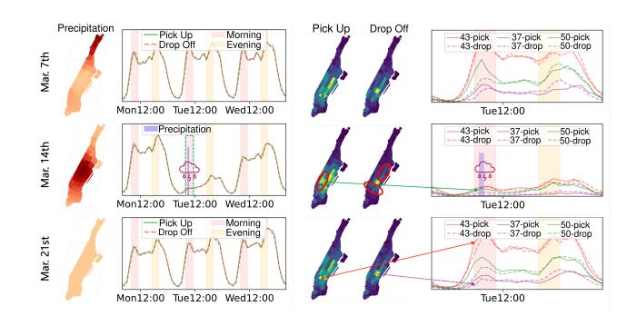
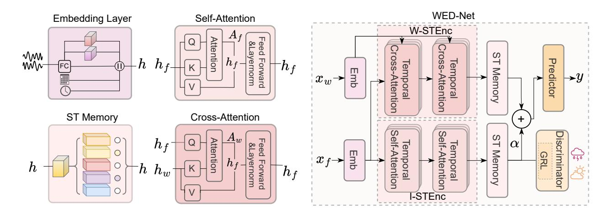
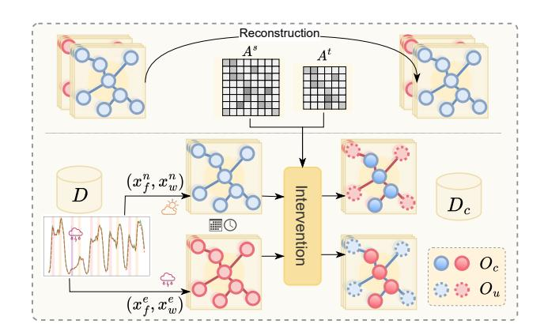
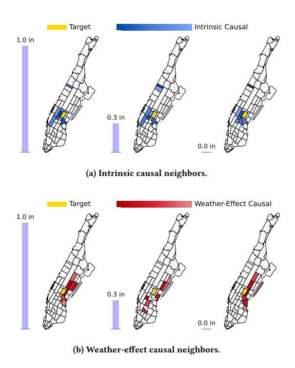
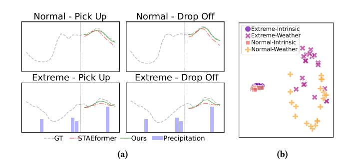
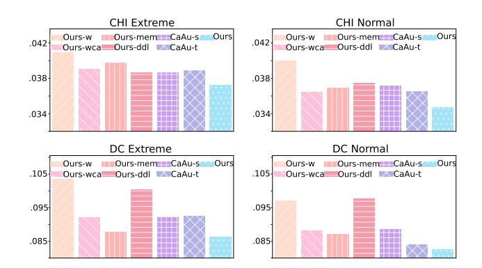
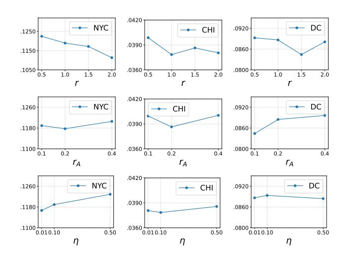

# WED-Net: A Weather-Effect Disentanglement Network with Causal Augmentation for Urban Flow Prediction

Qian Hong Gaoling School of Artificial Intelligence, Renmin University of China Beijing, China qianhong99@ruc.edu.cn

Siyuan Chang School of Statistics, Renmin University of China Beijing, China csy24@ruc.edu.cn

Xiao Zhou∗†‡ Gaoling School of Artificial Intelligence, Renmin University of China Beijing, China xiaozhou@ruc.edu.cn

#### Abstract

Urban spatio-temporal prediction under extreme conditions (e.g., heavy rain) is challenging due to event rarity and dynamics. Existing data-driven approaches that incorporate weather as auxiliary input often rely on coarse-grained descriptors and lack dedicated mechanisms to capture fine-grained spatio-temporal effects. Although recent methods adopt causal techniques to improve outof-distribution generalization, they typically overlook temporal dynamics or depend on fixed confounder stratification. To address these limitations, we propose WED-Net (Weather-Effect Disentanglement Network), a dual-branch Transformer architecture that separates intrinsic and weather-induced traffic patterns via self- and cross-attention, enhanced with memory banks and fused through adaptive gating. To further promote disentanglement, we introduce a discriminator that explicitly distinguishes weather conditions. Additionally, we design a causal data augmentation strategy that perturbs non-causal parts while preserving causal structures, enabling improved generalization under rare scenarios. Experiments on taxi-flow datasets from three cities demonstrate that WED-Net delivers robust performance under extreme weather conditions, highlighting its potential to support safer mobility, highlighting its potential to support safer mobility, disaster preparedness, and urban resilience in real-world settings. The code is publicly available at [https://github.com/HQ-LV/WED-Net.](https://github.com/HQ-LV/WED-Net)

### CCS Concepts

• Computing methodologies → Machine learning; • Information systems → Spatial-temporal systems; Data mining.

# Keywords

Traffic forecasting, Spatio-temporal models, Disaster response

#### ACM Reference Format:

Qian Hong, Siyuan Chang, and Xiao Zhou. 2026. WED-Net: A Weather-Effect Disentanglement Network with Causal Augmentation for Urban Flow

∗Corresponding authors †Also with Beijing Key Laboratory of Research on Large Models and Intelligent Governance

‡Also with Engineering Research Center of Next-Generation Intelligent Search and Recommendation, MOE

© 2026 Copyright held by the owner/author(s). ACM ISBN 979-8-4007-2307-0/2026/04 <https://doi.org/10.1145/3774904.3793059>

Prediction. In Proceedings of the ACM Web Conference 2026 (WWW '26), April 13–17, 2026, Dubai, United Arab Emirates. ACM, New York, NY, USA, [9](#page-8-0) pages. <https://doi.org/10.1145/3774904.3793059>

Figure 1: Comparison of spatio-temporal patterns of NYC taxi flow on Mar. 7th, Mar. 14th (rainstorm), and Mar. 21st.

### 1 Introduction

Urban flow prediction is a cornerstone of smart city development, as it enables the optimization of traffic management systems and long-term urban planning, supports timely emergency response and disaster management, and provides quantitative insights into underlying social and mobility dynamics. Classical deep learning models such as STGCN [\[26\]](#page-8-1), DCRNN [\[11\]](#page-8-2), Graph WaveNet [\[24\]](#page-8-3), and STAEformer [\[12\]](#page-8-4) leverage spatio-temporal graph neural networks and Transformer-based architectures to capture complex spatial correlations and temporal dependencies. By learning expressive representations of evolving traffic states, these methods have advanced applications such as route planning, travel time estimation, congestion mitigation, and reliable intelligent transportation services in dynamic urban environments.

Nevertheless, existing spatio-temporal models either completely overlook or only coarsely encode external factors such as extreme weather, large public events, and other disruptive disasters, even though these exogenous influences can drastically alter normal traffic patterns and substantially increase temporal and spatial volatility. When these factors are ignored or treated as noise, models become biased toward typical conditions, leading to inaccurate predictions and delayed responses when reliable forecasts are most needed.

To illustrate the substantial spatio-temporal variation of human mobility under different weather conditions, we examine taxi flow

[This work is licensed under a Creative Commons Attribution 4.0 International License.](https://creativecommons.org/licenses/by/4.0) WWW '26, Dubai, United Arab Emirates

in New York City (NYC) across three Tuesdays (March 7th, 14th, and 21st), as shown in Fig. [1.](#page-0-0) Light red and yellow shaded intervals indicate the morning (8:00 to 11:00 AM) and evening (5:00 to 8:00 PM) peak hours, respectively, thereby highlighting the two main commuting periods. The line plots in the left column show that the rainstorm on March 14th leads to a clear and sustained drop in total flow throughout the day, which differs noticeably from the two rain-free Tuesdays that display relatively similar and stable trajectories of overall demand. The middle column presents the spatial distributions of taxi flow during the morning peak across the three Tuesdays, and evident changes emerge in the circled regions when March 14th experienced heavy rainfall, indicating that not only the overall volume but also the spatial allocation of trips is affected. The parcel-level trends (IDs 37, 43, and 50) shown in the right-column line plots indicate that, under normal conditions, the three parcels exhibit similar temporal patterns with consistent relative magnitudes over time. However, the rainstorm disrupts this pattern, causing parcel 43's flow to drop sharply to approximately the same level as that of parcel 50.

The aforementioned classical urban flow prediction models typically overlook the spatially heterogeneous nature of weather and lack dedicated components to capture its effects in a principled manner. In many existing approaches, external weather variables are treated analogously to temporal covariates such as daily or weekly periodicity and holidays: they are incorporated as auxiliary inputs that are shared across all time steps or spatial regions and are simply concatenated with the traffic features. For example, MemeSTN and EAST-Net [\[8,](#page-8-5) [21\]](#page-8-6) construct memory banks of traffic patterns that are stratified by coarse weather-type labels (e.g., normal vs. disaster days), while MT-C2G [\[15\]](#page-8-7) addresses data imbalance by oversampling traffic samples tagged as extreme-weather cases. However, these approaches do not directly model the fine-grained weather observations and instead treat external events as coarse, qualitative labels attached to traffic data, rather than as continuously varying, spatially heterogeneous factors. As a result, their ability to capture detailed, localized impacts of weather on traffic flow remains limited. In practice, different precipitation levels and their spatially uneven distribution can influence travel behavior in markedly different ways: a sudden moderate rainfall event may temporarily increase taxi demand in specific areas as travelers switch from walking or cycling to motorized modes, whereas a well-forecasted severe storm can suppress demand throughout the day or shift peak travel period earlier or later across the city as individuals adjust their schedules, with some neighborhoods being more strongly affected than others. These nuanced, fine-grained weather effects are often overlooked, leaving models unable to capture their complex influence on traffic patterns.

Moreover, the above purely data-driven approaches often learn spurious correlations, particularly under rare external events such as heavy rainfall. As illustrated in Fig. [1,](#page-0-0) extreme weather can induce substantial shifts in both the spatial distribution and temporal evolution of traffic patterns. Because such events occur infrequently, they are severely underrepresented in the training data, which in turn leads to systematic prediction failures when they do arise [\[17,](#page-8-8) [20\]](#page-8-9). These limitations motivate our focus on robust out-of-distribution (OOD) prediction under dynamic external conditions.

In graph learning and computer vision, OOD generalization has been approached through methods [\[9,](#page-8-10) [13,](#page-8-11) [14,](#page-8-12) [27\]](#page-8-13) grounded in the principle of Invariance of Causality [\[2\]](#page-8-14), which posits that causal relationships remain stable across different environments. Recent studies in spatio-temporal learning have begun to adopt causal tools to address distribution shifts in a similar spirit [\[3,](#page-8-15) [6,](#page-8-16) [10,](#page-8-17) [18,](#page-8-18) [19\]](#page-8-19). These methods either perform data augmentation by identifying causal and non-causal regions and perturbing the latter in the input or latent space, or apply causal adjustment techniques to reduce the influence of environmental confounders. Moreover, temporal causality is often overlooked. These methods may distort underlying causal structures with poorly designed perturbations, as well as rely on fixed confounders that are ill-suited to dynamic urban traffic under changing weather.

Motivated by the above insights, we proposeWED-Net(Weather-Effect Disentanglement Network), a forecasting framework that explicitly separates intrinsic traffic patterns from weather-induced dynamics. WED-Net adopts a dual-branch Transformer architecture: I-STEnc employs spatio-temporal self-attention to capture intrinsic traffic dependencies, while W-STEnc leverages cross-attention to model fine-grained weather effects on traffic states. Both branches are equipped with memory banks that retrieve representative historical patterns and are integrated through an adaptive gating mechanism that assigns data-dependent weights to each branch. To further promote disentanglement, a Weather Discriminator is trained in an adversarial manner to encourage weather-invariant representations in the intrinsic branch. To improve robustness under rare conditions, we further propose a causality-driven augmentation strategy that perturbs non-causal parts while preserving causal ones. In contrast to prior causal augmentation methods, our approach jointly considers temporal and spatial causality and is grounded in real-world meteorological semantics, which helps maintain meaningful causal structures and enhances both interpretability and generalization under distribution shifts. Extensive experiments on three real-world city datasets show that WED-Net improves generalization under extreme weather conditions and strengthens the capacity of traffic forecasting systems to support disaster-response applications.

Our contributions are summarized as follows:

- We model fine-grained weather effects on traffic with a weather-aware spatio-temporal network that disentangles intrinsic and weather-induced patterns for robust prediction under dynamic conditions.
- We introduce a causality-driven augmentation method that perturbs non-causal parts to improve generalization under rare extreme weather scenarios.
- We validate our approach on real-world datasets from three cities, demonstrating superior performance in dynamic traffic prediction and disaster response scenarios.

# 2 Related Work

Traffic Forecasting. Capturing complex spatio-temporal dependencies is a key challenge in traffic prediction. Spatio-temporal graph models like STGCN [\[26\]](#page-8-1) and DCRNN [\[11\]](#page-8-2) combine TCN and GCN modules to model spatio-temporal features. ASTGCN [\[5\]](#page-8-20) proposes using daily and weekly periodicity to enhance temporal

modeling. To improve static modeling of predefined graph structures, models like Graph WaveNet [\[24\]](#page-8-3), MTGNN [\[23\]](#page-8-21), GTS [\[16\]](#page-8-22), and AGCRN [\[1\]](#page-8-23) learn dynamic and adaptive network structures from data. More Recently, Transformers have also become primary architecture for traffic forecasting. Models like STAEformer [\[12\]](#page-8-4) can capture adaptive spatial structures and dynamic temporal dependencies. Meanwhile, Autoformer [\[22\]](#page-8-24), and PDFormer [\[7\]](#page-8-25) focus on long sequence event prediction.

Dynamic Urban Flow Prediction. However, existing researches have not sufficiently analyzed the impact of external events (e.g., urban large-scale events, traffic accidents, extreme weather, and natural disasters) on human mobility. Quantitative empirical studies have shown that human mobility patterns under disruptions from natural disasters, such as hurricanes and earthquakes, are related to steady-state mobility patterns [\[17,](#page-8-8) [20\]](#page-8-9). Based on this discovery, recent models such as DIGC-Net [\[25\]](#page-8-26), MT-C2G [\[15\]](#page-8-7), and EAST-Net [\[21\]](#page-8-6) leverage deep models to capture the effects of external factors like events and weather on human mobility and urban traffic. However, such external factor data is sparse, and factors like weather are often treated as globally shared external factors, concatenated with traffic data before being input to the network. In reality, the impact of weather also exhibits spatio-temporal heterogeneity, which is often overlooked in existing studies.

Causal Solutions for OOD Generalization. The scarcity of traffic data under extreme weather conditions poses a typical out-ofdistribution (OOD) challenge, where spatio-temporal dependencies learned from normal scenarios fail to generalize. In graph learning and computer vision, OOD generalization is tackled by methods that leverage the invariance of causality [\[2\]](#page-8-14), which assumes that causal relationships remain stable across different environments. Models like RGCL [\[9\]](#page-8-10), iMoLD [\[27\]](#page-8-13), and FLOOD [\[13\]](#page-8-11) learn causal representations of graph by generating perturbed but consistent views. In image recognition, Mao et al. [\[14\]](#page-8-12) separate causal content from spurious background and apply causal transportability to improve robustness under distribution shifts. Recently, spatiotemporal studies like NuwaDynamics [\[19\]](#page-8-19), CaPaint [\[3\]](#page-8-15), STONE [\[18\]](#page-8-18), and STEVE [\[6\]](#page-8-16) have explored causal tools for OOD robustness. However, these methods often overlook temporal causality, rely on simplistic spatio-temporal mechanisms that may distort causal structures, and depend on fixed confounders that struggle to adapt to changing environments.

To mitigate these shortcomings, we propose a framework that disentangles intrinsic spatio-temporal traffic dependencies from weather-induced patterns with fine-grained weather modeling, and incorporates spatio-temporal causal augmentation to better capture traffic dynamics under extreme weather.

#### 3 Preliminaries

This section establishes the key concepts, notation, and the core research problem of weather-aware spatio-temporal (ST) prediction. Urban Region Graph. Given a city, we define an Urban Region Graph G (V, E, A), where nodes V represent land parcels, edges E connect adjacent parcels, and the adjacency matrix A represents the geographical distance between parcels.

Urban Flow. Given graph G and a time window ��, �� ∈ R ��×�� ×���� denotes flow data, where ���� is the number of flow features and �� = |V | is the number of spatial units.

Meteorological Data. Given G and ��, the meteorological data is denoted by �� ∈ R ��×�� ×���� , with ���� is the number of meteorological attributes, including hourly rainfall, temperature, wind velocity. Weather-Aware Spatio-Temporal Prediction. Given urban flow ����−��+1:�� and corresponding meteorological data ����−��+1:�� in the previous�� time frames, weather-aware spatio-temporal forecasting aims to infer the urban flow in the future �� ′ frames by training a model F (·) with parameters ��, which can be formulated as:

[����−��+1:�� , ����−��+1:�� ] F (· ) −→����+1:��+�� ′ . (1)

#### 4 Methodology

## 4.1 Weather-Effect Disentanglement Network

As shown in Fig. [2,](#page-3-0) WED-Net embeds raw traffic and weather inputs, then applies a two-branch architecture with I-STEnc and W-STEnc that leverage self- and cross-attention to disentangle intrinsic traffic dynamics from weather-induced variations. Each branch is enhanced with ST Memory for historical pattern retrieval, while a Weather Discriminator enforces weather-invariant intrinsic features, and Adaptive Fusion combines both branches for accurate, contextaware forecasting.

4.1.1 Embedding Layer. For raw traffic or weather data �� ∈ R �� ×�� ×�� , we first use a fully connected layer to obtain feature embeddings ��ℎ = ����(�� ). Then we project them into adaptive embeddings ������ and ������ using time-adaptive and spatial-adaptive weight matrices, respectively. To capture daily and weekly periodicity, we store the time-of-day and day-of-week features using one-hot embeddings, and use the time indices of the raw data to extract periodic representations ���� . By concatenating these embeddings, we obtain the initial hidden representation ℎ ∈ R �� ×�� ×��ℎ .

4.1.2 Intrinsic and Weather-induced ST Dependency Disentanglement. Urban traffic dynamics are governed by heterogeneous factors, primarily stemming from two sources: intrinsic spatio-temporal dependencies, such as daily commuting patterns and urban functional layouts; and external perturbations, particularly weather events like rain or snow, which can induce abrupt and localized disruptions. Existing models often entangle these factors within a unified representation, making it difficult to generalize under extreme or shifting weather conditions. To address this, we propose a structural disentanglement of these two dependencies. Specifically, we design a dual-branch module:

- The Intrinsic Spatio-Temporal Dependency Encoder (I-STEnc) employs self-attention transformer to model the internal spatio-temporal correlations within traffic data.
- The Weather-Induced Spatio-Temporal Dependency Encoder (W-STEnc) leverages cross-attention, treating traffic features as queries and weather features as keys and values, to model weather's modulation of traffic patterns.

This explicit disentanglement enables distinct representations for intrinsic and environmental dependencies, improving sensitivity to weather shifts and generalization under diverse conditions.

To preserve short-term continuity, we expand �� �� (����) with a fixedsize temporal window around ���� . All remaining time steps constitute the non-causal set �� (����).

4.2.3 Causal Intervention. After identifying causal spatial parcels and temporal steps via attention mechanisms, we perform causal augmentation by perturbing non-causal parcels and time steps. Given an extreme-condition sample (�� �� , ���� ��) and a reference (�� �� , ���� ��), we replace the traffic and weather values of �� and �� in (�� �� , ���� ��) with those from (�� �� , ���� ��). Moreover, to ensure that the substitution of non-causal parts does not disrupt the original periodic temporal patterns, (�� �� , ���� ��) is chosen to match the day type (weekday or weekend) and the hour index of (�� �� , ���� ��). We generate �� augmented samples for each extreme-condition sample, thereby transforming the original training set �� into the augmented set ���� . This preserves causal structure while varying irrelevant context, guiding the model to focus on true causal relationships.

# 5 Experiments

# 5.1 Experimental Settings

5.1.1 Datasets. We collect representative human mobility data of New York City[1](#page-5-0) , Chicago[2](#page-5-1) , and Washington DC[3](#page-5-2) to evaluate the effectiveness of our model. The taxi data includes the timestamps and location parcel IDs of pick-up and drop-off for each trip. Meteorological data[4](#page-5-3) is sourced from weather stations in each city, including hourly precipitation, wind speed, etc. Each land parcel's meteorological data is estimated through inverse-distance weighted interpolation from nearby weather stations. We align the temporal and spatial granularity of traffic and weather data for each city. Table [1](#page-5-4) presents detailed dataset statistics. The data is split into 50%/25%/25% based on chronological order for training, validation, and testing, respectively. We prioritize precipitation to define the scope of weather conditions, since rainfall has a more direct and immediate impact on road conditions and travel demand than temperature or wind. Samples with average precipitation above 0.1 inches per hour are labeled extreme rainstorm cases, while those below are treated as normal weather samples; this threshold is chosen based on the standard definition of rainfall intensity[5](#page-5-5) together with the empirical rainfall distributions of the three cities. Under this criterion, the training and test sets cover both normal and extreme weather conditions, but extreme-condition samples remain relatively scarce. We partition the test set into normal and extreme conditions for separate evaluation.

5.1.2 Baselines. To evaluate the performance of WED-Net, we compare it with widely used baselines in urban spatio-temporal traffic prediction, including spatiotemporal graph neural networks (STGCN [\[26\]](#page-8-1), DCRNN [\[11\]](#page-8-2), AGCRN [\[1\]](#page-8-23), GWNet [\[24\]](#page-8-3), GTS [\[16\]](#page-8-22), MTGNN [\[23\]](#page-8-21)), and Transformer-based models (STAEformer [\[12\]](#page-8-4)). To further validate the effectiveness of our proposed causal augmentation approach, we integrate it into above baselines and evaluate the performance gains.

Table 1: Dataset statistics.

| City | #Parcels | Time Span | Weather Condition #Trian | #Valid | #Test |
|------|----------|-----------|--------------------------|--------|-------|
| NYC  | 66       | 03/2017-  |                          |        |       |
|      |          |           | Normal                   | 1044   | 1056  |
|      |          | 10/2017   | Extreme                  | 365    | 290   |
| CHI  | 77       | 03/2017-  |                          |        |       |
|      |          |           | Normal                   | 1085   | 997   |
|      |          | 10/2017   | Extreme                  | 282    | 329   |
| DC   | 69       | 01/2017-  |                          |        |       |
|      |          |           | Normal                   | 1077   | 1038  |
|      |          | 08/2017   | Extreme                  | 353    | 384   |

5.1.3 Hyperparameter and Reproducibility. For WED-Net's embedding layer, ��ℎ uses 12 hidden features, while ������ and ������ use 18 each. The periodic time-of-day and day-of-week embeddings ���� use 12 features each. Both I-STEnc and W-STEnc contain 4 Transformer blocks with 4-head multi-head attention. To ensure fairness, all models use both traffic and weather inputs. We use batch size 128 and learning rate 1e-3 with a OneCycleLR scheduler and AdamW optimizer with weight decay 5e-4. Experiments are conducted on NVIDIA A40 GPUs with Ubuntu 20.04.6 LTS, using Python 3.9.12, PyTorch 1.13.0, and DGL 1.1.3.

### 5.2 Performance Evaluation

5.2.1 Overall Evaluation. We focus on urban flow prediction in different weather conditions. During testing, we assess the model's performance under both extreme and normal weather conditions for each city. We use historical taxi flow and weather from the past 12 time steps to predict the flow for the next 12 time steps.

As shown in Table [2,](#page-6-0) WED-Net achieves the lowest MAE and RMSE across most cities and weather conditions, indicating its superior generalization and robustness. In particular, the performance advantage is most pronounced in extreme weather, where traffic dynamics exhibit greater irregularity. The performance advantage is most pronounced under extreme weather, with improvements of 14% and 9% over the second-best model MTGNN in NYC and DC, respectively. Compared with baselines that also leverage spatiotemporal dependencies, WED-Net benefits from three architectural innovations. First, the dual-branch disentanglement module enables independent modeling of weather-sensitive and weather-invariant patterns, which avoids mutual interference and supports specialized learning. Second, the memory bank augmentation modules provide representative historical knowledge for both intrinsic and weather-induced branches, improving the model's ability to cope with rare or unseen events. Third, the adaptive fusion mechanism allows the model to dynamically adjust the influence of each branch, resulting in better responsiveness under different conditions.

In addition to architectural design, the causal augmentation strategy further enhances generalization. By perturbing the noncausal parts of flow and weather signals while preserving causally relevant ones, the model is encouraged to focus on core causal factors. As shown in the lower half of Table [2,](#page-6-0) causal augmentation benefits most models, with DCRNN improving by 25%, GTS by 8%, and STGCN, GWNNet, STAEformer, and WED-Net by around 5%, while WED-Net consistently maintains the best performance.

1www.nyc.gov/site/tlc/about/tlc-trip-record-data.page

2data.cityofchicago.org

3 opendata.dc.gov/search?q=taxi 4www.ncei.noaa.gov/maps/hourly

en.wikipedia.org/wiki/Rain

Table 2: Model performance comparison under extreme and normal weather across NYC, CHI, and DC.

| Method     | MAE    | Extreme RMSE | NYC MAE | Normal RMSE | MAE No | Extreme RMSE Augmentation | CHI MAE | Normal RMSE | MAE    | Extreme RMSE | DC MAE | Normal RMSE |
|------------|--------|--------------|---------|-------------|--------|---------------------------|---------|-------------|--------|--------------|--------|-------------|
| DCRNN      | 0.7221 | 1.0465       | 0.7351  | 1.0549      | 0.1562 | 0.7286                    | 0.1591  | 0.7284      | 0.2450 | 0.7843       | 0.2515 | 0.8003      |
| AGCRN      | 0.6732 | 0.9900       | 0.6768  | 0.9910      | 0.2118 | 1.0024                    | 0.2192  | 1.0115      | 0.2764 | 0.9287       | 0.2836 | 0.9572      |
| GTS        | 0.5317 | 0.7886       | 0.5319  | 0.7852      | 0.2252 | 0.9460                    | 0.2277  | 0.9507      | 0.2798 | 0.8873       | 0.2830 | 0.9119      |
| STGCN      | 0.3626 | 0.6121       | 0.3530  | 0.5944      | 0.1059 | 0.5183                    | 0.1028  | 0.4970      | 0.1701 | 0.5773       | 0.1655 | 0.5511      |
| GWNet      | 0.1762 | 0.3164       | 0.1716  | 0.3051      | 0.0544 | 0.2207                    | 0.0535  | 0.2125      | 0.1015 | 0.2933       | 0.0970 | 0.2738      |
| STAEformer | 0.1611 | 0.2817       | 0.1503  | 0.2619      | 0.0532 | 0.1904                    | 0.0390  | 0.1901      | 0.0976 | 0.2983       | 0.0940 | 0.2789      |
| MTGNN      | 0.1344 | 0.2494       | 0.1304  | 0.2394      | 0.0398 | 0.1639                    | 0.0370  | 0.1496      | 0.0881 | 0.2598       | 0.0848 | 0.2392      |
| WED-Net    | 0.1281 | 0.2330       | 0.1206  | 0.2121      | 0.0386 | 0.1558                    | 0.0358  | 0.1468      | 0.0871 | 0.2583       | 0.0887 | 0.2556      |
|            |        |              |         |             | Causal | Augmentation              |         |             |        |              |        |             |
| DCRNN      | 0.4388 | 0.7385       | 0.4357  | 0.7279      | 0.1131 | 0.5353                    | 0.1144  | 0.5292      | 0.2059 | 0.7320       | 0.2094 | 0.7485      |
| AGCRN      | 0.6701 | 0.9893       | 0.6766  | 0.9901      | 0.2117 | 1.0019                    | 0.2192  | 1.0110      | 0.2761 | 0.9276       | 0.2833 | 0.9561      |
| GTS        | 0.4999 | 0.7396       | 0.4964  | 0.7267      | 0.2029 | 0.8600                    | 0.2062  | 0.8661      | 0.2703 | 0.7335       | 0.2797 | 0.7751      |
| STGCN      | 0.3614 | 0.6123       | 0.3527  | 0.5977      | 0.0980 | 0.4760                    | 0.0943  | 0.4559      | 0.1636 | 0.5464       | 0.1605 | 0.5277      |
| GWNet      | 0.1750 | 0.3098       | 0.1688  | 0.2965      | 0.0501 | 0.2123                    | 0.0489  | 0.2021      | 0.0998 | 0.2902       | 0.0917 | 0.2704      |
| STAEformer | 0.1568 | 0.2861       | 0.1408  | 0.2522      | 0.0431 | 0.1680                    | 0.0400  | 0.1624      | 0.0950 | 0.2929       | 0.0910 | 0.2701      |
| MTGNN      | 0.1341 | 0.2465       | 0.1257  | 0.2241      | 0.0380 | 0.1522                    | 0.0353  | 0.1439      | 0.0920 | 0.2841       | 0.0862 | 0.2540      |
| WED-Net    | 0.1172 | 0.2087       | 0.1152  | 0.2059      | 0.0372 | 0.1541                    | 0.0347  | 0.1459      | 0.0863 | 0.2506       | 0.0825 | 0.2297      |

This suggests our disentangled design captures stable dependencies, with causal augmentation further enhancing generalization.

Overall, these results show that WED-Net effectively disentangles and fuses heterogeneous dependencies in urban flow prediction, remaining robust under normal and extreme weather.

5.2.2 Intrinsic and Weather-Effect Causal Neighbors Visualization. Fig. [4](#page-6-1) further illustrates the effectiveness of weather-effect disentanglement and causal identification method. We randomly select a target parcel ��37 (yellow) and visualize three samples at 10:00 on a Friday, each from a different date, under precipitation levels of 1.0, 0.3, and 0.0 inches per hour, respectively. Using the causal identification procedure described in Sec. [4.2.2,](#page-4-1) we plot the intrinsic causal neighbors �� ���� (��37) (blue) in Fig. [4a,](#page-6-2) and the weather-effect causal neighbors �� ���� (��37) (red) in Fig. [4b.](#page-6-3) The color intensity indicates the relative causal importance. As shown, intrinsic causal neighbors stay largely consistent across weather conditions, while weather-effect causal neighbors vary markedly with precipitation, indicating that I-STEnc and W-STEnc disentangle intrinsic dependencies from weather-induced modulations and that the causal identification is stable and accurate.

5.2.3 Weather-Aware Flow Pattern Visualization. To evaluate WED-Net's prediction performance under different weather conditions, Fig. [5a](#page-7-0) compares its prediction with those of STAEformer. Under normal weather (top row), the two models perform similarly. Under heavy rain (bottom row), STAEformer exhibits clear deviations during intense precipitation, whereas WED-Net better tracks the true flow trend, demonstrating greater robustness to extreme conditions. Fig. [5b](#page-7-1) further visualizes the hidden representations learned by WED-Net. We apply PCA to the hidden features from both I-STEnc and W-STEnc for samples under extreme and normal conditions.

Figure 4: Intrinsic and Weather-effect causal neighbors of parcel ��37 under different weather conditions.

Figure 5: (a) Taxi flow prediction under varying weather; (b) Latent representation visualization of our model across weather scenarios.

indicating that the model successfully learns weather-invariant intrinsic traffic patterns. In contrast, weather-induced features exhibit clear separation across different weather conditions, confirming that WED-Net effectively disentangles weather-driven dynamics from intrinsic traffic patterns.

5.2.4 Ablation Study. To evaluate the effectiveness of each module in our framework, we conduct comprehensive ablation studies on both model components and the proposed causal augmentation strategy. We design several ablation variants to assess key components of the model. The weather input and its corresponding branch is entirely removed (Ours-w), or replaced with self-attention to disable weather-flow interaction while retaining weather input (Ours-wca). ST memory augmentation method is removed (Oursmem), and weather discrimination loss is dropped (Ours-ddl). For causal augmentation, we degrade spatial causal parcel localization by using adjacent nodes from the adjacency matrix (CaAu-s), and degrade the selection of temporal causal steps to using all time steps (CaAu-t).

As shown in Fig. [6,](#page-7-2) removing the whole weather modality leads to the largest performance drop, especially under extreme weather, underscoring the need for weather modeling. Simply replacing cross-attention with self-attention also degrades performance, indicating that direct weather-flow interaction is crucial. Removing the memory module or the weather discrimination mechanism consistently harms performance, with the latter causing especially large drops on DC, highlighting its role in handling weather-sensitive scenarios. For causal augmentation, degrading any single type of causal localization leads to performance degradation, highlighting the effectiveness and complementary nature of different causal region discovery mechanisms.

5.2.5 Parameters Sensitivity. We further analyze the sensitivity of three key hyperparameters: ��, ����, and ��, as shown in Fig. [7.](#page-7-3) Overall, the model maintains stable performance across a wide range of settings. Increasing �� generally improves performance on NYC and DC, indicating the benefit of stronger data augmentation. For ����, lower values (e.g., 0.1 or 0.2) tend to perform better, suggesting that replacing more non-causal regions contributes to better generalization. As for ��, small values (e.g., 0.01 or 0.1) consistently yield better results, while a larger �� = 0.5 slightly degrades performance

Figure 6: Ablation results on CHI and DC under extreme and normal weather conditions.

Figure 7: Parameter sensitivity analysis on ��, ����, and ��.

on NYC and CHI, likely due to overemphasizing the auxiliary discrimination objective. These results validate the robustness of our method under different configurations.

#### 6 Conclusion

We propose WED-Net, a dual-branch spatio-temporal forecasting model that explicitly disentangles intrinsic traffic patterns from weather-induced effects. By incorporating dedicated memory modules and a weather discriminator, WED-Net is able to capture both stable, environment-invariant dynamics and fine-grained, weathersensitive variations in mobility. When combined with the proposed causal augmentation strategy, WED-Net generalizes effectively under distribution shifts and consistently outperforms competitive baselines, with particularly pronounced gains under extreme weather conditions. These capabilities make WED-Net a practical and reliable tool for robust urban mobility forecasting and for supporting data-driven disaster preparedness and response planning, thereby enhancing urban resilience.

#### Acknowledgements

This work was supported by the Public Computing Cloud at Renmin University of China and the Fund for Building World-Class Universities (Disciplines) at Renmin University of China. References [1] Lei Bai, Lina Yao, Can Li, Xianzhi Wang, and Can Wang. 2020. Adaptive graph convolutional recurrent network for traffic forecasting. Advances in neural information processing systems 33 (2020), 17804–17815. [2] Peter Bühlmann. 2020. Invariance, causality and robustness. Statist. Sci. 35, 3 (2020), 404–426. [3] Yifan Duan, Jian Zhao, Junyuan Mao, Hao Wu, Jingyu Xu, Caoyuan Ma, Kai Wang, Kun Wang, Xuelong Li, et al. 2024. Causal deciphering and inpainting in spatio-temporal dynamics via diffusion model. Advances in Neural Information Processing Systems 37 (2024), 107604–107632. [4] Yaroslav Ganin and Victor Lempitsky. 2015. Unsupervised domain adaptation by backpropagation. In International conference on machine learning. PMLR, 1180– 1189. [5] Shengnan Guo, Youfang Lin, Ning Feng, Chao Song, and Huaiyu Wan. 2019. Attention based spatial-temporal graph convolutional networks for traffic flow forecasting. In Proceedings of the AAAI conference on artificial intelligence, Vol. 33. 922–929. [6] Jiahao Ji, Wentao Zhang, Jingyuan Wang, Yue He, and Chao Huang. 2023. Selfsupervised deconfounding against spatio-temporal shifts: Theory and modeling. arXiv preprint arXiv:2311.12472 (2023). [7] Jiawei Jiang, Chengkai Han, Wayne Xin Zhao, and Jingyuan Wang. 2023. PDFormer: propagation delay-aware dynamic long-range transformer for traffic flow prediction. In Proceedings of the Thirty-Seventh AAAI Conference on Artificial Intelligence and Thirty-Fifth Conference on Innovative Applications of Artificial Intelligence and Thirteenth Symposium on Educational Advances in Artificial Intelligence (AAAI'23/IAAI'23/EAAI'23). AAAI Press, Article 487, 9 pages. [doi:10.1609/aaai.v37i4.25556](https://doi.org/10.1609/aaai.v37i4.25556) [8] Renhe Jiang, Zhaonan Wang, Yudong Tao, Chuang Yang, Xuan Song, Ryosuke Shibasaki, Shu-Ching Chen, and Mei-Ling Shyu. 2023. Learning social metaknowledge for nowcasting human mobility in disaster. In Proceedings of the ACM Web Conference 2023. 2655–2665. [9] Sihang Li, Xiang Wang, An Zhang, Yingxin Wu, Xiangnan He, and Tat-Seng Chua. 2022. Let invariant rationale discovery inspire graph contrastive learning. In International conference on machine learning. PMLR, 13052–13065. [10] Xintong Li, Haoran Zhang, and Xiao Zhou. 2025. Spatio-Temporal Hierarchical Causal Models. arXiv preprint arXiv:2511.20558 (2025). [11] Yaguang Li, Rose Yu, Cyrus Shahabi, and Yan Liu. 2018. Diffusion Convolutional Recurrent Neural Network: Data-Driven Traffic Forecasting. In International Conference on Learning Representations. [https://openreview.net/forum?id=](https://openreview.net/forum?id=SJiHXGWAZ) [SJiHXGWAZ](https://openreview.net/forum?id=SJiHXGWAZ) [12] Hangchen Liu, Zheng Dong, Renhe Jiang, Jiewen Deng, Jinliang Deng, Quanjun Chen, and Xuan Song. 2023. Spatio-Temporal Adaptive Embedding Makes Vanilla Transformer SOTA for Traffic Forecasting. In Proceedings of the 32nd ACM International Conference on Information and Knowledge Management (Birmingham, United Kingdom) (CIKM '23). Association for Computing Machinery, New York, NY, USA, 4125–4129. [doi:10.1145/3583780.3615160](https://doi.org/10.1145/3583780.3615160) [13] Yang Liu, Xiang Ao, Fuli Feng, Yunshan Ma, Kuan Li, Tat-Seng Chua, and Qing He. 2023. FLOOD: A flexible invariant learning framework for out-of-distribution generalization on graphs. In Proceedings of the 29th ACM SIGKDD conference on knowledge discovery and data mining. 1548–1558. [14] Chengzhi Mao, Kevin Xia, James Wang, Hao Wang, Junfeng Yang, Elias Bareinboim, and Carl Vondrick. 2022. Causal transportability for visual recognition. In Proceedings of the IEEE/CVF Conference on Computer Vision and Pattern Recognition. 7521–7531. [15] Reza Safarzadeh Ramhormozi, Arash Mozhdehi, Saeid Kalantari, Yunli Wang, Sun Sun, and Xin Wang. 2022. Multi-task graph neural network for truck speed prediction under extreme weather conditions. In Proceedings of the 30th International Conference on Advances in Geographic Information Systems (Seattle, Washington) (SIGSPATIAL '22). Association for Computing Machinery, New York, NY, USA, Article 93, 11 pages. [doi:10.1145/3557915.3561029](https://doi.org/10.1145/3557915.3561029) [16] Chao Shang, Jie Chen, and Jinbo Bi. 2021. Discrete Graph Structure Learning for Forecasting Multiple Time Series. In International Conference on Learning Representations.<https://openreview.net/forum?id=WEHSlH5mOk> [17] Xuan Song, Quanshi Zhang, Yoshihide Sekimoto, and Ryosuke Shibasaki. 2014. Prediction of human emergency behavior and their mobility following largescale disaster. In Proceedings of the 20th ACM SIGKDD International Conference on Knowledge Discovery and Data Mining (New York, New York, USA) (KDD '14). Association for Computing Machinery, New York, NY, USA, 5–14. [doi:10.1145/](https://doi.org/10.1145/2623330.2623628) [2623330.2623628](https://doi.org/10.1145/2623330.2623628) [18] Binwu Wang, Jiaming Ma, Pengkun Wang, Xu Wang, Yudong Zhang, Zhengyang Zhou, and Yang Wang. 2024. Stone: A spatio-temporal ood learning framework kills both spatial and temporal shifts. In Proceedings of the 30th ACM SIGKDD Conference on Knowledge Discovery and Data Mining. 2948–2959. [19] Kun Wang, Hao Wu, Yifan Duan, Guibin Zhang, Kai Wang, Xiaojiang Peng, Yu Zheng, Yuxuan Liang, and Yang Wang. 2024. Nuwadynamics: Discovering and updating in causal spatio-temporal modeling. In The Twelfth International Conference on Learning Representations. [20] Qi Wang and John E Taylor. 2016. Patterns and limitations of urban human mobility resilience under the influence of multiple types of natural disaster. PLoS one 11, 1 (2016), e0147299. [21] Zhaonan Wang, Renhe Jiang, Hao Xue, Flora D Salim, Xuan Song, and Ryosuke Shibasaki. 2022. Event-Aware Multimodal Mobility Nowcasting. In Proceedings of the AAAI Conference on Artificial Intelligence, Vol. 36. 4228–4236. [22] Haixu Wu, Jiehui Xu, Jianmin Wang, and Mingsheng Long. 2021. Autoformer: Decomposition transformers with auto-correlation for long-term series forecasting. Advances in neural information processing systems 34 (2021), 22419–22430. [23] Zonghan Wu, Shirui Pan, Guodong Long, Jing Jiang, Xiaojun Chang, and Chengqi Zhang. 2020. Connecting the Dots: Multivariate Time Series Forecasting with Graph Neural Networks (KDD '20). Association for Computing Machinery, New York, NY, USA, 753–763. [doi:10.1145/3394486.3403118](https://doi.org/10.1145/3394486.3403118) [24] Zonghan Wu, Shirui Pan, Guodong Long, Jing Jiang, and Chengqi Zhang. 2019. Graph wavenet for deep spatial-temporal graph modeling. In Proceedings of the 28th International Joint Conference on Artificial Intelligence (Macao, China) (IJCAI'19). AAAI Press, 1907–1913. [25] Qinge Xie, Tiancheng Guo, Yang Chen, Yu Xiao, Xin Wang, and Ben Y. Zhao. 2020. Deep Graph Convolutional Networks for Incident-Driven Traffic Speed Prediction. In Proceedings of the 29th ACM International Conference on Information & Knowledge Management (Virtual Event, Ireland) (CIKM '20). Association for Computing Machinery, New York, NY, USA, 1665–1674. [doi:10.1145/3340531.](https://doi.org/10.1145/3340531.3411873) [3411873](https://doi.org/10.1145/3340531.3411873) [26] Bing Yu, Haoteng Yin, and Zhanxing Zhu. 2018. Spatio-temporal graph convolutional networks: a deep learning framework for traffic forecasting (IJCAI'18). AAAI Press, 3634–3640. [27] Xiang Zhuang, Qiang Zhang, Keyan Ding, Yatao Bian, Xiao Wang, Jingsong Lv, Hongyang Chen, and Huajun Chen. 2023. Learning invariant molecular representation in latent discrete space. Advances in Neural Information Processing Systems 36 (2023), 78435–78452.

