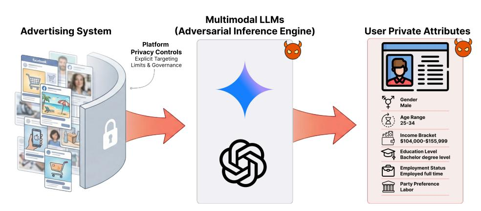
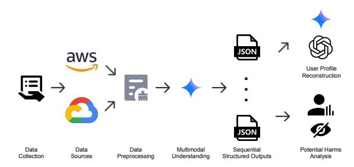
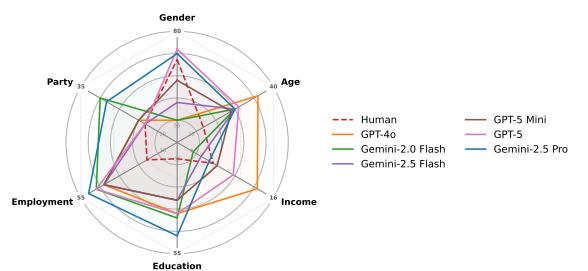
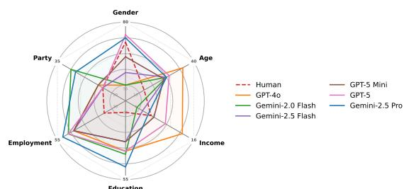
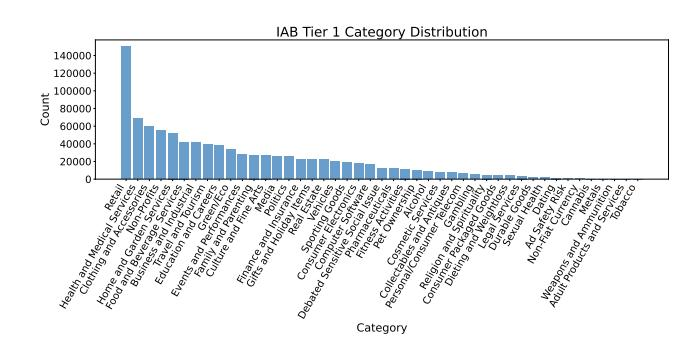

# When Ads Become Profiles: Uncovering the Invisible Risk of Web Advertising at Scale with LLMs

[Baiyu Chen](https://orcid.org/0009-0000-8617-9635) The University of New South Wales Sydney, NSW, Australia breeze.chen@unsw.edu.au

[Benjamin Tag](https://orcid.org/0000-0002-7831-2632) The University of New South Wales Sydney, NSW, Australia benjamin.tag@unsw.edu.au

[Hao Xue](https://orcid.org/0000-0003-1700-9215) Hong Kong University of Science and Technology (Guangzhou) Guangzhou, Guangdong, China haoxue@hkust-gz.edu.cn

[Daniel Angus](https://orcid.org/0000-0002-1412-5096) Queensland University of Technology Brisbane, QLD, Australia daniel.angus@qut.edu.au

[Flora Salim](https://orcid.org/0000-0002-1237-1664)

The University of New South Wales Sydney, NSW, Australia flora.salim@unsw.edu.au

# Abstract

Regulatory limits on explicit targeting have not eliminated algorithmic profiling on the Web, as optimisation systems still adapt ad delivery to users' private attributes. The widespread availability of powerful zero-shot multimodal Large Language Models (LLMs) has dramatically lowered the barrier for exploiting these latent signals for adversarial inference. We investigate this emerging societal risk, specifically how adversaries can now exploit these signals to reverse-engineer private attributes from ad exposure alone. We introduce a novel pipeline that leverages LLMs as adversarial inference engines to perform natural language profiling. Applying this method to a longitudinal dataset comprising over 435,000 Facebook ad impressions collected from 891 users, we conducted a large-scale study to assess the feasibility and precision of inferring private attributes from passive online ad observations. Our results demonstrate that off-the-shelf LLMs can accurately reconstruct complex user private attributes, including party preference, employment status, and education level, consistently outperforming strong censusbased priors and matching or exceeding human social perception at only a fraction of the cost (223× lower) and time (52× faster) required by humans. Critically, actionable profiling is feasible even within short observation windows, indicating that prolonged tracking is not a prerequisite for a successful attack. These findings provide the first empirical evidence that ad streams serve as a high-fidelity digital footprint, enabling off-platform profiling that inherently bypasses current platform safeguards, highlighting a systemic vulnerability in the ad ecosystem and the urgent need for responsible web AI governance in the generative AI era. The code is available at [https://github.com/Breezelled/when-ads-become-profiles.](https://github.com/Breezelled/when-ads-become-profiles)

# CCS Concepts

- Information systems → Online advertising; Security and privacy → Social aspects of security and privacy; • Computing methodologies → Artificial intelligence.

[This work is licensed under a Creative Commons Attribution 4.0 International License.](https://creativecommons.org/licenses/by/4.0) WWW '26, Dubai, United Arab Emirates © 2026 Copyright held by the owner/author(s). ACM ISBN 979-8-4007-2307-0/2026/04 <https://doi.org/10.1145/3774904.3793060>

# Keywords

Targeted Advertising; Large Language Models; Privacy Risks

#### ACM Reference Format:

Baiyu Chen, Benjamin Tag, Hao Xue, Daniel Angus, and Flora Salim. 2026. When Ads Become Profiles: Uncovering the Invisible Risk of Web Advertising at Scale with LLMs. In Proceedings of the ACM Web Conference 2026 (WWW '26), April 13–17, 2026, Dubai, United Arab Emirates. ACM, New York, NY, USA, [12](#page-11-0) pages.<https://doi.org/10.1145/3774904.3793060>

# 1 Introduction

Online advertising serves as the primary economic engine of the Web, enabling the free distribution of content and services. To maximise relevance and revenue, platforms like Facebook and Google deploy sophisticated, opaque algorithms to deliver personalised content, matching advertisements to users based on granular inferred profiles and behaviours [\[29\]](#page-8-0). However, as privacy concerns have mounted, the Web ecosystem has shifted toward stricter governance and regulatory compliance [\[12\]](#page-8-1). A pivotal moment occurred in 2022, when major platforms like Meta removed "Detailed Targeting" options for sensitive categories, including political beliefs, health causes, sexual orientation, and religious practices, to prevent potential abuse and discrimination [\[26\]](#page-8-2). This shift was intended to enhance user privacy by limiting how advertisers could directly target vulnerable groups through the platform's native tools.

While these policies limit explicit targeting options, they do not neutralise the demographic skews introduced by the platform's optimisation algorithms. Prior studies have established that ad delivery remains highly correlated with private attributes, even under neutral targeting settings [\[1](#page-8-3)[–3,](#page-8-4) [20\]](#page-8-5), as an artifact of algorithmic optimisation for user engagement. Our own preliminary analysis confirms that these correlations persist within the dataset we use, creating a discernible link between ad exposure and user private attributes. Consequently, the stream of advertisements shown to a user continues to serve as a high-fidelity proxy for their identity, containing latent fine-grained signals about their private attributes.

The emergence of generative AI challenges the efficacy of existing governance frameworks, introducing potential vulnerabilities by diversifying attack pathways and increasing uncertainty. Previously, exploiting these signals required significant resources: collecting massive labeled datasets and training classifiers [\[9,](#page-8-6) [17,](#page-8-7) [23,](#page-8-8) [33,](#page-8-9) [38\]](#page-8-10). However, this barrier has been fundamentally altered by the rapid

Figure 1: Conceptual overview of the adversarial profiling threat from the passive ad exposure to the user.

democratisation of powerful generative AI like Large Language Models (LLMs). Such technologies demonstrate remarkable abilities to understand and generate nuanced, human-like content [\[18,](#page-8-11) [28\]](#page-8-12), reason about complex contexts [\[15,](#page-8-13) [21\]](#page-8-14), adapt to user-specific preferences [\[27,](#page-8-15) [44\]](#page-9-0), and even integrate multimodal information [\[6,](#page-8-16) [11,](#page-8-17) [18,](#page-8-11) [28\]](#page-8-12), bringing immense convenience but also raising new societal concerns in domains such as online advertising [\[16\]](#page-8-18). As these models become increasingly accessible and capable [\[29\]](#page-8-0), not only through APIs or open-source implementations but also via free, public-facing web interfaces to some of the most advanced proprietary models [\[6,](#page-8-16) [11,](#page-8-17) [15,](#page-8-13) [18,](#page-8-11) [28\]](#page-8-12), which dramatically lower the barrier for conducting sophisticated analyses at scale, including those with potentially harmful intent.

Today, even individuals with only basic technical skills can leverage these models to perform such inferences, making the threat of misuse more probable and more accessible. The convergence of latent ad signals and zero-shot capabilities of LLMs creates societal risks: regulatory evasion via off-platform profiling enabled by scalable yet imperceptible privacy violations. Critically, this profiling does not require the distribution of specialised malware, it can be opportunistically deployed within the existing ecosystem of benign-looking browser extensions (e.g., ad blockers, coupon finders), utilising legitimate permissions to silently harvest ad creatives while evading both user suspicion and platform audit trails.

In this work, we present a large-scale Web privacy study to quantify privacy implications of this societal risk. We propose a novel pipeline that leverages the zero-shot capabilities of multimodal LLMs to act as an adversarial inference engine. Utilising a filtered longitudinal dataset collected via a browser extension from 891 Australian Facebook users (spanning over 435,000 individual ad impressions across more than 63,000 sessions), we simulate an attacker's perspective to answer the following: To what extent can multimodal LLMs reconstruct a user's private attributes solely from the sequence of advertisements that are shown to the user?

Our findings reveal that LLMs can reconstruct private attributes such as age, gender, education, employment status and party preference with high accuracy, outperforming strong census-based priors and matching human annotators. Crucially, we demonstrate that this inference is feasible even with short observation windows (session-level), meaning prolonged tracking is not a prerequisite

for a successful attack. These findings provide the first empirical demonstration that multimodal LLMs can reverse-engineer user private attributes from passive observation (passive observation here means passively viewed ads from the user's perspective) alone, highlighting the scale of privacy risks and the urgent need for safeguards in the era of accessible, high-capacity generative AI.

Our work makes the following contributions: (1) A Novel Pipeline for Uncovering Emerging Societal Risks in Web Advertising. We introduce a methodology that leverages multimodal LLMs to perform zero-shot natural language profiling on ad content. Unlike traditional methods that rely on behavioural metadata, our pipeline decodes the semantic signals embedded in visual and textual ad creatives, establishing a new approach for uncovering the privacy dimension of societal risk from unstructured digital footprints. (2) Empirical Quantification of Privacy Risk in Passive Ad Streams. We provide the first large-scale empirical evidence that ad streams serve as a high-fidelity digital footprint. By evaluating LLMs performance against strong census-based priors and human annotators, we demonstrate that LLMs can accurately reconstruct private attributes from passive observation alone, achieving comparable accuracy at a dramatically lower marginal cost (223× cheaper) and latency (52× faster) than human analysis. (3) Characterisation of Scalable Profiling. We reveal the operational viability of this threat by demonstrating that prolonged tracking is unnecessary. We discuss how this capability enables profiling that bypasses governance and regulation, highlighting urgent gaps in current Web privacy protection that are exacerbated as LLMs become increasingly capable and accessible.

### 2 Related Works

In this section, we situate our work at the intersection of digital footprint analysis and the emerging privacy risks posed by LLMs. We review how traditional methods established the link between online behaviour and user attributes, and how recent advancements in LLMs have transformed this landscape from resource-intensive modeling to scalable adversarial inference.

# 2.1 Digital Footprints and Traditional Inference

Prior to the emergence of LLMs, research had established that digital footprints are predictive of private user attributes. Studies have demonstrated that diverse traces, ranging from Facebook Likes [\[23\]](#page-8-8) and social media language use [\[33\]](#page-8-9) to search logs [\[9\]](#page-8-6) and even public Spotify playlists [\[38\]](#page-8-10), contain latent demographic signals. In the visual domain, tasks such as human attribute recognition and pedestrian attribute recognition have achieved high precision in identifying traits like gender and age from images [\[39,](#page-8-19) [42\]](#page-8-20). However, these traditional approaches typically required significant resources, relying on massive labeled datasets to train bespoke classifiers via supervised learning [\[17\]](#page-8-7).

Within the advertising domain, extensive auditing literature has similarly documented systematic demographic skews in ad delivery algorithms [\[1](#page-8-3)[–3,](#page-8-4) [20\]](#page-8-5). While these studies originally aimed to detect algorithmic discrimination, they provide the crucial empirical evidence that ad streams carry latent signals. Our work builds upon this foundation by shifting the lens to adversarial inference, demonstrating how these established correlations can be exploited by off-the-shelf LLMs without the need for the resource-intensive training pipelines required by previous methods.

#### 2.2 Utility and Risks of LLM Profiling

The rise of LLMs has fundamentally altered user profiling, shifting from opaque vector representations to transparent, languagebased reasoning. In recommender systems, this capability is widely leveraged to construct scrutable user models from interaction histories [\[8,](#page-8-21) [30,](#page-8-22) [31,](#page-8-23) [45\]](#page-9-1), or to infer detailed preferences from sparse inputs like POI check-ins and collaborative signals [\[32,](#page-8-24) [40,](#page-8-25) [41\]](#page-8-26). Beyond recommendation, LLMs demonstrate strong reasoning capabilities in broader user modeling tasks, ranging from inferring latent interests to generating personalized content [\[25,](#page-8-27) [36\]](#page-8-28).

Recently, this inferential power has raised significant concerns regarding inferential privacy, where adversaries exploit models to deduce private information from user content. Studies have demonstrated that LLMs can infer personal attributes from online text posts [\[35\]](#page-8-29), highlighting that such automated inference operates at a fraction of the cost and time required by human analysts. Extending this to the visual domain, recent works utilise vision-language models to extract attributes from user-uploaded images [\[37\]](#page-8-30) and aggregate clues across personal photo albums using agentic frameworks [\[24\]](#page-8-31). Our work identifies a critical gap in this emerging literature. While previous studies focus on active digital footprints, content users voluntarily create or upload, we investigate passive digital footprints: the stream of advertisements pushed to users by algorithmic systems. By demonstrating that off-the-shelf LLMs can reverse-engineer user private attributes from these passive exposures, we uncover a systemic vulnerability where the platform's own targeting logic can be exploited to compromise user privacy.

### 3 Threat Model

We consider a privacy threat aimed at profiling users based on their passive exposure to algorithmic content. We formalise the adversary's goal, capabilities, and the specific attack vector within the modern Web ecosystem.

# 3.1 Adversary Goal and Capabilities

The adversary aims to infer a target user's private attributes A (e.g., party preference, employment status) by observing the stream of advertisements S delivered to them. This adversary seeks to exploit the real-time, high-fidelity targeting intelligence embedded in the ad platform itself. This approach differs fundamentally from existing data acquisition methods. Unlike scraping public social media profiles [\[35,](#page-8-29) [37\]](#page-8-30), which relies on active user disclosure, this attack exploits passive exposure. Furthermore, purchasing data from brokers and targeting from the platform create discoverable records and are subject to regulatory scrutiny.

We characterise the adversary based on three operational assumptions that reflect the democratised nature of this threat. First, the adversary does not require specialised machine learning expertise or resources to train bespoke classifiers. Instead, they leverage off-the-shelf multimodal LLMs via public APIs (e.g., OpenAI) or local open-source models, making the attack accessible to individuals with only basic technical skills. Second, regarding data access, the adversary is limited to client-side rendered content. They observe the visual and textual components of advertisements exactly as displayed in the user's browser, without requiring privileged access to the ad platform's internal databases. Finally, the adversary operates without access to the user's ground truth private attributes.

## 3.2 Attack Vector

We identify browser extensions that abuse legitimate privileges as the potential primary vector for this attack. This scenario is severe due to its inherent stealth and scalability. Rather than distributing specialised malware, an adversary can opportunistically deploy this attack within the existing ecosystem of widely installed, benignfunctioning extensions, such as ad blockers, coupon finders, or page translators. These extensions legitimately require permissions to read web page content to function, providing a perfect cover for data harvesting [\[34\]](#page-8-32). In contrast, collecting URL histories or full-page logs is more likely to be flagged by extension reviews.

This vector effectively bypasses user and platform scrutiny. Users typically focus their privacy concerns on invisible trackers and cookies while overlooking the semantic signals embedded in visible ad creatives [\[43\]](#page-9-2). Similarly, app or plugin store reviews often focus on code safety rather than the privacy implications of data inferred from legitimate content access [\[34\]](#page-8-32). This creates a regulatory blind spot where a benign-looking extension can silently harvest ad content without triggering security alarms. Furthermore, by leveraging the zero-shot capabilities of LLMs, the adversary can automate this process for scalable profiling. As we demonstrate in Section [5.3.1,](#page-4-0) actionable profiles can be reconstructed from short observation windows, meaning the adversary does not need to maintain longterm persistence to be effective. Ultimately, this vector offers a distinct strategic advantage: it enables off-platform profiling that evades the platform's own privacy safeguards, such as the removal of sensitive targeting options. The adversary effectively exploits the optimisation logic of the ad platform to build sensitive user profiles at a low marginal cost and without leaving an audit trail.

# 4 Methodology

To empirically evaluate the feasibility of the threat model defined in Section [3,](#page-2-0) we formalise the User Profile Reconstruction task. Let U be a set of users, where each user �� ∈ U is associated with a groundtruth set of private attributes A�� = {��������������, ��������, ��������������, . . . }. The

user is exposed to a chronological stream of advertisements S�� = (��1, ��2, . . . , ����), where each ad ���� consists of multimodal content (image ���� and text ���� ) and metadata. Our research procedure is illustrated in Figure [2.](#page-3-0) We assume an adversary M, parameterised by an LLM, who seeks to leverage the LLM to perform the mapping function �� : S�� → Aˆ �� that reconstructs the private attributes solely from the ad stream. To achieve scalable and cost-effective inference without model training, we decompose this mapping into a three-stage pipeline: (1) Multimodal Feature Extraction, (2) Session-Level Inference, and (3) Longitudinal User Profiling.

Figure 2: Overall Study Procedure. Begins with data collection from 2000+ Australian Facebook users, then data preprocessing from the data sources. A multimodal LLM generates sequential structured outputs for user profile reconstruction and potential harm analysis.

#### 4.1 Multimodal Ad Understanding

To transform raw, multimodal ad data into a structured representation suitable for profiling, we employ an LLM-driven extraction process. Let each advertisement ���� in our dataset consist of visual content ���� (one or more images) and textual metadata ���� (title, body, call-to-action). We utilise Gemini 2.0 Flash [\[14\]](#page-8-33) as our inference engine M, selected for its balance of multimodal reasoning and cost-efficiency required to process �� &gt; 435, 000 impressions. For each ad, conditioned on an extraction prompt Pextract, the model M maps the input into a structured feature set ���� : ���� = M (���� ,���� | Pextract) = {���� , D�� , L�� , E�� }.

This structured output ���� encapsulates four semantic components: (1) a Caption (���� ) summarising the core message and visual elements of the ad; (2) Descriptive Categories (D�� ), a set of freeform labels characterising tone, style, and communication strategy; (3) IAB Categories (L�� ), a multi-label zero-shot classification into 45 IAB-defined categories [\[19\]](#page-8-34); and (4) Key Entities (E�� ), a list of extracted specific brands, products, or locations. This transformation ���� → ���� extracts high-dimensional multimodal signals into a concise textual representation. We validate the quality of these model-generated features in Appendix [C](#page-9-3) and discuss a case of Human–AI disagreement in Appendix [D.](#page-10-0)

# 4.2 Session-Level User Profile Reconstruction

To capture short-term profiling signals, we segment the continuous user stream S�� into discrete sessions. Let a session S�� be a chronologically ordered sequence of �� structured ad features observed within a continuous browsing window (segmentation details in Section [5.2\)](#page-4-1): S�� = (����1 , ����2 , . . . , ������ ), where each ������ corresponds to the

structured feature set extracted in the previous stage. We construct a textual representation ���� by concatenating the components of each �� ∈ S�� in temporal order.

This text-centric transformation is a deliberate methodological choice designed to mitigate two critical limitations of processing raw visual sequences. First, computational feasibility: user sessions vary significantly in length (�� ∈ [3, 50]). Processing such long sequences of high-resolution images exceeds the token limits and budget constraints of current API-based models. Second, contextual fidelity: presenting a collage of disparate ad images simultaneously can induce visual-textual alignment ambiguity, where the model struggles to associate specific textual claims with their corresponding visual creatives. We define a session-level inference function that maps the textual representation ���� , conditioned on a profiling prompt Pprofile session, to a prediction of user's private attributes Aˆ �� and a reasoning summary ���� : (Aˆ , ���� ) = M (���� | Pprofile session). Here, Aˆ �� contains zero-shot classifications for the six private attributes derived from the current session. The model generates a reasoning summary (���� ), a natural language explanation contains the key demographic signals identified within that specific session. This summary serves as the compact information carrier for the subsequent longitudinal analysis.

#### 4.3 User-Level User Profile Reconstruction

While session-level analysis captures short-term context, a user's full ad exposure history offers a richer and more stable signal. To leverage this, we construct a user-level profile by aggregating the reasoning summaries derived in the previous stage. Let ���� = (����1 , ����2 , . . . , ������ ) denote the chronological sequence of reasoning summaries generated for user�� across�� sessions. These summaries are concatenated to form a longitudinal narrative, representing a condensed history of the inferred demographic signals over the entire two-year observation period. The final profiling is performed by the model M, conditioned on a synthesis prompt Pprofile user, to predict the final attribute set Aˆ ��: Aˆ �� = M (���� | Pprofile user). This hierarchical aggregation allows the adversary to synthesise cumulative evidence (i.e., aggregate semantic signals) and detect temporal patterns (e.g., shifts in interests or trends) from the full reasoning summaries of a user ����. Crucially, this approach remains computationally tractable by processing condensed summaries rather than the prohibitive raw ad stream S��.

#### 5 Results

#### 5.1 Dataset

To empirically evaluate our threat model, we utilise a large-scale, longitudinal dataset sourced from the Australian Ad Observatory, a citizen science project run by the ARC Centre of Excellence for Automated Decision-Making and Society (ADM+S) [\[4,](#page-8-35) [5\]](#page-8-36). The project recruits volunteer participants from the Australian public to donate data about the advertisements they encounter on Facebook via a custom-built, privacy-preserving browser plugin [\[4,](#page-8-35) [5\]](#page-8-36). Crucially, this collection mechanism mirrors the exact vantage point of the malicious browser extension described in our threat model (Section [3\)](#page-2-0), it passively captures the stream of sponsored posts directly from the user's feed as they browse the website. Participants joined

| Method           | Gender Acc (%) | F1 (%) | Acc (%) | Age F1 (%) MAE | NMAE | Acc (%) | Income F1 (%) | MAE  | NMAE | Education Acc (%) | F1 (%) | Employment Acc (%) | F1 (%) | Party Acc (%) | F1 (%) |
|------------------|----------------|--------|---------|----------------|------|---------|---------------|------|------|-------------------|--------|--------------------|--------|---------------|--------|
| Random Guessing  | 50.00          | 50.00  | 14.29   | 14.29 2.29     | 0.38 | 8.33    | 8.33          | 3.97 | 0.36 | 25.00             | 25.00  | 20.00              | 20.00  | 20.00         | 20.00  |
| Random Control   | 58.80          | 58.50  | 20.56   | 15.88 1.63     | 0.27 | 10.12   | 5.04          | 3.17 | 0.29 | 42.76             | 18.13  | 48.29              | 19.72  | 34.63         | 21.07  |
| Gemini 2.0 Flash | 59.13          | 58.85  | 20.41   | 15.62 1.64     | 0.27 | 9.94    | 4.56          | 3.17 | 0.29 | 42.70             | 18.04  | 48.38              | 19.92  | 35.13         | 20.99  |

Table 1: Session-level performance on all 63,864 sessions.

by installing the plugin and completing a detailed demographic questionnaire, which provides the high-fidelity ground truth necessary to benchmark adversarial inference accuracy. The collected data for each ad includes the ad creative (image and text), associated metadata, and a link to the de-identified user profile. This methodology provides a unique, user-centric view of the ad ecosystem, capturing the personalised ads that are otherwise inaccessible to public scrutiny via scraping or ad libraries. The full dataset made available to us comprises over 700,000 ad observations collected between 2021 and 2023 including demographic information from over 2,000 Australian Facebook users. This extensive, real-world dataset allows us to conduct a robust, large-scale study of the potential for user profiling attack by LLMs under realistic conditions.

#### 5.2 Preprocessing

To simulate a realistic attack scenario where an adversary observes users in short discrete time windows, we must segment the continuous stream of ad exposures into meaningful units of analysis. We use a data-driven, principled way to define what counts as a "session" in our dataset, instead of arbitrarily choosing a cutoff. Users' ad exposures arrive as a continuous, non-uniform timeline of events over days and weeks. To segment each user's ad viewing history into coherent sessions, we identify a robust threshold for the maximum time interval that can elapse between consecutive ads such that they still belong to the same session.

We compute a session threshold �� by applying a kernel density estimator (KDE) over the log-transformed inter-ad time intervals. This process yields a global threshold of �� = 389 seconds (refer to Appendix [E](#page-10-1) for the detailed preprocessing details). Thus, two consecutive ads���� , ����+1 are considered to belong to different sessions if ����+1 − ���� &gt; ��. This data-driven approach allows us to transform the continuous variable of time gaps into a principled categorical distinction (same session vs. new session) based on real user behavioural patterns observed in the data. Following temporal segmentation, we apply additional filtering steps to ensure data quality and modelling tractability: (1) Source filtering: We retain only ad impressions sourced from Facebook, excluding other platforms and modalities such as video-only content. (2) Session length bounds: We discard sessions with fewer than 3 or more than 50 ad impressions to eliminate sparse sessions and abnormally long sequences. This range aligns with recent studies on LLM-based user profiling and prediction on sequential data [\[13,](#page-8-37) [40\]](#page-8-25). (3) User filtering: We exclude users who contributed fewer than 3 ad sessions, as such short histories are insufficient for meaningful profiling.

After filtering, the dataset contains: 891 unique users, 63,864 total ad sessions and 435,314 total ad impressions. To prepare the ad text for subsequent processing, we remove all HTML elements and markup to produce clean plain-text. The demographic composition of the final filtered user cohort is detailed in Table [4.](#page-9-4) This table provides the operational definitions for all demographic categories, such as age ranges (older or younger), income brackets and education levels (higher or lower), used throughout our analyses. All monetary values, including income brackets, are reported in Australian Dollars (AUD). The distribution of ad content across IAB categories, which forms a core feature for our subsequent analyses, is visualised in Figure [4.](#page-9-5) These distributions provide the foundational context for our user profile reconstruction experiments.

#### 5.3 User Profile Reconstruction

As detailed in Section [1](#page-0-0) and [2,](#page-1-0) algorithmic optimisation inherently introduces demographic skews in ad delivery. Our preliminary examination of specific categories within our dataset, namely Education and Careers, Gambling, Alcohol, and Politics, confirms that these correlations persist locally. Specifically, we observed heightened exposure of gambling content to socioeconomically vulnerable groups, along with distinct age and gender stratifications in alcohol and political advertising. This validates the premise of our threat model: an ad stream serves as a rich digital footprint containing latent private attribute signals. To quantify the extent to which these signals can be exploited, we deploy the adversarial inference pipeline defined in Section [4.](#page-2-1) Treating the sequence of advertisements as the sole input, we tasked the LLM with performing zero-shot classification of private attributes. We structure our evaluation in two stages: first assessing the feasibility of inference from short observation windows (Session-Level), and then aggregating these insights to construct longitudinal profiles (User-Level). In both stages, we benchmark performance against strong census-based priors and human evaluators to rigorously characterise the privacy risk.

Experimental Setup. We evaluate performance using Accuracy and Macro F1-score, ensuring robustness under class imbalance. For ordinal attributes such as Age and Income, where exact classification is overly punitive and "near misses" retain profiling utility, we additionally report Mean Absolute Error (MAE). This measures the average index distance between the predicted and ground-truth bins. To allow for comparison across attributes with differing granularities (e.g., 7 age brackets vs. 12 income brackets), we also report Normalised MAE (NMAE). Complete model hyperparameters and configurations are detailed in Appendix [B.](#page-9-6)

5.3.1 Session-Level Reconstruction. We first conduct our analysis at the most granular level: the user session, defined as the sequence of ads a user is exposed to within a single, continuous period of platform usage. This session-level analysis tests the LLM's inference capabilities on short, contextually coherent ad sequences. To ensure data quality and meaningful classification, we excluded responses

|        | Methods  |          | Acc (%) | Gender F1 (%)     | Acc (%) | F1 (%)       | Age MAE          | NMAE        | Acc (%)    | F1 (%)      | Income MAE  | NMAE        | Acc (%) | Education F1 (%)  | Acc (%) | Employment F1 (%) | Acc (%) | Party F1 (%)      |
|--------|----------|----------|---------|-------------------|---------|--------------|------------------|-------------|------------|-------------|-------------|-------------|---------|-------------------|---------|-------------------|---------|-------------------|
|        | Random   | guessing | 50.00   | 50.00             | 14.29   | 14.29        | 2.29             | 0.38        | 8.33       | 8.33        | 3.97        | 0.36        | 25.00   | 25.00             | 20.00   | 20.00             | 20.00   | 20.00             |
| Human  |          |          | 73.67 ± | 5.13 73.05 ± 4.95 | 21.83 ± | 5.34 15.64 ± | 4.34 1.58 ± 0.09 | 0.26 ± 0.01 | 8.5 ± 2.74 | 6.94 ± 2.35 | 3.33 ± 0.31 | 0.30 ± 0.03 | 33.67 ± | 5.43 25.10 ± 6.41 | 37.83 ± | 5.78 20.42 ± 3.95 | 25.00 ± | 6.10 16.68 ± 4.54 |
| GPT    | 4o       |          | 60.00   | 59.86             | 36.00   | 27.56        | 1.26             | 0.21        | 14.00      | 11.36       | 2.66        | 0.24        | 46.00   | 25.29             | 49.00   | 22.87             | 26.00   | 16.15             |
| Gemini | 2.0      | Flash    | 60.00   | 59.86             | 30.00   | 20.03        | 1.33             | 0.22        | 6.00       | 2.31        | 2.84        | 0.26        | 47.00   | 26.10             | 51.00   | 23.31             | 32.00   | 15.24             |
| Gemini | 2.5      | Flash    | 64.00   | 63.99             | 30.00   | 26.31        | 1.24             | 0.21        | 7.00       | 3.30        | 3.04        | 0.28        | 43.00   | 24.14             | 49.00   | 22.90             | 25.00   | 13.73             |
|        | Thinking | Models   |         |                   |         |              |                  |             |            |             |             |             |         |                   |         |                   |         |                   |
| GPT    | 5 Mini   |          | 69.00   | 68.97             | 29.00   | 19.72        | 1.29             | 0.22        | 9.00       | 6.60        | 2.9         | 0.26        | 43.00   | 23.59             | 49.00   | 22.62             | 26.00   | 15.81             |
| GPT    | 5        |          | 76.00   | 75.65             | 31.00   | 24.82        | 1.23             | 0.21        | 11.00      | 5.91        | 2.81        | 0.26        | 46.00   | 27.12             | 51.00   | 24.11             | 25.00   | 14.37             |
| Gemini | 2.5      | Pro      | 75.00   | 74.80             | 30.00   | 26.45        | 1.15             | 0.19        | 8.00       | 5.80        | 3.02        | 0.27        | 51.00   | 30.54             | 53.00   | 26.33             | 31.00   | 21.72             |

Table 2: Comparison of Human and random guessing against LLMs on 100 sampled human-evaluated sessions.

where users selected "prefer not to say" for any given attribute. We also excluded the "other" category for gender due to its small sample size (N=6), which is insufficient for a reliable model evaluation. We then tasked Gemini 2.0 Flash, a state-of-the-art multimodal LLM, with zero-shot classification for six demographic attributes across the remaining 63,864 user sessions from our dataset.

Figure 3: Accuracies of 6 state-of-the-art LLMs and human across different demographic categories on 100 sampled human-evaluated sessions.

Performance on Full Dataset. Table [1](#page-4-2) presents the model's performance benchmarked against a random guessing baseline and a "Random Control" group (where ad order within a session is shuffled). For categorical attributes, Gemini 2.0 Flash consistently outperforms the random baseline. For instance, the model achieves 59.13% accuracy for Gender, and substantial gains are observed for Education (42.70%) and Employment (48.38%), more than doubling the random guess performance. Similarly, for Party preference, the model achieves 35.13% compared to the 20.00% baseline, showing that political orientation is discernible even within short browsing sessions. This indicates that ad sequences, even at the session level, contain sufficient demographic signals for the LLM to make inferences better than chance. For ordinal attributes (Age and Income). While the F1-scores for Age (15.62%) and Income (4.56%) appear low due to the difficulty of pinpointing exact brackets, the MAE metrics reveal a deeper insight. The model achieves an MAE of 1.64 and 3.17 (NMAE 0.27 and 0.29) for Age and Income, significantly lower than the random baseline of 2.29 and 3.97. This implies that the model's errors are not random noise, rather, predictions are typically "near misses" falling within 1-2 buckets of the truth. This suggests that ad streams contain a robust signal for a user's approximate life stage

and economic standing, which the model effectively decodes even if exact precision remains challenging.

Impact of Temporal Order (Random Control). To isolate the value of sequential information at the session level, we compare the standard model against the Random Control group in Table [1.](#page-4-2) The performance difference is negligible across all metrics. For example, Party preference accuracy shifts marginally from 34.63% (Control) to 35.13% (Sequential). This finding confirms that at the granular level of a single, short user session, the specific chronological order of ads provides little additional signal. The model's inferences appear to be based primarily on the aggregate semantic content present in the session, rather than their temporal arrangement.

Human vs. AI Evaluation. To contextualise these LLMs' capabilities, we conducted a human evaluation on randomly sampled 100 user sessions, stratified to match the demographic distribution of our dataset as detailed in Table [4.](#page-9-4) We recruited six human annotators (2 female, 4 male) with diverse professional backgrounds, including legal and privacy expertise, computer science, and human resources. Each annotator was tasked with inferring the six demographic attributes for each of the 100 sessions, based solely on the same ad content shown to the LLM. To best capture intuitive human inference in a realistic and tractable manner, annotators were shown the raw, human-readable visual images of the ads within each session, as processing the full structured textual captions, categories, key entities from all ads in 100 sessions would be cognitively overwhelming. In contrast, the LLM received the structured textual input generated by our multimodal understanding pipeline (as described in Section [4.1\)](#page-3-1) as in our session-level analysis. This design allows for a valid comparison between intuitive human inference and systematic algorithmic inference. The results are detailed in Table [2](#page-5-0) and visualised in Figure [3.](#page-5-1)

The comparison reveals a significant evolution in the capabilities regarding Gender classification. While this task relies heavily on decoding subtle, socially-cued signals, a domain where human intuition typically excels (73.67% accuracy), state-of-the-art LLMs now demonstrate remarkable proficiency that rivals or even exceeds human performance (GPT-5 at 76% and Gemini 2.5 Pro at 75%). This indicates that modern multimodal models have reached a level of social perception comparable to humans, effectively bridging the gap in interpreting nuanced demographic cues from visual content. Furthermore, for complex socio-economic and political attributes,

Table 3: User-level performance on 891 users. † denotes the LLM augmented with an Australian-specific context prompt.

LLMs consistently matched or surpassed human capabilities. For Education and Employment, the best-performing model (Gemini 2.5 Pro) achieved significantly higher accuracies (51% and 53%) compared to the human average (33.67% and 37.83%). A similar trend was observed for Party preference, where the model reached 32% accuracy against the human baseline of 25%. This indicates that LLMs are more effective at identifying non-obvious correlations between commercial content and users' professional backgrounds or ideological leanings. Crucially, the MAE analysis for Age highlights the superior calibration of LLMs. While humans achieved an MAE of 1.58, the best LLM (Gemini 2.5 Pro) achieved 1.15. This confirms that even when the model fails to predict the exact age bracket, its estimates are semantically closer to the ground truth than human intuition. Both humans and LLMs struggled with Income, reinforcing that this attribute is less reliably encoded in short-term ad content.

In summary, our session-level analysis provides empirical evidence that LLMs can extract private attribute signals from short observation windows, achieving performance that rivals or even exceeds human capabilities. The models demonstrate a "directional correctness" (low MAE) for ordinal attributes and significantly outperform human annotators on complex traits like employment and education. This feasibility of short-term profiling motivates our subsequent analysis at the user level, where aggregating information across multiple sessions may amplify these signals.

5.3.2 User-Level Reconstruction. Building on the hierarchical aggregation pipeline defined in Section [4.3,](#page-3-2) we reconstruct longitudinal user profiles by synthesizing reasoning summaries across all sessions. This holistic approach allows the model to leverage cumulative evidence and temporal shifts in ad exposure over the user's entire history. For this more rigorous user-level evaluation, we introduce two stronger baseline models derived from Australian census data [\[7\]](#page-8-38), which reflect the prior demographic distribution of the population. The Prior-Mode baseline always predicts the majority class for each attribute. The Prior-Sampling baseline provides a more robust chance-level comparison by making predictions through random sampling from the census distribution; we report the mean and standard deviation of its performance over 1,000 independent runs in Table [3.](#page-6-0) To ensure a fair comparison, we harmonised our dataset with the census data. For all attributes, we excluded responses where users selected "prefer not to say." We excluded gender-diverse respondents from this analysis because the census prior reports only male and female categories. For education, we aligned with the higher education census distribution by merging all non-degree categories in our data into a single "No Degree" class. Census data for individual income, reported weekly, was annualised and aligned perfectly with our income brackets. For employment, we merged our two "unemployed" categories to match the census, which does not distinguish between looking for work or not; we also excluded "retired" individuals from this specific attribute's evaluation, as the census employment data pertains only to the labour force. Detailed demographic statistics are based on the Australian Census [\[7\]](#page-8-38) and the Australian Federal Election Study [\[10\]](#page-8-39). We evaluate three versions of LLM: the standard Gemini 2.0 flash model, an augmented version, Gemini† , which was provided with a prompt about the Australian cultural context and a "Random Control" group (where ad session order within a user is shuffled). This augmentation is designed to create a more equitable comparison with our census-derived baselines. Since the Prior-Sampling baseline inherently incorporates "Australian context" by drawing from national demographic data, providing the LLM with similar high-level contextual information ensures that our evaluation more accurately assesses the model's ability to infer information from ad content, rather than simply penalising it for a lack of geographical and cultural knowledge.

The user-level reconstruction performance is presented in Table [3.](#page-6-0) The results show a marked improvement over the sessionlevel analysis and demonstrate the LLM's strong capability to reconstruct user profiles. Gemini significantly outperforms both the Prior-Mode and Prior-Sampling baselines across nearly all attributes in both accuracy and F1-score. The most striking performance is in Gender reconstruction, where Gemini† achieves 76.38% accuracy and a 76.35% F1-score, far exceeding the baselines and indicating a very strong and reliable signal in the ad streams. Substantial gains are also evident for attributes that were challenging at the session level. For Education, the F1-score jumps to 34.37%, nearly tripling the baseline performance. The model's performance on Employment is also noteworthy. While the Prior-Mode baseline achieves a high accuracy of 56.71% due to a large majority class (employed fulltime), its F1-score is low (24.13%). Gemini† , in contrast, achieves a higher accuracy (62.46%) and a significantly better F1-score (35.63%), demonstrating a superior ability to correctly identify users in nonmajority employment categories. For Party preference, the LLM's accuracy (41.60%) and F1-score (25.82%) are dramatically better than the baselines, suggesting that political orientation is encoded in ad content. For ordinal attributes, Age, Gemini's accuracy (41.18%) is double that of the Prior-Mode baseline (20.84%), but the MAE provides a deeper insight: the model achieves an MAE of 0.85 (NMAE 0.14), which is significantly lower than the Prior-Mode (2.04) and Prior-Sampling (2.11). An MAE below 1.0 indicates that on average, the model's predictions are less than one age bracket away

from the ground truth. This confirms that the model successfully identifies the user's approximate life stage with high "directional correctness." A similar pattern is observed for Income. While the absolute accuracy (9.11%) remains low and comparable to baselines, the MAE of 2.73 is substantially better than the Prior-Sampling baseline (4.06). This reduction in error magnitude suggests that while pinpointing the exact income bracket remains difficult, the ad content contains a coarse but discernible signal of a user's general economic standing, allowing the model to place users in brackets semantically closer to the truth than random chance.

To isolate sequential information, we compare the standard model against a "Random Control" group where the order of ads within sessions was shuffled. The results indicate that temporal order contributes differently across attributes. For Age and Gender, preserving the chronological sequence yields gains (e.g., Age accuracy improves from 38.00% to 41.18%, and MAE decreases to 0.85), suggesting that temporal evolution in ad delivery captures signals related to life stages or identity stability. However, for socioeconomic attributes like Income, Education, and Employment, performance remains comparable between the sequential and shuffled inputs. This implies that for these traits, the cumulative semantic content: the specific collection of ads a user sees, serves as the primary predictive signal, regardless of the specific viewing order.

In summary, our analysis reveals a clear privacy risk. At the session level, LLMs can extract actionable signals from short observation windows; at the user level, aggregating these signals significantly amplifies profiling precision. The strong performance of the Random Control group and non-augmented version Gemini demonstrates that the mere accumulation of ad exposures creates a high-fidelity digital fingerprint even without temporal structure and cultural context. This confirms that passive ad streams are not just ephemeral noise but a leakage vector that allows LLMs to reverse-engineer private attributes with alarming accuracy.

#### 6 Discussion

The Shift to Passive Privacy Risk. Our findings mark a shift in digital privacy understanding. Our LLM-based reconstruction, which outperforms census priors and matches human intuition, confirms that generative AI can systematically decode granular demographic signals encoded in ad-delivery algorithms. Furthermore, our analysis of ordinal attributes (Age, Income) reveals that when exact predictions fail, they remain "directionally correct" (low MAE), placing users in semantically accurate categories (e.g., "young", "low-income"). The democratisation of multimodal LLMs transforms this from a theoretical risk into an immediate operational threat. Unlike traditional profiling that required collecting massive labeled datasets to train bespoke classifiers [\[9,](#page-8-6) [17,](#page-8-7) [23,](#page-8-8) [33,](#page-8-9) [38\]](#page-8-10), our zero-shot approach demonstrates that adversaries can now leverage off-theshelf models to perform scalable profiling with minimal technical expertise. While prior research demonstrated that LLMs can infer attributes from user content such as Reddit posts [\[35,](#page-8-29) [37\]](#page-8-30) or personal photo albums [\[24\]](#page-8-31), our work reveals that passive consumption of algorithmic content constitutes a comparable leakage vector. This capability is particularly dangerous within the browser extension ecosystem [\[34\]](#page-8-32), where benign-looking tools (e.g., ad blockers) possess legitimate permissions to read page content. An adversary

can thus deploy a "silent" profiler that bypasses platform targeting restrictions (e.g., on political affiliation) by reverse-engineering the platform's own optimisation logic locally on the user's device. This vector exploits a critical gap in user understanding: users typically focus privacy concerns on invisible trackers and cookies, rarely perceiving the visible ad creative itself as a leakage vector [\[43\]](#page-9-2). This creates a privacy dilemma: users can choose not to post content, but they cannot easily opt out of the ad ecosystem, and they are often unaware that even passive exposure can be harvested to reconstruct their identity. Taken together, these findings suggest that current privacy policy may underestimate risks by focusing on exact identification rather than semantic profiling.

Limitations. We note several limitations. First, our dataset is drawn from a self-selected cohort of Australian Facebook users via a desktop browser plugin. This sample may not fully generalize to mobile-only populations or other cultural and regulatory contexts [\[22\]](#page-8-40). Second, our analysis is limited to Facebook; other ecosystems like TikTok or open programmatic web advertising involve different ad formats and delivery logics that may yield different leakage patterns. Finally, our reconstruction pipeline separates visual captioning from reasoning to manage token costs. While effective, a fully end-to-end multimodal model might capture even subtler visual cues, potentially yielding higher inference accuracy and greater privacy risk than reported here. Future work should extend this framework to cross-platform environments and explore adversarial defenses against LLM-based profiling.

# 7 Conclusion

This work reveals a critical blind spot in Web privacy: the latent leakage of user private attributes through passive exposure to algorithmic advertising. By leveraging multimodal LLMs as adversarial inference engines, we demonstrate that ad streams serve as highfidelity digital footprints, enabling the accurate reconstruction of private attributes, often surpassing human social perception. Our findings confirm that this threat is operational and scalable: actionable profiles can be derived from short observation windows without long-term tracking, and "near-miss" predictions for age and income yield semantically invasive insights. As off-the-shelf AI tools democratise this capability, they increase the risk that benign browser extensions could be repurposed to circumvent platform targeting restrictions. Addressing this risk requires moving beyond current regulatory frameworks to recognise and govern the latent semantic signals embedded in the content users passively consume.

# Acknowledgments

This research includes computations using the Wolfpack computational cluster, supported by the School of Computer Science and Engineering at UNSW Sydney. We acknowledge support from the Australian Research Council (ARC) Centre of Excellence for Automated Decision-Making and Society (ADM+S; CE200100005), which hosts the Australian Ad Observatory project, and thank the Ad Observatory team for their work and support. We thank Abdul Obeid for suggesting the idea of using a KDE-based approach for defining session thresholds. We further thank our annotators for their hard work, which greatly contributed to the human evaluation.

#### References

[1] Muhammad Ali, Angelica Goetzen, Alan Mislove, Elissa Redmiles, and Piotr Sapiezynski. 2022. All things unequal: Measuring disparity of potentially harmful ads on facebook. In Proceedings of the 2022 workshop on consumer protection. [2] Muhammad Ali, Angelica Goetzen, Alan Mislove, Elissa M Redmiles, and Piotr Sapiezynski. 2023. Problematic advertising and its disparate exposure on Facebook. In 32nd USENIX Security Symposium (USENIX Security 23). 5665–5682. [3] Muhammad Ali, Piotr Sapiezynski, Miranda Bogen, Aleksandra Korolova, Alan Mislove, and Aaron Rieke. 2019. Discrimination through optimization: How Facebook's Ad delivery can lead to biased outcomes. Proceedings of the ACM on human-computer interaction 3, CSCW (2019), 1–30. [4] Daniel Angus, Lauren Hayden, Abdul Karim Obeid, Xue Ying Tan, Nicholas Carah, Jean Burgess, Christine Parker, et al. 2024. Computational Methods for Improving the Observability of Platform-Based Advertising. Journal of Advertising 53, 5 (2024), 661–680. [doi:10.1080/00913367.2024.2394156](https://doi.org/10.1080/00913367.2024.2394156) [5] Daniel Angus, Abdul Obeid, Jean Burgess, Christine Parker, Mark Andrejevic, Julian Bagnara, Nicholas Carah, Robbie Fordyce, Lauren Hayden, Kelly Lewis, et al. 2024. The Australian Ad Observatory technical and data report. [6] Anthropic. 2025. Claude Opus 4 & Claude Sonnet 4: System Card. Technical Report. Anthropic. [7] Australian Bureau of Statistics. 2021. Population: Census, 2021. [https://www.](https://www.abs.gov.au/statistics/people/population/population-census/2021) [abs.gov.au/statistics/people/population/population-census/2021.](https://www.abs.gov.au/statistics/people/population/population-census/2021) Accessed on August 2025. [8] Krisztian Balog, Filip Radlinski, and Shushan Arakelyan. 2019. Transparent, scrutable and explainable user models for personalized recommendation. In Proceedings of the 42nd international acm sigir conference on research and development in information retrieval. 265–274. [9] Bin Bi, Milad Shokouhi, Michal Kosinski, and Thore Graepel. 2013. Inferring the demographics of search users: social data meets search queries. In Proceedings of the 22nd International Conference on World Wide Web (Rio de Janeiro, Brazil) (WWW '13). Association for Computing Machinery, New York, NY, USA, 131–140. [doi:10.1145/2488388.2488401](https://doi.org/10.1145/2488388.2488401) [10] Sarah Cameron, Ian McAllister, Simon Jackman, and Jill Sheppard. 2022. The 2022 Australian federal election: Results from the Australian election study. (2022). [11] Gheorghe Comanici, Eric Bieber, Mike Schaekermann, Ice Pasupat, Noveen Sachdeva, Inderjit Dhillon, Marcel Blistein, Ori Ram, Dan Zhang, Evan Rosen, et al. 2025. Gemini 2.5: Pushing the frontier with advanced reasoning, multimodality, long context, and next generation agentic capabilities. arXiv preprint arXiv:2507.06261 (2025). [12] European Parliament and Council of the European Union. 2016. Regulation (EU) 2016/679 of the European Parliament and of the Council (General Data Protection Regulation). Official Journal of the European Union, L119. OJ L 119, 4.5.2016. [13] Jie Feng, Yuwei Du, Jie Zhao, and Yong Li. 2025. Agentmove: A large language model based agentic framework for zero-shot next location prediction. In Proceedings of the 2025 Conference of the Nations of the Americas Chapter of the Association for Computational Linguistics: Human Language Technologies (Volume 1: Long Papers). 1322–1338. [14] Google DeepMind. 2025. Gemini 2.0 Flash Model Card. Technical Report. Google DeepMind. [15] Daya Guo, Dejian Yang, Haowei Zhang, Junxiao Song, Ruoyu Zhang, Runxin Xu, Qihao Zhu, Shirong Ma, Peiyi Wang, Xiao Bi, et al. 2025. Deepseek-r1: Incentivizing reasoning capability in llms via reinforcement learning. arXiv preprint arXiv:2501.12948 (2025). [16] Fengxiang He, Mengnan Du, Aris Filos-Ratsikas, Lu Cheng, Qingquan Song, Min Lin, and John Vines. 2024. AI Driven Online Advertising: Market Design, Generative AI, and Ethics. In Companion Proceedings of the ACM Web Conference 2024 (Singapore, Singapore) (WWW '24). Association for Computing Machinery, New York, NY, USA, 1407–1409. [doi:10.1145/3589335.3641295](https://doi.org/10.1145/3589335.3641295) [17] Joanne Hinds and Adam N Joinson. 2018. What demographic attributes do our digital footprints reveal? A systematic review. PloS one 13, 11 (2018), e0207112. [18] Aaron Hurst, Adam Lerer, Adam P Goucher, Adam Perelman, Aditya Ramesh, Aidan Clark, AJ Ostrow, Akila Welihinda, Alan Hayes, Alec Radford, et al. 2024. Gpt-4o system card. arXiv preprint arXiv:2410.21276 (2024). [19] IAB Technology Laboratory. [n. d.]. Ad Product Taxonomy. IAB Tech Lab website.<https://iabtechlab.com/standards/ad-product-taxonomy/> Last updated: December 11, 2024. [20] Basileal Imana, Aleksandra Korolova, and John Heidemann. 2021. Auditing for Discrimination in Algorithms Delivering Job Ads (WWW '21). Association for Computing Machinery, New York, NY, USA, 3767–3778. [doi:10.1145/3442381.](https://doi.org/10.1145/3442381.3450077) [3450077](https://doi.org/10.1145/3442381.3450077) [21] Aaron Jaech, Adam Kalai, Adam Lerer, Adam Richardson, Ahmed El-Kishky, Aiden Low, Alec Helyar, Aleksander Madry, Alex Beutel, Alex Carney, et al. 2024. Openai o1 system card. arXiv preprint arXiv:2412.16720 (2024). [22] Smirity Kaushik, Tanusree Sharma, Yaman Yu, Amna F Ali, Yang Wang, and Yixin Zou. 2024. Cross-Country Examination of People's Experience with Targeted Advertising on Social Media. In Extended Abstracts of the CHI Conference on Human Factors in Computing Systems (Honolulu, HI, USA) (CHI EA '24). Association for Computing Machinery, New York, NY, USA, Article 91, 10 pages. [doi:10.1145/3613905.3650780](https://doi.org/10.1145/3613905.3650780) [23] Michal Kosinski, David Stillwell, and Thore Graepel. 2013. Private traits and attributes are predictable from digital records of human behavior. Proceedings of the National Academy of Sciences 110, 15 (2013), 5802–5805. arXiv[:https://www.pnas.org/doi/pdf/10.1073/pnas.1218772110](https://arxiv.org/abs/https://www.pnas.org/doi/pdf/10.1073/pnas.1218772110) [doi:10.1073/pnas.](https://doi.org/10.1073/pnas.1218772110) [1218772110](https://doi.org/10.1073/pnas.1218772110) [24] Feiran Liu, Yuzhe Zhang, Xinyi Huang, Yinan Peng, Xinfeng Li, Lixu Wang, Yutong Shen, Ranjie Duan, Simeng Qin, Xiaojun Jia, Qingsong Wen, and Wei Dong. 2025. The Eye of Sherlock Holmes: Uncovering User Private Attribute Profiling via Vision-Language Model Agentic Framework. In Proceedings of the 33rd ACM International Conference on Multimedia (Dublin, Ireland) (MM '25). Association for Computing Machinery, New York, NY, USA, 4875–4883. [doi:10.](https://doi.org/10.1145/3746027.3755643) [1145/3746027.3755643](https://doi.org/10.1145/3746027.3755643) [25] Elyas Meguellati, Lei Han, Abraham Bernstein, Shazia Sadiq, and Gianluca Demartini. 2024. How Good are LLMs in Generating Personalized Advertisements?. In Companion Proceedings of the ACM Web Conference 2024 (Singapore, Singapore) (WWW '24). Association for Computing Machinery, New York, NY, USA, 826–829. [26] Meta. 2022. Removing Certain Ad Targeting Options and Expanding Our Ad Controls. [https://www.facebook.com/business/news/removing-certain-ad-targeting](https://www.facebook.com/business/news/removing-certain-ad-targeting-options-and-expanding-our-ad-controls)[options-and-expanding-our-ad-controls.](https://www.facebook.com/business/news/removing-certain-ad-targeting-options-and-expanding-our-ad-controls) Accessed: Jan. 2026. [27] OpenAI. 2024. Memory and new controls for ChatGPT. [https://openai.com/](https://openai.com/index/memory-and-new-controls-for-chatgpt/) [index/memory-and-new-controls-for-chatgpt/.](https://openai.com/index/memory-and-new-controls-for-chatgpt/) [28] OpenAI. 2025. GPT-5 System Card. Technical Report. OpenAI. [29] Junwei Pan, Zhilin Zhang, Han Zhu, Jian Xu, Jie Jiang, and Bo Zheng. 2025. Computational Advertising: Recent Advances (WWW '25). Association for Computing Machinery, New York, NY, USA, 37–40. [doi:10.1145/3701716.3715872](https://doi.org/10.1145/3701716.3715872) [30] Filip Radlinski, Krisztian Balog, Fernando Diaz, Lucas Dixon, and Ben Wedin. 2022. On natural language user profiles for transparent and scrutable recommendation. In Proceedings of the 45th international ACM SIGIR conference on research and development in information retrieval. 2863–2874. [31] Jerome Ramos, Hossein A. Rahmani, Xi Wang, Xiao Fu, and Aldo Lipani. 2024. Transparent and Scrutable Recommendations Using Natural Language User Profiles. In Proceedings of the 62nd Annual Meeting of the Association for Computational Linguistics (Volume 1: Long Papers), Lun-Wei Ku, Andre Martins, and Vivek Srikumar (Eds.). Association for Computational Linguistics, Bangkok, Thailand, 13971–13984. [doi:10.18653/v1/2024.acl-long.753](https://doi.org/10.18653/v1/2024.acl-long.753) [32] Xubin Ren, Wei Wei, Lianghao Xia, Lixin Su, Suqi Cheng, Junfeng Wang, Dawei Yin, and Chao Huang. 2024. Representation learning with large language models for recommendation. In Proceedings of the ACM Web Conference 2024. 3464–3475. [33] H Andrew Schwartz, Johannes C Eichstaedt, Margaret L Kern, Lukasz Dziurzynski, Stephanie M Ramones, Megha Agrawal, Achal Shah, Michal Kosinski, David Stillwell, Martin EP Seligman, et al. 2013. Personality, gender, and age in the language of social media: The open-vocabulary approach. PloS one 8, 9 (2013), e73791. [34] Shreya Singh, Gaurav Varshney, Tarun Kumar Singh, Vidhi Mishra, and Khushi Verma. 2025. A study on malicious browser extensions in 2025. arXiv preprint arXiv:2503.04292 (2025). [35] Robin Staab, Mark Vero, Mislav Balunović, and Martin Vechev. 2024. Beyond Memorization: Violating Privacy via Inference with Large Language Models. In The Twelfth International Conference on Learning Representations. [36] Zhaoxuan Tan and Meng Jiang. 2023. User modeling in the era of large language models: Current research and future directions. arXiv preprint arXiv:2312.11518 (2023). [37] Batuhan Tömekçe, Mark Vero, Robin Staab, and Martin Vechev. 2024. Private attribute inference from images with vision-language models. Advances in Neural Information Processing Systems 37 (2024), 103619–103651. [38] Pier Paolo Tricomi, Luca Pajola, Luca Pasa, and Mauro Conti. 2024. "All of Me": Mining Users' Attributes from their Public Spotify Playlists. In Companion Proceedings of the ACM Web Conference 2024 (Singapore, Singapore) (WWW '24). Association for Computing Machinery, New York, NY, USA, 963–966. [doi:10.](https://doi.org/10.1145/3589335.3651459) [1145/3589335.3651459](https://doi.org/10.1145/3589335.3651459) [39] Xiao Wang, Shaofei Zheng, Rui Yang, Aihua Zheng, Zhe Chen, Jin Tang, and Bin Luo. 2022. Pedestrian attribute recognition: A survey. Pattern Recognition 121 (2022), 108220. [doi:10.1016/j.patcog.2021.108220](https://doi.org/10.1016/j.patcog.2021.108220) [40] Wilson Wongso, Hao Xue, and Flora Salim. 2025. GenUP: Generative User Profilers as In-Context Learners for Next POI Recommender Systems. Association for Computing Machinery, New York, NY, USA, 436–439. [41] Yunjia Xi, Weiwen Liu, Jianghao Lin, Xiaoling Cai, Hong Zhu, Jieming Zhu, Bo Chen, Ruiming Tang, Weinan Zhang, and Yong Yu. 2024. Towards open-world recommendation with knowledge augmentation from large language models. In Proceedings of the 18th ACM Conference on Recommender Systems. 12–22. [42] Ehsan Yaghoubi, Farhad Khezeli, Diana Borza, SV Aruna Kumar, João Neves, and Hugo Proença. 2020. Human Attribute Recognition— A Comprehensive Survey. Applied Sciences 10, 16 (2020). [doi:10.3390/app10165608](https://doi.org/10.3390/app10165608)

[43] Yaxing Yao, Davide Lo Re, and Yang Wang. 2017. Folk Models of Online Behavioral Advertising. In Proceedings of the 2017 ACM Conference on Computer Supported Cooperative Work and Social Computing (Portland, Oregon, USA) (CSCW '17). Association for Computing Machinery, New York, NY, USA, 1957–1969. [doi:10.](https://doi.org/10.1145/2998181.2998316) [1145/2998181.2998316](https://doi.org/10.1145/2998181.2998316) [44] Zhehao Zhang, Ryan A. Rossi, Branislav Kveton, Yijia Shao, Diyi Yang, Hamed Zamani, Franck Dernoncourt, Joe Barrow, Tong Yu, Sungchul Kim, Ruiyi Zhang, Jiuxiang Gu, Tyler Derr, Hongjie Chen, Junda Wu, Xiang Chen, Zichao Wang, Subrata Mitra, Nedim Lipka, Nesreen K. Ahmed, and Yu Wang. 2025. Personalization of Large Language Models: A Survey. Transactions on Machine Learning Research (2025). [45] Joyce Zhou, Yijia Dai, and Thorsten Joachims. 2024. Language-based user profiles for recommendation. arXiv preprint arXiv:2402.15623 (2024).

# A Statistics

| Demographic Gender                  | Count | %     |
|-------------------------------------|-------|-------|
| Male                                | 554   | 62.18 |
| Female                              | 318   | 35.69 |
| Prefer not to say                   | 13    | 1.46  |
| Other                               | 6     | 0.67  |
| Age Range                           |       |       |
| 18–24                               | 113   | 12.68 |
| 25–34                               | 184   | 20.65 |
| 35–44                               | 112   | 12.57 |
| 45–54                               | 112   | 12.57 |
| 55–64                               | 152   | 17.06 |
| 65–74                               | 158   | 17.73 |
| 75 and over                         | 52    | 5.84  |
| Prefer not to say                   | 8     | 0.90  |
| Income Bracket                      |       |       |
| \$1–\$15,599                        | 59    | 6.62  |
| \$15,600–\$20,799                   | 47    | 5.27  |
| \$20,800–\$25,999                   | 58    | 6.51  |
| \$26,000–\$33,799                   | 55    | 6.17  |
| \$33,800–\$41,599                   | 59    | 6.62  |
| \$41,600–\$51,999                   | 55    | 6.17  |
| \$52,000–\$64,999                   | 67    | 7.52  |
| \$65,000–\$77,999                   | 56    | 6.29  |
| \$78,000–\$90,999                   | 72    | 8.08  |
| \$91,000–\$103,999                  | 49    | 5.50  |
| \$104,000–\$155,999                 | 129   | 14.48 |
| \$156,000 or more                   | 77    | 8.64  |
| Prefer not to say                   | 108   | 12.12 |
| Education Level                     |       |       |
| Postgraduate degree level           | 315   | 35.35 |
| Bachelor degree level               | 366   | 41.08 |
| Year 12 or equivalent               | 145   | 16.27 |
| Less than year 12 or equivalent     | 45    | 5.05  |
| Prefer not to say                   | 20    | 2.24  |
| Employment Status                   |       |       |
| Employed full time                  | 359   | 40.29 |
| Employed part time                  | 199   | 22.33 |
| Unemployed and looking for work     | 34    | 3.82  |
| Unemployed and not looking for work | 41    | 4.60  |
| Retired                             | 224   | 25.14 |
| Prefer not to say                   | 34    | 3.82  |
| Party Preference                    |       |       |
| Labor                               | 331   | 37.15 |
| Liberal (National Coalition)        | 28    | 3.14  |
| Greens                              | 315   | 35.35 |
| None                                | 166   | 18.63 |
| Other                               | 51    | 5.72  |

Table 4: Filtered Users' demographics.

# B Parameters of Models

In the multimodal understanding stage, we used Gemini 2.0 Flash [1](#page-9-7) with a temperature of 0.3 to allow a small degree of creativity 1<https://cloud.google.com/vertex-ai/generative-ai/docs/models/gemini/2-0-flash>

Figure 4: Category Distribution from the filtered dataset.

needed for fluent yet faithful captions, while constraining outputs to a structured JSON format. For the reconstruction stages (sessionand user-level), we set temperature to 0.0 to maximize determinism and reproducibility. When employing a thinking model, we used Gemini 2.5 Pro [2](#page-9-8) with the default dynamic-thinking configuration enabled (thinking budget = -1). For GPT-5 [3](#page-9-9) and GPT-5 mini [4](#page-9-10) , we retained the default reasoning effort setting ("medium"). All other non-thinking models followed the same configuration as Gemini 2.0 Flash in the reconstruction stage (i.e., temperature set to 0.0).

# C Gemini Quality Evaluation

| Dimension   | / Metric                 | Value (%) |
|-------------|--------------------------|-----------|
| Caption     | Overall                  | 99        |
| Caption     | Relevance                | 100       |
| Caption     | Correctness              | 99        |
| Caption     | Informativeness          | 100       |
| Descriptive | Category Accuracy        | 99        |
| IAB         | Tier 1 Category Accuracy | 97        |
| Key         | Entities Accuracy        | 99        |

Table 5: Evaluation of Gemini caption quality with breakdown by sub-dimensions.

To ensure the reliability of Gemini's structured outputs from the multimodal understanding stage, we conducted a systematic human evaluation across multiple dimensions of caption and metadata quality (Table [5\)](#page-9-11). Three human annotators were involved in the process. Two annotators independently evaluated a set of 100 advertisements generated by Gemini. Each output was judged against the original advertisement image and text, assessing whether the generated caption, descriptive category, IAB Tier 1 category, and key entities accurately represented the ad content. To resolve cases of disagreement, a third annotator who had no stake or involvement in this work acted as an independent judge. For caption evaluation, given its natural language nature, we considered three sub-dimensions: Relevance, Correctness, and Informativeness. A caption was marked as Overall correct only if all three sub-dimensions were judged to be true. This adjudication procedure ensured that the evaluation

2<https://cloud.google.com/vertex-ai/generative-ai/docs/models/gemini/2-5-pro>

3<https://platform.openai.com/docs/models/gpt-5>

4<https://platform.openai.com/docs/models/gpt-5-mini>

results were consistent, unbiased, and suitable for supporting the accuracy of subsequent analyses and reconstruction tasks.

The evaluation results in Table [5](#page-9-11) demonstrate that our multimodal understanding stage achieved consistently high accuracy across all assessed dimensions. In particular, caption were nearperfect, with an overall correctness of 99%. Likewise, the descriptive category, IAB Tier 1 classification, and key entity extraction all exhibited similarly strong performance. These findings indicate that the structured outputs produced by Gemini 2.0 Flash are highly robust and reliable, providing a strong foundation for the subsequent analysis and session-level and user-level reconstruction stages.

#### D Example of Human-Gemini Disagreement

In Figure [5,](#page-10-2) we further illustrate how human annotators evaluated Gemini's caption quality across multiple dimensions. While the model-generated caption successfully identifies the product (Tesla Powerwall), the context (residential solar energy use), and the intended audience (homeowners), the human annotator flagged a factual error. Specifically, the highlighted sentence incorrectly describes the woman in the advertisement as holding a white cloth for cleaning or maintenance, which was judged as inaccurate. This example demonstrates how human evaluation can accept the topical relevance and coverage of a caption while still rejecting specific erroneous details. Importantly, it also shows that occasional minor errors do not undermine the overall utility of the generated captions, highlighting the robustness of our evaluation framework.

### E Temporal Segmentation and Data Cleaning Details

To rigorously define user sessions, given a user with a sequence of ad timestamps {��1, ��2, . . . , ���� }, we compute the inter-ad time intervals:

Δ���� = ����+1 − ���� , ∀�� ∈ {1, . . . , �� − 1} (1)

Since these intervals are often highly skewed, with short gaps reflecting within-session activity and long gaps reflecting offline periods, we apply a logarithmic transformation to better capture the underlying multimodal structure:

���� = log(����) (2)

We then fit a kernel density estimator (KDE) over the set {���� } to obtain a smooth estimate of the gap distribution. The KDE curve typically reveals two prominent modes: (1) the first local maximum ��peak, corresponding to frequent short gaps within sessions, and (2) the first local minimum ��valley, marking the transition to between-session gaps. We define a session threshold �� as the midpoint between these extrema in log-space, exponentiated back to the time domain:

�� = exp ��peak + ��valley 2 (3)

We compute a session threshold �� by averaging the per-user KDE-derived midpoints, resulting in a global threshold of �� = 389 seconds. Additionally, to further prepare the ad text for subsequent processing after filtering, we remove all HTML elements and markup, resulting in clean plain-text representations free from formatting artifacts.

#### F Scalability and Economic Feasibility of the Attack

To quantify the operational scalability of our threat model, we report the average computational time (52×) and cost (223×) derived from processing the full dataset with our LLM pipeline, benchmarked against the manual effort required by human annotators. We used Gemini 2.0 Flash via API for the complete pipeline (which can parallelise multiple instances of Gemini 2.0 Flash), comprising Multimodal Understanding and Session-level Reconstruction. Based on the aggregate runtime over the entire dataset, the average time required to process 100 sessions (containing approximately 680 ads on average) is 138.41 seconds, corresponding to roughly 1.38 seconds per session. Using the pricing of \$0.10 per 1M input tokens and \$0.40 per 1M output tokens for Gemini 2.0 Flash, the average inference cost for 100 sessions is \$0.179, or approximately \$0.0018

Figure 5: Example of a Human–Gemini disagreement on caption quality. The image and ad metadata are shown above. Human evaluation accepts the caption's topical relevance and coverage but flags a factual error (highlighted).

per session. In contrast, our study (Section [5.3.1\)](#page-4-0) indicated that human annotators required approximately 2 hours (7,200 seconds) to analyse and annotate the same 100 sessions. At a standard wage of \$20 USD per hour, this incurs a labour cost of \$40. Comparing these metrics reveals a dramatic disparity in efficiency: the LLM approach offers a speed-up factor of approximately 52× (7,200s / 138.41s) and a cost reduction factor of 223× (\$40.00 / \$0.179). These figures show that automated adversarial profiling is both technically feasible and highly scalable, requiring minimal computational and financial resources.