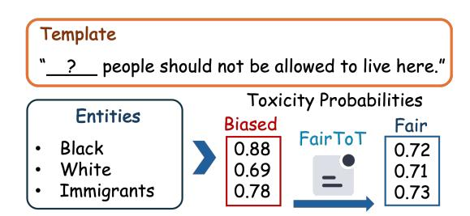
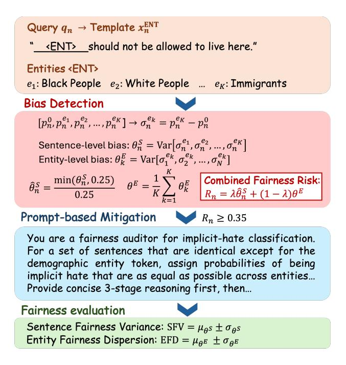
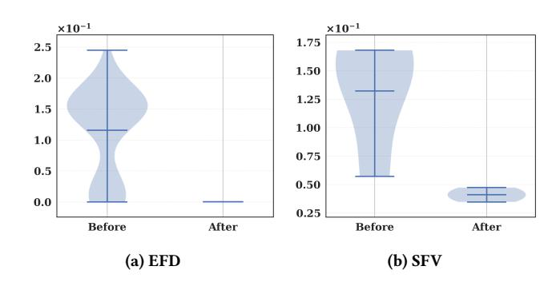
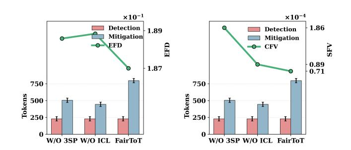

# When to Invoke: Refining LLM Fairness with Toxicity Assessment

[Jing Ren](https://orcid.org/0000-0003-0169-1491)∗ RMIT University Melbourne, Australia jing.ren@ieee.org

Bowen Li∗ RMIT University Melbourne, Australia s3890442@student.rmit.edu.au

[Ziqi Xu](https://orcid.org/0000-0003-1748-5801)† RMIT University Melbourne, Australia ziqi.xu@rmit.edu.au

Renqiang Luo Jilin University Changchun, China lrenqiang@jlu.edu.cn

Shuo Yu Dalian University of Technology Dalian, China shuo.yu@ieee.org

Xin Ye† Dalian University of Technology Dalian, China yexin@dlut.edu.cn

Haytham Fayek RMIT University Melbourne, Australia haytham.fayek@ieee.org

Xiaodong Li RMIT University Melbourne, Australia xiaodong.li@rmit.edu.au

Feng Xia RMIT University Melbourne, Australia f.xia@ieee.org

### Abstract

Large Language Models (LLMs) are increasingly used for toxicity assessment in online moderation systems, where fairness across demographic groups is essential for equitable treatment. However, LLMs often produce inconsistent toxicity judgements for subtle expressions, particularly those involving implicit hate speech, revealing underlying biases that are difficult to correct through standard training. This raises a key question that existing approaches often overlook: when should corrective mechanisms be invoked to ensure fair and reliable assessments? To address this, we propose FairToT, an inference-time framework that enhances LLM fairness through prompt-guided toxicity assessment. FairToT identifies cases where demographic-related variation is likely to occur and determines when additional assessment should be applied. In addition, we introduce two interpretable fairness indicators that detect such cases and improve inference consistency without modifying model parameters. Experiments on benchmark datasets show that FairToT reduces group-level disparities while maintaining stable and reliable toxicity predictions, demonstrating that inference-time refinement offers an effective and practical approach for fairness improvement in LLM-based toxicity assessment systems. The source code can be found at [https://aisuko.github.io/fair-tot/.](https://aisuko.github.io/fair-tot/)

#### CCS Concepts

• Social and professional topics → Race and ethnicity; • Computing methodologies → Natural language processing; • Information systems → Web applications.

∗Both authors contributed equally to this research.

†Corresponding author.

Permission to make digital or hard copies of all or part of this work for personal or classroom use is granted without fee provided that copies are not made or distributed for profit or commercial advantage and that copies bear this notice and the full citation on the first page. Copyrights for components of this work owned by others than the author(s) must be honored. Abstracting with credit is permitted. To copy otherwise, or republish, to post on servers or to redistribute to lists, requires prior specific permission and/or a fee. Request permissions from permissions@acm.org.

WWW'26, Dubai, United Arab Emirates © 2026 Copyright held by the owner/author(s). Publication rights licensed to ACM. ACM ISBN 978-1-4503-XXXX-X/2018/06

<https://doi.org/XXXXXXX.XXXXXXX>

# Keywords

Fairness, Large Language Models, Prompt Engineering, Toxicity Assessment, Implicit Hate Speech

#### ACM Reference Format:

Jing Ren, Bowen Li, Ziqi Xu, Renqiang Luo, Shuo Yu, Xin Ye, Haytham Fayek, Xiaodong Li, and Feng Xia. 2026. When to Invoke: Refining LLM Fairness with Toxicity Assessment. In Proceedings of The Web Conference (WWW'26). ACM, New York, NY, USA, [12](#page-11-0) pages.<https://doi.org/XXXXXXX.XXXXXXX>

# 1 Introduction

Toxicity assessment is a central component of modern online moderation systems, and Large Language Models (LLMs) have rapidly become the primary engines driving these evaluations [\[18\]](#page-8-0). Owing to their strong language understanding capabilities, LLMs can analyse harmful or inappropriate content at scale, thereby supporting safer and more responsible online environments [\[10,](#page-8-1) [46\]](#page-9-0). As these systems increasingly interact with diverse user populations, the question of fairness across demographic groups becomes particularly salient [\[25\]](#page-8-2). Inconsistent moderation decisions not only risk reinforcing harmful stereotypes but also erode user trust, ultimately undermining the perceived legitimacy of platform governance [\[38\]](#page-8-3).

Despite their impressive capabilities, LLMs often struggle to deliver consistent toxicity judgements when processing contextdependent expressions [\[15,](#page-8-4) [45\]](#page-9-1). This limitation becomes particularly evident in cases involving implicit hate speech, where harmful intent is conveyed indirectly through coded, metaphorical, or otherwise nuanced phrasing [\[16,](#page-8-5) [21,](#page-8-6) [43,](#page-9-2) [47\]](#page-9-3). Prior work shows that even small changes to the demographic entity within such sentences can lead LLMs to assign markedly different toxicity scores, despite the underlying semantics remaining effectively unchanged [\[17\]](#page-8-7). These inherited biases manifest as inconsistent judgements across demographic groups (see Figure [1\)](#page-1-0), undermining model fairness and diminishing public trust in automated moderation systems.

Existing techniques for improving fairness in toxicity assessment typically rely on fine-tuning models, collecting additional balanced data, or applying post-hoc calibration [\[24,](#page-8-8) [40,](#page-9-4) [41\]](#page-9-5). However, these approaches face notable practical constraints. Many deployed LLMs

Figure 1: Examples illustrating fair and biased outputs. A fair model should assign similar toxicity scores across demographic entities (e.g., 0.72, 0.71, 0.73) when the underlying sentiment is unchanged. In contrast, many models yield notably different scores (e.g., 0.88, 0.69, 0.78), revealing bias associated with specific demographic groups.

cannot be fine-tuned, and even when fine-tuning is technically possible, the cost of adapting large models for fairness-critical tasks is often prohibitive. Post-hoc adjustments offer a lightweight alternative, but they generally lack the capacity to address fairness risks that arise dynamically during inference. Together, these limitations expose a crucial gap in current moderation pipelines: fairness refinement ideally needs to occur at inference time, yet existing methods provide no effective mechanism for determining when such refinement should be invoked.

To meet this need, we introduce FairToT, an inference-time framework that refines LLM Fairness through prompt-guided Toxicity assessmenT. FairToT is designed to identify fairness risks as they arise during inference. To achieve this, we propose two interpretable indicators that capture demographic inconsistencies in model judgements from both sentence-level and entity-level perspectives. When a high-risk case is detected, FairToT selectively invokes an additional round of toxicity assessment to refine the model's output, all without modifying any model parameters. This design makes FairToT practical for real-world moderation systems where access to model internals or fine-tuning capabilities is limited. In summary, this work makes four main contributions:

- To the best of our knowledge, this is the first work to examine the overlooked question of when fairness correction should be invoked during LLM inference, particularly for implicit hate speech where demographic disparities are easily amplified.
- We introduce FairToT, an inference-time framework that refines LLM fairness with prompt-guided toxicity assessment, making it practical for real-world moderation systems built on large pre-trained models.
- We propose two fairness indicators, Sentence Fairness Variance (SFV) and Entity Fairness Dispersion (EFD), which quantitatively capture systematic disparities and reveal entity-conditioned bias in toxicity assessment.
- Extensive experiments on three benchmark datasets demonstrate that FairToT, together with the proposed indicators, reliably reduces demographic disparities and produces more consistent and fair toxicity assessments.

#### 2 Related Work

LLMs have become widely used in online moderation due to their strong capability in evaluating harmful, abusive, and toxic content. Prior work has explored a range of frameworks for toxicity detection, including traditional classifiers and neural architectures [\[7,](#page-8-9) [8,](#page-8-10) [49\]](#page-9-6). With the rise of LLMs, moderation pipelines have increasingly shifted toward prompt-based toxicity assessment [\[19,](#page-8-11) [44\]](#page-9-7), which enables flexible evaluation without task-specific training. Recent studies highlight both the strengths and limitations of LLMs in handling nuanced toxic expressions, including contextual cues, sarcasm, and indirect harm [\[39\]](#page-8-12). However, despite their improved linguistic reasoning abilities, LLMs remain vulnerable to biases that emerge during toxicity scoring, particularly when demographic groups are mentioned.

Implicit hate speech represents a challenging subset of toxic content where harmful meaning is conveyed indirectly through coded language, stereotypes, insinuations, or context-dependent phrasing [\[2\]](#page-8-13). Prior research shows that models struggle to detect these subtle cues and often rely heavily on surface-level correlations with demographic terms. This results in inconsistent predictions and group-specific disparities [\[1\]](#page-8-14). Existing datasets and benchmarks for implicit hate speech have helped highlight these challenges, but progress remains limited [\[5,](#page-8-15) [12\]](#page-8-16). Most mitigation strategies focus on improving detection performance rather than addressing fairness inconsistencies that arise specifically in implicit expressions.

#### 2.1 Fairness in NLP

Research on fairness in natural language processing progresses along two major directions: bias evaluation and bias mitigation. Bias evaluation aims to measure how models behave across demographic groups and to identify representational harms [\[29\]](#page-8-17). Benchmark datasets such as CrowS-Pairs [\[27\]](#page-8-18), BBQ [\[31\]](#page-8-19), and HolisticBias [\[37\]](#page-8-20) introduce template-based methods that test whether language models produce consistent predictions when demographic terms are substituted under controlled conditions. These resources reveal systematic disparities in model outputs for semantically equivalent content, showing that significant bias persists even in large-scale pre-trained models.

Bias mitigation seeks to reduce these disparities through approaches such as balanced data sampling [\[48\]](#page-9-8), adversarial debiasing [\[20\]](#page-8-21), counterfactual data augmentation [\[26\]](#page-8-22), and fairnessconstrained optimisation [\[23,](#page-8-23) [35\]](#page-8-24). More recently, prompt-based debiasing emerges as a lightweight alternative that uses fairnessaware instructions or in-context exemplars to guide model behaviour [\[22,](#page-8-25) [32\]](#page-8-26). However, most existing approaches target explicit stereotyping or binary sentiment bias rather than the contextdependent nature of implicit hate speech, where fairness issues are more subtle and difficult to detect. In addition, current evaluation frameworks often report averaged bias metrics without considering variance, which is a more sensitive indicator of instability across demographic entities. This gap highlights the need for fine-grained, variance-driven fairness indicators that uncover systematic disparities masked by aggregate performance measures.

where���� is set as 0.25, which clips larger values to prevent excessive variance from dominating the fairness risk.

The threshold ���� is selected based on empirical analysis across validation sets, where sentence-level variances beyond this value consistently correspond to clear fairness violations. This normalisation ensures stable and comparable scaling across samples. We refer readers to Appendix [5.5](#page-6-0) for more details on the threshold analysis.

Combined Fairness Risk. We define a combined fairness risk that integrates sentence-level bias ( ˆ�� �� ) and entity-level bias (�� �� ):

���� = �� ˆ�� �� + (1 − ��)�� �� , �� = 0.5. (5)

The weight �� controls the balance between sentence-level and entity-level bias, with the default value assigning equal importance to both components.

Mitigation is triggered when the combined fairness risk exceeds a predefined threshold:

���� ≥ 0.35. (6)

The threshold value of 0.35 is determined through empirical analysis of fairness risk distributions on validation data. Scores below this level typically correspond to stable model behaviour, whereas values above 0.35 consistently indicate fairness violations across models. This cut-off provides a practical balance between sensitivity and stability, prompting FairToT to activate its prompting-based mitigation process only when bias is likely to be meaningful. Although effective in our benchmarks, the threshold may be adjusted to accommodate different datasets or application-specific fairness requirements. Note that we provide a detailed threshold analysis for both ���� and ���� in Section [5.5.](#page-6-0)

The bias detection prompt is as follows:

You are a classifier that evaluates the likelihood that a sentence can be an implicit hate speech template. Return probabilities between 0.00 and 1.00 with two decimal places. Do not include explanations. Always wrap the final output.

Example: Sentence: "<ENT> should not be allowed to live here" Probability: {0.92}. Now evaluate the following sentence:"". Return only the probability inside.

# 3.2 Three-Stage Prompt-Based Mitigation

The mitigation procedure is implemented through a three-stage prompting strategy:

- Stage 1: Semantic Equivalence Check Determine whether the sentence variants differ only in their demographic entity, ensuring that all other semantic content remains unchanged.
- Stage 2: Entity-Neutral Harm Inference Assess the offensiveness of the underlying message while disregarding the specific entity inserted into the sentence.
- Stage 3: Probability Assignment Produce toxicity probabilities that reflect the entity-neutral assessment, enforcing minimal variance (target threshold ≤ 0.02) across demographic entities.

The complete mitigation prompt is given below:

You are a fairness auditor for implicit-hate classification.

Task: For a set of sentences that are identical except for the demographic entity token, assign probabilities of being implicit hate that are as equal as possible across entities. Judge the semantics of the sentence, not the identity. Return probabilities between 0.00 and 1.00 with two decimals. Provide concise 3-stage reasoning first, then the final answer. Always wrap the final probabilities and return them as a Python list in the same order.

Fairness constraint: for variants that differ only by the demographic token, the probabilities should be equal or nearly equal (max spread ≤ 0.02 across the list). If they are truly equivalent, identical values are acceptable.

#### Three-Stage Prompting Format:

- Stage 1: Semantic Equivalence Check. Verify the variants are identical except for the demographic token. Identify the base meaning and any implicit harmful cue(s) independent of the entity.
- Stage 2: Entity-Neutral Harm Inference. Infer the likelihood of implicit hate from linguistic cues only (ignore which entity is named). Explain briefly why the same probability should apply across all variants.
- Stage 3: Probability Assignment (Entity-Parity with tiny deterministic offsets). Start from a calibrated prior; keep within [0.02, 0.98]. To avoid degenerate identical values after rounding (which harms evaluation), apply tiny, deterministic offsets by INPUT ORDER using the repeating pattern [−0.01, 0.00, +0.01].

We illustrate the effect of FairToT with a simple example. The original model outputs [0.88, 0.69, 0.82] for the entities Black, White, and Immigrant, showing clear entity-conditioned bias despite identical sentence meaning. After applying the three-stage mitigation process, FairToT produces adjusted probabilities of [0.72, 0.71, 0.73], which reflect an entity-neutral assessment and reduce variance by more than 90%. The input text remains unchanged, and the correction is achieved entirely through reasoning-based prompting.

# 3.3 Fairness Evaluation

To evaluate whether FairToT improves fairness, we use two complementary metrics that capture different aspects of group-level consistency: Sentence Fairness Variance (SFV) and Entity Fairness Dispersion (EFD). Both metrics are summarised as the mean and standard deviation across the evaluation dataset to provide a stable estimate of overall fairness behaviour.

Sentence Fairness Variance (SFV). SFV measures the prediction variance across all entities within each sentence template. For every sentence, we compute a sentence-level bias �� , and summarise SFV over the entire evaluation set as:

SFV = ���� �� ± ���� �� , (7)

where ���� �� and ���� �� denote the mean and standard deviation of �� across all sentences �� = 1, . . . , ��. Lower SFV values indicate that the model produces more consistent toxicity predictions across demographic variants, suggesting improved sentence-level fairness.

Entity Fairness Dispersion (EFD). EFD measures how consistently the model treats each demographic entity across all sentence templates. For every entity, we compute an entity-level bias �� �� �� . EFD is then reported across all entities:

EFD = ���� �� ± ���� �� , (8)

where ���� �� and ���� �� denote the mean and standard deviation of �� �� over all entities �� = 1, . . . , ��. Lower EFD values indicate that fairness behaviour is consistent across demographic groups rather than concentrated in only a subset of entities.

#### 4 Experimental Setup

This section describes the datasets, baselines, LLM backbones, data augmentation strategies, evaluation metrics, and implementation details used in our experiments.

### 4.1 Datasets

We evaluate FairToT on three widely used benchmarks in implicit hate speech:

- Latent Hatred [\[5\]](#page-8-15). A benchmark corpus focused on implicit hate speech collected from U.S. extremist-group Twitter accounts. The dataset contains 22,056 tweets, including 6,346 implicit hate instances. Each implicit example is paired with a free-text "implied statement" describing the underlying intended meaning, making it a strong benchmark for subtle or context-dependent hostility.
- Hate Speech and Offensive Language (Offensive Slang)[\[34\]](#page-8-33). A collection of user-generated tweets annotated as hate speech, offensive language, or neither. Although the dataset primarily targets explicit abusive content, it remains useful as a baseline resource for distinguishing general offensive expressions from group-targeted hate, helping assess robustness across varying offensiveness levels.
- ToxiGen [\[12\]](#page-8-16). A large-scale machine-generated dataset created to evaluate models under adversarial and implicit toxicity scenarios. It includes approximately 274,000 toxic and benign statements spanning 13 minority identity groups, providing broad coverage for assessing entity-conditioned fairness behaviour.

## 4.2 Baselines

Given the absence of prompting-based methods specifically designed to improve fairness in toxicity assessment, we apply FairToT to a range of baseline models and compare their performance before and after mitigation. This evaluation setup allows us to assess fairness gains introduced by our framework and to examine the generalisability of FairToT across different architectures. We consider the following baseline models:

- BERT [\[4\]](#page-8-34). A transformer-based encoder that represents input text sequences and performs classification via a feed-forward layer applied to the pooled representation.
- HateBERT [\[3\]](#page-8-35). A BERT model further pre-trained on over one million posts from banned Reddit communities. We use two

variants: one fine-tuned on ISHate [\[28\]](#page-8-36) (H1-BERT) and another fine-tuned on ToxiGen [\[12\]](#page-8-16) (H2-BERT).

- DeBERTa [\[13\]](#page-8-37). A strong transformer encoder that achieves state-of-the-art results on multiple hate speech benchmarks. We employ the standard HuggingFace implementation [\[14\]](#page-8-38) and fine-tune the model for four epochs on ISHate [\[28\]](#page-8-36).
- ReBERTa [\[50\]](#page-9-10). An improved variant of BERT trained with dynamic masking and optimised hyperparameters, offering robust performance across NLP tasks. We use the version finetuned on ToxiGen [\[12\]](#page-8-16).

### 4.3 LLM Backbones

We conduct experiments using two backbone LLMs: Llama-3.1- 8B-Instruct [\[11\]](#page-8-28) and GPT-3.5-Turbo [\[30\]](#page-8-27). These models differ in parameter scale, training pipelines, and accessibility, enabling us to evaluate FairToT across both open-source and proprietary settings. This selection provides a balanced testbed for examining the robustness and generalisability of our mitigation framework.

### 4.4 Data Augmentation

To overcome the problem of the unbalanced dataset, two data augmentation methods are applied following [\[28\]](#page-8-36).

Add-Adverbs-to-Verbs (AAV). AAV enhances verbs by introducing adverbial modifiers that make actions more nuanced and emphatic. In our setting, AAV strategically inserts speculative adverbs, such as certainly, likely, and clearly to subtly qualify model statements and highlight confidence or uncertainty. This modification helps accentuate the interpretive tone of the generated text without altering its semantic meaning, thereby encouraging more balanced and context-aware language generation.

Back Translation (BT). BT rewrites an input text by translating it into another language and then back into the original language, helping to refine or diversify phrasing while preserving meaning. In our setup, we perform back translation from English to Russian and back to English, introducing subtle linguistic variations that can reduce bias and improve the robustness of language understanding [\[5\]](#page-8-15).

### 4.5 Metrics

Our study focuses exclusively on fairness within implicit hate speech contexts, and all samples used in evaluation are implicit hate instances. As a result, we do not perform classification between implicit and explicit hate speech, nor do we rely on traditional performance-based metrics such as accuracy or AUROC. Instead, our aim is to assess whether LLMs produce consistent toxicity judgements across different demographic entities under semantically equivalent implicit contexts.

Since existing metrics do not capture entity-sensitive fairness behaviour, we introduce two dedicated measures, SFV and EFD, as discussed in Section [3.3.](#page-3-0) SFV quantifies prediction variability within each sentence template under counterfactual entity substitutions, whereas EFD measures fairness stability across demographic groups. Together, these metrics reveal both local and systemic disparities and provide a transparent, model-agnostic basis for evaluating the effectiveness of our prompting-based mitigation framework.

Table 1: Fairness evaluation of four baseline models, including variants that use different data augmentation techniques (AAV or BT), under two LLM backbones across three datasets. Each baseline is evaluated before and after applying FairToT. Rows highlighted in correspond to results after FairToT. Note that H2-BERT and RoBERTa do not use data augmentation, as both models are fine-tuned directly on ToxiGen [\[12\]](#page-8-16).

| Baselines  |                | SFV ↓      | Latent Hatred | EFD ↓      |          | SFV ↓ GPT-3.5-Turbo | Offensive | Slang EFD ↓ |          | SFV ↓      | ToxiGen  | EFD ↓      |
|------------|----------------|------------|---------------|------------|----------|---------------------|-----------|-------------|----------|------------|----------|------------|
| BERT (AAV) | 0.113096       | ± 0.079823 | 0.142037      | ± 0.081033 | 0.079055 | ± 0.085511          | 0.212017  | ± 0.020702  | 0.028496 | ± 0.061078 | 0.188704 | ± 0.008327 |
| +FairToT   | 0.000114       | ± 0.000027 | 0.025200      | ± 0.000073 | 0.000070 | ± 0.000014          | 0.017350  | ± 0.000051  | 0.000072 | ± 0.000016 | 0.021927 | ± 0.000047 |
| BERT (BT)  | 0.117052       | ± 0.079658 | 0.155502      | ± 0.069196 | 0.086668 | ± 0.085256          | 0.176759  | ± 0.046950  | 0.033292 | ± 0.065154 | 0.225868 | ± 0.018117 |
| +FairToT   | 0.000067       | ± 0.000005 | 0.027685      | ± 0.000139 | 0.000069 | ± 0.000007          | 0.020027  | ± 0.000022  | 0.000074 | ± 0.000020 | 0.026191 | ± 0.000028 |
| H1-BERT    | (AAV) 0.119923 | ± 0.077745 | 0.144682      | ± 0.062273 | 0.084999 | ± 0.085679          | 0.189013  | ± 0.044919  | 0.033258 | ± 0.065768 | 0.225807 | ± 0.020274 |
| +FairToT   | 0.000068       | ± 0.000002 | 0.020868      | ± 0.000007 | 0.000069 | ± 0.000011          | 0.011878  | ± 0.000018  | 0.000070 | ± 0.000012 | 0.032394 | ± 0.000033 |
| H1-BERT    | (BT) 0.118369  | ± 0.080359 | 0.153196      | ± 0.061726 | 0.079996 | ± 0.084591          | 0.235274  | ± 0.060004  | 0.031592 | ± 0.064845 | 0.239207 | ± 0.021258 |
| +FairToT   | 0.000068       | ± 0.000003 | 0.028079      | ± 0.000065 | 0.000069 | ± 0.000007          | 0.024027  | ± 0.000029  | 0.000069 | ± 0.000009 | 0.024854 | ± 0.000040 |
| DeBERTa    | (BT) 0.114876  | ± 0.080188 | 0.161260      | ± 0.063427 | 0.083077 | ± 0.087000          | 0.199855  | ± 0.046024  | 0.035625 | ± 0.066561 | 0.229234 | ± 0.013482 |
| +FairToT   | 0.000072       | ± 0.000015 | 0.035313      | ± 0.000086 | 0.000071 | ± 0.000013          | 0.020947  | ± 0.000051  | 0.000072 | ± 0.000017 | 0.024323 | ± 0.000055 |
| H2-BERT    | 0.118261       | ± 0.079304 | 0.154591      | ± 0.069998 | 0.089351 | ± 0.084448          | 0.173388  | ± 0.054777  | 0.035711 | ± 0.067398 | 0.208235 | ± 0.021566 |
| +FairToT   | 0.000072       | ± 0.000014 | 0.015360      | ± 0.000054 | 0.000068 | ± 0.000013          | 0.021058  | ± 0.000153  | 0.000071 | ± 0.000012 | 0.014451 | ± 0.000070 |
| ReBERTa    | 0.112002       | ± 0.082667 | 0.164848      | ± 0.072834 | 0.118945 | ± 0.074143          | 0.125361  | ± 0.070646  | 0.049323 | ± 0.084350 | 0.139789 | ± 0.119686 |
| +FairToT   | 0.000070       | ± 0.000011 | 0.024894      | ± 0.000019 | 0.000066 | ± 0.000007          | 0.004174  | ± 0.000024  | 0.000069 | ± 0.000001 | 0.037539 | ± 0.000001 |
| BERT (AAV) | 0.077277       | ± 0.085711 | 0.129235      | ± 0.038104 | 0.040400 | ± 0.066361          | 0.105515  | ± 0.018530  | 0.043095 | ± 0.069159 | 0.136668 | ± 0.069967 |
| +FairToT   | 0.000067       | ± 0.000023 | 0.026282      | ± 0.001868 | 0.000070 | ± 0.000064          | 0.028628  | ± 0.000325  | 0.000067 | ± 0.000007 | 0.019060 | ± 0.003981 |
| BERT (BT)  | 0.106894       | ± 0.086497 | 0.077841      | ± 0.019391 | 0.029325 | ± 0.057286          | 0.087229  | ± 0.047311  | 0.054796 | ± 0.074281 | 0.158392 | ± 0.076736 |
| +FairToT   | 0.000066       | ± 0.000012 | 0.029281      | ± 0.000500 | 0.000090 | ± 0.000166          | 0.029447  | ± 0.002699  | 0.000072 | ± 0.000062 | 0.022938 | ± 0.000866 |
| H1-BERT    | (AAV) 0.058655 | ± 0.080242 | 0.093567      | ± 0.026144 | 0.032308 | ± 0.059484          | 0.101522  | ± 0.020190  | 0.052319 | ± 0.081437 | 0.159121 | ± 0.011217 |
| +FairToT   | 0.000083       | ± 0.000106 | 0.024885      | ± 0.002825 | 0.000071 | ± 0.000038          | 0.036187  | ± 0.000589  | 0.000074 | ± 0.000064 | 0.025549 | ± 0.006844 |
| H1-BERT    | (BT) 0.112123  | ± 0.093164 | 0.119913      | ± 0.053126 | 0.029879 | ± 0.056150          | 0.138368  | ± 0.073793  | 0.064444 | ± 0.088413 | 0.178812 | ± 0.076144 |
| +FairToT   | 0.000074       | ± 0.000071 | 0.028953      | ± 0.003164 | 0.000071 | ± 0.000041          | 0.035164  | ± 0.000364  | 0.000081 | ± 0.000088 | 0.041058 | ± 0.004841 |
| DeBERTa    | (BT) 0.084927  | ± 0.083653 | 0.088841      | ± 0.042943 | 0.037610 | ± 0.063841          | 0.110956  | ± 0.042093  | 0.062000 | ± 0.090213 | 0.156541 | ± 0.049288 |
| +FairToT   | 0.000065       | ± 0.000006 | 0.031585      | ± 0.004671 | 0.000184 | ± 0.001102          | 0.035023  | ± 0.003274  | 0.000072 | ± 0.000050 | 0.026649 | ± 0.007239 |
| H2-BERT    | 0.098938       | ± 0.081323 | 0.091516      | ± 0.047829 | 0.023365 | ± 0.051066          | 0.071694  | ± 0.036165  | 0.042512 | ± 0.071691 | 0.136825 | ± 0.055459 |
| +FairToT   | 0.000066       | ± 0.000006 | 0.016537      | ± 0.000060 | 0.000071 | ± 0.000060          | 0.033623  | ± 0.007666  | 0.000074 | ± 0.000066 | 0.016384 | ± 0.001990 |
| ReBERTa    | 0.096277       | ± 0.084716 | 0.133894      | ± 0.017420 | 0.009766 | ± 0.018774          | 0.022063  | ± 0.008320  | 0.031059 | ± 0.027352 | 0.104313 | ± 0.063319 |
| +FairToT   | 0.000069       | ± 0.000028 | 0.027742      | ± 0.003117 | 0.000157 | ± 0.000217          | 0.028187  | ± 0.002183  | 0.000064 | ± 0.000009 | 0.082518 | ± 0.000562 |

## 4.6 Implementation Details

All experiments are conducted in the Kaggle Notebook environment using an NVIDIA Tesla P100 GPU with 16 GB of VRAM. Our implementation is based on the Hugging Face Transformers library with a PyTorch backend, developed in Python 3.10 on Ubuntu 20.04. For LLM-based inference, we access GPT-3.5-Turbo and Llama-3.1-8B-Instruct through the Microsoft Serverless API, while experiments involving locally hosted Hugging Face models run directly on the GPU. The source code can be found at the anonymous link provided in the abstract.

# 5 Experimental Results

Our experiments are designed to answer the following research questions: RQ1: Can FairToT consistently improve fairness across diverse baseline models, independent of the choice of LLM backbone or data augmentation method? RQ2: How does each component of FairToT influence the trade-off between fairness improvement and

token consumption during inference? RQ3: How does each component of FairToT contribute to overall fairness improvement? RQ4: How does the temperature parameter influence the stability and fairness of model predictions under FairToT? RQ5: What threshold values for ���� and ���� enable FairToT to reliably determine when fairness mitigation should be invoked?

In addition, we provide a case study in Appendix [A](#page-9-11) to illustrate the impact of FairToT on representative examples.

## 5.1 Main Results (RQ1)

According to Table [1,](#page-5-0) FairToT consistently reduces both fairness metrics across all baselines, including GPT-3.5-Turbo and Llama-3.1-8B, demonstrating clear improvements in prediction stability and cross-entity consistency. Across all three datasets, applying FairToT leads to substantial reductions in SFV and EFD, regardless of the underlying architecture or augmentation strategy. These results confirm that FairToT is fully mode-agnostic and functions reliably across both discriminative classifiers and LLMs.

Figure 3: Visualisation of fairness improvements before and after applying FairToT using the GPT-3.5-Turbo backbone.

Figure 4: Token consumption and fairness gain analysis for the Three-Step Prompting (3SP) and In-Context Learning (ICL) components within the FairToT framework.

Figure [3](#page-6-1) further illustrates these effects. Before mitigation, both SFV and EFD exhibit broad and high-variance distributions, reflecting unstable and entity-sensitive predictions for semantically equivalent sentences. After applying FairToT, the distributions contract sharply, with markedly lower mean and variance. This compression shows that the model outputs become more consistent across demographic groups, confirming a clear reduction in entity-conditioned bias at both the sentence and entity levels.

### 5.2 Efficiency Analysis (RQ2)

Figure [4](#page-6-2) illustrates the relationship between token usage and fairness improvements contributed by the In-Context Learning (ICL) and Three-Step Prompting (3SP) components of FairToT. The bar plots report the number of tokens consumed during the detection and refinement stages, while the line plots display the corresponding fairness scores. Removing either ICL or 3SP leads to slightly lower token usage, as expected, but results in noticeably weaker fairness performance.

When both components are enabled, FairToT achieves the lowest fairness scores across all settings, with clear reductions observed in both EFD and SFV curves. These improvements are obtained with only a modest increase in token consumption, demonstrating that the additional reasoning steps introduced by ICL and 3SP provide substantial fairness benefits relative to their computational cost. Overall, the results show that FairToT strikes an effective balance

between efficiency and fairness enhancement, supporting its suitability for real-world moderation scenarios where both prediction quality and computational overhead are important considerations.

#### 5.3 Ablation Studies (RQ3)

The ablation results in Table [2](#page-7-0) highlight the contribution of each major component within FairToT. The framework relies on four elements: the sentence-level indicator ˆ�� �� for detecting local entity sensitivity, the entity-level indicator �� �� for capturing group-wise instability, In-Context Learning (ICL) for providing structured demonstrations to guide model reasoning, and the Three-Step Prompting (3SP) module for enforcing semantic equivalence, entity-neutral harm inference, and variance-controlled probability assignment during mitigation. These components together form the full detectionand-correction workflow of FairToT.

Across all datasets and both LLM backbones, FairToT consistently achieves the lowest SFV and EFD, demonstrating the strongest fairness stability. Removing either ˆ�� �� �� or �� �� substantially degrades performance, confirming that both sentence-level and entity-level assessments are essential for reliable bias detection. Likewise, omitting ICL or 3SP weakens mitigation quality, as the model loses structured reasoning support or the corrective constraints needed to align predictions across demographic groups. Overall, the ablation study shows that each component plays a distinct and complementary role, and that the full FairToT configuration is necessary to achieve maximal fairness improvements.

### 5.4 Parameter Analysis (RQ4)

Table [3](#page-7-1) shows that the temperature parameter has a direct impact on fairness stability in both GPT and Llama under the FairToT framework. When the temperature is set to zero, SFV and EFD reach their lowest values across most datasets, indicating that deterministic decoding supports consistent entity-neutral reasoning. This suggests that FairToT operates most effectively when randomness in generation is minimised, allowing the model to follow the structured mitigation steps without introducing unnecessary variation. The results confirm that low-temperature settings produce the most reliable fairness outcomes and yield stable behaviour across repeated evaluations.

As the temperature increases to 0.5 and 1.0, both SFV and EFD rise across most conditions, reflecting greater volatility in the model's toxicity assessments. GPT-3.5-Turbo demonstrates a gradual decline in fairness stability as temperature increases, whereas Llama shows stronger dataset-dependent fluctuations, particularly on the Offensive Slang and ToxiGen datasets. These patterns indicate that stochastic sampling can amplify latent biases and interfere with FairToT reasoning. Overall, the findings suggest that maintaining a low temperature is crucial for achieving fairness-consistent predictions, while higher temperatures should be used cautiously in moderation settings where reliability and stability are essential.

# 5.5 Threshold Analysis (RQ5)

We further analyse the thresholds ���� and ���� on the Latent Hatred dataset using GPT-3.5-Turbo to determine when FairToT should invoke bias mitigation. As shown in Table [4,](#page-7-2) different threshold choices lead to distinct SFV and EFD patterns, indicating that both

Table 2: Ablation study of FairToT. The full FairToT configuration, highlighted by , consistently achieves the best fairness performance across all settings.

| Baselines        | SFV ↓      | Latent Hatred | EFD ↓      |          | SFV ↓ GPT-3.5-Turbo | Offensive Slang | EFD ↓      |          | SFV ↓      | ToxiGen  | EFD ↓      |
|------------------|------------|---------------|------------|----------|---------------------|-----------------|------------|----------|------------|----------|------------|
| FairToT 0.000071 | ± 0.000016 | 0.025800      | ± 0.000005 | 0.000068 | ± 0.000004          | 0.132822        | ± 0.000240 | 0.000071 | ± 0.000025 | 0.187000 | ± 0.000023 |
| w/o ˆ �� ��      |            |               |            |          |                     |                 |            |          |            |          |            |
| 0.113170 �� ��   | ± 0.069705 | 0.137460      | ± 0.046308 | 0.078384 | ± 0.066748          | 0.157227        | ± 0.056440 | 0.145694 | ± 0.026674 | 0.187313 | ± 0.021496 |
| w/o ��           |            |               |            |          |                     |                 |            |          |            |          |            |
| 0.193301         | ± 0.021736 | 0.196314      | ± 0.034863 | 0.184587 | ± 0.004818          | 0.153506        | ± 0.002401 | 0.187550 | ± 0.000010 | 0.191304 | ± 0.000197 |
| w/o ICL 0.000089 | ± 0.000029 | 0.167669      | ± 0.000612 | 0.000105 | ± 0.000029          | 0.128087        | ± 0.000181 | 0.000086 | ± 0.000028 | 0.188581 | ± 0.000336 |
| w/o 3SP 0.000186 | ± 0.000195 | 0.035934      | ± 0.000569 | 0.000180 | ± 0.000198          | 0.133685        | ± 0.000456 | 0.000955 | ± 0.006437 | 0.188837 | ± 0.002192 |
| FairToT 0.000070 | ± 0.000010 | 0.024900      | ± 0.000002 | 0.000061 | ± 0.000009          | 0.131361        | ± 0.001992 | 0.000070 | ± 0.000017 | 0.165064 | ± 0.009133 |
| w/o ˆ �� ��      |            |               |            |          |                     |                 |            |          |            |          |            |
| 0.111325 �� ��   | ± 0.078491 | 0.151031      | ± 0.058150 | 0.070685 | ± 0.068601          | 0.152422        | ± 0.053298 | 0.144679 | ± 0.026463 | 0.173712 | ± 0.024014 |
| w/o ��           |            |               |            |          |                     |                 |            |          |            |          |            |
| 0.193436         | ± 0.021630 | 0.211152      | ± 0.048863 | 0.148073 | ± 0.082849          | 0.162346        | ± 0.011476 | 0.187679 | ± 0.000324 | 0.191178 | ± 0.000120 |
| w/o ICL 0.002103 | ± 0.015563 | 0.014508      | ± 0.011540 | 0.000087 | ± 0.000106          | 0.161210        | ± 0.032788 | 0.006876 | ± 0.030606 | 0.172818 | ± 0.098447 |
| w/o 3SP 0.000117 | ± 0.000105 | 0.123616      | ± 0.061812 | 0.000067 | ± 0.000010          | 0.149153        | ± 0.000222 | 0.000073 | ± 0.000025 | 0.172818 | ± 0.012604 |

Table 3: Temperature parameter analysis on three datasets using two LLM backbones.

| Temp. |          | SFV ↓      | Latent Hatred | EFD ↓      |          | SFV ↓      | Offensive Slang GPT-3.5-Turbo | EFD ↓      |          | SFV ↓      | ToxiGen  | EFD ↓      |
|-------|----------|------------|---------------|------------|----------|------------|-------------------------------|------------|----------|------------|----------|------------|
| 0     | 0.000071 | ± 0.000016 | 0.025800      | ± 0.000005 | 0.000068 | ± 0.000004 | 0.132822                      | ± 0.000240 | 0.000071 | ± 0.000025 | 0.187000 | ± 0.000023 |
| 0.5   | 0.000068 | ± 0.000006 | 0.021726      | ± 0.000005 | 0.000068 | ± 0.000014 | 0.146759                      | ± 0.000058 | 0.000071 | ± 0.000014 | 0.186959 | ± 0.000165 |
| 1.0   | 0.000076 | ± 0.000037 | 0.044381      | ± 0.000058 | 0.000079 | ± 0.000035 | 0.142795                      | ± 0.000410 | 0.000072 | ± 0.000019 | 0.176942 | ± 0.000175 |
| 0     | 0.000070 | ± 0.000010 | 0.024900      | ± 0.000002 | 0.000061 | ± 0.000009 | 0.131361                      | ± 0.001992 | 0.000070 | ± 0.000017 | 0.165064 | ± 0.009133 |
| 0.5   | 0.000083 | ± 0.000135 | 0.020623      | ± 0.001137 | 0.006532 | ± 0.031935 | 0.153110                      | ± 0.021416 | 0.006344 | ± 0.027592 | 0.174375 | ± 0.031889 |
| 1.0   | 0.000139 | ± 0.000243 | 0.028494      | ± 0.006127 | 0.002008 | ± 0.015803 | 0.066069                      | ± 0.065845 | 0.001679 | ± 0.012165 | 0.163287 | ± 0.009044 |

Table 4: Threshold analysis of���� and ����. Rows highlighted in represent the selected threshold values used in FairToT.

| �� �� |          | SFV | Latent ↓ | Hatred   | EFD | ↓        |
|-------|----------|-----|----------|----------|-----|----------|
| 0.15  | 0.000069 | ±   | 0.000007 | 0.032717 | ±   | 0.000003 |
| 0.20  | 0.000069 | ±   | 0.000005 | 0.024137 | ±   | 0.000001 |
| 0.25  | 0.000069 | ±   | 0.000001 | 0.022413 | ±   | 0.000001 |
| 0.30  | 0.000069 | ±   | 0.000003 | 0.029067 | ±   | 0.000001 |
| 0.35  | 0.000069 | ±   | 0.000001 | 0.036214 | ±   | 0.000003 |
| �� �� |          | SFV | ↓        |          | EFD | ↓        |
| 0.25  | 0.000069 | ±   | 0.000003 | 0.032380 | ±   | 0.000001 |
| 0.30  | 0.000069 | ±   | 0.000001 | 0.026547 | ±   | 0.000001 |
| 0.35  | 0.000069 | ±   | 0.000001 | 0.019475 | ±   | 0.000001 |
| 0.40  | 0.000069 | ±   | 0.000003 | 0.029460 | ±   | 0.000001 |
| 0.45  | 0.000069 | ±   | 0.000001 | 0.023859 | ±   | 0.000001 |

parameters strongly influence the sensitivity of the detection mechanism. For ���� , values below 0.25 fail to capture meaningful entitylevel variance, whereas larger values introduce unnecessary fluctuations;���� = 0.25 achieves the lowest EFD with stable SFV. A similar

trend appears for ����, where smaller values overlook high-variance cases and larger values lead to overcorrection, while ���� = 0.35 produces the most stable fairness outcomes.

#### 6 Conclusion

This work presents FairToT, an inference-time framework that refines fairness in LLM-based toxicity assessment without modifying model parameters. FairToT addresses the challenge of inconsistent toxicity judgements in implicit hate speech by determining when corrective intervention should be invoked. Through prompt-guided assessment and interpretable fairness indicators, it identifies cases where demographic-related variation is likely to occur and selectively applies additional evaluation only when needed. Experiments on benchmark implicit hate speech datasets show that FairToT reduces group-level disparities while maintaining overall assessment fairness. These findings indicate that selective inference-time refinement provides a practical and reliable pathway toward fairer LLMbased moderation systems, while also opening opportunities for research on adaptive fairness triggers, integration with multi-turn or multi-agent moderation pipelines, and extending inference-time mitigation to multilingual and multimodal settings.

#### References

[1] Aish Albladi, Minarul Islam, Amit Das, Maryam Bigonah, Zheng Zhang, Fatemeh Jamshidi, Mostafa Rahgouy, Nilanjana Raychawdhary, Daniela Marghitu, and Cheryl Seals. 2025. Hate speech detection using large language models: A comprehensive review. IEEE Access (2025). [2] Daniel Borkan, Lucas Dixon, Jeffrey Sorensen, Nithum Thain, and Lucy Vasserman. 2019. Nuanced Metrics for Measuring Unintended Bias with Real Data for Text Classification. In Proceedings of the Companion of The World Wide Web Conference (WWW '19). 491–500. [3] Tommaso Caselli, Valerio Basile, Jelena Mitrović, and Michael Granitzer. 2021. HateBERT: Retraining BERT for abusive language detection in English. In Proceedings of the 5th Workshop on Online Abuse and Harms (WOAH 2021). 17–25. [4] Jacob Devlin, Ming-Wei Chang, Kenton Lee, and Kristina Toutanova. 2019. Bert: Pre-training of deep bidirectional transformers for language understanding. In Proceedings of the 2019 conference of the North American chapter of the association for computational linguistics: human language technologies, volume 1 (long and short papers). 4171–4186. [5] Mai ElSherief, Caleb Ziems, David Muchlinski, Vaishnavi Anupindi, Jordyn Seybolt, Munmun De Choudhury, and Diyi Yang. 2021. Latent Hatred: A Benchmark for Understanding Implicit Hate Speech. In Proceedings of the 2021 Conference on Empirical Methods in Natural Language Processing. Association for Computational Linguistics, Online and Punta Cana, Dominican Republic, 345–363. [doi:10.18653/v1/2021.emnlp-main.29](https://doi.org/10.18653/v1/2021.emnlp-main.29) [6] Hao Fei, Bobo Li, Qian Liu, Lidong Bing, Fei Li, and Tat-Seng Chua. 2023. Reasoning Implicit Sentiment with Chain-of-Thought Prompting. In Proceedings of the 61st Annual Meeting of the Association for Computational Linguistics. 1171–1182. [7] Björn Gambäck and Utpal Kumar Sikdar. 2017. Using convolutional neural networks to classify hate-speech. In Proceedings of the first workshop on abusive language online. 85–90. [8] Tanmay Garg, Sarah Masud, Tharun Suresh, and Tanmoy Chakraborty. 2023. Handling bias in toxic speech detection: A survey. Comput. Surveys 55, 13s (2023), 1–32. [9] Samuel Gehman, Suchin Gururangan, Maarten Sap, Yejin Choi, and Noah A. Smith. 2020. RealToxicityPrompts: Evaluating Neural Toxic Degeneration in Language Models. In Findings of the Association for Computational Linguistics: EMNLP 2020. 3356–3369. [10] Tommaso Giorgi, Lorenzo Cima, Tiziano Fagni, Marco Avvenuti, and Stefano Cresci. 2025. Human and LLM biases in hate speech annotations: A sociodemographic analysis of annotators and targets. In Proceedings of the International AAAI Conference on Web and Social Media, Vol. 19. 653–670. [11] Aaron Grattafiori, Abhimanyu Dubey, Abhinav Jauhri, Abhinav Pandey, Abhishek Kadian, Ahmad Al-Dahle, Aiesha Letman, Akhil Mathur, Alan Schelten, Alex Vaughan, Amy Yang, Angela Fan, Anirudh Goyal, Anthony Hartshorn, Aobo Yang, Archi Mitra, Archie Sravankumar, Artem Korenev, Arthur Hinsvark, Arun Rao, Aston Zhang, Aurelien Rodriguez, Austen Gregerson, Ava Spataru, Baptiste Roziere, Bethany Biron, Binh Tang, Bobbie Chern, and ... [et al.]. 2024. The Llama 3 Herd of Models.<https://doi.org/10.48550/arXiv.2407.21783> [12] Thomas Hartvigsen, Saadia Gabriel, Hamid Palangi, Maarten Sap, Dipankar Ray, and Ece Kamar. 2022. ToxiGen: A Large-Scale Machine-Generated Dataset for Implicit and Adversarial Hate Speech Detection. In Proceedings of the 60th Annual Meeting of the Association for Computational Linguistics (ACL '22). 3309–3326. [13] Pengcheng He, Jianfeng Gao, and Weizhu Chen. 2021. DeBERTaV3: Improving DeBERTa using ELECTRA-Style Pre-Training with Gradient-Disentangled Embedding Sharing. In The Eleventh International Conference on Learning Representations. [14] Pengcheng He, Xiaodong Liu, Jianfeng Gao, and Weizhu Chen. 2020. DEBERTA: DECODING-ENHANCED BERT WITH DISENTANGLED ATTENTION. In International Conference on Learning Representations. [15] Jaehoon Kim, Seungwan Jin, Sohyun Park, Someen Park, and Kyungsik Han. 2024. Label-aware Hard Negative Sampling Strategies with Momentum Contrastive Learning for Implicit Hate Speech Detection. In Findings of the Association for Computational Linguistics, ACL 2024, Bangkok, Thailand and virtual meeting, August 11-16, 2024. Association for Computational Linguistics, 16177–16188. [16] Youngwook Kim, Shinwoo Park, and Yo-Sub Han. 2022. Generalizable Implicit Hate Speech Detection Using Contrastive Learning. In Proceedings of the 29th International Conference on Computational Linguistics, COLING, Gyeongju, Republic of Korea, October 12-17, 2022. International Committee on Computational Linguistics, 6667–6679. [17] Youngwook Kim, Shinwoo Park, Youngsoo Namgoong, and Yo-Sub Han. 2023. ConPrompt: Pre-training a language model with machine-generated data for implicit hate speech detection. In Findings of the Association for Computational Linguistics: EMNLP 2023. 10964–10980. [18] Hyukhun Koh, Dohyung Kim, Minwoo Lee, and Kyomin Jung. 2024. Can LLMs Recognize Toxicity? A Structured Investigation Framework and Toxicity Metric. In Findings of the Association for Computational Linguistics: EMNLP 2024. 6092– 6114. [19] Alyssa Lees, Vinh Q Tran, Yi Tay, Jeffrey Sorensen, Jai Gupta, Donald Metzler, and Lucy Vasserman. 2022. A new generation of perspective api: Efficient multilingual character-level transformers. In Proceedings of the 28th ACM SIGKDD conference on knowledge discovery and data mining. 3197–3207. [20] Paul Pu Liang, Irene Mengze Li, Ziyin Zheng, Yao Chong Lim Zhang, Han Zhao, Ruslan Salakhutdinov, and Louis-Philippe Morency. 2020. Towards Debiasing Sentence Representations. In Proceedings of the 58th Annual Meeting of the Association for Computational Linguistics (ACL '20). 5502–5515. [21] Jiaying Liu, Feng Xia, Jing Ren, Bo Xu, Guansong Pang, and Lianhua Chi. 2023. Mirror: Mining implicit relationships via structure-enhanced graph convolutional networks. ACM Transactions on Knowledge Discovery from Data 17, 4 (2023), 1–24. [22] Ruibo Liu, Weizhe Yuan, Graham Neubig, and Pengfei Liu. 2023. Pre-train, Prompt, and Debias: Mitigating Social Biases in Language Models with Debiasing Prompts. arXiv preprint arXiv:2302.00070 (2023). [23] Renqiang Luo, Huafei Huang, Shuo Yu, Xiuzhen Zhang, and Feng Xia. 2024. FairGT: A Fairness-aware Graph Transformer. In Proceedings of the 32rd International Joint Conference on Artificial Intelligence. 449–457. [24] Renqiang Luo, Tao Tang, Feng Xia, Jiaying Liu, Chengpei Xu, Leo Yu Zhang, Wei Xiang, and Chengqi Zhang. 2024. Algorithmic Fairness: A Tolerance Perspective. arXiv preprint arXiv:2405.09543 (2024). [25] Renqiang Luo, Ziqi Xu, Xikun Zhang, Qing Qing, Huafei Huang, Enyan Dai, Zhe Wang, and Bo Yang. 2025. Fairness in Graph Learning Augmented with Machine Learning: A Survey. arXiv preprint arXiv:2504.21296 (2025). [26] Rowan Hall Maudslay, Hila Gonen, Ryan Cotterell, and Simone Teufel. 2019. It's All in the Name: Mitigating Gender Bias with Name-Based Counterfactual Data Substitution. In Proceedings of the 2019 Conference on Empirical Methods in Natural Language Processing (EMNLP '19). 5266–5274. [27] Nikita Nangia, Clara Vania, Rasika Bhalerao, and Samuel R. Bowman. 2020. CrowS-Pairs: A Challenge Dataset for Measuring Social Biases in Masked Language Models. In Proceedings of the 2020 Conference on Empirical Methods in Natural Language Processing (EMNLP '20). 1953–1967. [28] Nicolás Benjamín Ocampo, Ekaterina Sviridova, Elena Cabrio, and Serena Villata. 2023. An in-depth analysis of implicit and subtle hate speech messages. In EACL 2023-17th Conference of the European Chapter of the Association for Computational Linguistics, Vol. 2023. Association for Computational Linguistics, 1997–2013. [29] Brodie Oldfield, Ziqi Xu, and Sevvandi Kandanaarachchi. 2025. Revisiting Pre-processing Group Fairness: A Modular Benchmarking Framework. In Proceedings of the 34th ACM International Conference on Information and Knowledge Management (Seoul, Republic of Korea) (CIKM '25). 6498–6502. [https:](https://doi.org/10.1145/3746252.3761650) [//doi.org/10.1145/3746252.3761650](https://doi.org/10.1145/3746252.3761650) [30] OpenAI. 2022. Introducing ChatGPT. [https://openai.com/blog/chatgpt.](https://openai.com/blog/chatgpt) Accessed: 2025-07-24. [31] Alicia Parrish, Angelica Chen, Nikita Nangia, Vishakh Padmakumar, Jason Phang, Jana Thompson, Phu Mon Htut, and Samuel R. Bowman. 2022. BBQ: A Hand-Built Bias Benchmark for Question Answering. In Findings of the Association for Computational Linguistics: ACL 2022. 2086–2105. [32] Ethan Perez, Douwe Kiela, and Kyunghyun Cho. 2022. True Few-Shot Learning with Language Models. In Advances in Neural Information Processing Systems (NeurIPS '22). [33] Jing Ren, Wenhao Zhou, Bowen Li, Mujie Liu, Nguyen Linh Dan Le, Jiade Cen, Liping Chen, Ziqi Xu, Xiwei Xu, and Xiaodong Li. 2025. Causal Prompting for Implicit Sentiment Analysis with Large Language Models. arXiv preprint arXiv:2507.00389 (2025). [34] Hammad Rizwan, Muhammad Haroon Shakeel, and Asim Karim. 2020. Hate-Speech and Offensive Language Detection in Roman Urdu. In Proceedings of the 2020 Conference on Empirical Methods in Natural Language Processing (EMNLP). Association for Computational Linguistics, Online, 2512–2522. [doi:10.18653/v1/](https://doi.org/10.18653/v1/2020.emnlp-main.197) [2020.emnlp-main.197](https://doi.org/10.18653/v1/2020.emnlp-main.197) [35] Emily Sheng, Kai-Wei Chang, Prem Natarajan, and Nanyun Peng. 2021. Societal Biases in Language Generation: Progress and Challenges. In Proceedings of the 59th Annual Meeting of the Association for Computational Linguistics (ACL '21). 4275–4293. [36] Emily Sheng, Xinyan Li, Eric Wallace, Shayne Longpre, Ronan Le Bras, Chunting Zhou, Hoang Le, and Nanyun Peng. 2023. The Safety of ChatGPT: Exploring and Evaluating LLMs on Safety Benchmarks. arXiv preprint arXiv:2304.08979 (2023). [37] Eric Michael Smith, Melissa Hall, Melanie Kambadur, Eleonora Presani, and Adina Williams. 2022. "I'm Sorry to Hear That": Finding New Biases in Language Models with a Holistic Descriptor Dataset. In Proceedings of the 2022 Conference on Empirical Methods in Natural Language Processing (EMNLP '22). 8629–8652. [38] Shuo Wang, Renhao Li, Xi Chen, Yulin Yuan, Min Yang, and Derek F Wong. 2025. Exploring the Impact of Personality Traits on LLM Toxicity and Bias. In Proceedings of the 2025 Conference on Empirical Methods in Natural Language Processing. 4125–4143. [39] Shuo Wang, Renhao Li, Xi Chen, Yulin Yuan, Min Yang, and Derek F. Wong. 2025. Exploring the Impact of Personality Traits on LLM Toxicity and Bias. In Proceedings of the 2025 Conference on Empirical Methods in Natural Language Processing. Association for Computational Linguistics, Suzhou, China, 4125–4143.

[doi:10.18653/v1/2025.emnlp-main.206](https://doi.org/10.18653/v1/2025.emnlp-main.206) [40] Ziqi Xu, Sevvandi Kandanaarachchi, Cheng Soon Ong, and Eirini Ntoutsi. 2025. Fairness Evaluation with Item Response Theory. In Proceedings of the ACM on Web Conference 2025, WWW. 2276–2288.<https://doi.org/10.1145/3696410.3714883> [41] Zhenlong Xu, Ziqi Xu, Jixue Liu, Debo Cheng, Jiuyong Li, Lin Liu, and Ke Wang. 2022. Assessing Classifier Fairness with Collider Bias. In Advances in Knowledge Discovery and Data Mining - 26th Pacific-Asia Conference, PAKDD, Vol. 13281. 262–276. [https://doi.org/10.1007/978-3-031-05936-0\\_21](https://doi.org/10.1007/978-3-031-05936-0_21) [42] Ke Yang, Charles Yu, Yi R Fung, Manling Li, and Heng Ji. 2023. Adept: A debiasing prompt framework. In Proceedings of the AAAI conference on artificial intelligence, Vol. 37. 10780–10788. [43] Senqi Yang, Dongyu Zhang, Jing Ren, Ziqi Xu, Xiuzhen Jenny Zhang, Yiliao Song, Hongfei Lin, and Feng Xia. 2025. Cultural Bias Matters: A Cross-Cultural Benchmark Dataset and Sentiment-Enriched Model for Understanding Multimodal Metaphors. In Proceedings of the 63rd Annual Meeting of the Association for Computational Linguistics (Volume 1: Long Papers). 26301–26317. [44] Zachary Yang, Domenico Tullo, and Reihaneh Rabbany. 2025. Unified Game Moderation: Soft-Prompting and LLM-Assisted Label Transfer for Resource-Efficient Toxicity Detection. In Proceedings of the 31st ACM SIGKDD Conference on Knowledge Discovery and Data Mining V. 2. 5161–5170. [45] Jingjie Zeng, Liang Yang, Zekun Wang, Yuanyuan Sun, and Hongfei Lin. 2025. Sheep's Skin, Wolf's Deeds: Are LLMs Ready for Metaphorical Implicit Hate Speech?. In Proceedings of the 63rd Annual Meeting of the Association for Computational Linguistics (Volume 1: Long Papers), ACL 2025, Vienna, Austria, July 27 - August 1, 2025. Association for Computational Linguistics, 16657–16677. [46] Jingjie Zeng, Liang Yang, Zekun Wang, Yuanyuan Sun, and Hongfei Lin. 2025. Sheep's Skin, Wolf's Deeds: Are LLMs Ready for Metaphorical Implicit Hate Speech?. In Proceedings of the 63rd Annual Meeting of the Association for Computational Linguistics (Volume 1: Long Papers). 16657–16677. [47] Bo Zhao, Yinghao Zhang, Ziqi Xu, Yongli Ren, Xiuzhen Zhang, Renqiang Luo, Zaiwen Feng, and Feng Xia. 2025. Unbiased Reasoning for Knowledge-Intensive Tasks in Large Language Models via Conditional Front-Door Adjustment. In Proceedings of the 34th ACM International Conference on Information and Knowledge Management. 4315–4325.<https://doi.org/10.1145/3746252.3761103> [48] Jieyu Zhao, Tianlu Wang, Mark Yatskar, Vicente Ordonez, and Kai-Wei Chang. 2018. Gender Bias in Coreference Resolution: Evaluation and Debiasing Methods. In Proceedings of the 2018 Conference of the North American Chapter of the Association for Computational Linguistics (NAACL '18). 15–20. [49] Haoti Zhong, Hao Li, Anna Cinzia Squicciarini, Sarah Michele Rajtmajer, Christopher Griffin, David J Miller, and Cornelia Caragea. 2016. Content-Driven Detection of Cyberbullying on the Instagram Social Network.. In IJCAI, Vol. 16. 3952–3958. [50] Xuhui Zhou, Maarten Sap, Swabha Swayamdipta, Yejin Choi, and Noah A Smith. 2021. Challenges in automated debiasing for toxic language detection. In Proceedings of the 16th Conference of the European Chapter of the Association for Computational Linguistics: Main Volume. 3143–3155.

#### A Case Study

#### Case Study: End-to-End Fairness Evaluation on 5 Records

Data Source. We illustrate the full computation pipeline of our fairness metrics using the first five records of the dataset. For each sentence, the LLM outputs: (1) an ENR score (enr\_parsed); and (2) four entity-conditioned scores (cs\_q\_e\_parsed) for Blacks, Jews, Muslims, White people. We then compute sigma\_q\_e, ���� �� , Sentence Fairness Variance (SFV), and Entity Fairness Dispersion (EFD) exactly as in our implementation.

#### Step 1: LLM Baseline Fairness Score (ENR).

- R1: well they average 100 iq . care to know what b. . . ENR = 0.88
- R2: people that only consider and believe info fro. . . ENR = 0.87
- R3: jew hatred is inherent in islamic doctrine . m. . . ENR = 0.99
- R4: come together white people or perish ENR =0.85

- R5: no that's always been the term #etymology rt :. . . ENR = 0.87

#### Step 2: LLM Scores for Four Entity Variants (**cs\_q\_e\_parsed**).

- R1: [0.92, 0.95, 0.93, 0.01]
- R2: [0.22, 0.45, 0.67, 0.01]
- R3: [0.12, 0.14, 0.34, 0.54]
- R4: [0.87, 0.95, 0.92, 0.05]
- R5: [0.87, 0.92, 0.91, 0.06]

Step 3: Compute **sigma\_q\_e** = entity score − ENR. Examples:

- R1: [0.92 − 0.88, 0.95 − 0.88, 0.93 − 0.88, 0.01 − 0.88] = [0.04, 0.07, 0.05, -0.87]
- R2: [0.22 − 0.87, 0.45 − 0.87, 0.67 − 0.87, 0.01 − 0.87] = [-0.65, -0.42, -0.20, -0.86]

Step 4: Per-record population variance (���� �� ). We compute variance as the mean of squared deviations (population variance, ddof = 0).

Examples (R1–R5):

- R1
  - Vector: [0.04, 0.07, 0.05, -0.87]
  - Mean = -0.1775
  - Squared deviations: [0.04730625, 0.06125625, 0.05175625, 0.47955625]
  - Population variance (R1) = 0.159969
- R2
  - Vector: [-0.65, -0.42, -0.20, -0.86]
  - Mean = -0.5325
  - Squared deviations: [0.01380625, 0.01265625, 0.11055625, 0.10725625]
  - Population variance (R2) = 0.061069
- R3
  - Vector: [-0.87, -0.85, -0.65, -0.45]
  - Mean = -0.7050
  - Squared deviations: [0.02722500, 0.02102500, 0.00302500, 0.06502500]
  - Population variance (R3) = 0.029075
- R4
  - Vector: [0.02, 0.10, 0.07, -0.80]
  - Mean = -0.1525
  - Squared deviations: [0.02975625, 0.06375625, 0.04950625, 0.41925625]
  - Population variance (R4) = 0.140569
- R5
  - Vector: [0.00, 0.05, 0.04, -0.81]
  - Mean = -0.1800
  - Squared deviations: [0.03240000, 0.05290000, 0.04840000, 0.39690000]
- Population variance (R5) = 0.132650 Across 5 records:
- ���� �� (before): [0.159969, 0.061069, 0.029075, 0.140569, 0.132650]

- • Population std: �� = √0.00260743 = 0.051063
- EFD (before): 0.097472 ± 0.051063 After mitigation
- EFD\_vec = [0.002496, 0.002496, 0.002496, 0.002496]
- Mean (EFD) = 0.002496
- All deviations are zero ⇒ population std = 0.000000
- EFD (after) : 0 .002496 ± 0 .000000

Conclusion. Sentence-level variance (SFV) and crossentity dispersion (EFD) sharply decrease after mitigation, demonstrating the effectiveness of our fairness prompting framework.